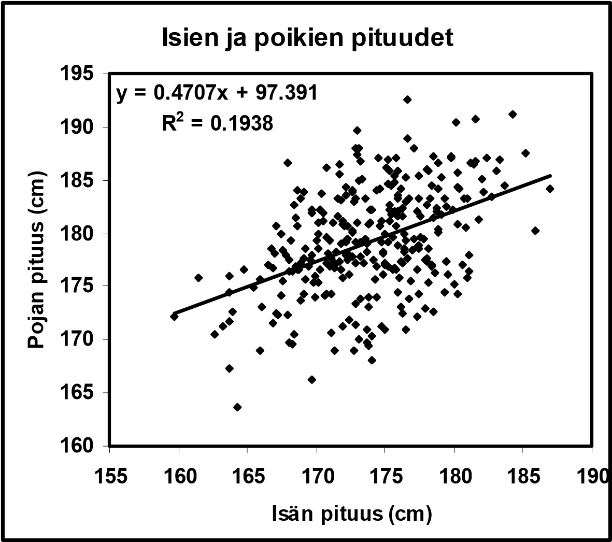

# Regressioanalyysi {#luku10}

Tilastollinen riippuvuus ja korrelaatio -jakson laajennuksena pyrimme tässä luvussa vastaamaan seuraavaan kysymykseen: _Miten jonkin selitettävän muuttujan tilastollista riippuvuutta joistakin toisista, selittäviksi muuttujiksi kutsutuista muuttujista voidaan mallintaa_? Muuttujien välisten riippuvuuksien, eli erilaisten tosielämän asioiden ja ilmiöiden välisten yhteyksien analysointi on tavallisesti keskeinen kysymys tieteellisessä tutkimuksessa. Regressioanalyysi on yksi tunnetuimpia ja eniten sovellettuja __tilastollisia menetelmiä__ kuvaamaan kahden muuttujan __tilastollista riippuvuutta__.

Jos tilastoaineistossa on havaittavissa säännönmukaisuutta ja muuttujien välillä näyttäisi olevan järkevä (asialooginen) yhteys, niin päästään "malliajatteluun". Ts. pyritään rakentamaan tilastollista mallia kys. aineistolle. Pyritään siis muodostaa tilastollinen malli että se valitun kriteeristön perusteella parhaiten kuvaa analysoitavaa pistejoukkoa.

## Johdatus regressioanalyysin ideaan {#alaluku10}

- Regressioanalyysi pyrkii siis havaintoaineiston perusteella __mallintamaan tilastoyksikköjen tilastollisten muuttujien välistä riippuvuutta__.
  - Regressiomallissa tilastollisia muuttujia on kahdenlaisia: __selitettävä muuttuja__, jonka tilastollista vaihtelua pyritään selittämään __selittävän muuttujan__, tai __selittävien muuttujien__, vaihtelulla. 
  - Toisin sanoen, pyritään erottamaan se selitettävän muuttujan arvojen vaihtelu, joka voidaan selittää selittävän muuttujan arvojen vaihtelulla siitä vaihtelusta, joka on täysin satunnaista. 
    - Esimerkiksi voitaisiin tutkia selittääkö vaaleissa puolueiden/ehdokkaiden vaalimainontabudjetti heidän äänimääriään, ja jos selittää, niin kuinka paljon? 
    - Jos __tilastollisesti merkitsevä osa__ selitettävän muuttujan havaittujen arvojen vaihtelusta voidaan selittää selittävien muuttujien arvojen vaihtelun avulla, sanomme, että selitettävä muuttuja __riippuu tilastollisesti__ selittäjinä käytetyistä muuttujista.

- Yleisemmin regressioanalyysi pyrkii vastaamaan seuraaviin kysymyksiin koskien tilastollisten muuttujien välistä riippuvuutta:
  - Muuttujien välisten __riippuvuuksien kuvaaminen__. Millainen on riippuvuuden muoto? Kuinka voimakasta riippuvuus on?
  - Muuttujien välisten __riippuvuuksien selittäminen__. Tilastollisen riippuvuuden luonteen selittäminen.
  - Selitettävän muuttujan käyttäytymisen __ennustaminen__.

- __Lineaarinen regressioanalyysi__ siis (teknisesti) rajoittuu muuttujien _lineaaristen_ riippuvuuksien kuvaamiseen. Kuitenkin, laajemmin asiaa pohdittaessa, lineaaristen regressiomallien suuri käyttökelpoisuus muuttujien välisten riippuvuuksien tilastollisessa analyysissa perustuu (ainakin) seuraaviin seikkoihin:
  - Lineaarisella regressiomallilla voidaan usein vähintään kohtuullisella (riittävällä) tarkkuudella approksimoida epälineaarisiakin muuttujien välisiä riippuvuuksia! 
  - Muuttujien välinen epälineaarinen riippuvuus voidaan usein myös linearisoida käyttäen sopivia muunnoksia alkuperäisiin muuttujiin.
  - Epälineaariset regressiomallit muodostavat oman tilastollisten (regressio)mallien luokkansa (joita ei käsitellä tällä kurssilla, mutta kylläkin myöhemmissä tilastotieteen opinnoissa).

- Regressiomalleja käytetään apuvälineinä monilla tilastotieteen osa-alueilla. Esimerkkejä regressiomallien käyttökohteista tilastotieteessä:
  - Varianssianalyysi
  - Koesuunnittelu
  - Monimuuttujamenetelmät
  - Biometria/biostatistiikka
  - Aikasarja-analyysi ja ennustaminen
  - Ekonometria

- Regressioanalyysissa sovellettavat tilastolliset mallit voidaan luokitella usealla eri periaatteella.
  - Luokittelu regressiomallin funktionaalisen muodon mukaan:
    - Lineaariset regressiomallit
    - Epälineaariset regressiomallit
  - Luokittelu regressiomallin yhtälöiden lukumäärän mukaan:
    - Yhden yhtälön regressiomallit
    - Moniyhtälömallit

Tällä kurssilla käsitellään vain __lineaarisia yhden yhtälön regressiomalleja__. Kuitenkin luvussa \@ref(alaluku103) esitellään lyhyesti minkälaisia laajennuksia tälle regressioanalyysin perustilanteelle tyypillisesti käsitellään. 

## Yhden selittäjän lineaarinen regressiomalli {#alaluku102}

- Yhden selittäjän lineaarinen regressiomalli pyrkii selittämään selitettävän muuttujan havaittujen arvojen vaihtelun yhden selittävän muuttujan havaittujen arvojen vaihtelun avulla. Se on siis yksinkertaisin esimerkki yhden yhtälön lineaarisista regressiomalleista, sillä se sisältää vain yhden selittävän muuttujan useamman sijaan. 
  - Selitettävää muuttujaa kutsutaan usein myös _vastemuuttujaksi, riippuvaksi muuttujaksi tai tulosmuuttujaksi_ 
  - Vastaavasti selittävää muuttujaa kutsutaan paikoin _selittäjäksi, riippumattomaksi muuttujaksi tai ennustavaksi muuttujaksi_. 

- Tässä luvussa tarkastellaan lyhyesti ja tiivistetysti seuraavia yhden selittävän muuttujan lineaarisen regressiomallin soveltamiseen liittyviä kysymyksiä:
  - Miten malli formuloidaan?
  - Mitkä ovat mallin osat ja mitkä ovat osien tulkinnat?
  - Mitkä ovat mallia koskevat oletukset?
  - Miten mallin parametrit estimoidaan?
  - Miten mallin parametreja koskevia hypoteeseja testataan?
  - Miten mallin hyvyyttä mitataan?
  - Miten mallilla ennustetaan?

- Oletetaan, että selitettävän muuttujan $Y$ havaittujen arvojen vaihtelua halutaan selittää selittävän muuttujan eli selittäjän $x$ havaittujen arvojen vaihtelun avulla. Tulkitaan selittävä muuttuja tässä kohtaa kiinteäksi eli sen arvot oletetaan tunnetuksi.^[Kyseinen muuttuja voidaan myös tulkita satunnaismuuttujana eikä seuraavat tarkastelut muutu ratkaisevasti tämän seurauksena. Tätä pohditaan vielä tarkemmin alempana.]

- Tehdään siis seuraavat oletukset:
  i) Selitettävä muuttuja Y on suhdeasteikollinen satunnaismuuttuja.
  ii) Selittävä muuttuja x on kiinteä eli ei-satunnainen muuttuja.

- Olkoot $y_1, y_2,\ldots, y_n$ selitettävän muuttujan $Y$ ja $x_1, x_2, \ldots, x_n$ selittävän muuttujan $x$ havaittuja arvoja. Oletetaan lisäksi, että havaintoarvot $x_i$ ja $y_i$ liittyvät
samaan havaintoyksikköön kaikille $i=1, 2, \ldots, n$. 
  - Matemaattisemmin tämä tarkoittaa sitä, että tällöin havaintoarvot muodostavat pisteitä 2-ulotteisessa $(x_i, Y_i)$ avaruudessa.

- Oletetaan seuraavaksi, että havaintoarvojen $y_i$ ja $x_i$ välillä on __lineaarinen tilastollinen riippuvuus__, joka voidaan ilmaista yhtälöllä
$$
Y_i = \beta_0 + \beta_1 x_i + \varepsilon_i, \quad i=1,\ldots, n.
$$
- Tämä yhtälö määrittelee yhden selittäjän lineaarisen regressiomallin, jossa
  - $y_i$ on selitettävän muuttujan $Y$ satunnainen ja havaittu arvo havaintoyksikölle $i$.
  - $x_i$ selittävän muuttujan eli selittäjän $x$ ei-satunnainen ja havaittu arvo havaintoyksikölle $i$.
  - $\varepsilon_i$ on virhetermi (ajoittain myös jäännöstermi) ja sen satunnainen ja ei-havaittu arvo havaintoyksikölle $i$.
- Yhden selittäjän lineaarisessa regressiomallissa on seuraavat regressiokertoimet:
  - $\beta_0$ on vakioselittäjän regressiokerroin; $\beta_0$ on ei-satunnainen ja tuntematon vakio. Kerrointa $\beta_0$ kutsutaan myös vakioselittäjän regressiokertoimeksi. Nimitys johtuu siitä, että kerrointa $\beta_0$ vastaa keinotekoinen selittäjä, joka saa kaikille havaintoyksiköille $i=1, 2, \ldots, n$ vakioarvon 1.
    - Huomautus: Jatkossa esitettävät kaavat eivät välttämättä päde esitettävässä muodossa, jos mallissa ei ole vakiota (vakioselittäjää), joka yleensä automaattisesti lisätään mukaan malliin.
    - Oletamme jatkossa, että mallissa on aina vakioselittäjä.
  - $\beta_1$ on selittäjän $x$ regressiokerroin; $\beta_1$ on ei-satunnainen ja tuntematon vakio
    - Huomautus: Regressiokertoimet $\beta_0$ ja $\beta_1$ on oletettu samoiksi kaikille havaintoyksiköille $i$. 

- Virhetermeistä $\varepsilon_i$ tehtävät ns. standardioletukset ovat seuraavat:
  i) $\text{E}(\varepsilon_i) = 0, \, i=1,2,\ldots,n$.
  ii) Virhetermeillä on vakiovarianssi eli ne ovat homoskedastisia: $\mathrm{Var}(\varepsilon_i)= \sigma^2, \, i=1,\ldots,n$. Virhetermien $\varepsilon_i$ tässä yhteiseksi oletettua varianssia kutsutaan ajoittain jäännösvarianssiksi.
  iii) Virhetermit ovat korreloimattomia: $\mathrm{Cov}(\varepsilon_i, \varepsilon_l)=0, \, i \neq l$.
  iv) Lisäksi tehdään ajoittain normaalisuusoletus eli että virhetermit ovat normaalisti jakautuneita: $\varepsilon_i \thicksim \text{N}(0, \sigma^2), \, i=1,2,\ldots,n$.
    - Huomautus: Oletus (iv) sisältää oletukset (i) ja (ii).

- Lineaarisen regressiomallin perusoletuksiin kuuluu se, että selittävien muuttujien arvot ovat ei-satunnaisia. On kuitenkin syytä korostaa (jo tässä vaiheessa), että selittävän muuttujan arvojen satunnaisuus ei kuitenkaan vaikuta mallin estimoinnissa ja testauksessa käytettäviin menetelmiin seuraavissa tilanteissa:
  - Tavanomaiset mallista tehdyt oletukset pätevät (sopivasti modifioituina), kun siirrytään tarkastelemaan selittävän muuttujan ehdollista odotusarvoa selittäjien suhteen.
  - Voidaan (ajoittain) olettaa, että selitettävä muuttuja ja selittäjät noudattavat yhdessä __multinormaalijakaumaa__ eli aiemmin esitellyn yksiulotteisen normaalijakauman moniulotteista laajennusta.

\

- Regressioanalyysille voidaan esittää kaksi asialoogisesti varsin erilaista lähtökohtaa, joilla on kuitenkin myös monia yhtymäkohtia:
  i) Ongelmat determinististen mallien sovittamisessa havaintoihin: Havainnoille esitetty malli ei sovi täsmällisesti kaikkiin havaintoihin. Tämä onkin osaltaan tilastollisen mallinnuksen yksi ominaispiirteistä: Täydellistä sopivuutta aineiston kanssa ei käytännössä koskaan saavuteta.
  ii) Tavoitteena on moniulotteisen todennäköisyysjakauman regressiofunktion parametrien estimointi.
    - Vaikka moniulotteisten todennäköisyysjakaumien regressiofunktiot ovat yleisesti epälineaarisia, lineaariset regressiomallit muodostavat tärkeän ja paljon sovelletun malliluokan.

- Koska regressiokertoimet $\beta_0$ ja $\beta_1$ sekä jäännösvarianssi $\sigma^2$ ovat tavallisesti tuntemattomia, niiden arvot on __estimoitava__ muuttujien $x$ ja $Y$ havaittuja arvoja $x_i$ ja $y_i$, $i=1,2, \ldots, n$ käyttäen.
    - Regressiomallien parametrien estimointiin käytetään tavallisesti __pienimmän neliösumman (PNS) menetelmää__. Tämän estimointimenetelmän tarkemmat yksityiskohdat ovat myöhempien tilastotieteen kurssien asioita, mutta seuraavassa kuitenkin muutamia lähtökohtia mihin PNS-menetelmä perustuu yhden selittäjän mallin tapauksessa.
    - Edellä esitellyn yhden selittäjän lineaarisen regressiomallin regressiokertoimien $\beta_0$ ja $\beta_1$ estimaattorit määrätään minimoimalla virhetermien $\varepsilon_i$ neliösummaa

$$
S(\beta_0,\beta_1) = \sum_{i=1}^{n} \varepsilon^2_i = \sum_{i=1}^{n} (y_i - \beta_0 - \beta_1 x_i)^2 
$$
regressiokertoimien $\beta_0$ ja $\beta_1$ suhteen.

- Tämä minimointi tapahtuu tavanomaiseen tapaan derivoimalla funktio $S(\beta_0,\beta_1)$ kertoimien $\beta_0$ ja $\beta_1$ suhteen ja merkitsemällä derivaatat nolliksi:
\begin{align*}
\frac{\partial S(\beta_0,\beta_1)}{\partial \beta_0} &= -2 \sum_{i=1}^{n} (y_i - \beta_0 - \beta_1 x_i) = 0 \\
\frac{\partial S(\beta_0,\beta_1)}{\partial \beta_1} &= -2 \sum_{i=1}^{n} (y_i - \beta_0 - \beta_1 x_i) x_i = 0. 
\end{align*}
- Nämä ns. **normaaliyhtälöt** johtavat lopulta pienen sieventämisen jälkeen regressiokertoimien $\beta_0$ ja $\beta_1$ pienimmän neliösumman (PNS-) estimaattoreihin (ja lopulta käytännössä analysoitavasta aineistosta laskettaviin PNS-estimaatteihin)
\begin{align*}
\widehat{\beta}_0 &= \bar{y} - \widehat{\beta}_1 \bar{x} \\
\widehat{\beta}_1 &= \frac{s_{xy}}{s^2_x} = r_{xy} \frac{s_y}{s_x}.
\end{align*}
- Huomaa siis yhteys aiemmin keskusteltuihin $x$:n ja $y$:n otoskeskiarvioihin, keskihajontoihin sekä otoskovarianssiin ja korrelaatioon $x$:n ja $y$:n välillä.

- PNS-estimaattorit (estimaatit) $\widehat{\beta}_0$ ja $\widehat{\beta}_1$ määrittelevät suoran (matemaattisesti katsoen avaruudessa $\mathbb{R}^2$):
$$
\widehat{y} = \widehat{\beta}_0 + \widehat{\beta}_1 x,
$$
jossa  
  - $\widehat{\beta}_0$ on estimoidun regressiosuoran ja pistekuvion y-akselin leikkauspiste
  - $\widehat{\beta}_1$ on estimoidun regressiosuoran kulmakerroin

- Tämän suoran tuottamat arvot $\widehat{y}_i$ ovat käytännössä eri havainnoille $y$ saatavat __sovitteet__ lineaariseen malliin perustuen.

\

- Sijoitetaan regressiokertoimien $\beta_0$ ja $\beta_1$ PNS-estimaattoreiden lausekkeet estimoidun regressiosuoran lausekkeeseen. Tällöin estimoidun regressiosuoran yhtälö voidaan kirjoittaa muodossa:
$$
y = \bar{y} + r_{xy} \frac{s_y}{s_x} (x-\bar{x})
$$

  - Yhtälöstä nähdään, että estimoitu regressiosuora kulkee havaintopisteiden $(x_i , y_i), i = 1,2, \ldots, n,$ painopisteen kautta. Voidaan siis nähdä, että estimoidulla regressiosuoralla on seuraavat ominaisuudet:
    - (i) Jos $r_{xy} > 0$, suora on nouseva.
    - (ii) Jos $r_{xy} < 0$, suora on laskeva.
    - (iii) Jos $r_{xy} = 0$, suora on vaakasuorassa.
    - (iv) Suora jyrkkenee (loivenee), jos
      - korrelaation itseisarvo $|r_{xy}|$ kasvaa (pienenee)
      - keskihajonta $s_y$ kasvaa (pienenee)
      - keskihajonta $s_x$ pienenee (kasvaa)

\

- Tarkastellaan vielä estimoituun lineaariseen malliin liittyviä sovitteita ja residuaaleja.
  - Estimoidun mallin __sovitteet__ saadaan siis kaavalla

$$
\widehat{y}_i = \widehat{\beta}_0 + \widehat{\beta}_1 x_i, \quad i=1,2,\ldots,n.
$$

- Vastaavasti __residuaalit__ saadaan havaintojen ja sovitteiden erotuksena

$$
\widehat{\varepsilon}_i = y_i - \widehat{y}_i = y_i - \widehat{\beta}_0 - \widehat{\beta}_1 x_i, \quad i=1,2,\ldots,n.
$$

- Sovite on estimoidun regressiosuoran yhtälön selitettävälle muuttujalle antama arvo havaintopisteessä $x_i$. Vastaaavasti residuaali on selitettävän muuttujan havaitun arvon $y_i$ ja sovitteen $\widehat{y}_i$ eli estimoidun regressiosuoran yhtälön selitettävälle muuttujalle  havaintopisteessä $x_i$ antaman arvon erotus.
  - Estimoitu regressiomalli selittää selitettävän muuttujan havaittujen arvojen vaihtelua sitä paremmin mitä lähempänä estimoidun mallin sovitteet $\widehat{y}_i$ ovat selitettävän muuttujan havaittuja arvoja $y_i$.
  - Yhtäpitävästi edellisen kanssa: Estimoitu regressiomalli selittää selitettävän muuttujan havaittujen arvojen $y_i$ vaihtelua sitä paremmin mitä pienempiä ovat estimoidun mallin residuaalit $\widehat{\varepsilon}_i$.

\

- Liittyen vielä estimoidun mallin sopivuuden tarkasteluun, estimoidun regressiomallin hyvyyttä mitataan (tavanomaisesti) mm. __selitysasteella__ ($R^2)$.
  - Selitysasteen määritelmä perustuu ns. varianssianalyysihajotelmaan, jossa selitettävän muuttujan havaittujen arvojen vaihtelua kuvaava neliösumma on jaettu kahdeksi neliösummaksi, joista toinen kuvaa mallin ja havaintojen yhteensopivuutta ja toinen mallin ja havaintojen yhteensopimattomuutta.
  - Selitysaste saa arvoja nollan ja ykkösen väliltä (kun lineaarisessa regressiomallissa on mukana vakiotermi). Arvo 0 tarkoittaa, että malli (yhden selittäjän mallissa käytännössä siis selittäjä $x$) ei selitä $y$:n lineaarista vaihtelua yhtään (yli vakiotermin). Ts. määritelty malli ei ollenkaan selitä selitettävän muuttujan havaittujen arvojen vaihtelua.
  - Vastaavasti arvo $R^2 = 1$ tarkoittaa, että malli sopii täydellisesti aineistoon. Ts. selitysaste mittaa regressiomallin selittämää osuutta selitettävän muuttujan havaittujen arvojen kokonaisvaihtelusta.
  - Korkea selitysasteen arvo on siis sinänsä usein toivottava lopputulos lineaarisen mallin käytön yhteydessä. Tämän liian mekaaninen tavoittelu johtaa kuitenkin ajoittain muihin ongelmiin, kuten __ylisovittamiseen__ usean selittäjän lineaarisia malleja käsiteltäessä.

\

::: {.eblock .kimmo data-latex="{}"}
**Esimerkki: isän ja poikien pituus, tarkemmin**

Jatketaan isän ja heidän poikiensa pituutta koskevan aineiston tarkastelua. Periytyykö isän pituus heidän pojilleen? Käytännössä jo aiemmin tarkastelimme 300 havainnon havaintoaineistoa isän ja heidän poikiensa pituuksien muodostamista lukupareista.

Estimoidun regressiosuoran yhtälö on (ks. oheinen kuva \@ref(fig:isatjapojat2))
$$
y = 97.391+ 0.4707 x
$$
Suoran kulmakertoimen $\widehat{\beta}_1$ = 0.4707 tulkinta on siis, että jos isä A on 1 cm pitempi kuin isä B, isä A:n poika on keskimäärin 0.4707 cm pitempi kuin isä B:n poika.
:::

```{r isatjapojat2, echo=FALSE, fig.cap="Isien ja poikien pituudet: regressiosuoran sovite", fig.align='center', out.width = "100%"}

```

\

## Muita regressiomalleja {#alaluku103}

- Yksinkertaista lineaarista regressiomallia voidaan laajentaa monin tavoin monenlaisiin erilaisiin tilanteisiin.
  - Usean selittäjän lineaarinen regressiomalli: Yhden selittäjän sijaan käytetään useita selittäviä muuttujia.
  - Lineaarisen mallin sijaan malli voi olla myös epälineaarinen (epälineaarinen regressiofunktio).

- Erityisen tärkeitä laajennuksia ilmenee kun __vastemuuttuja on muuta muotoa__ mitä edellä oletetaan lineaarisissa regressiomalleissa, joissa käytännössä oletetaan että vaste on reaaliarvoinen (jokin reaaliluku). 
  - Vaste voi olla myös __diskreettiarvoinen__, kuten __binäärinen__ ($Y_i=0$ tai $Y_i=1$) tai __lukumäärä__ $Y_i \in \{0,1,2,3,\ldots\}$
  - Mikäli vaste on binäärinen, niin tällöin tyypillinen tarkasteltava ja täsmennettävä tilastollinen malli on __logistinen regressiomalli__ (tunnetaan myös __logistisena regressiomallina__ tai __logit-mallina__).
  - Jos vaste on lukumäärä, niin tällöin yksi mahdollinen malliluokka on ns. __Poisson-regressiomalli__. Tässä yhteydessä oletetaan siis, että sm. $Y$ noudattaa Poisson-jakaumaa ja regressiomalli rakennetaan tämän oletuksen ympärille.
- __Vastemuuttujan roolin/luonteen selvittäminen on hyvin keskeistä tilastollista mallia rakennettaessa__. Tässä pätee samat eroavaisuudet mitkä tulevat tutuiksi todennäköisyyslaskennan kursseilla kun käsitellään diskreettien ja jatkuva-arvoisten satunnaismuuttujien jakaumia ja näihin liittyviä yksityiskohtia.

- Pitemmälle meneviä regressioanalyysin kysymyksiä käsitellään useilla myöhemmillä tilastotieteen kursseilla.
  - Erityisesti aineopintojen kurssien [TILM3561 Tilastollinen päättely I](https://opas.peppi.utu.fi/fi/opintojakso/TILM3561/5069) ja  [TILM3562 Tilastollinen päättely II](https://opas.peppi.utu.fi/fi/opintojakso/TILM3562/5070) jälkeisellä [TILM3588 Lineaariset ja yleistetyt lineaariset mallit -kurssilla](https://opas.peppi.utu.fi/fi/opintojakso/TILM3588/5071), jossa tarvitaan myös lineaarialgebran ja matriisilaskennan tietoja, joita tilastotieteen yhteydessä käydään läpi [TILM3574 Matriisilaskenta tilastotieteessä -kurssilla](https://opas.peppi.utu.fi/fi/opintojakso/TILM3574/5082).
  - Tämän jälkeen regressiomallien käsittely jatkuu useilla eri aineopintojen ja syventävien opintojen erikoiskursseilla.

## Luvun 10 yhteenveto, keskeisiä termejä ja kokonaisuuksia.

- Lineaarinen regressioanalyysi
- Yhden selittäjän lineaarinen regressiomalli
- Selitettävä muuttuja
- Selittävä muuttuja/selittävät muuttujat
- Virhetermi
- Pienimmän neliösumman (PNS) menetelmä
- PNS-estimaattorit ja PNS-estimaatit
- Sovitteet ja residuaalit
- Selitysaste