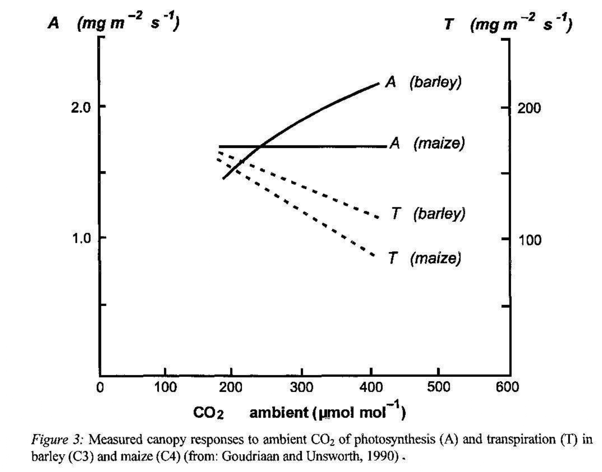
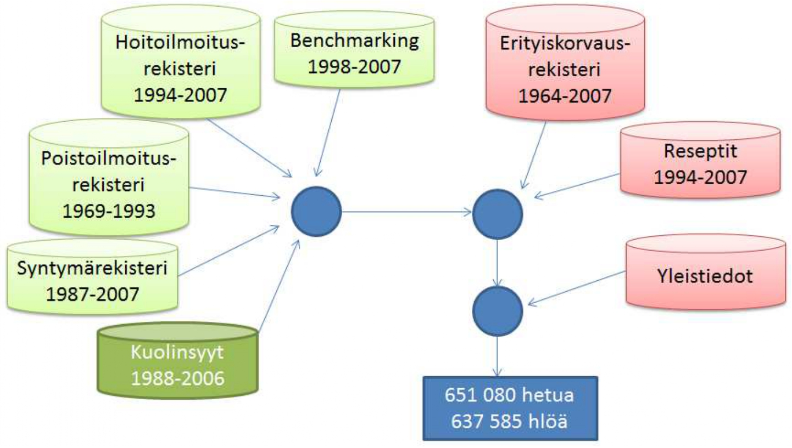
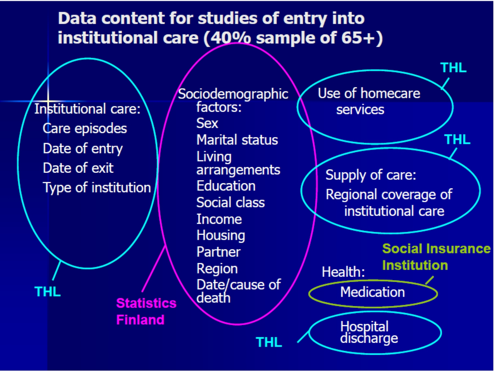
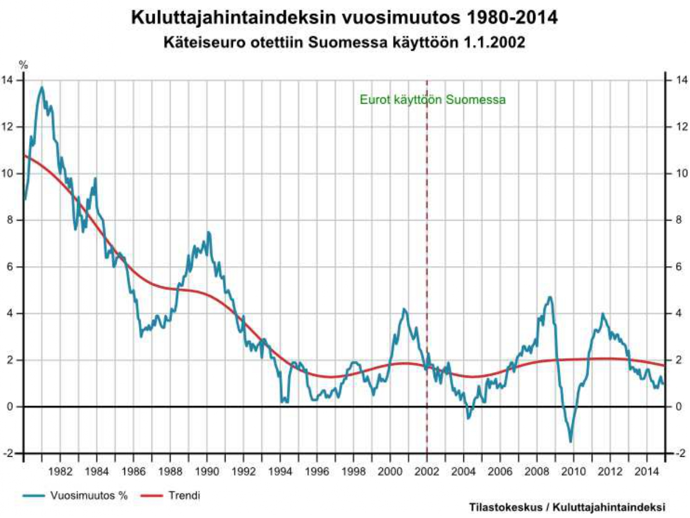
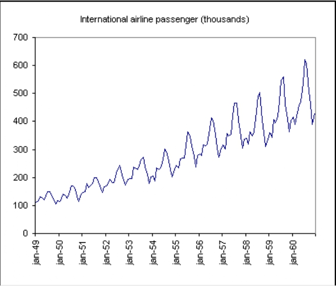
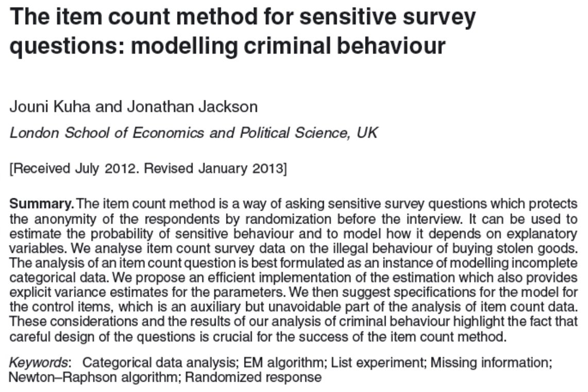
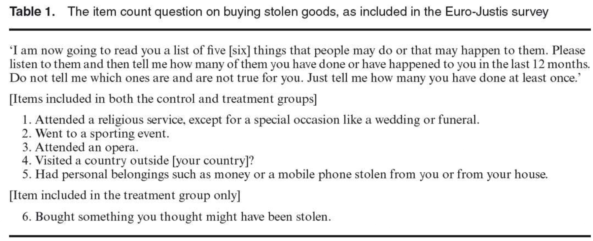
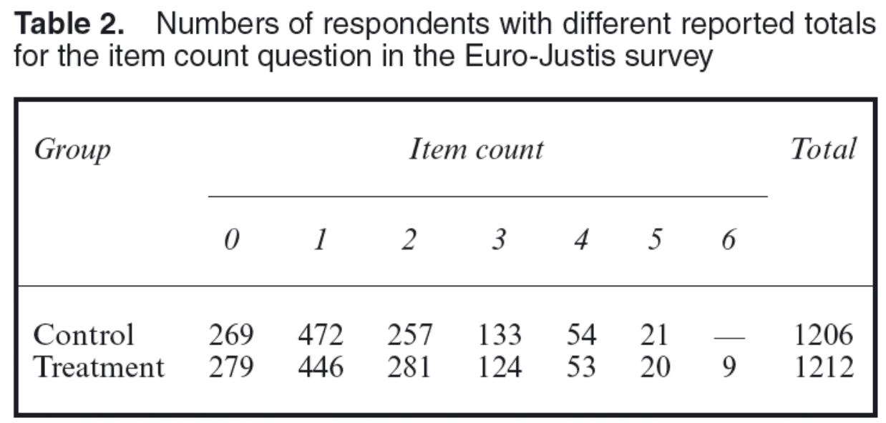

\lefthyphenmin=62
\righthyphenmin=62
# Aineisto- ja tutkimustyypit ja koeasetelmat {#luku12}

Tässä luvussa käsitellään erilaisia tapoja toteuttaa tilastollista tutkimusta. Empiirisen tutkimuksen lähtökohtana on aina tutkimusongelma, joka sisältää kysymyksen tai kysymyksiä, joihin tutkimuksella haetaan vastauksia. Tilastotieteen näkökulmasta tutkimusongelman keskiössä on kuitenkin __aineisto__, __data__, ja se miten käytettävissä olevasta aineistosta saadaan vastauksia tutkimuskysymyksiin. Tarkastelemme tässä luvussa myös tutkimuksenteon käytäntöä käsittelemällä erilaisia aineistotyyppejä. Käymme läpi eri alojen ja tutkimusongelmien käytännön tutkimustyössä kohdattavia aineistoja ja erittelemme pidemmälle eri tutkimuskysymysten käytännön haasteita aineistojen osalta sekä sitä, minkälaisia ongelmia erilaisiin tutkimusykysymyksiin käytännössä liittyy ja miten eri tutkimusasetelmat pyrkivät niitä ratkomaan. 

Aineistotarpeen ja sen analysoinnin lähtökohdat määrää tutkimusongelma. Tutkimus voi olla esimerkiksi kuvailevaa, vertailevaa, selittävää tai kokeellista ja aineistolle sekä menetelmille asetetaan kussakin tapauksessa erilaiset vaatimukset ja odotukset. Erilaisiin tutkimuskysymyksiin ja niihin vastausta etsiviin __koeasetelmiin__ liittyvien esimerkkien avulla pyrimme löytämään vastauksia esimerkiksi seuraaviin kysymyksiin:

- Miten tilastotiede liittyy tiedon keruuseen?
- Miten aineisto generoituu?
- Millaisiin kysymyksiin saadaan kussakin asetelmassa vastauksia?
- Tarkemmat asetelmiin ja analyyseihin liittyvät yksityiskohdat käsitellään [TILM3579 Kokeiden suunnittelu ja analyysi -kurssilla.](https://opas.peppi.utu.fi/fi/opintojakso/TILM3579/5081) 

```{r tutkimusasetelma, echo=FALSE, fig.cap="Tutkimusasetelma", fig.align='center', out.width = "100%"}
knitr::include_graphics("images/tutkimusasetelma.jpg")
```

Luvussa käsiteltävät asiat kuuluvat tilastotieteelle ominaisesti kvantitatiivisen tutkimussuuntauksen alaisuuteen (ks. luku \@ref(luku3)). Luvussa esiteltävät karkeat tutkimustyyppien- strategioiden ja aineistojen jaot ovat vain yksi jaottelutapa ja todennäköisesti poikkeaa eri oppikirjoissa ja lähteissä esitetyistä. 

## Tutkimustyypit {#alaluku121}

Tarkastellaan ensin erilaisia tutkimustyyppejä yleisellä tasolla. Erilaiset tutkimukset voidaan karkeasti jakaa neljään eri luokkaan: __kuvaileva__, __vertaileva__, __kokeellinen__ ja __havainnoiva__ tutkimus. 

- __Kuvaileva tutkimus__
  - Tarkoituksena on kuvata jonkin ilmiön, tilanteen tai tapahtuman luonnetta, yleisyyttä, historiallista kehitystä tai muita tunnuspiirteitä  mahdollisimman todenmukaisesti ja tarkasti.
  - Keskeistä __tiedon lisääminen__ ja pyrkimys vastata kysymyksiin __mitä__, __millainen__ tai __miten__. 
    - Yleisesti ottaen kuvaileva tilastollinen tutkimus perustuu aineistosta lasketuille tunnusluvuille, jotka kuvaavat aineiston ominaisuuksia. Esimerkkeinä toimivat keskiarvon lisäksi sen kaltaiset keskimääräistä havaintoa mittaavat suureet kuten mediaani ja moodi tai vaihtelua kuvaavat eri muuttujien vaihteluvälit ja keskihajonnat (ks. luku \@ref(luku9).
  - Saadakseen luotettavia tunnuslukuja, tulee otoksen olla edustava ja havaintojen luotettavia ja päteviä eli saatujen mittausten pitää kuvata kohteena olevaa ilmiötä ilman virheitä.
  - Kuvailevassa tutkimuksessa ei tutkita muuttujien välisiä yhteyksiä tai riippuvuksia eikä täten yleensä tehdä jakoa selittäviin ja selitettäviin muuttujiin vaan muuttujat ovat asetelmallisesti samantasoisia.
    - Vastaavasti kuvailevassa tutkimuksessa ei välttämättä testata hypoteeseja, ei tehdä ennusteita, ei anneta selityksiä tai pohdita seurauksia: kyseessä on vain aineiston kuvailua ilman sen merkityksellisempää sisältöä kuten havaintojen taustalla olevien ilmiöiden tutkimista tai perusjoukon ominaisuuksien päättelyä otoksen perusteella.

\

- __Vertaileva tutkimus__
  - Vertaileva tutkimus voidaan jakaa kahteen luokkaan 
    1. Ryhmäeroja selittävään tutkimukseen
    2. Korrelaatiotutkimukseen
  - __Ryhmäeroja selittävässä tutkimuksessa__ pyritään selvittämään, mitkä tekijät liittyvät tutkittaviin ilmiöihin, jotka aiheuttavat ryhmissä ilmeneviä eroja.
  - __Korrelaatiotutkimuksissa__ pyritään löytämään ilmiöiden välisiä yhteyksiä tutkimalla kohdejoukkoa kokonaisuutena, jolloin mitattavien muuttujien joukkoon otetaan selittäviä muuttujia.
  - Selittäviä muuttujia hyödynnetään molemmissa luokissa. Niiden avulla pyritään löytämään yhteyksiä verrattavien kohteiden välillä ja niiden voidaan ajatella olevan myös mahdollisia syitä selitettäville muuttujille, seurauksille. 
    - Syy-seuraussuhteita ei kuitenkaan vertailevassa tutkimuksessa pohdita, ts. vertaileva tutkimus ei ole suoranaisesti kiinnostunut kohteena olevien ilmiöiden/ryhmien vertailussa löydettyjen erojen syistä vaan mielenkiinnon kohteena on kys. erot itsessään.

  - Vertailevaa tutkimusta tehdessä on tarpeen pohtia:
    - Miksi jotakin tutkimuskohdetta vertaillaan eli mitä tutkimuskohteesta halutaan nimenomaan saada selville.
    - Mitkä ja minkälaisia tilastoyksiköitä vertailuun kannattaa ottaa mukaan, jotta tutkimuksen tavoitteet saavutetaan.
    - Tyypillistä se, että kontrolli on puutteellista ja ns. väliin tulevia muuttujia ei voida aina eliminoida.
    - Tutkimuksessa on hyväksyttävä myös muuttujiin liittyvä luonnollinen vaihtelu.

- __Kokeellinen tutkimus__
  - Tarkastellaan syy-seuraussuhteita sellaisissa olosuhteissa, joissa tutkija pystyy kontrolloimaan tutkimusyksikköihin vaikuttavia tekijöitä, eli nk. "__käsittelytekijöitä__".
  - Tavallisesti kokeellisella tutkimuksella viitataan sellaiseen tutkimukseen, jossa aineiston on kerätty valvotussa ja kontrolloidussa ympäristössä, kuten laboratoriossa tai sairaalan koehuoneissa, jotta mittaukset ja käsittelytekijät on tutkimuksen tekijän puolesta kontrolloitu ja täten halutunlaisia.
    - Tutkimusasetelman kontrollointi vähentää mittauksiin ja käsittelytekijöihin liittyvien virhelähteiden mahdollisuuksia ja täten jättää vähemmän sijaa epäilyksille.
    - Lisäksi tutkimuksen toistettavuus ja objektiivisuus paranevat, kun koejärjestelyt tehdään tarkasti ja huolellisesti.
  - Kokeelliset tutkimukset tuottavat yleensä nopeammin riittävään näyttöön perustuvaa evidenssiä kuin havainnoivat tutkimukset.
  - Kokeellinen tutkimusasetelma ei kuitenkaan ole mahdollinen kaikissa tilanteissa.
    - Esimerkiksi erilaisten politiikkatoimien arvioimisessa olisi hyödyllistä, mikäli se voitaisiin satunnaisesti kohdistaa esimerkiksi vain osaan kansasta tai kunnista. Tällaisten kokeilujen ehdotukset ovat kuitenkin usein kaatuneet joko perustuslaillisiin ongelmiin tasavertaisesta kohtelusta tai muihin lainsäädännöllisiin ongelmiin tai niitä ei ole toteutettu riittävän hyvin, jotta asetelma riittäisi kokeelliseen analyysiin.^[Esimerkki: [Jeremias Nieminen avaa vuonna 2020 alkaneesta työllisyyden kuntakokeilusta koeasetelman tärkeydestä politiikkatoimien arvioinnissa.](https://labore.fi/julkaisu/kuntakokeilut-kolmas-kerta-samat-ongelmat/)]
  - Kontrolloitujen kokeiden yleisenä kritiikkinä ja heikkoutena voidaan kuitenkin pitää niiden vähäistä yleistettävyyttä: liian pitkälle kontrolloidut ja pelkistetyt koeolosuhteet eivät toimi kaikkien tutkimuskysymysten kannalta yleistettävyyden osalta. 
    - Ihmiset käyttäytyvät eri tavalla laboratorio-olosuhteissa kuin normaalissa ympäristössä!

::: {.eblock .kimmo data-latex="{}"}
**Esimerkki: kasvien kasvatus eri hiilidioksidipitoisuuksissa**  

- Hiilidioksidipitoisuuden kasvu tehostaa kasvien yhteyttämistä
- Kasvit eroavat toisistaan siinä, millä tavalla ne sitovat hiilidioksidia ilmasta yhteyttämistä varten $\rightarrow$ muutokset vaikuttavat eri tavalla eri kasveihin
- Vaikuttaako ilmastonmuutos sadonmuodostukseen? Onko vaikutus suurempi joillain tietyillä kasveilla?
:::

\FloatBarrier

```{r co2, echo=FALSE, fig.cap="Hiilidioksidipitoisuuden kasvun vaikutus satomääriin.", fig.align='center', out.width = "100%"}

```

\FloatBarrier

::: {.eblock .kimmo data-latex="{}"}
**Esimerkki: Lääketieteelliset kokeet**  

- Erään tappavan taudin hoitoon on kehitetty uusi lääke, jonka toivotaan parantavan enemmän potilaita kuin kauan käytössä ollut vanha lääke. Miten saadaan varmuus siitä, että uusi lääke on parempi kuin vanha lääke?
- Paranemistulosten vertailemiseksi järjestetään tilastollinen koe:
  - (i) Jaetaan joukko potilaita arpomalla kahteen ryhmään:
    - Ryhmälle 1 annetaan uutta lääkettä.
    - Ryhmälle 2 annetaan vanhaa lääkettä.
  - (ii) Verrataan parantuneiden suhteellisia osuuksia ryhmissä 1 ja 2.

- Kokeen tavoitteena on tehdä kokeen tulosten perusteella yleisiä johtopäätöksiä uuden lääkkeen tehokkuudesta. Miten yhdestä kokeesta saadut tulokset voidaan yleistää koskemaan kaikkia tautia sairastavia potilaita?
  - Kokeen tulokset voidaan yleistää, jos kokeessa uutta ja vanhaa lääkettä saavien potilaiden ryhmät ovat samankaltaisia kaikissa muissa suhteissa paitsi siinä, että niihin kohdistetaan kokeessa erilainen käsittely.
    - Tällöin mahdolliset erot parantuneiden suhteellisissa osuuksissa on oltava seurausta erilaisista käsittelyistä.
    - Kokeen kohteiden jakaminen ryhmiin arpomalla on ainoa menetelmä, joka mahdollistaa samankaltaisten ryhmien saamisen.
    - Kokeen kohteiden jakamista erilaisen käsittelyn kohteiksi joutuviin ryhmiin arpomalla kutsutaan siis __satunnaistamiseksi__.
  - Arvonnan käyttö ryhmiin jaossa merkitsee sitä, että koetulokset ovat satunnaisia seuraavassa mielessä: Jos arvontaa toistettaisiin, kokeesta saataisiin (suurella todennäköisyydellä) erilaiset ryhmäjaot.
- Kysymyksiä:
  - Miten yhdestä kokeesta saadut ja satunnaiset koetulokset voidaan yleistää koskemaan kaikkia ko. tautia sairastavia potilaita?
  - Miten luotettava tällainen yleistys on?
- Vastauksia:
  - Jos potilaiden jaossa ryhmiin on käytetty satunnaistamista, kokeen tuloksiin sisältyvälle epävarmuudelle ja satunnaisuudelle voidaan muodostaa tilastollinen malli, joka mahdollistaa sekä koetulosten yleistämisen että yleistyksen luotettavuuden arvioimisen.
- Yleistyksen luotettavuutta ei pystytä arvioimaan, ellei ryhmiin jaossa ole käytetty satunnaistamista.
- Tilastollisen kokeen suunnittelussa, toteutuksessa ja tulosten analysoinnissa sovelletaan mm. seuraavia tilastollisia menetelmiä: koesuunnittelu, estimointi ja testaus.
:::

\

- __Havainnoiva tutkimus__
  - Kuten edellä mainittiin, kokeellisia tutkimusasetelmia ei useinkaan ole mahdollista järjestää. Tällaisia kysymyksiä voidaan kuitenkin tutkia havainnoivassa tutkimuksessa, jossa syy-seuraussuhteita tarkastellaan tilanteissa, joissa tutkijalla ei ole välttämättä mitään kontrollia (tai syytä sille) tutkimusyksikköihin tai heihin vaikuttaviin muuttujiin (käsittelytekijöihin).
    - Esimerkiksi tutkimusasetelmat, joissa tutkimuksen kohteena olevia yksiköitä (esim. ihmiset, kunnat, valtiot) ei voida satunnaistaa kuuluvaksi osaksi joukkoa, joka altistetaan jollekin käsittelylle. 
  - Tällöin tutkijan on tyydyttävä havainnoimaan sitä mitä tapahtuu luonnostaan tietyssä (mahdollisesti satunnaisesti poimitussa) tutkimusjoukossa tietyssä tilanteessa.
  - Havainnoivan tutkimuksen aineistoa voidaan analysoida samoin menetelmin kuin kokeellisen tutkimuksenkin, mutta mitattujen tekijöiden vaikutusta ei voida erottaa kokonaisuudesta samalla tarkkuudella kuin kokeellisessa tutkimuksessa.
  - Havainnoivan tutkimuksen tilastollinen teoria muodostuu periaatteista ja menetelmistä, joiden avulla aineiston tuottaman evidenssin painoarvoa voidaan arvioida mahdollisimman "puhtaasti".
  - __Havainnoivan tutkimuksen edut__
    - Saadaan välitöntä ja suoraa tietoa yksilöiden, ryhmien ja organisaatioiden toiminnasta ja käyttäytymisestä.
    - Tutkija voi havainnoida tutkittavia luonnollisessa ympäristössä.
    - Sopii sekä määrällisen että laadullisen aineiston hankkimiseen.
    - Erinomainen menetelmä muun muassa vuorovaikutuksen tutkimisessa, ja silloin kun tilanteet ovat vaikeasti ennakoitavia ja nopeasti muuttuvia.
    - Sopii myös silloin, kun tutkittavilla on kielellisiä vaikeuksia (kuten lapset) tai kun halutaan saada selville sellaista tietoa, jota tutkittavat eivät halua suoraan kertoa tutkijalle.
  - __Havainnoivan tutkimuksen haitat__
    - Tutkija saattaa häiritä tilannetta tai muuttaa sen kulkua.
    - Tutkija saattaa sitoutua emotionaalisesti tutkittavaan ryhmään tai tilanteeseen.

::: {.eblock .kimmo data-latex="{}"}
**Esimerkki: raskauden keskeytyksen ja rintasyövän välinen kausaaliyhteys**  

- Kokeellinen asetelma: Poimitaan satunnaisesti $n$ kappaletta raskaana olevia naisia ja heistä $n_1$ kappaletta satunnaistetaan käsittelyryhmään (raskauden keskeytys) ja $n_2$ kontrolliryhmään. Kaikki naiset käyvät muutaman seuraavan vuoden ajan syöpäseulonnoissa.
- Kokeelliseen asetelma ei selvästikään ole eettisistä syistä mahdollinen, eikä sitä olisi mahdollista suorittaa sokkoutettuna kokeena
- Aiheesta julkaistut tutkimukset aloittavat yleensä naisista, joille on jo tehty raskauden keskeytys
- Käsittelyryhmään kuuluminen ei siis ole tutkijan kontrollissa
:::

\

::: {.eblock .kimmo data-latex="{}"}
**Esimerkki: lääkityksen aiheuttama harvinainen sivuvaikutus**  

- Harvinaisen ilmiön tarkastelu satunnaistetulla kokeella on epäkäytännöllistä, sillä saattaa olla, että isossakaan tutkimusjoukossa sivuvaikutusta ei esiinny yhdelläkään tutkittavalla
- Havainnoiva tutkimus aloittaisi tässä tapauksessa etsimällä ensin sivuvaikutuksesta kärsivät potilaat ja sen jälkeen selvittäisi ketkä heistä ovat saaneet kyseistä lääkettä (ja saaneet sivuoireet lääkityksen aloittamisen jälkeen)
:::

## Tutkimusstrategiat {#alaluku122}

- Erilaiset tutkimusasetelmat voidaan jakaa edelleen kahteen __tutkimusstrategiaan__ sen mukaan, miten niissä ryhmitellään tilastoyksiköitä: __poikkileikkaus__- ja __pitkittäistutkimuksiin__. Tilastoyksikköjen erilainen ryhmittely tuottaa erilaisia aineistotyyppejä, jotka voidaan jaotella karkeasti kolmeen eri tyyppiin
  - Poikkileikkausaineistot: havaintoaineisto kattaa yhden ajankohdan ja mahdollisesti useita tilastollisia muuttujia
  - Aikasarja-aineisto: havaintoaineisto kattaa vain yhden tilastollisen muuttujan mitattuna useana ajanhetkenä
  - Paneeli- ja pitkittäisaineistot: havaintoaineisto kattaa mahdollisesti useita tilastollisia muuttujia mitattuna useana ajanhetkenä

- Eri tutkimusstrategiat hyödyntävät eri aineistotyyppejä sen mukaan, miten ne sopivat tutkimuskysymykseen ja valittuun menetelmään. Tarkastellaan seuraavaksi mitä em. kaksi tutkimustrategiaa tarkoittavat, miten ne eroavat ja minkälaisia tutkimustyyppejä-, asetelmia- ja aineistoja kumpaankin kuuluu.

### __Poikittaistutkimus__ eli __poikkileikkaustutkimus__ 
- Poikittaistutkimukseksi kutsutaan tutkimusstrategiaa, jossa tarkoituksena on tutkia kohdetta tai ilmiötä laaja-alaisesti tiettynä ajankohtana käyttäen poikkileikkausaineistoja.
  - Voidaan tarkastella useita ryhmiä, joissa on esimerkiksi eri-ikäisiä henkilöitä ja ryhmistä saatua tietoa vertaillaan toisiinsa.
  - Voidaan käyttää kuvailemaan riskisuhteita (odds ratio) tai kuvailemaan tiettyyn populaation osaan kohdistuvaa ilmiötä tai riskiä (esimerkiksi sydän- ja verisuonitaudit).
    - Esimerkiksi tutkittaessa sydän- ja verisuonitauteja binäärisellä vastemuuttujalla käyttäen aineistoa, joka koostuu eri ikäisistä ja kuntoisista ihmisistä voidaan arvioida iän ja muiden muuttujien vaikutuksia sydän- ja verisuonitauteihin sairastumisen riskitekijöinä.
  - Poikittaistutkimuksessa ei saada tietoa tilastoyksikön mielenkiinnon kohteena olevien muuttujien arvojen muutoksesta yli ajan mutta tutkimuksessa voidaan kuitenkin kerätä tietoa menneisyyteen liittyen. 
  - Eri ikäryhmiä vertailtaessa ongelmana on myös niin sanottu kohorttivaikutus: tiettynä aikana syntyneiden, eli tietyn kohortin, elinolosuhteet saattavat olla täysin erilaiset kuin jonakin toisena aikana syntyneiden, minkä vuoksi ikäryhmien väliset erot saattavat johtua esimerkiksi yhteiskunnallisista olosuhteista.
  - Poikittaistutkimukseen osallistutaan vain yhden kerran, jolloin tietoa saadaan kerralla paljon.
    - Tämä on kuitenkin usein työlästä ja suuren poikkileikkausaineston kerääminen voi olla kallista.
    - Poikittaistutkimuksessa hyödynnetäänkin usein rutiinitoimenpiteinä kerättyjä aineistoja (esimerkiksi tietyn ikävuoden terveystarkastuksista)
    - Näin voidaan selvittää korrelaatioita ilmiöiden välillä (esimerkiksi alkoholin käyttö ja maksakirroosi) ja siten luoda hypoteeseja tarkemmille jatkotutkimuksille
    - Tällöin on kuitenkin taas vaara sekoittavista tekijöistä, jos aineistoa ei ole kerätty varta vasten tätä tarkoitusta varten

```{r cross, echo=FALSE, fig.cap="Esimerkki poikkileikkaustutkimuksesta", fig.align='center', out.width = "100%"}
knitr::include_graphics("images/cross.jpg")
```

\

### __Pitkittäistutkimus__ 
- Pitkttäistutkimuksessa seurataan usein samoja tilastoyksiköitä "yli ajan", eli mittauspisteitä on useita ja pitkältä aikaväliltä.
  - Hyödyntää poikkileikkausdimension lisäksi myös aikasarjadimensiota.
  - Yleinen tutkimuskysymys pitkittäistutkimuksessa on jonkin __käsittelyn vaikutuksen arviointi__. Tällaisia ovat esimerkiksi lääkeainetutkimus, poliittisten päätösten arviointi tai markkinointitutkimus.
    - Pitkittäistutkimuksessa voidaan siis tarkastella __muutosta__ mutta on tärkeä muistaa, että pitkittäistutkimuksen eri mittauskerrat eivät ole toisistaan __riippumattomia__ ja tämä tulee ottaa tilastollisessa mallissa huomioon!
  - Pitkittäistutkimuksen hyvänä puolena on __ryhmien homogeenisyys__
    - Tutkittavan ryhmän henkilöt ovat eläneet saman historiallisen ajan sekä käyneet läpi samat yhteiskunnalliset muutokset, jolloin muutoksen tutkiminen on luotettavaa, sillä tutkimusta vääristävät tilastoyksiköiden ominaisuuksista erilliset ympäristön haittamuuttujat ovat kaikille samat.
    - Pitkittäistutkimuksen pitkän keston vuoksi tutkittavien määrää kuitenkin yleensä vähenee ja tutkimuksen valmistumisessa kestää kauan, jopa vuosikymmeniä.

```{r long, echo=FALSE, fig.cap="Esimerkki pitkittäistutkimuksesta", fig.align='center', out.width = "100%"}
knitr::include_graphics("images/long.jpg")
```

\newpage

::: {.eblock .kimmo data-latex="{}"}
**Esimerkki: poikittais- ja pitkittäistutkimus epidemiologiassa**  

- Epäkokeelliset epidemiologiset tutkimukset voivat olla joko poikittaistutkimuksia tai pitkittäistutkimuksia.
- Poikittaistutkimus on tiettyyn ajankohtaan rajoittuva tutkimus, jossa mitataan sairauksien vallitsevuutta eli prevalenssia.
  - Prevalenssi kuvaa sairauden tai haitan omaavien henkilöiden määrää tarkasteltavasta väestöstä tiettynä ajankohtana.
  - Usein mitataan vallitsevuustiheyttä eli sairaiden lukumäärää tiettynä ajanhetkenä / väkiluku samana ajankohtana.
- Pitkittäistutkimuksessa mitataan sairauksien ilmaantuvuutta eli insidenssiä.
  - Tutkimuksessa seurataan väestössä ilmaantuvien uusien sairaustapausten lukumäärää tietyn ajanjakson aikana.
  - Useimmiten mitataan ilmaantuvuustiheyttä, joka ilmoittaa uusien sairastapausten määrän henkilöaikaa kohden.
  - Henkilöaika muodostuu tarkasteltavan henkilöryhmän yhteenlasketusta seuranta-ajasta ennen sairastumista, esimerkiksi 100 henkilövuotta muodostuu seurattaessa 100 henkilöä vuoden ajan tai 10 henkilöä 10 vuoden ajan.
:::

\

### __Kohorttitutkimus__ 
- Kohorttitutkimus on altistelähtöinen tapa toteuttaa pitkittäistutkimus.
  - **Kohortti** on suljettu väestö (syntymäkohortti, tietyn työpaikan työntekijät, yms.), jota tutkimuksessa seurataan ja joka on valittu jonkin yhteisen ominaisuuden perusteella (syntymävuosi, työpaikka, yms.).
    - Kohortti voidaan jakaa myös alakohortteihin, mikäli se on alkujaankin riittävän suuri.
    - Valitun kohortin tilastoyksiköt pyritään pitämään täysin samana koko tutkimuksen ajan, ts. kohortit ovat kiinteitä.
  - Tutkimuksessa voidaan valita esimerkiksi jollekkin käsittelymuuttujalle altistunut ja altistumattomien ryhmä.
    - Kohortin seuranta-aikana tutkitaan ryhmien välillä ilmeneviä eroja mielenkiinnon kohteena olevassa muuttujassa.
    - Näitä voi olla esimerkiksi ryhmien väliset erot sairastuvuudessa, kun käsittely on ollut jokin lääke kuten rokote tms. Vastaava esimerkki olisi em. työllisyyden kuntakokeilun osalta työllisyysaste eri kunnissa ja erojen tutkiminen kuntakokeiluun osallistuvien ja osallistumattomien välillä. 
  - Kohorttitukimus voi olla __taannehtiva__: tutkija määrittelee kohortin menneisyydessä, ja seuraa olemassaolevien rekisterien avulla, mitä kohortin jäsenille on tapahtunut myöhemmin.
  - Kohorttitutkimuksessa voidaan yleensä tutkia kerrallaan vain __yhtä altistetta/käsittelyä__, mutta __useita tilastollisia muuttujia__.
  - Tutkimukset saattavat olla hyvin pitkäkestoisia, jos tutkitaan ilmiötä, joka ilmenee vasta pitkä ajan kuluttua altistuksesta (kuten sairaus tai työllisyyden paraneminen)
  - Kohorttitutkimus voi vastata kysymykseen: "Mitkä ilmiöt johtuvat tästä altisteesta?"

::: {.eblock .kimmo data-latex="{}"}
**Esimerkki kohorttitutkimuksesta**  

Toisen maailmansodan aikana räjäytettiin Japanissa kaksi atomipommia. Tämän traagisen tapahtuman jälkeen tutkijat alkoivat selvittää, mitä terveysvaikutuksia ionisoiva säteily aiheuttaisi altistuneille. Tutkimuksessa seurattiin altistuneiden ja altistumattomien sairastumista vuodesta 1945 vuoteen 1970. Tutkimuksen mukaan ionisoiva säteily aiheutti etupäässä monenlaisia kasvaimia; mm. keuhkosyöpää, rintasyöpää ja kilpirauhasen syöpää.
:::

```{r hiroshima, echo=FALSE, fig.cap="Yhdysvaltain räjäyttämä atomipommi Japanin Hiroshimassa aiheutti mittaamattomia tuhoja.", fig.align='center', out.width = "100%"}
knitr::include_graphics("images/hiroshima.jpg")
```

\

### __Tapaus-verrokkitutkimus__ 

- On __retrospektiivinen havainnoiva__ pitkittäistutkimusmenetelmä, jossa tutkimukseen valitaan esimerkiksi tutkittavaan sairauteen (tai muulle altisteelle/käsittelylle altistuneita) potilaita (__tapaukset__) ja lisäksi henkilöitä, jotka eivät ole sairastuneita tähän sairauteen (__verrokit__) (tai altistuneet altisteelle/käsittelylle).
  - Tavoitteena on tutkia miten tutkimusyksiköt reagoivat altistuttuaan jollekin altisteelle tai käsittelylle. Soveltuu erityisesti harvinaisten ilmiöiden aiheuttajien selvittämiseen.
    - Esimerkkinä altistuminen Covid-19 virukselle: retrospektiivisesti (jälkikäteen) voidaan tarkastella viruksen kantajan kanssa samassa tilassa olleita (virukselle altistuneita (virus on altiste)) kyseisessä tilassa olleet olisivat tapauksia ja hypoteettinen toinen tila ilman virusta toimisi verrokkina (ts. ei yhtäkään tartuntatapausta). Mielenkiinnon kohteena olisi tarkastella kuinka monta henkilöä sai tartunnan (ja minkälaiset olosuhteet olivat). 
    - Toisena esimerkkinä voitaisiin jälleen pitää em. työllisyyden kuntakokeilua: ne kunnat jotka (satunnaisesti) valikoituisivat työllisyyskokeiluun tulisivat altistetuksi politiikkamuutokselle eli olisivat tapauskuntia. Näitä kuntia voidaan sitten verrata verrokkikuntiin, joissa kys. politiikkamuutosta ei toteutettaisi. Mielenkiinnon kohteena olisi työllisyyden kehitys altistumisen jälkeen.
  - Käsittelyn tai altistuksen seurauksia, esimerkiksi sairauden, syitä etsitään vertaamalla tapausten ja verrokkien aikaisempaa altistumista erityisesti mielenkiinnon kohteena oleville altisteille. 
  - Tapaus-verrokkitutkimus eroaa kohorttitutkimuksesta siten että siinä voidaan tutkia __yhtä tilastollista muuttujaa__ (kuten sairastumista), mutta __useita altisteita__: mistä altisteesta sairaus on seuraus, ts. mikä on taudinaiheuttaja?
    - Altistumishistoriaa voidaan selvitettää mm. mittauksilla, malleilla tai kyselylomakkeilla.
    - Esimerkki: tapauksien ja verrokkien altistumiseroista saadaan epäsuora arvio altistuneiden riskistä sairastua kyseiseen sairauteen suhteessa altistumattomien riskiin.
  - Tapaus-verrokkitutkimukset ovat yleensä suhteellisen yksinkertaisia ja halpoja toteuttaa niiden retrospektiivisestä luonteesta johtuen: tutkimuskysymys määrittelee aineistotarpeen, jonka jälkeen se tarvitsee vain kerätä.
    - Verrokkien valinta kuitenkin kriittinen, sillä valitsemalla verrokit/kontrollitapaukset väärin mikään tilastollinen testi tai menetelmä ei korjaa tai kvantifioi tätä virhettä!
    - Esimerkki verrokkiryhmän epäkelvosta valinnasta on huonosti mitattu aiempi altistuminen ja/tai jos jokin tutkimuksen kannalta keskeinen taustamuuttuja sivuutetaan: mitä jos tauti tai sen vakavuus riippuukin sairastuneen muusta terveydentilasta?
  - Eroaa poikittaistutkimuksesta siinä, että poikittaistutkimus pyrkii yleistämään tulokset koko kohdepopulaatioon, kun taas tapaus-verrokkitutkimus keskittyy hyvin spesifiin populaation osaan

::: {.eblock .kimmo data-latex="{}"}
**Esimerkki: tapaus-verrokkitutkimuksesta**  

Länsi-Saksassa tuotiin 50-luvun lopulla markkinoille talidomidi-niminen uni- ja rauhoittava lääke. Varsin pian markkinoille tulon jälkeen tietyntyyppisten synnynnäisten epämuodostumien määrä alkoi lisääntyä rajusti. Talidomidin ja lasten raajojen muodostumishäiriöiden yhteys paljastettiin tapaus-verrokkitutkimuksilla. Tutkimuksissa selvitettiin sekä sairaiden lasten (tapaukset) että terveiden lasten (verrokkien) äitien altistuminen talidomidille raskauden kriittisten viikkojen aikana. Melkein kaikki sairaiden lasten äidit olivat saaneet talidomidia ensimmäisten raskausviikkojen aikana (talidomidin oli myös havaittu helpottavan odottavien äitien raskauspahoinvointia). Talidomidi poistettiin markkinoilta ja epämuodostumatapausten määrä putosi jyrkästi.
:::

```{r tali, echo=FALSE, fig.cap="Esimerkki tapaus-verrokkitutkimuksesta", fig.align='center', out.width = "100%"}
knitr::include_graphics("images/tali.jpg")
```

\

- __Lohkot/osittaminen__
  - Lohkomisella / osittamisella tarkoitetaan tutkimusyksiköiden järjestämistä ryhmiin niin, että ryhmät ovat mahdollisten sekoittavien tekijöiden suhteen mahdollisimman samankaltaiset
  - Lohkotekijä on yleensä muuttuja, jonka aiheuttama vaihtelu vasteeseen ei ole tutkijan päämielenkiinnon kohteena
  - Lohkotekijän kontrollointi johtaa usein tarkkuudeltaan parempiin tuloksiin
  - "Block what you can, randomize what you cannot."

```{r block, echo=FALSE, fig.cap="Esimerkki ositetusta koeasetelmasta", fig.align='center', out.width = "100%"}
knitr::include_graphics("images/block.jpg")
```

- __Sokkouttaminen__
  - Tutkimushoitojen sokkoutuksen tavoitteena on vähentää sekä potilaan että tutkimushenkilökunnan mahdollisten ennakkokäsitysten vaikutusta tutkimuksen tuloksiin.
  - **Yksöissokkotutkimuksessa** (single-blind) tutkittava ei tiedä, mihin hoitoryhmään hän kuuluu.
  - **Kaksoissokkotutkimuksessa** (double-blind) ei tutkittava eikä tutkija ja muukaan tutkimushenkilökunta saa tutkimuksen aikana tietää mihin hoitoryhmään tutkittava kuuluu.
  - **Kolmoissokkoutetussa** tutkimuksessa edes havaintojen analysoija (esim. tilastotutkija) ei tiedä, miten kokeellisen tutkimuksen käsittely on koodattu. 
  - **Avoimessa tutkimuksessa** (open) sekä tutkittava että tutkimushenkilökunta tietävät, mihin hoitoryhmään tutkittava kuuluu. Myös avoimessa tutkimuksessa tulisi yleensä käyttää satunnaistamista.

## Erilaisia aineistoja ja aineistolähteitä {#alaluku123}

Käydään seuraavaksi läpi erilaisia aineistotyyppejä, joita käytännön tutkimuksissa Suomessa (ja maailmalla) usein käytetään. Emme käsittele tässä erikseen itse otannalla koottavia aineistoja tai otannan järjestämistä, ks. luku \@ref(luku5). 

### Rekisteriaineistot

- Rekisteriperusteinen tutkimus hyödyntää aineistoinaan valmiiksi kerättyjä __tietokantoihin__ tallennettuja aineistoja, joita kutsutaan rekisteriaineistoiksi.
  - Yleensä __hallinnollisia tarpeita__ varten kerättyjä tietoja.

- Rekisteriaineistojen eduiksi voidaan lukea mm. seuraavat seikat
  - Aineiston muodostaminen/kerääminen on verrattain helppoa ja Suomessa on paljon korkealaatuisia rekisteriaineistoja. Tätä edesauttaa tietotekniikan nopea kehittyminen, joka on mahdollistanut erittäin suurten aineistojen rutiininomaisen keräämisen.
  - Ei tarvetta erikseen tuottaa tutkimusaineistoa: vältetään mahdollisesti kallis aineiston keräysvaihe.
  - Suomalainen henkilötunnusjärjestelmä mahdollistaa tietojen tehokkaan käytön ja laadukkaan tutkimuksen.

- Rekisteriaineistojen ongelmina ja haittoina voidaan pitää mm. seuraavia
  - Mikäli tutkimuksessa lähtökohtaisesti käytetään rekisteriaineistoja, määräävät ne välillisesti myös mahdolliset tutkimuskohteet: rekisteriaineistot kerätään eri tarkoitusta varten eivätkä ne täten välttämättä sisällä kaikkea haluttua informaatiota.
    - Tutkimuksen ongelmalähtöisyys saattaa unohtua helpommin, kun tutkimusongelman aihiota asetellaan sopimaan rekisteriaineistojen tarjoamiin mahdollisuuksiin.
    - Rekisteriaineistoilla on myös omat rajansa: tutkimuskysymysten kannalta väärin mitattua muuttujaa ei useinkaan voida millään tavalla muuntaa täydellisesti haluttuun muotoon. 
  - Rekisteriaineisto pitää usein esikäsitellä sopivaan muotoon laadullista tutkimusta muistuttavalla tavalla.
  - Rekisteriaineistojen analyysista ja niihin soveltuvista tilastollisista menetelmistä on vähänlaisesti metodologisia oppikirjoja ja/tai esimerkkitutkimuksia.
  - "Ulkopuolisille" tutkijoille aineistojen käyttö saattaa olla hankalaa mm. korkeiden pääsykustannusten (rekisterien ylläpitäjien, viranomaisten ja tutkimuslaitosten ulkopuolella), tietosuojakysymysten tai teknisten hankaluuksien takia. 
    - Rekisteriaineiston käyttö vaatii tutkimussuunnitelman ja tutkimussuunnitelman perusteella myönnetyn käyttöluvan rekisterin ylläpitäjältä. 
  - Tietotekniikan kehittymisen vuoksi kasvaneet rekisteriaineistot tekevät käyttökelpoisen tiedon esiin seulomisesta haastavaa. Tämä näyttäytyy esimerkiksi eri rekistereiden tietojen linkkaamista yhteen, jolla saattaa olla tutkimuksen kannalta ratkaiseva merkitys ja joka edelleen korostaa substanssitietoutta. 
    - Eri rekisterejä ei aina saadakaan linkattua tehokkaasti yhteen esimerkiksi jos ne ovat mitanneet mielenkiinnon kohteina olevia muuttujia eri tilastoyksikön tasolla (vrt. kunnan vs kaupunginosan työllisyys)

- Erilaisia rekisterejä Suomessa:
  - Verorekisterit (Verohallinnon rekisterit)
  - Kuolemansyyrekisterit
  - Eläkerekisterit
  - Väestölaskennat (väestörekisteri)
  - Syöpärekisteri
  - Lääkeostorekisteri
  - Sosiaali- ja terveydenhuollon rekisterit 
  - Kelan etuusrekisterit
  - Osoiterekisterit
  - Etukorttirekisterit
  - Opintosuoritusrekisteri
- Näiden lisäksi tulevat myös aikaisempien tutkimusten aineistot.

- Rekisteriaineiston käyttämisen __tilastollisia haasteita__ tutkimuksessa
  - Rekisteriaineistot ovat usein kokonaisaineistoja, joten otantavirheeseen perustuvan tilastollisen päättelyn oletukset eivät välttämättä päde. 
    - Isoissa aineistoissa käytännössä merkityksettömistäkin eroista tulee helposti tilastollisesti merkitseviä!
- Rekisteriaineistoja saadaan "valmiina" ja niiden kokonaistutkimukseen soveltuvasta luonteesta huolimatta niitä on arvioitava samojen periaatteiden mukaisesti kuin itse kerättäviäkin aineistoja.
  - Tutkimusongelman pitäisi aina olla keskeinen lähtökohta myös rekisteriaineiston käytössä.
  - Itse kerätessä aineisto on mahdollista räätälöiden tuottaa vastaamaan juuri tutkimuskysymykseen kun taas rekisteriaineisto on "toisen käden" aineistoa ja ohjaa täten tutkimusta niin käsitteiden määrittelystä kuin tutkimuskysymysten asettelusta lähtien.

- __Tietosuojalaki__: Lain mukaan henkilötietoja voidaan kerätä ja tallettaa vain, jos rekisterinpitäjän ja rekisteröitävän henkilön välillä on asiallinen yhteys. Olennaista lain soveltamisessa on, voidaanko käytössä olevan aineiston tiedot tosiasiassa tavalla tai toisella liitää tiettyyn tunnistettavissa olevaan henkilöön.
  - Lain merkitys on paljolti siinä, että se ohjaa suunnitelmallisuuteen ja huolellisuuteen henkilötietojen käsittelyssä.
  - Sääntelyjen yleisenä tavoitteena on ettei tarpeettomasti kerätä ja talleteta henkilötietoja ettei rekisteröityjen yksityisyyttä ja oikeuksia perusteettomasti loukata ja että rekisteri, siihen liittyvät tiedot ja niiden käsittely suojataan kaikissa vaiheissa.

- Rekisteriaineistot tietosuojalain takaaman yksityisyydensuojan näkökulmasta 
  - Suomessa rekisteriaineistot pyritään luovuttamaan käyttöön vain tunnisteettomina yksityisyydensuojan säilyttämiseksi.
  - Tieteellinen tutkimustarkoitus luokitellaan kuitenkin poikkeustapaukseksi tietosuojalaissa ja ensisijaisena tavoitteena on aina se että tietoja, joista henkilö voidaan tunnistaa, käytetään ainoastaan silloin kun tutkimusta ei voida muutoin toteuttaa. 
  - Tiedot tulee ensisijaisesti kerätä tutkimusyksiköiden suostumuksella ja siten, että henkilö saa halutessaan riittävästi informaatiota tietojen käyttötarkoituksesta ja -tavasta.
  - Rekisteritietojen hyödyntäjien etujen mukaista on, että tietosuojaa koskevat säännökset ovat niin selkeitä ja kattavia, että yleisössä ei synny epäilyksiä tietojen väärinkäytön mahdollisuuksista.
  - Rekisteritietojen käyttöön on aina haettava lupaa. Erityisesti eri rekistereitä yhdistettäessä on hankittava myös tietosuojavaltuutetun lausunto suunnitteilla olevan tutkimuksen laillisuudesta ja käyttöehdoista.

- Rekisteriaineiston ymmärtämisessä ja käyttämisessä kannattaa huomioida ainakin seuraavat seikat:
  - Mitkä tekijät ovat johtaneet alkuperäisen aineiston ja sen koonneen/tuottaneen informaatiojärjestelmän syntymiseen?
    - Nimellisesti oikealta kuulostava muuttuja ei aina vastaa tutkijan käsitystä siitä muuttujasta, mitä kyseisen rekisteriaineiston ylläpitäjä/tuottaja on ajatellut.
  - Miten järjestelmän sisältämät tiedot on mitattu ja miten tämä ilmoitetaan eli miten tietojärjestelmän sisältämien tietojen informaatioarvo on dokumentoitu?
    - Rekisterin tuottajan ja sen käyttäjien näkemykset mitatuista muuttujista ja niistä johdetut tulkinnat eivät välttämättä aina kohtaa.
  - Minkälaisia tietorakenteita aineistossa käytetään ja miten se vaikuttaa eri muuttujien tallentamiseen tietojärjestelmään?
    - Tutkimuskysymyksen kannalta on voi olla merkitystä esimerkiksi sillä, onko rekisterinpitäjä kerännyt henkilöiden ikätietoa vuoden vai kymmenen vuoden tarkkuudella.  

\FloatBarrier

::: {.eblock .kimmo data-latex="{}"}
**Esimerkki: diabeteksen ja sen lisäsairauksien esiintyvyyden ja ilmaantuvuuden rekisteriperusteinen mittaaminen**  

- Vaihe 1: Diabeteskohtortin identifiointi (Tilastokeskus: kuolinsyyt, THL: diagnoosit, Kela: erityiskorvaukset, reseptit).

- Vaihe 2: Seurantatiedot (syöpärekisteri, sairaspäivärahat,  eläkerekisteri...).

- Ongelma: kuinka monta henkilöä diabeteskohortista on kuollut seuranta-aikana?
  - Kuolema on vakaa käsite, johon ei liity mittausvirhettä tai subjektiivisuutta.
  - Katsotaan aineistosta "yhden rivin säännöllä" kuinka monelle löytyy tieto kuolemasta.

- Kysymys: Kuinka moni diabeteskohorttiin kuuluvista sairastaa tyypin 1 diabetesta?
  - Tyypin 1 diabetes johtuu insuliinia tuottavien beetasolujen tuhoutumisesta autoimmuuniprosessin seurauksena.
  - Tyypin 1 diabeetikko tarvitsee jatkuvasti insuliinia, mutta ei hyödy haiman omaa insuliinineritystä tehostavista lääkkeistä.
  - Rakennetaan algoritmi, jolla identifioidaan tyypin 1 diabeetikot lääkeostojen luokkien ja säännöllisyyden perusteella.
:::

\FloatBarrier

```{r diab, echo=FALSE, fig.cap="Vaihe 1: Diabeteskohortin identifiointi", fig.align='center', out.width = "100%"}

```

\FloatBarrier

::: {.eblock .kimmo data-latex="{}"}
**Esimerkki: rekisteritutkimus pitkäaikaisen laitoshoivan käytöstä**  

- Miten sosiaaliset tekijät, kuten sosioekonominen asema ja perherakenne, vaikuttavat laitoshoivan käyttöön?
- Kolme erityistä tutkimusintressiä
  - Laitoshoivaan siirtymisen riskit
  - Laitoksissa vietetty aika
  - Laitoshoivan käyttö elämän loppupäässä

- Aiemmat tutkimukset samasta aiheesta
  - Perustuvat potilasaineistoihin
  - Eivät sisällä laitostumis- ja poistumistietoja samassa aineistossa
  - Kärsivät vastauskadosta
  - Kärsivät seurantakadosta ja seurannan puutteellisuudesta
  - Perustuvat pieniin aineistoihin
  - Eivät mahdollista perhevaikutusten tutkimista
:::

\FloatBarrier

```{r rekist, echo=FALSE, fig.cap="Vaihe 1: Diabeteskohortin identifiointi", fig.align='center', out.width = "100%"}

```

\FloatBarrier

### Aikasarjat ja paneeliaineistot

- __Aikasarjat__
  - Aikasarjaksi kutsutaan havaintojen jonoa, jossa aika
  määrää jostain tilastollisesta muuttujasta tehtyjen havaintojen järjestyksen.
  - Havainnot ovat tavallisesti peräkkäisiä, ja mittaukset on tehty tasaisin aikavälein, mutta väliaikojen tasaisuus ei kuitenkaan ole välttämätöntä ja monissa tutkimusasetelmissa kohdeaikasarjasta voidaan poimia havaintoja jatkuvasti tai mielivaltaisen pienin aikavälein.
  - Yksittäinen aikasarja on pitkittäisaineiston erikoistapaus, jossa tarkastellaan vain yhtä aikasarjaa. Pitkittäisaineistoon nähden toistot eivät välttämättä ole suunniteltuja, vaan niitä havaitaan jatkuvasti ajassa.
    - Vuotuinen bruttokansantuote Suomessa
    - Suomalaisten lukumäärä kunkin vuoden lopussa
    - Vuorokautinen sademäärä Helsingin Kaisaniemessä
- Jotkut aikasarjat ovat suunnitelmallisesti muodostettu tiettyjen laskennallisten menetelmien avulla muista aikasarjoista. Tällaisia tilastollisia suureita kutsutaan __indekseiksi__ ja ne sisältävät tiivistettyä tietoa yhteiskunnasta, kuten esimerkiksi inflaation mittarina käytetty kuluttajahintaindeksi.

::: {.eblock .kimmo data-latex="{}"}
**Esimerkki: kuluttajahintaindeksit**  

- Hintaindeksi on normalisoitu keskiarvo tarkasteltavan tuote- tai palvelukorin hinnoista, joka lasketaan säännöllisin väliajoin tavoitteena helpottaa hintojen muutosten seurantaa eri ajankohtien tai alueiden välillä. Laajimmat indeksit mittaavat hintojen kehitystä koko talouden tasolla ja niitä hyödynnetään monin tavoin talouspolitiikassa.
  - Tilastokeskuksen haastattelijat keräävät indeksiä varten kaiken kaikkiaan noin 50 000 hintatietoa lähes 500 hyödykkeestä noin 2 700 (näin joitain vuosia sitten) liikkeestä aina kuukauden puolivälissä, lisäksi noin 1 000 hintatietoa kerätään keskitetysti.
  - Tilastokeskuksen laskema kuluttajahintojen vuosimuutos oli marraskuussa 2014 oli n. 1,0 prosenttia
  - Marraskuussa kuluttajahintoja nostivat viime vuodesta eniten vuokrankorotukset, tupakkatuotteiden ja alkoholijuomien vähittäishintojen ja ravintola- ja kahvilapalvelujen sekä kerrostalojen kunnossapitopalvelujen kallistuminen
  -  Kuluttajahintojen nousua vuoden takaisesta hillitsi marraskuussa eniten elintarvikkeiden, polttonesteiden ja viihde-elektroniikan halpeneminen
:::

```{r kuluttaja, echo=FALSE, fig.cap="Esimerkki: kuluttajahintaindeksi", fig.align='center', out.width = "100%"}

```

- __Aikasarjojen tilastollinen analyysi__ perustuu siihen, että sarja tulkitaan jonkin __stokastisen prosessin__ eli satunnaisprosessin realisaatioksi
  - Jos aikasarjan generoinut prosessi saadaan selville, voidaan tietoja prosessista käyttää aikasarjan käyttäytymisen kuvaamiseen ja selittämiseen sekä aikasarjan tulevan käyttäytymisen ennustamiseen.
  - Aikasarja-aineistot ilmentävät ilmiöstä riippuen ns. **autokorrelaatiota**, eli ajallisesti toisiaan lähellä olevat havainnot ovat korreloituneempia kuin ajallisesti kaukana toisistaan olevat.
    - Aikasarja-analyysi on yksi tilastotieteen osa-alue, jolla on rikas ja pitkälle kehittynyt teoriapohja.
    - Aikasarja-analyysia opetetaan tarkemmin kursseilla [TILM3541 Aikasarja-analyysi](https://opas.peppi.utu.fi/fi/opintojakso/TILM3541/5076), [TILM3589 Epälineaarinen aikasarja-analyysi](https://opas.peppi.utu.fi/fi/opintojakso/TILM3589/8393) ja [TILM3586 Moniulotteinen aikasarja-analyysi](https://opas.peppi.utu.fi/fi/opintojakso/TILM3586/6973).
- Aikasarjoja analysoimalla voidaan selvittää esimerkiksi
  - Onko aikasarjassa __trendejä__ eli aikasarjan tason systemaattisia muutoksia?
  - Onko aikasarjassa __syklistä vaihtelua__ kuten  __suhdanne__- ja/tai __kausivaihtelua__?
  - Ks. esimerkiksi kuva \@ref(fig:time).

\FloatBarrier

```{r time, echo=FALSE, fig.cap="Esimerkki: Kansainvälisten lentomatkustajien lkm vuosina 1949-1960", fig.align='center', out.width = "100%"}

```

\

\FloatBarrier

- __Paneeli- eli pitkittäisaineisto__
  
  - Paneeliaineistolla tarkoitetaan aineistoa, jossa tilastoyksiköistä on useita havaintoja ja aika määrää havaintojen järjestyksen (kuten aikasarjoissa) ja lisäksi jokaisena ajanhetkenä mitataan useampi kuin yksi tilastollinen muuttuja (kuten poikkileikkausaineistossa).  
    - Paneeliaineisto on terminä käytetympi yhteiskuntatieteissä kun taas pitkittäisaineisto esimerkiksi lääketieteessä.
    - Havaintoyksiköt voivat olla esimerkiksi yrityksiä, ihmisiä, kuntia tai kouluja. Ns. "täydellisessä" paneeliaineistossa kaikista havaintoyksiköistä on havaittu kaikki muuttujat kaikkina ajanhetkinä. "Kiertävä" paneeli on vastaavasti sellainen, jossa osa havaintoyksiköistä vaihtuu ajan kuluessa.
      - Tyypillisesti havaintoja kerätään tasaisin väliajoin, kuten kuukausittain tai vuosittain, ja yksittäisen ajanhetken havainto on poikkileikkausaineisto ja kustakin havaintoyksiköstä on oma usean muuttujan aikasarjansa. 
  - Paneeliaineisto mahdollistaa vastaamisen kysymykseen miksi? Yleisesti ottaen paneeliaineistoja käytetäänkin erityisesti ns. kausaalipäättelyyn tähtäävissä malleissa.^[Kausaalimalleja opetetaan kurssilla [TILM3529 Kausaalipäättely havainnoivissa tutkimuksissa](https://opas.peppi.utu.fi/fi/opintojakso/TILM3529/5080)]


### Survey- eli haastattelu- tai kyselytutkimus

- Survey-tutkimus on ei-kokeellinen tutkimus, jonka lähtökohtana on tiettyjen ilmiöiden, ominaisuuksien tai tapahtumien yleisyyden tai jakautumisen selvittäminen, joka toteutetaan kysely- tai haastattelumenetelmällä.
  - Havaintoyksiköt pyritään valitsemaan satunnaisotannalla, sillä myös survey-tutkimuksessa pyritään yleistämään tulokset otoksesta koko perusjoukkoon.
  - Kyselytutkimukset muodostava kokonaan oman tutkimustapansa, joka mahdollistaa hyvin erilaisen informaation keräämisen kuin tavallisesti kvantitatiivissa aineistoissa.

- Survey-tutkimus koostuu seuraavista vaiheista:
  - Kohdepopulaation määrittely ja otannan suunnittelu
  - Kyselylomakkeen rakentaminen ja testaaminen
  - Kyselymetodin määrittely (puhelinhaastattelu, elektroninen kysely...)
  - Mahdollisten haastattelijoiden koulutus
  - Aineiston keräys
  - Aineiston yhteneväisyyden tarkistaminen (muuttujat tallennettu oikein jne.)
  - Tulosten adjustointi mahdollisten identifioitujen virhelähteiden mukaan

- Survey-tutkimusta käytetään erityisesti asenteiden, mielipiteiden ja käyttäytymisen tutkimiseen.
  - Esimerkkejä ovat mm. poliittiset mielipidekyselyt, markkinointitutkimukset, alkoholinkulutustottumukset ja terveyspalveluiden tyytyväisyyskyselyt, joihin voi kaikkiin uskoa liittyvän vastausharhaa eri syistä.
  - Esimerkiksi vastausharhaa arkaluontoisiin kysymyksiin voidaan vähentää avoimilla kysymyksillä tai alustamalla kysymystä johdannolla, jossa suvaitaan / ymmärretään kaikenlaiset vastaukset.
  - "Randomized response": vastaukseen lisätään jonkin todennäköisyysmallin mukaisesti harhaa todellisen vastauksen salaamiseksi.

- Kerätty aineisto on siten altisteinen tehdylle kyselylle ja täten sen käyttökelpoisuus perustuu hyvin pitkälti etukäteissuunnitteluun, kunnolliseen toteutukseen ja kyselylomakkeen oikeaoppiseen rakentamiseen.
  - Lisäksi aineiston käyttökelpoisuus riippuu myös vastaajaotoksen poiminnasta (edustavuudesta) ja siitä, kuinka totuudenmukaista informaatiota vastaajat ovat kyselyssä antaneet. Tässäkin hyvä etukäteissuunnitelu on keskeistä.
  - Tilastollisten menetelmien avulla pyritään arvioivaan otoksen, kyselyn suunnittelun ja kerätyn vastaajaotoksen sisältämää (tai aiheuttamaa) harhaa. 


```{r survey, include=FALSE, echo=FALSE, fig.cap="Esimerkki survey-tutkimuksesta.", fig.align='center', out.width = "100%"}

```

```{r survey2, include=FALSE, echo=FALSE, fig.cap="Esimerkki survey-tutkimuksesta.", fig.align='center', out.width = "100%"}

```

```{r survey3, include=FALSE, echo=FALSE, fig.cap="Esimerkki survey-tutkimuksesta. (Kuva 3)", fig.align='center', out.width = "100%"}

```

## Luvun 12 yhteenveto, keskeisiä termejä ja kokonaisuuksia.

- Kuvaileva tutkimus
- Vertaileva tutkimus
- Kokeellinen tutkimus
- Havainnoiva tutkimus
- Poikittais/poikkileikkaustutkimus
- Pitkittäistutkimus (paneeli- ja pitkittäisaineistot)
- Kohorttitutkimus
- Tapaus-verrokkitutkimus ml. lohkot/osittaminen ja sokkouttaminen
- Rekisteriaineisto
- Aikasarja-aineisto
- Survey eli kyselytutkimus
