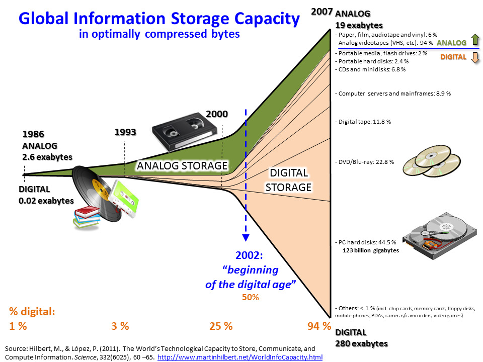

# Tilastotiede tieteenalana {#luku3}

Tässä luvussa hahmottelemme tilastotieteen piirteitä tieteenalana. Käymme läpi tilastotieteelle ominaisia piirteitä, jotka erottavat sen niin lähitieteistä, kuten matematiikasta ja tietojenkäsittelytieteestä, kuin myös sovellusaloista. Usein näkee tilastotieteen typistettävän vain työkaluksi eri sovellusalojen empiiriseen tutkimukseen siitäkin huolimatta että tilastotieteellä on oma rikas teoriapohjansa sekä kiistaton asema omana tieteenalanaan. 

Tieteenalan määritteleminen lyhyesti on aina hieman hankalaa. Tästä huolimatta seuraavassa yritämme osaltaan vastata seuraaviin kysymyksiin:

- Mitä tilastotiede on ja mitä se ei ole? Miksi tilastotiede ei ole vain sovellettua matematiikkaa tai matematiikalla höystettyä tietojenkäsittelyä?
- Mihin tilastotiedettä käytetään? Onko tilastotieteellä käyttöä ns. “akatemian” eli tutkimusyhteisön ulkopuolella?
- Minkälaista on tyypillinen tilastotiedettä kohtaan esitetty kritiikki?

## Lisää tilastotieteen perustermejä {#alaluku31}

Seuraavia tilastotieteen esittelyä ja karakterisointeja ajatellen määritellään seuraavassa lisää tilastotieteellisen tutkimuksen peruskäsitteitä. Näihin käsitteisiin paneudutaan osaltaan tarkemmin mm. luvussa \@ref(luku5).

- Tilastotieteellinen tutkimus tarkastelee reaalimaailman ilmiöitä. Täten tutkimuskohteena on tavallisessa elämässä tavattavia asioita, ihmisiä tai tapahtumia. Tutkimuskohteita kutsutaan **tilastoyksiköiksi** ja niiden joukkoa kutsutaan **populaatioksi (perusjoukoksi)**. 

::: {.eblock .kimmo data-latex="{}"}
**Esimerkki: vaalitutkimus**: 

- Politiikan tutkimuksen alalla yksi mielenkiintoinen tutkimuskohde on tutkia kuntavaaleissa äänestävien ihmisten tuloja.
  - Tällöin jokainen äänioikeuttaan käyttävä muodostaa oman tilastoyksikkönsä.
  - Vastaavasti populaationa (perusjoukkona) (ks. alla) toimii kaikki äänestysikäiset kansalaiset, jotka äänioikeuttaan käyttävät.
  - Pohdi: miksi pelkästään äänioikeuttaan käyttävien tutkiminen saattaisi olla tutkimuksen tulosten luotettavuuden kannalta ongelmallista?
- Toinen tutkimuskysymys voisi käsitellä kuntien välistä äänestysaktiivisuutta.
  - Tällöin jokainen kunta muodostaa oman tilastoyksikkönsä ja vastaavasti kaikki Suomen kunnat muodostavat populaation.
  - Kuntien äänestysaktiivisuus saadaan kuitenkin tutkimalla kunnan sisäistä äänestysaktiivisuutta.
    -  Toisin sanoen, voidaksemme mitata kuntien äänestysaktiivisuutta, tulee ensiksi selvittää kuntien äänestysikäiset kansalaiset ja äänioikeuttaan käyttävät.
:::

::: {.defblock .mikko data-latex="{}"}
**Populaatio**  

Konkreettinen tai hypoteettinen tutkimuskohteiden joukko, joka koostuu kaikista tilastoyksiköistä
:::

- Populaation muodostavilta tilastoyksiköiltä tarkastellaan niiden ominaisuuksia, eli **tilastollisia muuttujia**. 
  - Edellisissä esimerkeissä nämä olisivat esim. äänestäjien tulot ja kuntien äänestysprosentti. 
  - Mielenkiinnon kohteena olevia tilastollisia muuttujia kutsutaan **tutkimusmuuttujiksi** (tulot ja kuntien äänestysprosentti) ja niiden lisäksi voidaan kerätä lisätietoa eli **taustamuuttujia** (näitä voisivat olla esimerkiksi asuinpaikka ja kunnan väkiluku).
  - Tilastoyksiköiden tilastollisilla muuttujilla on tietty mahdollisten arvojen joukko, ja näillä arvoilla on jokin **jakauma** populaatiossa. 
    - Esimerkiksi tulot voivat määritelmästä riippuen saada minkä tahansa positiivisen arvon mutta äänestysprosentti on luonnollisesti rajattu nollan ja sadan prosentin väliin.

::: {.defblock .mikko data-latex="{}"}
**Tilastoyksikkö ja tilastollinen muuttuja**  

Populaation muodostavilta tilastoyksiköiltä (populaation alkioilta) tarkastellaan  tilastollisia muuttujia, joita voidaan mitata tai havaita.
:::

- Kun tarkasteltavien tilastoyksikön tilastollisten muuttujien (numeeriset) arvot havaitaan, kutsutaan näiden arvojen joukkoa **havainnoksi**


::: {.defblock .mikko data-latex="{}"}
**Havainto**  

Havainto muodostuu tilastoyksikön tarkasteltavien tilastollisten muuttujien havaitusta arvoista.
:::

- Kerättyjen havaintojen joukko muodostaa **havaintoaineiston**, eli **datan**.

::: {.defblock .mikko data-latex="{}"}
**Havaintoaineisto/data**  

Havaintoaineisto, data, on tilastoyksiköiden tilastollisista muuttujista kerätty havaintojen joukko.
:::


**Tiivistettynä**: 

- Populaatio koostuu tutkimuksen kohteena olevista tilastoyksiköistä.
- Havaitaan tilastoyksiköistä tutkimuksen kannalta mielenkiintoisia tilastollisten muuttujien numeerisia arvoja.
- Nämä havainnot muodostavat havaintoaineiston, eli datan, jota voidaan käyttää tutkimuksessa ja tutkia **populaation ominaisuuksia**.

## Mitä tilastotiede on ja mitä se ei ole? {#alaluku32}

- Aloitetaan tarkastelemalla erinäisiä **tilastotieteen "karakterisointeja"** eri tahojen ja tutkijoiden toimesta:
  - __*Tilastotiede on tietotuotannon teknologiaa*__, *jonka avulla voidaan suorittaa kvantitatiivisten tietojen joukkotuotantoa ja havaintoihin perustuvia tieteellisiä ja käytännöllisiä päätöksiä. Tilastotiede on siis yksikköjen muodostamaan joukkoon liittyvän numeerisen tietoaineiston keräämistä, analysointia ja tulkintaa koskeva tiede* ^[[Leo Törnqvistin]( https://fi.wikipedia.org/wiki/Leo_T%C3%B6rnqvist), Suomen ensimmäisen tilastotieteen professorin, esittämä luonnehdinta (Vartia, 1989).].
  - __*Tilastotiede on yleinen menetelmätiede*__, *jota sovelletaan, jos reaalimaailman ilmiöstä halutaan tehdä johtopäätöksiä ilmiötä kuvaavien kvantitatiivisten tai numeeristen tietojen perusteella sellaisissa tilanteissa, joissa tietoihin liittyy epävarmuutta tai satunnaisuutta* ^[Mellin (2005).].
  - *Vale, emävale, tilasto* ^[[Mark Twain](https://fi.wikipedia.org/wiki/Mark_Twain) popularisoi tämän lausahduksen teoksessaan *Chapters from My Autobiography* jo vuonna 1907. Huomionarvoista toki on, että valtaosa "modernin" tilastotieteen, jolle nykytilastotiede pohjautuu, teoriakehityksestä on tapahtunut vasta Twainin teoksen julkaisun jälkeen. Esimerkiksi Ronald Fisher, jota pidetään modernin tilastotieteen isänä, julkaisi merkityksellisimmät työnsä vasta 1920- ja 30-lukujen aikana. Tällä lentävällä lausahduksella ei siis ole mitään tekemistä nykyisten tilastollisten menetelmien kanssa.].
  - *Statistics concerns what can be learned from data* ^[(A.C. Davison)].
  - *"Maalaisjärjen tehostamista"* ^[Sund, (2003)].

- Tilastotiede siis **kehittää** ja **soveltaa menetelmiä** ja (tilastollisia) **malleja**, joiden avulla reaalimaailman ilmiöistä voidaan tehdä johtopäätöksiä ilmiöitä kuvaavien numeeristen tai kvantitatiivisten tietojen perusteella tilanteissa, joissa tietoihin liittyy **epävarmuutta ja satunnaisuutta**.
  - Tilastollisten menetelmien avulla pyritään löytämään reaalimaailman satunnaisia ilmiöitä kuvaavista numeerisista (eli kvantitatiivisista) tiedoista **systemaattisia piirteitä** joita jalostetaan sellaiseen muotoon, että ilmiöistä voidaan tehdä päätelmiä. 
    - Vrt. signaalin ja kohinan erottaminen (ks. Silver, 2014)^[Silver, N. (2014). Signaali ja kohina: Miksi monet ennusteet epäonnistuvat mutta jotkin eivät? Terra Cognita. (Suomentanut Kimmo Pietiläinen)].
  - Tilastolliset mallit perustuvat todennäköisyyslaskentaan ja niillä mallinnetaan reaalielämän ilmiöiden alla piileviä prosesseja tai mekanismeja. Näiden prosessien tuottamia tietoja (aineistoja) tiivistetään usein graafisiksi esityksiksi ja tunnusluvuiksi sekä tilastollisten mallien parametreiksi, joiden pohjalta johtopäätöksiä tehdään.
  - Tässä onnistuakseen tilastollisten menetelmien tuleekin pyrkiä erottelemaan **sattuma** ja **systemaattisuus** tarkasteltavissa ilmiöissä tai, tarkemmin, niitä kuvaavissa aineistoissa, jotta johtopäätökset olisivat luotettavia.

\

**Voidaan sanoa, että saadakseen tarkemmin selville mitä tilastotiede on, pitää opiskella tilastotiedettä ja sen käyttöä!**

\

**Mitä tilastotiede ei ole**

- __Tilastotiede ei ole vain tilastojen tuotantoa__
  - Vaikka sana **tilasto** tuo useimmille ensimmäisenä mieleen yhteiskuntaa ja sen toimintaa kuvaavat **numeeristen tietojen järjestelmälliset kokoelmat**, tilastotiede ei suinkaan ole ainoastaan tilastojen ja niiden tekemisen oppia.
    - Tämä siitäkin huolimatta, että niiden menetelmien konstruointi, joilla näitä tilastoja tuotetaan, jalostetaan ja analysoidaan on keskeinen osa tilastotiedettä. Tilastot ovat siis usein tilastotieteen soveltajan tutkimuskohteena ja tilastojen laadinnassa käytetään apuna tilastotieteen menetelmiä.
    - Suomessa [Tilastokeskus](https://www.stat.fi/) toimii virallisena tilastoviranomaisena ja tilastotuottajana. Tätä **tilastotuotannon** kokonaisuutta nimitetään ajoittain **tilastotoimeksi**. **Tilastotieteen käyttöalue on paljon tätä laajempi**. 
    - Ajoittain käytettävää terminologiaa ja luokittelua:    
      - Tilastoala = Tilastotiede + Tilastotoimi  
      - Tilastotiede = Teoreettinen tilastotiede + Soveltava tilastotiede  
      - Tilastotoimi = Tilastojen tuotanto + Tilastojen hyödyntäminen  
      
          
- Tilastotieteen kannalta mikä tahansa reaalimaailman ilmiötä kuvaava **numeeristen tai kvantitatiivisten tietojen järjestelmällinen kokoelma** voi muodostaa **tilastollisen aineiston** ja siten tilastollisen tutkimuksen mahdollisen kohteen.
  - Esimerkiksi kaikki **empiirisen** tai **kvantitatiivisen** tutkimuksen tutkimus- tai havaintoaineistot ovat tilastotieteen kannalta tilastollisia aineistoja.

\

- Tilastotiede sijoittuu tieteiden kentässä matematiikan, filosofian ja tietojenkäsittelytieteen rinnalle. Tästä huolimatta se ei kuitenkaan ole yksiselitteisesti minkään näiden osa-alue.
  - **Tilastotiede ei ole matematiikan osa-alue**, sillä tilastotiede lähestyy tieteellistä ongelmanratkaisua eri tavoin:
    - Matematiikka on tietyllä tavalla aina eksaktia ja sen tulokset perustuvat formaaliin deduktioon ja loogisiin todistuksiin, johtaen usein "eksaktiin" ratkaisuun tai matemaattisesti formaaliin ratkaisun loogiseen esitystapaan.
    - Tilastotiede sen sijaan on aina konteksti- ja aineistopohjaista ja perustuu induktiiviseen päättelyyn. Saadut tulokset ovat aina epävarmoja - koska ne kuvailevat epävarmaa tietoa generoivia prosesseja!
      - Tilastotiede on siis hyvä nähdä omana tieteenalanaan matemaattisesta esitystavastaan huolimatta. Eihän esimerkiksi myöskään fysiikkaa (sentään) pidetä matematiikan osa-alueena!
  - **Tilastotiede ei ole myöskään tietojenkäsittelytieteen osa-alue**, vaikkakin useiden laskennallisten menetelmien ja tehokkaan tietojenkäsittelyn rooli tilastollisissa analyyseissä on jatkuvasti kasvanut. 
    - Tietojenkäsittelytieteen teoria ei rakennu tilastotieteen tavoin ajatukselle epävarmoista ja satunnaisista reaalimaailman ilmiöistä.

- Vaikka nämä ja jotkin muut alat jakavat tilastotieteen kanssa useita piirteitä ja ominaisuuksia, on tilastotiede kuitenkin siis perustellusti oma tieteenalansa. Tämä erottelun vaikeus jo itsessään todistaa kuinka keskeinen rooli tilastotieteellä on eri aloilla! 
  - Tilastotiede ei siis kuulu yksiselitteisesti sen lähitieteiden alle, vaan muodostaa oman tieteenalan omine teorioineen ja tieteellisine premisseineen. Käsittelemme myöhemmin tilastotieteen roolia matematiikan ja/tai datatieteiden ("data science") kokonaisuudessa ja keskustelemme tarkemmin näiden erojen luonteesta.

\
\

**Mitä tilastotiede (ainakin) on**

- **Tilastotiede yleisenä menetelmätieteenä**
  - Tieteellistä tietoa ympäröivästä maailmasta hankitaan tieteellisillä **menetelmillä/metodeilla** (ks. tieteellisen menetelmän kriteerit luku \@ref(luku2))), joiden avulla tutkitaan jotain ilmiötä tai sen generoimaa kvantitatiivista mutta epävarmaa tietoa sisältävää aineistoa. 
  - Tilastotieteessä kehitetyt ja kehitettävät menetelmät antavat tutkijoille yhtenevät ja tiedeyhteisön hyväksymät raamit, jotka mahdollistavat (tilastollisen) päättelyn ja päätöksenteon epävarman tiedon vallitessa. Näin voidaan uskottavasti ja luotettavasti tiivistää tietoa, jota erilaiset aineistot sisältävät, perustaa johtopäätöksiä näille tiivistyksille ja saavuttaa uusia tieteellisiä löytöjä.
    - Tilastotieteen menetelmien käyttö ja soveltaminen onkin siis aina alakohtaista. Tästä huolimatta tilastollisia menetelmiä sovelletaan aina johonkin **aineistoon**!
  - Tilastotieteen nähdäänkin usein kuuluvan ns. **menetelmätieteisiin**, joissa mm.:
    - Kehitetään työkaluja muiden tieteiden tutkimusongelmien ratkaisuksi
    - On myös oma sovelluksista vapaa teorianmuodostuksensa
  - Menetelmäkehityksen näkökulma tilastotieteeseen: *tilastotiede kehittää matemaattisia* __*malleja*__ *satunnaisilmiöitä kuvaavia kvantitatiivisia tietoja generoiville prosesseille.* Koska tietoihin liittyy **epävarmuutta** tai **satunnaisuutta**, **tilastolliset mallit** perustuvat **todennäköisyyslaskentaan**.
    - Juuri sattuman ja epävarmuuden huomioiminen tutkimusasetelmissa erottaa tilastotieteen muista menetelmätieteistä!

- Tilastollisia menetelmiä voidaan soveltaa tietojen keruun, jalostuksen ja analysoinnin jokaisessa vaiheessa. Päämääränä on jalostaa tiedot muotoon, joka mahdollistaa tutkittavaa reaalimaailman ilmiötä koskevien johtopäätösten tekemisen käytettyjen menetelmien pohjalta, eli ns. **tilastollisen päättelyn**.
  - Tutkimuksessa on pystyttävä valitsemaan ja käyttämään menetelmiä, jotka antavat aineistosta vastauksia haluttuihin kysymyksiin. Tämä vaatii yhtä lailla sovellusalakohtaista osaamista (ns. **substanssiosaamista**) kuin myös kattavaa **menetelmäosaamista**.

\
\

- Tilastotieteessä lähtökohtana ja ratkaisevassa asemassa on siis aina jonkin satunnaisilmiön generoima __aineisto__, josta haluamme oppia tai tietää lisää, kenties voidaksemme tehdä suuria yhteiskunnallisia päätöksiä sen pohjalta!
  - Tämä aineistokeskeisyys yhtäältä erottaa tilastotieteen rajatieteistään ja toisaalta tuo sen lähemmäksi niitä ja sovellusalojaan.
  - Aineistoa analysoidaan, kuvaillaan ja mallinnetaan tilastollisin menetelmin, joiden kehittäminen on keskeinen osa tilastotiedettä. 
  - Pelkkä menetelmien kehittäminen kuuluu pitkälti matemaattisen/teoreettisen tilastotieteen osa-alueelle.
  - Pelkkä ainestoon keskittyminen ja (mekaaninen) analysointi voi sen sijaan olla joissain tilanteissa pitkälti tietojenkäsittelyä.
- **Tilastollinen "mallintaminen"** löytyykin näiden välistä ja se sisältää eri alojen sovelluksista kumpuavan tarpeen uusien menetelmien kehittämiseen.
  - Tämä vuoropuhelu muodostaa tilastotieteelle luonnollisen "takaisinkytkennän" teoreettisen ja soveltavan puolen välillä: uudet teoreettiset menetelmät vastaavat soveltavan tilastotieteen ongelmiin mutta herättävät aina uusia kysymyksiä, jotka palautuvat taas teoreettisen tilastotieteilijän pöydälle!
  - Luonnollisesti valtaosa tilastotieteilijöistä ja lähitieteiden harrastajista asettuvat näiden äärimmäisten luonnehdintojen välimaastoon eikä tarkkaa luokittelua ole sinänsä tarpeen tehdä ja korostaa.
  - Joka tapauksessa tilastotieteen kehityksen keskiössä ovat aina sovellusalakohtaiset ongelmat, joista useat palautuvat yleisemmälle tasolle teoreettisen tilastotieteen kehityspolkuihin. 
  
  
  
## Tilastotieteen suhde lähitieteisiin {#alaluku33}

- Kuvio \@ref(fig:datasc)^[Kuvan lähde: [Duchesnay (2020)](https://duchesnay.github.io/pystatsml/introduction/machine_learning.html)] tarjoaa karkean yleistyksen tietojenkäsittelytieteen (Computer Science) ja sovellusalan (Application domain) sekä tilastotieteen (Statistics) ja matematiikan (Mathematics) välisistä yhteyksistä. On selvää että tilastotieteellä on paljon päällekäisyyksiä lähitieteidensä kanssa ja joskus näkeekin (huolimatta edellä tehdyistä huomioista) että tilastotiede niputetaan yhteen matematiikan tai tietojenkäsittelytieteen kanssa. 

```{r datasc, echo=FALSE, fig.cap="Tilastotieteen ja rajatieteiden yhteyksiä kuvaava Venn-diagrammi. (Duchesnay, 2020)", fig.align='center', out.width = "100%"}
knitr::include_graphics("images/data_science.jpg")
```


- Yritetään siis vielä hahmotella tilastotieteen suhdetta sitä lähimpänä olevaan (soveltavaan) matematiikkaan.
  - Tilastotieteessä olennaisen otantateorian (Luku \@ref(luku5)) voisi ajatella olevan matemaattisesti määritelty teoria, jossa myös on aineiston käsite, mutta se ei tee siitä vielä varsinaisesti tilastotiedettä.
  - Matematiikassa kuvataan ongelma ja esitetään se teorian muodossa, eli malli on _"parametreista havaintoihin"_.
  - Tilastotieteessä ongelma on käänteinen, edetään _"havainnoista parametreihin"_, mutta ongelman matemaattinen kuvaus vaaditaan ensin.
  - Tilastotiede esittää menetelmiä ja käsitteitä tämän käänteisen ongelman ratkaisemiseen.
    - Karkeasti erotellen tilastotieteessä käsiteltävät ongelmat lähtevät aina havainnoista eli aineistosta ja matematiikassa suunta on teoriasta aineistoon.
    - Voidaankin siis sanoa, että tilastotieteen erottaa puhtaasta matematiikasta se, että siinä tutkitaan menetelmiä eli metodeja, jotka mahdollistavat päättelyn/tiedon hankinnan puutteellisesta tai epävarmasta tiedosta.

- Ilmiöiden kuvaamiseen ja käyttäytymisen ennakoimiseen käytetään usein **mallia**. Mallit (matemaattiset/tilastolliset mallit) voidaan jakaa **deterministisiin** ja **stokastisiin** malleihin.
    - Deterministisen mallin tapauksessa, tiettyjen alkuehtojen (alkuarvojen) vallitessa voidaan määrittää tarkasteltavan ilmiön lopputulos. Esimerkkejä ovat esim. monet fysiikan lait.
    - Stokastiset mallit perustuvat todennäköisyyslaskentaan. Stokastisia malleja käytetään kun alkuehtojen perusteella ei voida varmasti määrittää tarkasteltavan ilmiön lopputulosta. Tällöin eri vaihtoehtoihin liittyvät tietyt __esiintymistodennäköisyydet__. Esimerkkejä ovat esim. kolikonheitto tai sään ennustaminen.
    - Kun jotain ilmiötä kuvataan stokastisen mallin avulla, voidaan käyttää (joudutaan käyttämään) tilastollisia menetelmiä. Vaikka käytännössä laskenta hoidetaan tietokoneohjelmien avulla, meidän tilastotieteen tutkijoina ja käyttäjinä on huolehdittava tutkimusprosessin onnistuneesta toteutuksesta muilta osin.

\
\

- Tilastotiede ei myöskään ole puhtaasti tietojenkäsittelyä, vaikka tilastotiede onkin luonteeltaan aineistopohjaista ja aineistojen sisältämää tietoa on käsitelty osin samoin kuin tietojenkäsittelyssä siitä asti kun se on ollut mahdollista (tietokoneen keksimisen myötä).
  - Tilastotieteen ja tietojenkäsittelytieteen ero on lähitieteistä selvin: tilastotieteellä on "mekaanisesta" tai teoreettisesta tietojenkäsittelystä selkeästi erillinen ja oma teoriapohjansa.
    - Siinä missä tilastotieteen teoria perustuu aineiston stokastiselle mallintamiselle, tietojenkäsittely on enemmänkin algoritmista ajattelua, missä aineistolla on ratkaisevalla tavalla erilainen rooli.
  - Lisäksi suomen kielessä tietojenkäsittely ymmärretään laajemmassa mielessä ohjelmoitavissa olevaksi automatisoimiseksi, jota tilastotiede ei perusolemukseltaan suinkaan ole.

\
\

- Tarkastellaan seuraavaksi tilastotieteen suhdetta viime vuosien aikana paljon suosiota keränneeseen **datatieteeseen (data science)** johon voidaan katsoa lukeutuvan mm.
  - Tilastotiede ja matematiikka
    - Erityisesti tilastollinen data-analytiikka ja satunnaisen aineiston mallintaminen sekä soveltuvat soveltavan matematiikan osa-alueet.
  - Tietojenkäsittely
    - Tietoteknologian kehityksen myötä taitavien tietojenkäsitteljöiden kysyntä on kasvanut merkittävästi. Lähes jokaisella alalla kerätään entistä enemmän dataa lähes kaikesta, ja jonkun pitäisi osata myös käsitellä sitä! 
    - Datatieteen voidaankin osaltaan katsoa syntyneen tästä elinkeinoelämän tarpeesta asiantuntijoille, jotka osaavat käsitellä suuria tietoaineistoja (dataa) sekä mallintaa niitä hyödyllisellä tavalla.
  - Sovellusala
    - Datatiede on luonteeltaan pääosin soveltavaa ja sen alaan lukeutuvia menetelmiä sovelletaan aina johonkin tosielämän ongelmaan. Tästä syystä substanssiosaaminen sovellusalalta on datatieteilijälle erityisen tärkeää ja nykypäivänä datatieteilijän rooli onkin pirstaloitunut yhä enemmän eri sovellusalojen datatieteisiin. 
    - Tästä huolimatta datatieteilijöiden käyttämät mallinnusmenetelmät ovat usein varsin samanlaisia, sillä ne pohjautuvat edelleen tilastotieteen ja matematiikan teoriapohjaan. Ilman jälkimmäisten riittävää osaamista, liikutaan datatieteen osalta vaarallisilla vesillä! (Ks. oheinen kuva ja keskustelu alla).  
- Datatieteellä ei usein nähdä olevan omaa historiallisen tieteellisen prosessin luomaa teoriapohjaa vaan sen voidaan katsoa olevan kokoelma eri alojen tieteellisiä menetelmiä ja tuloksia, jotka voidaan yhdistää tavalla, jonka "datavallankumous" (ks. kuva \@ref(fig:datarevolution)) mahdollistaa ja jotka ovat keskeisessä roolissa dataintensiivisissä sovellutuksissa.

```{r datarevolution, echo=FALSE, fig.cap="Datavallankumous (Hilbert, M. ja Lopez, P. (2011) The Worlds Technological Capacity to Store, Communicate and Compute Information. Science, 332(6025), 60-65.", fig.align='center', out.width = "100%"}

```

- __"Danger zone"__
  - Kuvan \@ref(fig:datasc) "danger zone" ([Duchesnay, 2020](https://duchesnay.github.io/pystatsml/introduction/machine_learning.html)) kuvaa tilannetta, jossa ilmiöiden/mallien tilastotieteellinen perusta unohdetaan.
  - Tilastotieteen näkökulman ohittava (laiminlyövä) soveltaja ei aina kykene suhtautumaan kriittisesti muodostuvaa ennustemallia, tai ennustetulosta, kohtaan eikä täten päädy parhaisiin mahdollisiin (tarkimpiin) ennustetuloksiin tilanteessa, jossa jokin toinen malli kuvaisi ilmiötä annettua mallia paremmin.
  - Ko. soveltaja ottaa mallin sekä sen antaman ennustetuloksen annettuna, eikä mieti _mistä kyseinen ennustetulos johtuu_. Jotta tarkat ennustetulokset toteutuvat jatkossakin (kun uutta aineistoa, dataa, tulee saataville), on ennustajan oleellista huomioida mitkä tekijät johtivat tarkkaan ennustulokseen.
  - Eri menetelmät sopivat eri sovelluskohteisiin. Tilastotieteilijä osaa useimmiten tunnistaa eri sovelluskohteisiin sopivat menetelmät paremmin kuin tietojenkäsittelijä. Vastaavasti tehokkaan/onnistuneen ohjelmointikoodin kirjoittamisessa tilanne on usein toisinpäin.

## Tilastotieteen osa-alueet {#alaluku34}

- Tilastotiede on saanut alkunsa siitä, että yhteiskunnan modernisoituessa on tarvittu yhä enemmän tietoja erilaisiin hallinnollisiin tarpeisiin. Samalla on syntynyt tarve kehittää menetelmiä joiden avulla tilastojen luotettavuutta on voitu parantaa.
  - Kehitys oli pitkään ns. ongelmasta menetelmään ja tutkimusalojen erilaisuudesta johtuen myös tilastotiede on kehittynyt vastaamaan monipuolisesti erilaisiin menetelmällisiin ongelmiin!
  - Tämä on johtanut osaltaan siihen, että tilastotiede jakautuu moniin osa-alueisiin. Osa-alueita on niin paljon, että alan huiputkaan eivät voi hallita niitä kaikkia! 
- Tästä huolimatta tilastotiede voidaan karkeasti jakaa teoreettiseen ja soveltavaan osa-alueeseen, jotka toimivat alituisessa vuoropuhelussa.

__Soveltava tilastotiede__

:::{.defblock .mikko data-latex="{}"}
**Soveltava tilastotiede**  

on nimensä mukaisesti teoreettisen tilastotieteen kehittämien menetelmien soveltamista jonkin tutkimusalan empiiriseen ongelmaan. Suurin osa tilastotieteen menetelmistä on alun perin kehitetty jonkin konkreettisen tutkimusongelman innoittamana. 
:::

- Yleisesti ottaen eri tieteenaloilla kohdattavat menetelmäsuuntaukset voidaan jakaa kahteen luokkaan tutkimusaineistojen tyypin perusteella:
  - **Kvantitatiivinen** eli __määrällinen tutkimus__ on tutkimusta, jossa tutkimusongelma on muotoiltu tarkasti etukäteen ja tutkimuskysymyksiin vastataan käyttäen tilastollisia menetelmiä pyrkien **selittämään ja ennustamaan** tutkimuksen kohteena olevaa ilmiötä.
    - Täsmällisten ja laskennallisten tilastollisten menetelmien käyttäminen numeeriseen aineistoon on kvantitatiiviselle tutkimukselle ominaisin piirre.
    - Perustuu yleensä satunnaisotokseen (kts. luvut \@ref(luku4), \@ref(luku5) ja \@ref(luku6)) ja tutkimusaineisto on tiivistetty numeeriseksi havaintomatriisiksi, jolle oleellinen vaatimus on sen totuudellisuus.
    - __Kritiikki__: määrällinen tutkimus on (paikoin) sokea tutkittavien ilmiöiden sellaiselle luonteelle, jota ei pystytä kvantifioimaan, eli muuntamaan numeeriseen muotoon. Näihin voidaan katsoa lukeutuvan mm. tunteet, merkitykset ja kokemukset, ellei tutkija keksi niiden numeeriselle mittaamiselle uskottavaa keinoa.  
  - **Kvalitatiivinen** eli __laadullinen tutkimus__ on tutkimusta, jossa tutkimuksen kohteena olevaa ilmiötä ja sen merkitystä sekä tarkoitusta pyritään **ymmärtämään** kokonaisvaltaisella tavalla.
    - Laadullisessa tutkimuksessa annetaan usein tilaa tutkimuksen kohteena olevien ilmiöiden ja/tai ihmisten näkökulmille, vaikuttimille, kokemuksille ja tuntemuksille. Tutkimusyksikköjen otanta on täten usein harkinnanvaraista.
    - Laadullisessa tutkimuksessa tutkimusongelma muotoutuu tutkimuksen edetessä ja sille tyypillistä on hypoteesittomuus, eli tutkimus on tarkoitus aloittaa mahdollisimman vähin ennakko-oletuksin. Ennakko-oletuksista on kuitenkin mahdotonta täysin irtautua, joten niiden ilmi tuominen esioletuksina tai "tutkimushypoteeseina" eli arvauksina tuloksista on osa tutkimusta.
    - Kritiikkiä: laadullinen tutkimus ei pysty vastaamaan kysymykseen miksi, sillä ilman määrällisiä (numeraalisia) aineistoja ei ilmiöiden välisiä riippuvuuksia kyetä tutkimaan: __laadullisessa tutkimuksessa menetetäänkin mahdollisuus tutkia ilmiöiden todellisia syitä__.
      - Laadullinen tutkimus nähdään usein vähemmän objektiivisena ja sen otosta koskevia tuloksia ei useinkaan voida yleistää koskemaan perusjoukkoa.
  
```{r, echo = FALSE}
#  - Usein pyritään vastaamaan kysymyksiin "miksi?", "miten?" ja "millainen?", joista laadullinen tutkimus kykenee vastaamaan korkeintaan viimeiseen.
```

\
\

- __Yleisenä menetelmätieteenä tilastotiedettä voidaan (ja myös pitäisi) soveltaa kaikilla reaalimaailmaa tutkivilla tieteenaloilla, joiden tutkimusaineistot voidaan esittää kvantitatiivisessa muodossa.__
  - Tilastollisten menetelmien käyttö on siis huomattavan paljon yleisempää määrällisessä kuin laadullisessa tutkimuksessa.
- Menetelmien soveltamisen tarkoituksena on (voi olla):
  **i)** __kuvailla ja tiivistää tietoa__, jota havaittu aineisto sisältää 
  **ii)** sovellusalan oman **teorian empiirinen testaus** tai 
  **iii)** edellisten pohjalta tehtävä **tilastollinen päättely**.
  - **Deskriptiivisellä eli kuvailevalla tilastotieteellä** tarkoitetaan sellaisten menetelmien soveltamista, joiden avulla havaintoaineistosta voidaan esimerkiksi laskea tunnuslukuja, kuvata havaintomuuttujien jakaumia ja visualisoida aineiston generoimaa ilmiötä tai siitä johdettuja tunnuslukuja.
  - **Tilastollinen päättely** on sen sijaan aineiston tarkasteluun/kuvailuun sekä mallintamiseen perustuvaa päätöksentekoa, jossa kvantitatiiviseen aineistoon kuuluva epävarmuus ja satunnaisuus on otettu huomioon. 
    - Keskeinen tilastollisen päättelyn käyttötarkoitus soveltajille on usein **teorian ja siihen liitettävien hypoteesien testaaminen**, joka voi johtaa joko teorian vahvistumiseen (*verifiointiin*) tai sen vääräksi osoittamiseen (*falsifioimiseen*) (ks. luku \@ref(alaluku21)).
    - On myös syytä muistaa, että yksi tutkimus ei vielä osoita teoriaa oikeaksi tai vääräksi vaan siihen tarvitaan useita tutkimuksia sekä erilaisia tutkimusasetelmia ja -menetelmiä. 
  - Kuvaileva tilastotiede ja tilastollinen päättely kulkevat soveltavassa tilastollisessa tutkimuksessa käsi kädessä.


```{r soveltava, echo=FALSE, fig.cap="Soveltava tilastotiede", fig.align='center', out.width = "100%"}
knitr::include_graphics("images/soveltava.jpg")
```

\newpage

__Teoreettinen tilastotiede__

:::{.defblock .mikko data-latex="{}"}
**Teoreettinen tilastotiede**  
kehittää (tilasto)matemaattisia malleja kuvaamaan satunnaisilmiöitä- ja prosesseja, jotka generoivat reaalimaailman ilmiöitä kuvaavia numeerisia tai kvantitatiivisia tietoja, joihin liittyy epävarmuutta ja satunnaisuutta.
:::

- Teoreettinen tilastotiede luo pohjan tilastollisten menetelmien ymmärtämiselle, soveltamiselle ja kehittämiselle.
  - Ilman riittävää ymmärrystä tilastollisten menetelmien toimintaperiaatteista niiden soveltaja on vaarassa tehdä virhepäätelmiä! (ks. alaluku \@ref(alaluku35) tilastotieteen kritiikistä)

- Mallit perustuvat todennäköisyyslaskentaan, ja niitä kutsutaan __tilastollisiksi malleiksi, stokastisiksi malleiksi tai todennäköisyysmalleiksi__.
  - Tilastolliset mallit perustuvat laajalti niin kutsuttuun uskottavuusfunktioon. Se on malli, joka riippuu havaintoaineiston lisäksi yhdestä tai useammasta parametrista. (ks. tarkemmin luku \@ref(luku6))
  - Uskottavuusfunktion arvo kertoo kuinka todennäköisenä voidaan havaittua aineistoa pitää, mikäli sen oletetaan olevan peräisin vastaavasta mallista jollain parametriarvoilla.
  - Uskottavuuspäättelyn perusajatuksena on, että se tai ne parametriarvot, joilla uskottavuusfunktion arvo maksimoituu kuvaa aineiston generoinutta prosessia parhaiten.
  - Aineistoa koskevia hypoteeseja voidaan testata käyttäen uskottavuusfunktion maksimia vastaavaa tilastollista mallia!
  - *"Kaikki mallit ovat vääriä, mutta jotkut ovat käyttökelpoisia."* (Box, 1976).

\
\

- Uskottavuusfunktiot perustuvat aina satunnaisilmiöiden mahdollisia arvoja kuvaaviin nk. **tiheysfunktioihin** tai **pistetodennäköisyysfunktioihin**.
  - Nämä funktiot kuvaavat jonkin satunnaismuuttujan (satunnaisilmiön) saamien arvojen jakaumaa.
  - Esimerkiksi kolikonheitto on satunnaisilmiö ja sillä on vain kaksi arvoa^[Kolikon kantilleen jäämistä ei tässä lasketa mahdolliseksi tapahtumaksi.] ja kolikonheittoa voidaan kuvata nk. binomijakaumalla, jota merkitään $\text{Bin}(n,p)$, jossa $n$ on heittojen lukumäärä ja $p$ on kruunan todennäköisyys.
  
::: {.eblock .kimmo data-latex="{}"}
**Esimerkki: kolikonheitto**: 

- Eräs klassinen yksinkertainen todennäköisyyslaskennassa ja tilastotieteessä käytettävä esimerkki käsittelee kolikonheittoa. 
- Kuvitellaan että olemme heittäneet kolikkoa 40 kertaa ja saatu kruuna 40/40 tapauksessa.
  - Kolikonheittoa seuranneet havainnot muodostavat nyt havaintoaineiston, jonka pohjalta voidaan perustellusti kysyä, että onko uskottavaa että kolikonheitto noudataa binomijakaumaa $\text{Bin}(40, 0.5)$?
  - Toisin sanoen, kuinka uskottavana voidaan pitää sitä että kyseinen kolikkon on tavallinen, painottamaton kolikko?
  
:::


```{r perus, echo=FALSE, fig.cap="Tilastotiede ja todennäköisyys", fig.align='center', out.width = "100%"}
knitr::include_graphics("images/perustuu.jpg")
```

\
\

- **Todennäköisyyslaskenta** luo tilastotieteelliselle epävarmuuden mallintamiselle vahvan ja uskottavan matemaattisen perustan. 
  - Todennäköisyyslaskentaa opetetaan tarkemmin (tätä kurssia seuraavilla) kursseilla [TILM3553 Todennäköisyyslaskennan peruskurssi pääaineopiskelijoille](https://opas.peppi.utu.fi/fi/opintojakso/TILM3553/1734), [TILM3568 Todennäköisyyslaskenta sivuaineopiskelijoille](https://opas.peppi.utu.fi/fi/opintojakso/TILM3568/3385) ja [SMAT5306 Todennäköisyyslaskennan jatkokurssi](https://opas.peppi.utu.fi/fi/opintojakso/SMAT5306/4400).


```{r teoreettinen, echo=FALSE, fig.cap="Esimerkki teoreettisesta tilastotieteestä ja tilastollisesta päättelystä.", fig.align='center', out.width = "100%"}
knitr::include_graphics("images/teoreettinen.jpg")
```

\newpage

## Tilastotieteeseen kohdistunutta kritiikkiä {#alaluku35}

- Tilastotieteen rooli tiedeyhteisössä on niin tärkeä että sitä kohtaan on ymmärrettävästi esitetty myös paljon kritiikkiä. Valtaosa kritiikistä kohdistuu joko tilastotieteen matemaattisuuteen tai sitten siinä tarvittaviin oletuksiin, jotka mahdollistavat esimerkiksi hypoteesien testaamisen. 
  - Usein kritiikki on aiheetonta ja johtuu sen esittäjän puutteellisesta tilastotieteen ymmärryksestä. Perusteettoman kritiikin esittäminen toista tieteenalaa kohtaa ei kuitenkaan ole vieras ilmiö juuri millään alalla. 

- Tässä alaluvussa käymme läpi yleisimpiä kritiikin muotoja, joita tilastotiedettä kohtaan esitetään ja pyrimme tarjoamaan vastauksia/vastineita silloin kun niitä voidaan antaa. 
  - On syytä korostaa, että seuraavassa käsiteltävät näkökulmat ovat monin paikoin sellaisia, joiden ymmärtämiseksi vaaditaan laajempia tilastotieteen opintoja mitä tällä kurssilla käsitellään. Eli tilastotieteen opintojen edetessä seuraavat, kriittisetkin, näkökulmat tulevat yhä paremmin ymmärrettäväksi.

\
\

__"Yleismaailmallinen" kritiikki__

- Tilastotieteessä käytettävien tunnuslukujen, kuten keskiarvon, reaalimaailman vastineet ovat joskus mielivaltaisia. 
  - Esimerkiksi keskiarvo on ajoittain ongelmallinen tunnusluku, sillä lienee varsin selvää, että keskimääräistä ihmistä ei ole olemassa vaikka tilastotieteessä näitä tunnuslukuja usein lasketaankin. 
  
::: {.eblock .kimmo data-latex="{}"}
**Esimerkki ("mahdoton" keskiarvo)**: 
- Puhekielessä kuulee paikoin tilastotiedettä kritisoitavan nk. "Keskiarvo-Kimmon" avulla, eli kuvitteellisella ihmisellä, joka on 1,8 lapsen vanhempi ja 1,5 auton omistaja. 
- Lisäksi joskus kuulee tilastotieteilijöitä kritisoitavan lausumalla "_Jos toinen jalka on jääkylmässä vedessä ja toinen kiehuvassa vedessä, niin tilastotieteilijän mielestä ihmisellä on tällöin keskimäärin hyvä olla_"

:::


- **Korrelaatio** on **tunnusluku**, joka kuvaa kahden muuttujan välistä riippuvuutta (palaamme tähän tarkemmin luvussa \@ref(luku6)). Se ei kuitenkaan kuvaa millään tavoin **kausaalisuutta**, eli sitä kumpi aiheuttaa kumman, jos kumpikaan.^[Tyler Vigen on kerännyt [verkkosivuilleen (ks. linkki)](https://www.tylervigen.com/spurious-correlations) mitä moninaisimpia esimerkkejä kahdenvälisistä nk. _näennäisistä_ korrelaatioista.] 
    - Esimerkiksi "jäätelön syönti ja hukkumiskuolemat" -tapauksessa havainnollisesti todetaan jäätelönkulutuksen ja  hukkumiskuolemien lukumäärän korreloivan keskenään, mutta taustalla vaikuttava tekijä onkin lämmin kesä, joka vaikuttaa molempiin.
    - Ylen jutussa [_"Jäätelö lisää hukkumiskuolemia – vai miten se menikään? Vältä nämä tilastojen tulkinnan kompastuskivet"_](https://yle.fi/aihe/artikkeli/2021/03/27/jaatelo-lisaa-hukkumiskuolemia-vai-miten-se-menikaan-valta-nama-tilastojen) on kuvattu useita esimerkkejä, jolla tilastoja voidaan esittää tai tulkita väärin - joskus jopa tahallisesti!
- Vaikkei näiden esimerkkien oikeellisuutta ole syytä kiistää, niin tilastollisen tiedon arvioinnissa on kuitenkin syytä päästä syvemmälle. 

\
\

__Kritiikki matemaattisuutta kohtaan__

- Ehkä merkittävin kritiikki tilastollisia menetelmiä kohtaan kohdistuu kritiikin näkökulmasta perusteettomaan, tai ainakin liian vahvaan, matemaattisuuden tuomaan itsevarmuuteen. Voidaankin siis perustellusti kysyä, että __onko tieteellisyys = matemaattisuus__?
  - Useat tieteenalat käyttävät tutkimuksessaan edistyneitäkin tilastollisia menetelmiä siitä huolimatta, että tutkijoiden tilastomatemaattinen pohjakoulutus ei välttämättä ole riittävällä tasolla kyseisten menetelmien kokonaisvaltaiseen ymmärtämiseen.
    - Helppokäyttöisistä tilasto-ohjelmistoista on riittävät perustaidot omaaville käyttäjille erittäin paljon hyötyä mutta koneiden ja ohjelmien käytön opettelu ei kuitenkaan ole varsinaista tilastotiedettä (tarvitaan enemmän tilastotieteen opintoja).
    - Laskentatehon ja modernin tietojenkäsittelyteknologian ansiosta monimutkaisiakin tilastollisia analyysejä on kuitenkin mahdollista tehdä vaikka tutkijalla olisi tilastotieteestä vain perustiedot, jos sitäkään. 
    - Pahimmillaan tämä saattaa johtaa siihen, että analyyseja tehdään ymmärtämättä mitä itse asiassa ollaan tekemässä.
  - Tilastollisten analyysien hyödyllisyyden ja järkevyyden ehtona on kuitenkin käytettävien menetelmien, aineiston ja tutkittavan ilmiön pintaa syvemmälle ulottuva tuntemus.
    - Käytettävien tilastollisten menetelmien oletukset on osattava ottaa huomioon ja toisaalta odottamattomien tulosten syyt on pystyttävä jäljittämään.
      - Teknistä esitystä käyttävää tutkijaa saatetaan pitää erityisen uskottavana, koska hän kykenee käyttämään vaikeita menetelmiä. Tästä huolimatta tutkimusongelma ei saisi päästä unohtumaan. 
      - Tutkijan tulisikin varmistua siitä, että käytettävät menetelmät todella vastaavat asetettuihin tutkimuskysymyksiin ja että tutkimusongelma on ratkaistavissa käytettävillä menetelmillä.
      - Tekninen esitys ei takaa onnistunutta tilastollista tutkimusta eri näkökulmista katsoen. Monet tilastolliset menetelmät ovat vaikeita ja vaativat soveltajiltaan paljon.
      - Lisäksi on hyvä muistaa, että käytettävien menetelmien lähtökohdat ja oletukset eivät matemaattisuudestaan huolimatta ole välttämättä neutraaleja!
    - Kaikkia tieteentekijöitä ei voida velvoittaa opiskelemaan edistynyttä abstraktia tilastotieteen teoriaa (tilastomatematiikkaa), mutta menetelmien oikeaoppinen käyttö kuitenkin vaatii riittävää ymmärrystä. 

\
\

__Kritiikki yksinkertaistuksia kohtaan__

- Edellisiä kohtia yleisemmin tilastotiedettä on kritisoitu siitä, että se ei kykene riittävällä tasolla huomioimaan reaalimaailman kompleksisuutta.
  - Merkittävässä osassa tilastollisia analyyseja lähtökohtana on usko "todellisen" maailman ja näin ollen aineistoa generoivien mekanismien olemassaoloon. 
    - Tätä saatetaan usein pitää kuitenkin kyseenalaisena: voiko "tosielämän stokastiikasta" muka todella löytyä säännönmukaisuuksia? 
    - Tämä kysymys on kuitenkin pitkälti tieteenfilosofinen ja palautuu lopulta sovellusalaan sekä tutkimusongelmaan ja -kysymykseen: tilastollisten menetelmien toimivuutta voidaan helposti testata esimerkiksi simulaatiokokeilla.  
  - Tilastotiedettä on myös kritisoitu sen "sokeudesta" sosiaaliseen vuorovaikutukseen liittyviin subjektiivisiin kokemuksiin kuten tunteisiin, kokemuksiin ja ei-numeerisiin havaintoihin.
    - Tämä kritiikki ei kuitenkaan suoranaisesti ole tilastotieteen kritiikkiä, vaan jälleen sovellusalakohtainen ja erityisesti tutkimuskysymyksen asettelua koskeva ongelma. 
      - Tuntemuksia ja kokemuksia voidaan hyvin testata tilastollisin menetelmin, mikäli tutkija osaa uskottavasti määritellä niille numeerisen mittauksen kriteeristöt! 
      - Tämä on kuitenkin vaikeaa, sillä aivan kaikkea ei voida kvantifioida: kirjoitetun tekstin tai sosiaalisten merkitysten tulkinnan sekä elämysten kuten musiikin ja taiteen aiheuttamien mielikuvien ja tunteiden voidaan perustellusti nähdä olevan hyvin haastavia kvantifioida. 
    - Näiden aiheiden tulkinta, ymmärtäminen ja tutkiminen ulottuu kvantitatiivisen tutkimuksen ulkopuolelle.
  - Mikäli tutkittavasta ilmiöstä pystyy kvantitatiivisilla mittauksilla saada relevanttia tietoa, tulisi aineiston analyysin apuna joka tapauksessa aina käyttää tilastollisia menetelmiä!
  - Vaikka kvantitatiivisia aineistoja ei voi pitää objektiivisina faktoina asioiden tilasta, se ei tarkoita, etteivätkö tulokset voisi olla käyttökelpoisia.

\
\

__Temppukokoelmakritiikki__

- Eräs ehkä osin implisiittinen kritiikki tilastotiedettä kohtaan on sen pitäminen nk. __"temppukokoelmana".__  
  - Tilastotieteen voi nähdä koostuvan numeeristen tietojen jalostamisen menetelmistä. Tämä näkemys, joka on usein tahaton, pelkistää tilastotieteen _vain_ __menetelmäkokoelmaksi__, vailla omaa teoriaa. 
  - Eri tutkimusalojen empiirisessä työssä (liian) usein vain kerätään aineisto ja vasta sitten mietitään mitä sillä voitaisiin tehdä.
  - Usein apuun haetaan tilastotieteilijä, jonka odotetaan loihtivan (tilastollisen) ratkaisun ongelmaan kuin ongelmaan. 
    - Joskus tämä toki onnistuukin, mutta useimmiten ei. 
    - Tilastotiede ei siis ole "työkalupakki", josta valitsemalla oikeanlaisen menetelmän voi vastata mihin tahansa tutkimuskysymykseen!
  - Tilastolliset menetelmät tulee ymmärtää ja niitä tulee soveltaa kaikissa soveltavan tutkimuksen vaiheissa, jotta tutkimusongelmaan kyetään vastaamaan eikä turhaa työtä tule tehdyksi. 
  - Karkeasti luokitellen tilastotieteilijät kehittävät menetelmiä, joita soveltajat käyttävät.  
    - Soveltavia tilastotieteilijöitä löytyy kuitenkin yhä kiihtyvissä määrin! Erityisesti eri rajatieteiden alueilla, kuten alaluvussa \@ref(alaluku36) lyhyesti esitellään.


__Tilastotieteen väärinkäyttö__

- Tilastotiedettä on myös mahdollista käyttää väärin monin eri tavoin, joka edelleen altistaa koko tieteenalan (perusteettomalle) kritiikille! 
  - Tilastoja ja tilastotiedettä käytetään paljon väärin, mutta tämä on usein tahatonta (esim. puutteellisesta koulutuksesta johtuvaa).
    - Joskus kuitenkin näkee tarkoituksellista tilastojen vääristelyä tai tahallista tilastollisten menetelmien väärinkäyttöä!
    - __Kansalaisten tiedelukutaidon__ ja tilastollisten menetelmien tuntemuksen merkitys on kasvanut viime vuosikymmeninä ja kasvanee jatkossa yhä, kun esimerkiksi erilaiset "vaihtoehtotieteet" ovat nousseet suositummiksi. 
    - Tilastotieteen ymmärrys auttaa itse kutakin tunnistamaan virheellisiä tai puutteellisin tiedoin tehtyjä päätelmiä ja täten helpottaa tietoyhteiskunnassa toimimista ja kriittistä ajattelua!

- Yleisiä tilastollisten menetelmien väärinkäyttötapoja ovat esimerkiksi seuraavat:
  - __"Kolmannen tyypin virhe"__: kun tilastollisia menetelmiä käyttämällä saadaan oikeita vastauksia, mutta vääriin kysymyksiin! Esimerkiksi jos tutkija ei täysin ymmärrä minkälaisia vastauksia käytettävissä olevasta aineistosta ja valitulla menetelmällä voidaan saada, voi hän syyllistyä kolmannen tyypin virheeseen. Tällöin voi nimittäin käydä niin, että hän tulkitsee tilastolliset testit täysin oikein, mutta luulee väärin niiden vastaavaan eri kysymykseen kuin on esitetty. 
  - Black-box ilmiö: saadaan _ehkä_ oikeita vastauksia, mutta ei tiedetä _miksi_ ja _mihin_ kysymyksiin.
    - Totaalinen tilastollisen päättelyn osaamattomuus saattaa johtaa tutkijan täysin väärille urille ja esimerkiksi jokseenkin epäoleelliseen tekniseen näpertelyyn monimutkaisten mallien kanssa.

::: {.eblock .kimmo data-latex="{}"}
**Esimerkki: Kolmannen tyypin virhe**

- Oletetaan että haluat tutkia onko kahden eri ikäryhmän ihmisten pituuksissa eroja ja sinulla on käytettävissä edustava otos molempien ikäluokkien edustajista. 
- Päätät tutkia _yksisuuntaisesti_ onko toisen ryhmän, ryhmän A, keskipituus _pienempi_ kuin ryhmän B. 
  - Testitulos osoittaa, että voit hylätä nollahypoteesin, jonka mukaan ryhmien        _keskipituus olisi sama_. 
  - Kolmannen tyypin virhe syntyy silloin, jos tosiasiallisesti testin hylkääminen     johtui siitä, että ryhmän A keskipituus olikin _suurempi_ kuin ryhmän B            keskipituus, mutta tätä et testin tuloksen perusteella voi tietää!   
:::

## Tilastotieteen sovellusaloja ja "rajatieteitä" {#alaluku36}

- Yleisenä menetelmätieteenä tilastotiedettä sovelletaan useilla eri tieteenaloilla.
  - Jokaisella sovellusalalla on oma erillinen teoriapohjansa sekä empiiriset käytänteet, joten substanssitietous on sovellettaessa erityisen tärkeää. 
    - Huolimatta vaihtelevista empiirisistä käytännöistä sovellusmenetelmän taustalla on (lähes aina) kuitenkin tilastotieteen alalla kehitetty menetelmä.
    - Sovellusaloilla ongelmanratkaisussa yhdistetäänkin metodiseen osaamiseen välttämättä myös substanssitietoutta. Tämän myötä soveltavan tilastollisen tutkimuksen kenttä on laaja ja rikas.
  - Osa näistä sovelluskentistä on kehittynyt vahvassa yhteisvaikutuksessa tilastotieteen ja lähitieteiden (viime aikoina erityisesti koneoppimisen) yhteydessä.

- Usein on pystyttävä arvioimaan ongelmanasettelun ja tulosten tarkoituksenmukaisuutta ja pyrkiä välttymään siltä että tutkijan tieteelliset ja yhteisölliset sitoumukset heijastuisivat tutkimuksen kulkuun.

- Tilastotieteen pääaineopiskelun osalta substanssitietous saavutetaan usein sivuaineopintojen perusteella. Vastaavasti toisinpäin muiden aineiden pääaineopiskelijoiden kohdalla, jolloin tilastotiede voi yhtä hyvin toimia (laajalti opiskeltuna) vahvana sivuaineena.

- Jokaisella tieteenalalla, jonka tutkimusaineistot voidaan esittää numeerisessa tai kvantitatiivisessa muodossa voi soveltaa/voisi soveltaa/pitäisi soveltaa tilastollisia menetelmiä sekä tutkimusaineistoja kerättäessä että niitä analysoitaessa. 
  - Siten jokainen empiirisen tutkimuksen havaintoaineisto on tilastollisen tutkimuksen mahdollinen kohde.
  - Esim. kokeellinen tutkimus käyttää apunaan tilastollisia menetelmiä.

- Koska tilastotieteellä on sovelluksensa miltei kaikilta tieteenhaaroilla, on syntynyt nk. "rajatieteitä":
  - Sovellusaloja, joilla tilastotieteen soveltaminen on muodostunut omaksi tutkimuskohteekseen/tieteenlajikseen (ks. linkit):
    - [Psykologia: psykometriikka,](https://en.wikipedia.org/wiki/Psychometrics) 
    - [Sosiaalitieteet: sosiometria,](https://en.wikipedia.org/wiki/Sociometry) 
    - [Taloustiede: ekonometria,](https://en.wikipedia.org/wiki/Econometrics) 
    - [Kemia: kemometria,](https://en.wikipedia.org/wiki/Chemometrics) 
    - [Bio- ja lääketiede: biometria,](https://en.wikipedia.org/wiki/Biometrics) 
    - [Epidemiologia,](https://en.wikipedia.org/wiki/Epidemiology) 
  - Soveltavan (sovelletun) matematiikan tutkimusaloja, jotka ovat osaltaan päällekkäisiä tilastotieteen kanssa
      - [Informaatioteoria,](https://en.wikipedia.org/wiki/Information_theory)
      - [Matemaattinen tilastotiede,](https://en.wikipedia.org/wiki/Mathematical_statistics)
      - [Todennäkäsyyslaskenta,](https://en.wikipedia.org/wiki/Probability)
      - [Operaatioanalyysi](https://en.wikipedia.org/wiki/Operations_research)
  - Tietojenkäsittelytieteen alaan (osittain) lukeutuvia tutkimusaloja
      - [Laskennalliset menetelmät,](https://en.wikipedia.org/wiki/Computational_science)
      - [Data mining,](https://en.wikipedia.org/wiki/Data_mining)
      - [Knowledge discovery,](https://en.wikipedia.org/wiki/Knowledge_extraction)
      - [Hahmontunnistus,](https://en.wikipedia.org/wiki/Pattern_recognition) 
      - [Tekoäly,](https://en.wikipedia.org/wiki/Artificial_intelligence)
      - [Koneoppiminen](https://en.wikipedia.org/wiki/Machine_learning)
- Ja paljon muita!

## Luvun 3 yhteenveto, keskeisiä termejä ja kokonaisuuksia.

Tilastotieteen perustermejä:  
- Populaatio  
- Tilastoyksikkö ja tilastollinen muuttuja  
- Havainto  
- Havaintoaineisto eli data  

Mitä tilastotiede on ja mitä se ei ole?  
- Tilastotieteen suhde lähitieteisiin, kuten matematiikkaan, tietojenkäsittelytieteeseen ja datatieteeseen.  

Tilastotieteen osa-alueet  
- Soveltava tilastotiede (ml. kvantitatiivinen ja kvalitatiivinen tutkimus)  
- Teoreettinen tilastotiede (tilastollisen mallin ajatus ja merkitys)  

Tilastotieteen sovellusalat ja "rajatieteet" (ks. tarkemmin luentomoniste ja sieltä löytyvät linkit!)  

Tilastotieteen kritiikki  