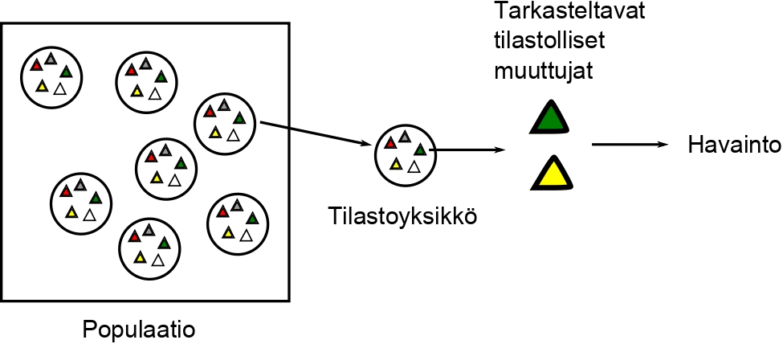
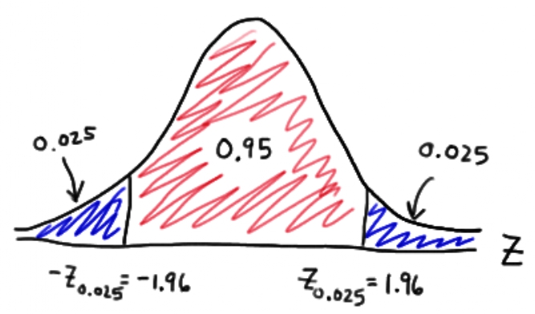

\lefthyphenmin=62
\righthyphenmin=62
# Tilastolliset aineistot, niiden kerääminen ja mittaaminen {#luku5}

Edellisessä luvussa käsiteltiin tilastotieteen suhtautumista satunnaisilmiöihin. Tässä luvussa tarkastelemme lähemmin miten reaalimaailman satunnaisilmiöistä kerätään tietoa ja miten niitä voidaan mitata. Tilastotieteen perusoppimäärä rakentuu ajatukselle ilmiöiden tutkimisesta rajallisen ja epävarman tiedon vallitessa. Käytännössä tämä tarkoittaa sitä, että tutkimuksen kohteena olevat rajalliset aineistot sisältävät niin systemaattista kuin satunnaisuudesta johtuvaa vaihtelua. Tilastollisten menetelmien avulla pyrimme erottamaan systemaattisen vaihtelun satunnaisesta sekä tekemään tilastollista päättelyä aineiston generoimasta mekanismista. Lyhyesti tämä tarkoittaa aineiston systemaattisen vaihtelun tilastollista mallintamista ja sen parametrien estimointia otoksesta, joka kattaa vain (pienen) osajoukon koko populaation (perusjoukon) tilastoyksiköistä. 

Voidaksemme tehdä uskottavaa päättelyä "havainnoista parametreihin", tulee otoksen olla riittävän __edustava__. Tämän luvun keskeisin oppi onkin, että miten __otanta__ tulisi suorittaa, jotta havaintoaineisto olisi __edustava otos__ populaatiosta, silloin kun aineisto kerätään otannalla. Vaikka aineiston hankinta vaatii yleensä runsaasti käytännön työtä, kannattaa se tehdä huolellisesti, sillä huonosti toteutetun otannan vuoksi tutkimusongelman kannalta keskeisiä johtopäätöksiä ei voida tehdä! 

## Kertausta: Data eli aineisto {#alaluku51}

- __Tilastollinen tutkimus__ aloitetaan tutkimusaineiston keruun suunnittelulla.
- Kertauksen vuoksi: tilastollinen tutkimusaineisto (havaintoaineisto) koostuu perusjoukon eli populaation tilastoyksiköiden havaituista tilastomuuttujien arvoista. 

```{r pophav, echo=FALSE, fig.cap="Populaatiosta havaintoon.", out.width="90%"}

```

- Havaintoaineisto voidaan koota taulukoksi, johon listataan tilastoyksiköt riveille ja tilastomuuttujat sarakkeisiin. Jos havaintoaineisto koostuu $n$ tilastoyksiköstä, joista jokaisesta on kerätty esim. $m$:stä tilastomuuttujasta havainnot, niin aineisto voidaan kirjoittaa taulukon muotoon:

| |tilastomuuttuja 1 |tilastomuuttuja 2 | $\dots$ |tilastomuuttuja $m$ |
|--------------------|--------------------|--------------------|------|--------------------|
| tilastoyksikkö  1 | $x_{1,1}$ | $x_{1,2}$ | $\dots$ | $x_{1,m}$ |
| tilastoyksikkö  2 | $x_{2,2}$ | $x_{2,2}$ | $\dots$ | $x_{2,m}$ |
| $\vdots$ | $\vdots$ | $\vdots$ | | $\vdots$ |
| tilastoyksikkö $n$| $x_{n,1}$ | $x_{1,2}$ | $\dots$ | $x_{n,m}$ |

- Tässä siis rivillä $i$ on $i$. __tilastoyksikön__ havainto ja sarakkeessa $j$ on $j$. tilastollisesta muuttujasta havaittu arvo $x_{i,j}$. Ts. yhdellä rivillä on yhden tilastoyksikön tiedot kaikista tilastomuuttujista ja yksi sarake on kaikkien tilastoyksiköiden tiedot yhdestä tilastomuuttujasta.

- Usein (varsinkin parhaillaan kiihtyvällä vauhdilla) kerättävät havaintoaineistot ovat niin suuria, ettei edellisenkaltaisesta havaintotaulukosta voida usein suoraan tarkastelemalla nähdä aineiston pääpiirteitä. 
    - Tällöin voi olla tarpeen luokitella aineistoa taulukon muodostamiseksi.  
    - Luokittelussa on kysymys aineiston tiivistämisestä kohtuullisen kokoiseksi ja havainnollisempaan muotoon. 
      - Luokittelussa tilastomuuttujan arvot sijoitetaan eri luokkiin siten, että yhden tilastomuuttujan arvo voi kuulua vain yhteen luokkaan. 
      - Luokka ilmoitetaan yleensä luokkavälinä, kuten reaalilukuvälinä. Esimerkiksi henkilön ikä on tapana luokitella ikäjakauman kuvaamisessa 10-vuotisluokkiin (15-24, 25-34, ...), vaikka periaatteessa ikä voitaisiin ilmoittaa minuutinkin tarkkuudella.  
      - Luokkien lukumäärään vaikuttavat muun muassa tilastomuuttujan arvojen vaihteluväli ja havaintoaineiston laajuus. 
      - Luokittelussa pyritään siihen, että luokkien lukumäärä saadaan tarvittaessa luokkia yhdistämällä kohtuulliseksi ja että luokat valitaan tasavälisesti eli siten, että kahden peräkkäisen luokan alarajojen erotus on vakio. 
      - Kun aineistoa luokitellaan, aineiston luettavuus paranee mutta toisaalta osa tiedoista menetetään eivätkä yksittäiset havaintoarvot ole enää tiedossa.  
    - Emme vielä tällä kurssilla käsittele tilastografiikan esittämistä, mutta sitä käsitellään mm. [Tilastollisen päättelyn peruskurssi (TILM3555)](https://opas.peppi.utu.fi/fi/opintojakso/TILM3555/1731?period=2024-2027) tarkemmin. 
      - Graafiset menetelmät ovat joka tapauksessa erittäin tärkeä osa aineiston havainnollistamista. 
      - Kuvat helpottavat aineiston tulkitsemista ja toimivat usein perusteltuna lähtökohtana monimutkaisempien tilastollisten mallien (ja algoritmien) sovittamiselle.  

\

- Kvantitatiivisen tutkimuksen aineistoksi kelpaa periaatteessa kaikki havaintoihin perustuva informaatio, joka on __mittauksen__ avulla muutettavissa numeeriseen muotoon. 
  - Havaintoyksiköiden tilastollisten muuttujien numeerisia arvoja kutsutaan __havaintoarvoiksi__ tai __havainnoiksi__.
  - Kaikki havaitut tilastolliset muuttujat eivät ole aina mielenkiintoisia. Tutkimuksen kannalta mielenkiintoisia muuttujia kutsutaan __tutkimusmuuttujiksi__, joiden lisäksi havaintoaineisto pitää mahdollisesti sisällään __taustamuuttujia__.
    - Esimerkiksi, jos tutkimuksella halutaan tietoa suomalaisen aikuisväestön mielipiteistä, havaintoyksikköinä ovat aikuisväestöön kuuluvat henkilöt. Jos halutaan tietoa suomalaisista kunnista, havaintoyksikköinä ovat Suomen kunnat jne.
    - Ensimmäisessä tapauksessa tilastollisina muuttujina on aikuisväestön mielipiteet, joita voidaan selvittää esimerkiksi kyselytutkimuksella. Toisaalta voidaan myös kerätä taustamuuttujiksi haastatelluista muita tietoja, kuten asuinpaikka, ikä ja ammatti. 
  - Kaikkia mielenkiintoisia muuttujia ei kuitenkaan välttämättä voida havaita, eli niille ei voida määrittää numeerista arvoa. Tällöin puhutaan nk. __latenteista muuttujista__, eli muuttujista joita ei suoraan havaita mutta joiden oletetaan vaikuttavan havaittavien muuttujien taustalla. Latentteja muuttujia voidaan rakentaa tilastollisten mallien avulla käyttäen hyödyksi niihin liittyviä havaittuja muuttujia.
    - Latentteja muuttujia ovat esimerkiksi elämänlaatu, onnellisuus, konservatiivisuus, yms.

\

- Tilastollinen tutkimus voi olla joko __kokonaistutkimus__ tai __otantatutkimus__.

::: {.defblock .mikko data-latex="{}"}
**Kokonaistutkimus**  

Kokonaistutkimus on tutkimus, jossa tutkitaan kaikki tutkimuksen kohteena olevan perusjoukon alkiot, ts. kaikki ajateltavissa olevat kohteet tutkitaan. 

- Kokonaistutkimus on yleinen tutkimustapa silloin, kun kohdeperusjoukko on selvästi määritelty ja sen alkioita koskevat tilastolliset muuttujat ovat helposti mitattavissa.
- Esimerkiksi, jos tutkitaan Suomen kuntia, niin kokonaistutkimuksessa tutkitaan kaikki kunnat. Kunnista on useimmissa tilanteissa mahdollista kerätä mielenkiinnon kohteena olevia tilastollisia muuttujia.
- Toisaalta, jos tutkitaan jonkin lääkeaineen vaikutuksia ihmisiin, niin kokonaistutkimuksessa tutkittaisiin jokainen ihminen erikseen. Selvää on, että tällainen kokonaistutkimus olisi liian vaikeaa toteuttaa. 
:::

::: {.defblock .mikko data-latex="{}"}
**Otantatutkimus**  

Otantatutkimuksessa tutkimus kohdistetaan johonkin (populaation/perusjoukon) osajoukkoon, joka poimitaan sopivaa __otantamenetelmää__ käyttäen (ks. Osan II Luku \@ref(luku7)) ja populaatiota/perusjoukkoa koskevat johtopäätelmät tehdään tähän otokseen perustuen.

- Otantatutkimus on usein luonnollinen valinta, sillä koko populaation tutkiminen ei useinkaan ole mahdollista tai kannattavaa.
  - Esimerkiksi aseiden patruunoita valmistava tehtailija ei voi tutkia toimivatko kaikki ammukset. Myöskään valaisimien valmistaja tuskin tekee kokonaistutkimuksia valmistamiensa tuotteiden kestoajan selvittämiseksi.   
- Perusjoukosta otokseen poimittuja alkioita kutsutaan __otosyksiköiksi__ ja niiden muodostama osajoukko, eli __otos__, on se osa perusjoukkoa, joka tutkitaan tutkimusaineiston keräämisen jälkeen.
  - Lääketutkimusta tehdäänkin poikkeuksetta otantatutkimuksena (ja kontrolloituina kokeina, ks. alempaa), jolloin lääkettä testataan vain osajoukolla koko ihmispopulaatiosta ja tämän osajoukon alkiot ovat otosyksiköitä.
  - Näin toimimalla, ja riittävän edustavalla otoksella, saadaan kuitenkin tarpeeksi tietoa lääkeaineen vaikutuksista ja tulokset voidaan yleistää populaatiotasolle ja lääke ottaa käyttöön.
- Otantatutkimus on halvempi kuin kokonaistutkimus ja tulokset saadaan nopeammin! 
:::

- Otantatutkimuksessa keskitytään siis perusjoukkoa edustavan mutta pienemmän, mieluusti satunnaisesti valitun otoksen tutkimiseen.
  - Otantatutkimuksissa tiedot kerätään useimmiten haastattelemella, kirjallisella/sähköisellä kyselyllä tai suoraan tietorekistereistä. Tiedonkeruun toteuttaminen (eri sovelluksissa) määrää osaltaan käytettävän otantamenetelmän.
  - Teoriassa äärelliseen perusjoukkoon kohdistuvat kokonaistutkimukset voidaan aina tulkita otantatutkimuksiksi (perusjoukko tulkitaan otokseksi hypoteettisesta äärettömästä perusjoukosta)!
    - Esimerkiksi Galilein tekemät painovoiman vaikutusta kappaleiden putoamisaikaan liittyneet mittaukset. Koetuloksia (mittauksia) voidaan pitää otoksena äärettömästä mahdollisten koetulosten joukosta. Tällöin ainoa mahdollisuus ilmiön tutkimiseen on käyttää otantaa.

- Otantatutkimuksen tulokset voivat olla luotettavampia kuin kokonaistutkimuksen.
  - Otantatutkimuksessa voidaan panostaa enemmän huolelliseen ja tarkkaan mittaamiseen sekä valitun otoksen tavoittamiseen.
  - Kokonaistutkimuksessa vastauskato ja tarkasteltavan populaation valintavirhe ovat mahdollisia siinä missä otantatutkimuksessakin.
  
- Otantateoria on yksi tilastotieteen keskeisimpiä oppeja ja tarjoaa teoreettisen kehikon empiiristen tutkimusten tulosten yleistämiseen. Tarkastellaan siis tarkemmin otannan ideaa seuraavassa alaluvussa. Otannan toteuttamista, otantamenetelmiä, tarkastellaan Osan II luvussa \@ref(luku7).

## Otannan idea {#alaluku52}

- Otantatutkimuksen (karkeat) suunnittelu- ja työvaiheet ovat seuraavat:
    1. Tavoitteiden asettaminen
    2. Perusjoukon (populaation) asettaminen
    3. Otantakehikko
    4. Kerättävän informaation sisältö (mitä tietoa todella tarvitaan, mitä voidaan jättää pois, suunnitellaan kysymykset ja mahdollinen kyselylomake)
    5. Otoskoon määrittäminen
    6. Suoritetaan otoksen poiminta, tietojen keräys ja tarkastus
    7. Aineiston taulukointi ja analysointi
    8. Raportin laatiminen

- Otantatutkimuksessa ajatuksena on siis poimia __edustava otos__ siitä populaatiosta (perusjoukosta), joka on mielenkiinnon kohteena eli jota halutaan tutkia ja josta halutaan tietoja.
  - __Tavoiteperusjoukko__ on joukko, johon otannan myötä saatavat tutkimustulokset halutaan yleistää. Toisin sanoen, se mistä haluamme tietoja määrää populaation.
  - __Kohdeperusjoukko__ on joukko, jota koskevia tietoja halutaan kerätä.
    - Esimerkiksi äänestysikäiset Suomen kansalaiset.
    - Usein tavoiteperusjoukko = kohdeperusjoukko.
    - Tavoiteperusjoukko voi joskus olla laajempi (esim. "ihmiset" vs. "suomalaiset").

- Tutkimuksessa (edustavaan) otokseen poimitut tilastoyksiköt, näiden tilastolliset muuttujat ja niiden arvot muodostavat __otosaineiston__ eli siis tutkimus- tai havaintoaineiston (__datan__).
    - Tutkimuskysymykseen vastatakseen tutkija valitsee sopivan tilastollisen mallin ja estimoi sen parametrit tähän otokseen perustuen.
    - Perusoletuksena on otoksen ja valitun tilastollisten mallin pohjalta suoritettavan tilastollisen päättelyn __yleistettävyys koko populaatioon__.
    - Otos valitaan erilaisia __otantamenetelmiä__ hyödyntäen pyrkien varmistamaan otoksen __edustavuus__ (perusjoukko pienoiskoossa, ks. kuva \@ref(fig:otanta)).

::: {.defblock .mikko data-latex="{}"}
**Edustavuus**  

Tutkimukseen valitut yksiköt edustavat koko populaatiota, ts. tutkimukseen valittu osajoukko kuvaa perusjoukon ominaisuuksia kattavasti.
:::

- Keskeistä tutkimuksen ja sen edustavuuden kannalta on, että tutkija osaa kerätä sisällöllisesti ja määrällisesti __sopivan kokoisen__ aineiston. 
- Tietyn otoksen edustavuutta arvioidessa voidaan käyttää apuna seuraavia kysymyksiä:
  - Miksi päädyttiin tämän kokoiseen otokseen?
    - __Otoskoko__ vaikuttaa siihen miten hyvin otoksesta tehdyt johtopäätökset voidaan yleistää koskemaan koko perusjoukkoa, ts. kuinka luotettavia ne ovat. 
    - Tämä johtuu siitä, että yksittäisten otosyksiköiden ominaisuudet saattavat vaihdella suuresti ja kasvattamalla otoskokoa perusjoukon systemaattiset piirteet tulevat otoskoon kasvaessa yhä paremmin esille. 
    - Kun otoskoko vastaa populaation kokoa, on kyseessä tietenkin kokonaistutkimus, joka kertoo kaiken perusjoukosta. Otoskoon valintaan ja määräämiseen palataan myöhemmin luvussa \@ref(luku9).
  - Käytettiinkö apuna tilastotieteellisesti vankkaa suunnittelua otoskoon määrittämiseksi ja/tai miten pyrittiin varmistamaan tärkeisiin analyysiryhmiin kuuluvien riittävä määrä aineistossa? 
  - Harkittiinko muita otantamenetelmiä ja miksi päädyttiin juuri käytössä olleeseen menetelmään?

- Edustavuuteen vaikuttaa keskeisesti se, millä tavoin otanta pystytään suorittamaan, ts. mihin kohdeperusjoukkoon otanta kohdistetaan.
  - __Kehikkoperusjoukko__ on rekisterin, luettelon tms. peittämä osa kohdeperusjoukkoa. Kyseessä on siis se osa kohdeperusjoukkoa, josta otanta ylipäänsä pystytään suorittamaan eli __otantakehikko__.
  - __Otantakehikon alipeitto__ esiintyy, kun otantakehikosta puuttuu osa kohdeperusjoukon alkioista (esim. tutkimus suoritetaan puhelinhaastattelulla, mutta osa aiottuun otokseen kuuluvista haastateltavista ei omista puhelinta). 
  - Vastaavasti __otantakehikon ylipeittoa__ esiintyy, kun otantakehikkoon kuuluu kohdeperusjoukkoon kuulumattomia alkioita.
    - Nämä ovat nk. __kehikkovirheitä__. Lisäksi esimerkiksi kyselytutkimuksissa tai rekisteriaineistoissa saattaa esiintyä __katoa__, eli osa vastauksista jää uupumaan tai niitä ei jostain syystä mitata.
    - __Otantavirhe__ taas on satunnaisuudesta johtuvaa tilastollisten muuttujien vaihtelua otoksesta toiseen ja se onkin ainoa virhelaji, jonka suuruutta voidaan tilastollisin menetelmin arvioida. 

```{r otanta, echo=FALSE, fig.cap="Otannan eri virhelajit.", fig.align='center', out.width="100%"}
knitr::include_graphics("images/otanta.jpg")
```

- Edustavan otoksen avulla on mahdollista tehdä perusjoukkoa koskevaa tilastollista päättelyä, sillä otos kuvaa perusjoukon ominaisuuksia riittävän hyvin. Tämä on yksi tilastotieteen keskeisimpiä oppeja mutta myös kriittisen tiedelukutaidon ja arkijärjen kannalta tärkeää.  

__Näyte otantavirheenä__

- Joskus kohdeperusjoukko on sellainen, ettei siitä voi kerätä edustavaa otosta.
  - Tämä voi johtua esimerkiksi siitä, että ei tiedetä keitä kohdeperusjoukkoon kuuluu eikä täten myöskään sen kokoa. Tällöin ei tietenkään voida myöskään suorittaa satunnaisotantaa.
- Vastaavasti jos tutkimukseen poimitaan ne tiedettyyn perusjoukkoon kuuluvat tilastoyksiköt, jotka sattuvat olemaan "saatavilla" tutkimuksen tekemishetkellä, niin kyseessä on __näyte__. Tällöin näyte ei kata ilmiön koko vaihtelua edustavan satunnaisotoksen tapaan.
  - Esimerkiksi perinteiset katukyselyt eivät ole hyvä otantatapa, sillä kadulla liikkujat eivät välttämättä kovin hyvin edusta tutkittavaa perusjoukkoa, ellei perusjoukkona ole kyseisellä kadulla kyseiseen aikaan liikkuvat ihmiset.
  - Vastaavasti surullisenkuuluisat X:ssä (ent. Twitter) toteutetut, tietyn henkilön omalle seuraajakunnalleen osoittamat kyselyt eivät muodosta edustavaa otosta edes X:n käyttäjistä, saati sitten koko kohdeperusjoukosta! Ellei sitten kohdeperusjoukko ole juurikin kyseisen käyttäjän seuraajat, joskin näin kyseisiä kyselytuloksia harvemmin tulkitaan. 
- __Koska näyte ei ole edustava otos, ei sen perusteella voida tehdä perusjoukkoa koskevia yleistyksiä luotettavasti.__ 
  - Tämä on yksi tilastollisen tutkimuksen tavoitteista, joten näytteiden käyttö ei ole suositeltavaa! 

::: {.eblock .kimmo data-latex="{}"}
**Esimerkki: Rikollisuuden tutkiminen harkinnanvaraisen näytteen avulla**  

- Kriminologian tutkija haluaa selvittää mitkä tekijät selittävät kesämökkimurtoja tehtailevien rikollisten motivaatiota rikoksilleen. 
- Mikään rekisteri Suomessa ei kata kaikkia kesämökkimurtoja tehneitä ihmisiä, sillä osa näistä rikollisista ei jää koskaan kiinni. 
  - Täten tutkija ei voi muodostaa satunnaisotantaa kohdeperusjoukosta, vaan hän joutuu tyytymään esimerkiksi oikeuden pöytäkirjoista selviäviin kesämökkimurroista kiinnijääneisiin tilastoyksiköihin, joista hän valikoi tutkimukseensa sopivat yksilöt.
  - Tällöin kyseessä on __harkinnanvarainen näyte__, sillä ei voida taata näytteeseen valikoitujen tilastoyksiköisen olevan edustava otos kohdeperusjoukosta!
    - Harkinnanvarainen näyte voi kuvata kohdeperusjoukkoa hyvin, mutta on kuitenkin alisteinen tutkijan suorittamalle harkinnalle, joka voi olla tiedostamatta tai tiedostaen jollain tavalla vääristynyttä.

:::


::: {.eblock .kimmo data-latex="{}"}
**Esimerkki: Kotitalouksien tulot, tuloerot ja pienituloisuusrajan kehitys 1987-2005 (Tilastokeskus)**  

- Tilastoyksikkö on kotitalous, joten kaikkien kotitalouksien tutkiminen (kokonaistutkimus, ks. alla) olisi vaikeaa, kallista ja aikaavievää. 
- Tutkittavaksi valitaan vain muutama tuhat kotitaloutta (ts. otantatutkimus) ja selvitetään näiden tulot.
  - Tuloja, pienituloisuusrajaa ja tuloeroja on havainnollistettu kuvassa \@ref(fig:tuloerot).
- On mahdollista tehdä __kaikkia__ suomalaisia kotitalouksia koskevia johtopäätöksiä, jos tutkitut yksiköt ovat __edustava otos__ suomalaisista kotitalouksista. Ts. osajoukkoa koskevat päätelmät voidaan yleistää koskemaan perusjoukkoa, mikäli osajoukko on edustava otos perusjoukosta.
:::

\FloatBarrier

```{r tuloerot, echo=FALSE, fig.cap="Tuloerot.", fig.align='center', out.width="100%"}
knitr::include_graphics("images/tuloerot.jpg")
```

## Mittaaminen ja mitta-asteikot {#alaluku53}

__Mittaaminen__ 

- Kumpaa tahansa tutkimusotetta (kokonais- tai otantatutkimus) noudatettaessa tietojen keräämisessä on olennaisena osana kohteiden ominaisuuksien __mittaaminen__. 
- Tilastotieteellinen tutkimus perustuu aina mitattaviin satunnaisilmiöihin: tavoitteena on mittaamalla liittää jokin luku ilmiötä kuvaavaan ominaisuuteen, ts. mitata kyseisen satunnaismuuttujan havaittua arvoa.
    - Mittaaminen vaatii aina mittauksen kohteen, hyvin määritellyn mitattavan ominaisuuden ja __mittarin__, joka liittää mielekkäät lukuarvot mitattavaan ominaisuuteen.
    - Erilaiset mittarit heijastavat ilmiön ominaisuuksia eri tavoin ja eri tarkkuudella
        - Esimerkiksi, jos tutkitaan opiskelijoiden pituuden kehitystä, niin mitataan pituutta eri aikoina. Pituudet voidaan mitata senttimetreissä, metreissä, kilometreissä tai vaikkapa tuumissa.
        - Mittari on hyvä, jos sen antama mittaus on
          - __(i) validi__ eli mittaus esittää oikein mitattavaa ominaisuutta (senttimetri mittaa pituutta, gramma ei) ja 
          - __(ii) luotettava__ eli mittaus on __harhaton__ ja __toistettavissa__. 
        - Määritellään nämä termit vielä erikseen, sillä ne ovat keskeisiä tilastotieteessä.

::: {.defblock .mikko data-latex="{}"}
**Mittarin harhattomuus**  

Mittari on harhaton, jos se ei systemaattisesti ali- tai yliarvioi mitattavan ominaisuuden määrää.
:::

- Harhaton mittari siis antaa keskimäärin oikeita mittauksia mitattavasta ominaisuudesta.

- Harhattomuutta pidetään myös hyvänä ominaisuutena tilastollisten mallien parametrien estimaattoreille. Tähän palataan myöhemmin luvussa \@ref(luku8).

::: {.defblock .mikko data-latex="{}"}
**Mittarin toistettavuus**  

Mittari on toistettava, jos se tuottaa keskimäärin samanlaisia mittauksia samanlaisista otoksista eli se on johdonmukainen ja mittausvirheet ovat pieniä.
:::

- Huonosti toistettava mittari antaa tilastoyksiköiden samankaltaisille ominaisuuksille hyvin erilaisia arvoja riippuen otoksesta.

- __Mittausten reliabiliteettia/luotettavuutta__ arvioidessa voidaan pohtia esimerkiksi seuraavia kysymyksiä:
  - Kuinka hyvin mittaustulokset ovat toistettavissa? Kuinka paljon niissä on ei-sattumanvaraisuutta?
  - Mittausten validiteetti: kuinka hyvin pystyttiin mittaamaan sitä, mitä oli tarkoitus mitata?

- Kun mittaaminen on luotettavaa ja validia, tutkimusaineisto on __sisäisesti luotettavaa__.
- Aineiston __ulkoinen luotettavuus__ toteutuu silloin, kun tutkittu otos edustaa perusjoukkoa eli on edustava. 
  - Validi mittaaminen ei pelasta otosta, jos se ei ole edustava!
- Jokaisen tutkimuksen tulosten luotettavuuden perusteena on käytetty aineisto, kuinka se on hankittu ja mistä lähteestä. Kun käytetään luotettavaksi havaittuja mittareita, voidaan kustakin aineistosta laskea erikseen tunnuslukuja mittauksen luotettavuudelle. Esimerkkinä __luottamusväli__:
  - Väli, joka vaihtelee otoksesta toiseen ja joka usein sisältää mielenkiinnon kohteena olevan parametrin, kun otantakoetta toistetaan!
  - Luottamusväliä käytetään määrittämään estimaatin luotettavuutta.
  - Väliestimointia tarkastellaan tarkemmin luvussa \@ref(luku9).
    
```{r luottamus, echo=FALSE, fig.cap="Normaalijakaumaan perustuva 95\\% luottamusväli.", fig.align='center', out.width="75%"}

```

- Luotettavuudella voidaan tarkoittaa myös tutkimuksen __objektiivisuutta / puolueettomuutta__.
    - __Objektiivinen totuus__, tutkimustulokset ovat samat riippumatta siitä kuka pätevä tutkija tutkimuksen on tehnyt.
    - Tulosten tulisi olla luotettavia, mutta luotettavatkin tulokset voivat olla puolueellisia siinä mielessä, että ne tarkastelevat asiaa vain yhdeltä näkökannalta!
    - Esim. tarkastellaan yrityksen henkilöstökysymyksiä, työn organisointia ja työmoraalia, ongelmien tarkastelua johdon vs. henkilöstön näkökulmasta.
  

::: {.eblock .kimmo data-latex="{}"}
**Esimerkki: C-vitamiinin vaikutus syövän hoidossa**  

- Annettiin C-vitamiinia 100:lle terminaalivaiheen syöpäpotilaalle ja
seurattiin kuolleisuutta ([Cameron and Pauling, 1976](https://pubmed.ncbi.nlm.nih.gov/1068480/)). 
  - Pyrittiin luomaan tärkeiden ominaisuuksien suhteen samanlaisia verrokkiryhmiä ja valittiin kutakin potilasta kohden 10 verrokkia, jotka olivat samanlaisia iän, sukupuolen, primääri-kasvaimen sijaintipaikan ja histologisen kasvaintyypin suhteen. 
  - Seuranta-aika: aika hetkestä, jolloin todettiin tavanomaisten hoitojen olevan tehottomia, kuolinhetkeen saakka. 
  - Tulos: C-vitamiinia saaneet käsittelyryhmän potilaat elivät 4 kertaa kauemmin ($p < 0.0001$) (Edellinen $p$ viittaa p-arvoon, ks. Osan II Luku \@ref(luku9)). 

- Ristiriitaista evidenssiä saatiin tutkimuksessa, jossa vastaava tutkimusongelma, mutta toteutettu satunnaistettuna kokeena ([Moertel et al. 1985](https://pubmed.ncbi.nlm.nih.gov/3880867/)). 
  - Satunnaistettiin potilaat, joilla pitkälle edennyt paksunsuolen tai peräsuolen syöpä, C-vitamiinia saavien ja lumelääkettä saavien ryhmiin. 
  - Tulos: kontrolliryhmän potilaat elivät keskimäärin hieman pidempään, mutta ero ei tilastollisesti merkitsevä.

- Mistä kahden tutkimuksen erot johtuivat? 
  - Huonolla tuurilla kaltaistetut verrokit erosivat käsittelyryhmän potilaista joillakin merkittävillä tavoilla, joita ei oltu mitattu! Miten kvantifioida "huonoa tuuria"? 

- Tilastolliset menetelmät tekevät juuri tämän: "Mikä on todennäköisyys, että havaittu tulos (tai sitä enemmän nollahypoteesista poikkeava tulos) olisi syntynyt vain sattumalta?" 
  - Ilman satunnaistamista tuota kenties merkittävää ei-mitattua eroa ei pystytä varmuudella kontrolloimaan. 
  - Todellisuudessa ero johtui siitä, että ensin mainitun tutkimuksen kontrollit valittiin jo kuolleista syöpäpotilaista, eikä heihin liittynyt enää mitään satunnaisuutta!
:::

\

__Mitta-asteikot__

- Kuten satunnaismuuttujia koskeneessa luvussa \@ref(luku4) opittiin, satunnaisilmiöillä on erilaisia tulosvaihtoehtoja, jotka kantavat satunnaismuuttujien todennäköisyysjakaumia.
  - On syytä huomauttaa, että vaikka mitattava ilmiö ei olisikaan numeerinen, se voidaan aina "koodata" eli muuntaa numeeriseksi. Esimerkiksi perinteisen kaksiarvoisen mies-nainen -muuttujan tapauksessa voidaan käyttää tunnuksia 0 ja 1.

- Ilmiön luonteesta riippuen voidaan näille tulosvaihtoehdoille käyttää erilaisia __mitta-asteikkoja__. 
  - __Laatueroasteikko/luokitteluasteikko__ (nominaaliasteikko): Muuttujan mittaustaso on tällöin sellainen, että sen arvot voidaan luokittaa toisistaan eroaviin luokkiin. Ts. mihin luokkaan kohde kuuluu mitattavan ominaisuuden perusteella? 
    - Tilastoyksiköt luokitellaan ennaltamääriteltyihin luokkiin. Luokkien järjestyksellä ei ole merkitystä.
    - Kukin tilastoyksikkö kuuluu vain yhteen luokkaan. Tällöin kahdesta tilastoyksiköstä/havainnosta voidaan päätellä vain kuuluvatko ne saamaan luokkaan vai eivät. 
    - Emme pysty määrittelemään empiirisesti mielekästä järjestystä havaintoarvojen välillä.
    - Esimerkkejä: Sukupuoli, veriryhmä tai kotikunta.

  - __Järjestysasteikko__ (ordinaaliasteikko): Tällöin muuttujan arvot voidaan luokittelun lisäksi asettaa empiirisesti mielekkääseen järjestykseen. Tällöin siis mittauksen kohteella on "enemmän mitattavaa ominaisuutta" kuin jollakin toisella kohteella.
    - Tilastoyksiköt luokitellaan ennalta määrättyihin luokkiin, joilla on yksikäsitteinen järjestys.
    - Esimerkkejä: Sotilasarvo, sosiaaliryhmä, kilpailun tulos tai sairauksien tarttuvuus.

  - __Välimatka-asteikko__ (intervalliasteikko): Luokittamisen ja järjestyksen asettamisen lisäksi havaintoarvojen välimatkalla on empiirisesti mielekäs tulkinta. Ts. intervalliasteikon tasoisen muuttujan arvoista voidaan sanoa, kuinka paljon toinen arvo on toista suurempi (pienempi).
    - Välimatka-asteikolla pystytään mittaamaan yksittäisten luokkien tai havaintoarvojen ero. Esimerkiksi: Lämpötilan mittaaminen celcius-asteina. Pystymme numeroarvoina ilmoittamaan onko tänään lämpimämpi, yhtä lämmin vai kylmempi sää kuin eilen ja kuinka monta astetta muutos on.
    - Kuinka paljon kahden mittauksen kohteen ominaisuudet eroavat toisistaan.
    - Intervalliasteikon tasoisen muuttujan arvoista voidaan sanoa, kuinka paljon toinen arvo on toista suurempi (pienempi). 
    - Mittarin nollapiste on kuitenkin "keinotekoinen" ja siten vapaasti valittavissa. Samoin voidaan valita käytettävä mittayksikkö vapaasti sekä yhteen- ja vähennyslasku ovat sallittuja.
    - Oleellista on vain se, että  havaintojen välisellä välimatkalla on aina empiirisesti mielekäs tulkinta.
  
  - __Suhdeasteikko__: Jos intervalliasteikon ominaisuuksien lisäksi on määriteltynä yksikäsitteinen mittalukujen absoluuttinen nollapiste.
    - Esimerkiksi kuuden euron hintainen tuote on kaksi kertaa niin kallis kuin kolmen euron tuote.
    - Kunnan veroäyri tai henkilön pituus: Absoluuttinen nollapiste on 0.
    - Nollapisteen ollessa absoluuttinen, se "pysyy paikallaan" ja mittalukujen suhteet pysyvät samoina.

```{r, echo = FALSE, include=FALSE}
#- Mittausmalli: Mittauksiin voi sisältyä mittausvirhettä: Kaikki satunnaisvaihtelu ei ote peräisin otannasta
#- Mittausmalli oleellinen: Latentteja tekijöitä mitataan "kysymyksillä", joihin liittyy mittausvirhettä. Kysymysten lineaarikombinaatioina muodostetaan asteikko, joka kuvaa "mahdollisimman hyvin" latentteja tekijöitä.
```

- Mitta-asteikot voidaan jakaa kahteen luokkaan: __Luokittelu- ja järjestysasteikkoa kutsutaan kvalitatiivisiksi asteikoiksi__. Tällöin muuttujien arvot kuvaavat vain tilastoyksiköiden laadullisia piirteitä. 

- Vastavasti __välimatka- ja suhdeasteikkoa kutsutaan kvantitatiivisiksi asteikoiksi__, koska tällöin mittaluvut kuvaavat jonkin ominaisuuden määrää.

- Tilastollisen analyysin kannalta mitta-asteikkojen merkitys on siinä, että tilastollisten (matemaattisten) operaatioiden sallittavuus määräytyy muuttujan mitta-asteikon mukaan. Mitä "korkeampi" mitta-asteikko, sitä enemmän on käytettävissä olevia analyysimenetelmiä. Esimerkiksi keskiarvon laskeminen on eräs tilastollinen operaatio, ja se ei ole sallittu kvalitatiivisille muuttujille.

\
__Aineistotyyppejä__ 

- Aineistotyyppejä käsitellään tarkemmin vielä myöhemmin (Osan II Luvussa \@ref(luku10)), mutta alla on lueteltuna yleisimpiä aineistotyyppejä, jotka usein määräävät sen, millaisia tilastollisia malleja tutkimuksessa käytetään.
  - Poikkileikkausaineisto: Tietoja useista tutkimuskohteista yhdeltä ajanhetkeltä tai aikäväliltä
  - Aikasarja-aineisto: Tietoja samasta tutkimuskohteesta eri ajanhetkiltä
  - Paneeliaineisto: Tietoja useilta ajanhetkiltä useista tutkimuskohteista
  - Tapahtumahistoria-aineisto: Tietoja tapahtumahetkiltä

## Kontrolloidut kokeet ja suorat havainnot {#alaluku54}

- Tarkastellaan seuraavaksi kahta tyyppiesimerkkiä tilastollisen tutkimusaineiston keräämisen asetelmista:
  - __Kontrolloiduit kokeet__ ovat sellaisia kokeellisia tutkimusasetelmia, joissa tutkimuksen kohteet altistetaan suunnitelmallisesti erilaisiin koeolosuhteisiin, jotta voidaan selvittää miten kohteet reagoivat muutoksiin.
  - __Suoria havaintoja__ kerätessä koeolosuhteita ei pyritä aktiivisesti muuttamaan vaan ainoastaan seurataan miten erilaiset olosuhteet ja niissä tapahtuvat muutokset vaikuttavat kohteisiin.
  
- Näistä tutkimusasetelmista kontrolloidut kokeet ovat tietenkin ihanteellisempia tutkimuksen tekemiselle, sillä tutkijan on mahdollista tarkastella tutkittavaa asiaa koeolosuhteissa "eristyksissä".
- Kontrolloidut kokeet eivät kuitenkaan ole aina mahdollisia, jolloin on käytettävä suoria havaintoja.
  - Tällöin tutkimuskohdetta ei suunnitelmallisesti altisteta koeolosuhteille ("käsittelyille") vaan muuttuvien olosuhteiden vaikutuksia tilastoyksikköihin seurataan passiivisesti.
  - Toisin sanoen tutkimuksen kohteena olevat tilastoyksiköt eivät välttämättä edes tiedä osallistuvansa tutkimukseen.

- Lisäksi usein tehdään hoito/käsittelyvastetta koskevia vertailuja erilaisissa olosuhteissa, joka osaltaan vaikuttaa tulosten uskottavuuteen, sillä tutkittaviin tilastoyksiköihin voi vaikuttaa olosuhteiden muutosten lisäksi muut ulkopuoliset tekijät.
  - Näiden __selittävien__ ja __sekoittavien tekijöiden__ vaikutusten kontrollointi on suoria havaintoja tehtäessä vaativa tehtävä.
  - Mikäli ulkopuolisia tekijöitä ei havaita ja/tai pystytä mittaamaan, tai muuten jostain syystä olla lisätty ja käytetty käytettävässä tilastollisessa mallissa, voi kyseeseen tulla ns. __puuttuvien selittäjien harha__, joka tarkoittaa sitä että havaittuihin tuloksiin vaikuttaa jokin havaitsematon tekijä, jonka vaikutusta ei kyetä kvantifioimaan puutteellisten havaintoarvojen vuoksi.

- Suoria havaintoja tehtäessä ei voida (usein) selvittää vasteen ja olosuhteiden __kausaalista__ yhteyttä. Suorilla havainnoilla voidaan lähinnä saada selville onko vasteella ja olosuhteilla jokin yhteys (korrelaatio) (ks. luku \@ref(luku6)).

- Suorien havaintojen keräämiseen liittyy olennaisesti joitain riskejä ja toisaalta rajoituksia. Riskit liittyvät käytännössä otoksen harhaisuuteen (erit. valikoitumisharha).
  - Esimerkiksi jos havaintoja tehtäessä suositaan systemaattisesti joitakin tulosvaihtoehtoja. Tämä suosiminen voi olla tahallista tai tahatonta.
  - Tämä tilastoyksiköiden __valikoituminen__ otokseen aiheuttaa harhaa, sillä otokseen valikoituva osajoukko saattaa ylikorostaa perusjoukon joitain ominaisuuksia.

::: {.defblock .mikko data-latex="{}"}
**Valikoituminen**  

Valikoitumista tapahtuu, jos otokseen poiminta ei ole riippumatonta tilastoyksikön ominaisuuksista. Tätä kutsutaan valikoitumisharhaksi.
 
- Esimerkiksi verrattaessa sydän- ja verisuonitautipotilaiden hoitotoimenpiteitä potilaat eivät mahdollisesti ole valikoituneet yhtä todennäköisesti pallolaajennukseen, ohitusleikkaukseen tai lääkehoitoryhmään, sillä taudin vakavuus saattaa jo määritellä mikä hoitotoimenpide valitaan.

- Valikoituminen on iso ongelma seurantatutkimuksissa, sillä harhaisten havaintotulosten, eli harhaisen otoksen, perusteella ei voida tehdä luotettavia johtopäätöksiä perusjoukosta!
:::

- Harhan syntymistä pyritään välttämään valitsemalla havaintojen kohteet perusjoukosta satunnaisesti (ellei tavoitteena ole tutkia kaikkia perusjoukon alkioita). 
  - Tämä merkitsee satunnaisotannan soveltamista havaintojen kohteiden valintaan, eli otokseen poimittavien tilastoyksiköiden valintaan sovelletaan __satunnaistamista__, jolloin sattuma määrää mitkä perusjoukon alkioista tulevat poimituksi otokseen (tutkimuksen kohteiksi)!

::: {.defblock .mikko data-latex="{}"}
**Satunnaistaminen**  

Tilastoyksiköiden poimimista populaatiosta otokseen riippumatta muiden yksiköiden poiminnasta tai kyseisten (poimittavien) yksiköiden ominaisuuksista.

- Satunnaistaminen takaa sen, että mahdolliset sekoittavat tekijät ovat jakaantuneet tasaisesti tutkittavassa joukossa. Tällöin sekoittavat tekijät eivät aiheuta harhaa otokseen ja tutkimuksen tulokset voidaan yleistää koko populaatioon.

- Satunnaistaminen poistaa otannasta valikoitumisharhan, sillä otokseen poiminta suoritetaan riippumatta tilastoyksiköiden ominaisuuksista. Satunnaistaminen on ainoa puolueeton tapa poimia otos (ei suosi mitään perusjoukon osaa)!
:::

- Satunnaistaminen (osaltaan) mahdollistaa __tilastollisen päättelyn__, jonka avulla otoksesta saatuja tietoja voidaan hyödyntää tehtäessä päätelmiä koko perusjoukosta.
  - Tilastollisen päättelyn avulla voidaan muodostaa esimerkiksi jakaumien ja tilastollisten mallien tuntemattomille parametreille arviot (piste-estimaatit) ja arvioida niiden epävarmuutta (keskivirheet ja luottamusvälit) sekä testata tarkasteltavaan ilmiöön liittyviä hypoteeseja (ks. Osan II Luvut \@ref(luku8) ja \@ref(luku9)).

- Johtopäätelmien pätevyys riippuu mm. siitä, kuinka hyvin otanta on suoritettu. Tämän vuoksi on tärkeää ymmärtää otannan perusperiaatteet ja erilaisten otantamenetelmien luonne.

- Kontrolloiduissa kokeissa satunnaistaminen jakaa yksilöt __riippumatta yksilön omista ilmiöön vaikuttavista muuttujista__ joko __käsittely- tai kontrolliryhmään__ (eng. treatment ja control).
  - Se takaa, ettei valikoitumista jonkin käsittelyä edeltävän ominaisuuden mukaan esiinny.
  - Tämä tarkoittaa __altisteen__ (käsittely / "treatment") antamista (täysin) satunnaisesti kokeeseen valituille yksilöille, riippumatta näiden taustamuuttujien arvoista.
  - Nämä yksilöt sinänsä voivat olla satunnaisotos jostain populaatiosta (tai ainakin niiden toivotaan olevan), mutta satunnaistaminen tarkoittaa siis käsittelyn kohdentamista koeyksilöille, ei satunnaisotantaa sinänsä.
  - Esimerkiksi tutkittavat voidaan satunnaistaa lääkehoito- ja placeboryhmiin, jotta mahdolliset erot tutkittavien iässä, sukupuolessa ja muissa taustamuuttujissa eivät aiheuta systemaattista harhaa, kun tutkitaan lääkehoidon vaikutusta.


## Luvun 5 yhteenveto, keskeisiä termejä ja kokonaisuuksia.

**Termejä**  
- Otanta  
- Perusjoukko/populaatio  
- Otos/otosaineisto/data  
- Havainto/havaintoarvo  
- Edustavuus ja edustava otos  
- Tilastoyksikkö ja tilastomuuttuja  
- Tutkimusmuuttuja ja taustamuuttuja(t)  
- Kokonaistutkimus vs. otantatutkimus  
- Otoskoko   
- Otantakehikko  
- Mittaaminen  
- Mittarin harhattomuus ja toistettavuus  
- Kontrolloidut kokeet vs. suorat havainnot  
- Selittävät ja sekoittavat tekijät  
- Puuttuvien selittäjien harha  
- Valikoituminen  
- Satunnaistaminen  
- Käsittely- ja kontrolliryhmät  

**Mitta-asteikot**  
-	Kvalitatiiviset ja kvantitatiiviset muuttujat
-	Laatueroasteikko/luokitteluasteikko (nominaaliasteikko)  
-	Järjestysasteikko (ordinaaliasteikko)  
-	Välimatka-asteikko (intervalliasteikko)  
-	Suhdeasteikko  
- Kvalitatiiviset ja kvantitatiiviset muuttujat  
