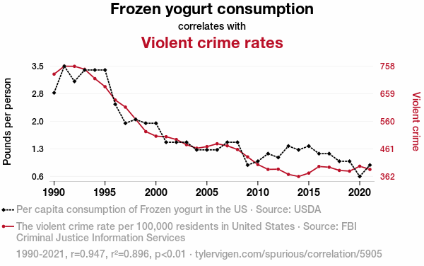

---
output:
  pdf_document: default
  html_document: default
always_allow_html: true
---
\lefthyphenmin=62
\righthyphenmin=62
# Tilastollinen riippuvuus ja korrelaatio {#luku6}

- Tarkastelemme tässä luvussa tilastollisia tutkimusasetelmia, joissa on mukana kaksi tai useampia __muuttujia__. 

- Pyrimme vastaamaan tässä ja seuraavissa luvuissa (ainakin) seuraaviin kysymyksiin:

  - Miten kahden (tai useamman) muuttujan samanaikainen tarkastelu vaikuttaa tilastolliseen analyysiin?
  - Mitä tarkoitetaan kahden muuttujan tilastollisella riippuvuudella ja miten se eroaa eksaktista riippuvuudesta?
  - Mitä tarkoitetaan korrelaatiolla?
  - Mikä on korrelaation ja riippuvuuden suhde?
  - Miten korrelaatiota ja sen voimakkuutta voidaan estimoida?

- Käsittelemme myös Osan II luvussa \@ref(luku10) regressioanalyysia yhden selittäjän lineaarisen regressiomallin tapauksessa. Pitemmälle meneviä regressioanalyysin kysymyksiä käsitellään koko tilastotieteen opinto-ohjelman lävitse, kuten perusteellisesti [Lineaariset ja yleistetyt lineaariset mallit -kurssin](https://opas.peppi.utu.fi/fi/opintojakso/TILM3588/5071?period=2024-2027) myötä.

## Muuttujien väliset riippuvuudet {#alaluku61}

- Tieteellisen tutkimuksen tärkeimmät ja mielenkiintoisimmat kysymykset liittyvät tavallisesti __tutkimuksen kohteena olevaa ilmiötä kuvaavien muuttujien välisiin riippuvuuksiin__.

- Jos tilastollisen tutkimuksen kohteena olevaan ilmiöön liittyy useampia kuin yksi muuttuja, yhden muuttujan tilastolliset menetelmät antavat tavallisesti vain rajoittuneen kuvan ilmiöstä.

- Sovellusten kannalta ehkä merkittävin osa tilastotiedettä käsittelee kahden tai useamman muuttujan välisten riippuvuuksien kuvaamista ja mallintamista.

::: {.eblock .kimmo data-latex="{}"}
**Esimerkkejä riippuvuustarkasteluista**  

- Miten työttömyysaste Suomessa (% työvoimasta) riippuu BKT:n (bruttokansantuotteen) kasvuvauhdista Suomessa, Suomen viennin volyymista sekä BKT:n kasvuvauhdista muissa EU-maissa ja USA:ssa? Taloustieteilijät pyrkivät yleisesti löytämään muitakin lainalaisuuksia. Esimerkkejä tällaisista ovat riskin ja tuoton välinen suhde osakesijoittamisessa, hajauttaminen pienentää riskiä ja/tai alhainen korkotaso suosii sijoittamista pörssiin.  
- Miten alkoholin kulutus (l per capita vuodessa) riippuu alkoholijuomien hintatasosta, ihmisten käytettävissä olevista tuloista ja alkoholin saatavuudesta?  
- Miten todennäköisyys sairastua keuhkosyöpään riippuu tupakoinnin määrästä ja kestosta?  
- Miten vehnän hehtaarisato (t/ha) riippuu kesän keskilämpötilasta ja sademäärästä sekä maan muokkauksesta, lannoituksesta ja tuholaisten torjunnasta?  
- Miten betonin lujuus (kg/cm2)  riippuu sen kuivumisajasta?  
- Miten kemiallisen aineen saanto (%) riippuu valmistusprosessissa käytettävästä lämpötilasta? 
:::

\

- __Eksakti__ vs. __tilastollinen riippuvuus__.
  - Tarkastelemme tässä esityksessä yksinkertaisuuden vuoksi pääasiassa kahden muuttujan välistä riippuvuutta:
    - (i) Muuttujien välinen riippuvuus on __eksaktia__, jos toisen arvot voidaan ennustaa tarkasti (täydellisesti) toisen saamien arvojen perusteella.
    - (ii) Muuttujien välinen riippuvuus on __tilastollista__, jos niiden välillä ei ole eksaktia riippuvuutta, mutta toisen muuttujan arvoja voidaan käyttää apuna toisen muuttujan arvojen mallintamisessa ja mahdollisesti myös ennustamisessa.

- Tilastollinen riippuvuus ja __korrelaatio__.
  - Kahden muuttujan välistä (lineaarista) tilastollista riippuvuutta kutsutaan tilastotieteessä (tavallisesti) __korrelaatioksi__.
  - Korrelaation eli (lineaarisen) tilastollisen riippuvuuden voimakkuutta mittaavia tilastollisia tunnuslukuja kutsutaan korrelaatiokertoimiksi.
  - Korrelaatiot muodostavat perustan muuttujien välisten riippuvuuksien ymmärtämiselle.
  - Vaikka korrelaatiot muodostavat perustan muuttujien välisten riippuvuuksien ymmärtämiselle, riippuvuuksia halutaan tavallisesti analysoida myös tarkemmin.
  - __Regressioanalyysi__ on tilastollinen menetelmä, jossa jonkin, ns. selitettävän muuttujan tilastollista riippuvuutta joistakin toisista, ns. selittävistä muuttujista pyritään mallintamaan regressiomalliksi kutsuttavalla tilastollisella mallilla. Käsittelemme johdantoa regressioanalyysiin vielä myöhemmin luvussa \@ref(luku10).

## Kahden muuttujan havaintoaineiston kuvaaminen {#alaluku62}

- Kuten yhden muuttujan havaintoaineistojen tapauksessa, lähtökohdan kahden tai useamman muuttujan havaintoaineistojen kuvaamiselle muodostaa tutustuminen havaintoarvojen jakaumaan.

- Havaintoarvojen jakaumaa voidaan kuvailla ja esitellä tiivistämällä havaintoarvoihin sisältyvä informaatio sopivaan muotoon:
  - Havaintoarvojen jakaumaa kokonaisuutena voidaan kuvata sopivasti valituilla graafisilla esityksillä.
  - Havaintoarvojen jakauman karakteristisia ominaisuuksia voidaan kuvata sopivasti valituilla otostunnusluvuilla (ks. otostunnusluvut ja otosjakaumat luvussa \@ref(luku9)).

- Koska useampiulotteisten kuvioiden kuin kaksiulotteisten muodostaminen ei ole usein kovin mielekästä, kolmen tai useamman muuttujan havaintoaineistoja havainnollistetaan tavallisesti niin, että muuttujia tarkastellaan pareittain.

- Kahden järjestys-, välimatka- tai suhdeasteikoillisen muuttujan havaittujen arvojen pareja havainnollistetaan tavallisesti graafisella esityksellä, jota kutsutaan hajontakuvioksi tai pistediagrammiksi ("pistekaavio" engl. scatter plot). Ks. esimerkiksi kuva \@ref(fig:isatjapojat1). 

- Usean muuttujan havaintoaineistojen karakteristisia ominaisuuksia voidaan kuvata muuttujakohtaisilla otostunnusluvuilla.
  - Muuttujakohtaiset otostunnusluvut eivät kuitenkaan voi antaa informaatiota muuttujien välisistä riippuvuuksista.
  - Muuttujien parittaisia tilastollisia riippuvuuksia voidaan kuvata sopivasti valitulla korrelaation mitalla.

\

__Pistediagrammi (hajontakuvio)__

- Tarkastellaan tilannetta, jossa tutkimuksen kohteina olevista havaintoyksiköistä on mitattu kahden järjestys-, välimatka- tai suhdeasteikollisen muuttujan $X$ ja $Y$ arvot.

- Muuttujien $X$ ja $Y$ arvojen samaan havaintoyksikköön liittyvien parien $(X,Y)$ muodostamaa havaintoaineistoa voidaan kuvata graafisesti pistediagrammilla.

- Pistediagrammi sopii erityisesti kahden muuttujan välisen riippuvuuden havainnollistamiseen. Se on keskeinen työväline korrelaatio- ja regressioanalyysissa.

::: {.defblock .mikko data-latex="{}"}
**Pistediagrammi**  

Olkoot $X$ ja $Y$ järjestys-, välimatka- tai suhdeasteikollisia muuttujia, joiden havaitut arvot ovat $x_1, x_2, \ldots, x_n$ ja $y_1, y_2, \ldots, y_n$. Oletetaan lisäksi, että havaintoarvot $x_i$ ja $y_i$ liittyvät samaan havaintoyksikköön kaikille $i = 1, 2, \ldots, n$. Havaintoarvojen parien $(x_i, y_i)$ pistediagrammi saadaan esittämällä lukuparit niiden määrittelemien pisteiden tasokoordinaatistossa.
:::

::: {.eblock .kimmo data-latex="{}"}
**Esimerkki: Isän ja pojan pituus**  

- Perinnöllisyystieteen mukaan lapset perivät geneettiset ominaisuutensa vanhemmiltaan.
- Periytyykö isän pituus heidän pojilleen?
- Havaintoaineisto koostuu 300:ta isän ja heidän poikiensa pituuksien muodostamasta lukuparista $(x_i , y_i),\, i = 1, 2, \ldots, 300$, jossa $x_i$ = isän $i$ pituus ja $y_i$ = isän $i$ pojan pituus.
- Yhtä pitkillä isillä näyttää olevan monen mittaisia poikia.
- Mutta: Lyhyillä isillä näyttää olevan keskimäärin lyhyempiä poikia kuin pitkillä isillä ja pitkillä isillä näyttää olevan keskimäärin pitempiä poikia kuin lyhyillä isillä.
- Tällaisten tilastollisten riippuvuuksien analysoimista lineaaristen regressiomallien avulla tarkastellaan myöhemmin luvussa \@ref(luku10). 
:::

```{r isatjapojat1, echo=FALSE, fig.cap="Isien ja poikien pituudet. Lähde: Mellin (2006).", fig.align='center', out.width = "75%"}
knitr::include_graphics("images/Isien-poikien-pituudet-Mellin.jpg")
```

## Tunnusluvut {#alaluku63}

- Kahden välimatka- tai suhdeasteikollisen muuttujan havaintoarvojen parien muodostamaa jakaumaa voidaan karakterisoida seuraavilla tunnusluvuilla:
  - Havaintoarvojen keskimääräistä sijaintia kuvataan aritmeettisilla keskiarvoilla.
  - Havaintoarvojen hajaantuneisuutta tai keskittyneisyyttä kuvataan keskihajonnoilla tai (otos-)variansseilla.
  - Havaintoarvojen (lineaarista) riippuvuutta kuvataan otoskovarianssilla ja otoskorrelaatiokertoimella.

- Ts. oletetaan seuraavassa, että meillä on käytettävissä välimatka- tai suhdeasteikollisten muuttujien $x$ ja $y$ havaittuja arvoja $x_1, x_2, \ldots, x_n$ ja $y_1, y_2, \ldots, y_n$. Oletetaan lisäksi, että havaintoarvot $x_i$ ja $y_i$ liittyvät samaan havaintoyksikköön kaikille $i = 1, 2, \ldots, n$ muodostaen havaintoyksikkökohtaisia havaintoarvojen pareja $(x_i, y_i)$.

- Käsitellään seuraavassa otoskeskiarvoa ja otosvarianssia. 

- Havaintoarvojen $y_1, y_2,\ldots, y_n$ aritmeettinen keskiarvo on
$$
    \bar{y} = \frac{1}{n} \sum_{i=1}^{n} y_i.
$$
Vastaavalla tavalla voidaan määritellä havaintojen $x_1, x_2, \ldots, x_n$ (aritmeettinen) keskiarvo $\bar{x}=\frac{1}{n}\sum_{i=1}^{n}x_i$.
  - Havaintoarvojen pareista $(x_i, y_i ), \, i = 1, 2,\ldots,n,$ laskettujen aritmeettisten keskiarvojen, otoskeskiarvojen, $\bar{x}$ ka $\bar{y}$ muodostama lukupari ($\bar{x}, \bar{y})$ on havaintoarvojen parien muodostamien pisteiden painopiste.
  - Havaintoarvojen aritmeettinen keskiarvo kuvaa havaintoarvojen keskimääräistä sijaintia.
  - Osoittautuu, että (aritmeettinen) keskiarvo toimii tilastollisessa mielessä hyvänä estimaattorina satunnaismuuttujan $Y$ odotusarvolle. 

\

- __Otosvarianssi__: Havaintoarvojen $y_1, y_2,\ldots, y_n$ (otos-) varianssi (on todettu jo aiemmin) on muotoa
$$
    s^2_y = \frac{1}{n-1} \sum_{i=1}^{n} (y_i - \bar{y})^2,
$$
jossa $\bar{y}$ on on y-havaintoarvojen aritmeettinen keskiarvo.  
  - Jälleen vastaavalla tavalla voidaan määritellä x-havaintoarvojen (otos-) varianssi $s^2_x$.
  - Havaintoarvojen varianssi mittaa havaintoarvojen hajaantuneisuutta tai keskittyneisyyttä havaintoarvojen aritmeettisen keskiarvon suhteen.
    
- __(Otos-) keskihajonta__: Havaintoarvojen $y_1, y_2,\ldots, y_n$ (otos-) keskihajonta
$$
    s_y = \sqrt{s^2_y} = \sqrt{\frac{1}{n-1} \sum_{i=1}^{n} (y_i - \bar{y})^2},
$$
jossa $\bar{y}$ on on y-havaintoarvojen aritmeettinen keskiarvo. Huomaa suhde otosvarianssiin.
  - Jälleen vastaavalla tavalla voidaan määritellä x-havaintoarvojen (otos-) keskihajonta $s_x$.
  - Havaintoarvojen keskihajonta mittaa havaintoarvojen hajaantuneisuutta tai keskittyneisyyttä havaintoarvojen aritmeettisen keskiarvon suhteen.

\

## Satunnaismuuttujien kovarianssi ja korrelaatio {#alaluku64}

- Tarkastellaan välimatka- tai suhdeasteikollisten satunnaismuuttujien $X$ ja $Y$ (Pearsonin tulomomentti-) korrelaatiokerrointa $\rho_{XY}$ ja sen estimointia.

- Tällä kurssilla emme tarkastele tarkemmin tilastollisia testejä korrelaatiokertoimelle $\rho_{XY}$, kuten:
  - Yhden otoksen testi korrelaatiokertoimelle
  - Korrelaatiokertoimien vertailutesti
  - Korreloimattomuuden testaaminen

- Jälleen kerran, lisätietoja ja tarkempia yksityiskohtia moniulotteisista satunnaismuuttujista ja jakaumista tarkastellaan todennäköisyyslaskennan kursseilla.

::: {.defblock .miko data-latex="{}"}
**Satunnaismuuttujien kovarianssi ja korrelaatio**  

 Olkoon $(X, Y)$ satunnaismuuttujien $X$ ja $Y$ muodostama järjestetty pari. Olkoot 
$$
\mu_X = \text{E}(X) \qquad \mathrm{ja} \qquad  \mu_Y = \text{E}(Y)
$$
satunnaismuuttujien $X$ ja $Y$ odotusarvot ja
\begin{align*}
\sigma^2_X &= \mathrm{Var}(X) = \text{D}^2(X) = \text{E}[(X - \mu_X)^2] \\
\sigma^2_Y &= \mathrm{Var}(Y) = \text{D}^2(Y) = \text{E}[(Y - \mu_Y)^2]
\end{align*}

satunnaismuuttujien $X$ ja $Y$ varianssit. $D^2(\cdot)$ on satunnaismuuttujan (populaatiotason) keskihajonta. 

\

Määritellään satunnaismuuttujien $X$ ja $Y$ kovarianssi $\sigma_{XY}$ kaavalla
$$
\sigma_{XY} = \mathrm{Cov}(X,Y) = \text{E}[(X-\mu_X)(Y-\mu_Y)]
$$

Määritellään satunnaismuuttujien $X$ ja $Y$ korrelaatio $\rho_{XY}$ kaavalla
$$
\rho_{XY} = \mathrm{Cor}(X,Y) = \frac{\sigma_{XY}}{\sigma_{X} \sigma_{Y}},
$$
jossa siis $\sigma_X = \sqrt{\mathrm{Var}(X)} = \sqrt{\text{D}^2(X)}$ ja $\sigma_Y = \sqrt{\mathrm{Var}(Y)} = \sqrt{\text{D}^2(Y)}$
:::

- Satunnaismuuttujien $X$ ja $Y$ korrelaatiota
$$
\rho_{XY} = \mathrm{Cor}(X, Y)
$$
kutsutaan ajoittain siis __Pearsonin korrelaatiokertoimeksi__ (tulomomenttikorrelaatiokertoimeksi).
  - Pearsonin korrelaatiokerroin $\rho_{XY}$ mittaa satunnaismuuttujien $X$ ja $Y$ lineaarisen riippuvuuden voimakkuutta. Ts. sm:jien välistä (lineaarista) yhteyttä.

- Pearsonin korrelaatiokerrointa voidaan estimoida Pearsonin __otoskorrelaatiokertoimella__.

::: {.defblock .mikko data-latex="{}"}
**Pearsonin otoskorrelaatiokerroin**

Havaintoarvojen $(x_i, y_i)$ pareista laskettu __otoskovarianssi__ on
$$
s_{xy} = \frac{1}{n-1} \sum_{i=1}^{n} (x_i - \bar{x}) (y_i - \bar{y}),
$$
jossa $\bar{x}$ ja $\bar{y}$ ovat havaintoarvojen $x$ ja $y$ aritmeettiset keskiarvot.
\
Otoskovarianssin $s_{xy}$ avulla voidaan määritellä $x$- ja $y$-havaintoarvojen lineaarisen tilastollisen riippuvuuden voimakkuuden mittari, jota kutsutaan Pearsonin otoskorrelaatiokertoimeksi. Pearsonin otoskorrelaatiokerroin $r_{xy}$ saadaan otoskovarianssista $s_{xy}$ __normeerausoperaatiolla__, jossa otoskovarianssi $s_{xy}$ jaetaan $x$- ja $y$-havaintoarvojen keskihajonnoilla $s_x$ ja $s_y$. 
\
Ts. havaintoarvojen pareista $(x_i, y_i), i = 1, 2, \ldots, n,$ laskettu Pearsonin otoskorrelaatiokerroin on siis
$$
r_{xy} = \frac{s_{xy}}{s_x s_y} = \frac{\sum_{i=1}^{n} (x_i - \bar{x}) (y_i - \bar{y})}{\sqrt{\sum_{i=1}^{n} (x_i - \bar{x})^2} \sqrt{\sum_{i=1}^{n} (y_i - \bar{y})^2}} , 
$$
jossa $s_{xy}$ on $x$- ja $y$-havaintoarvojen otoskovarianssi, $s_x$ on $x$-havaintoarvojen keskihajonta ja $s_y$ on $y$-havaintoarvojen keskihajonta. 
:::

- Otoskorrelaatiokertoimen estimaattori voidaan johtaa sekä momenttimenetelmällä että suurimman uskottavuuden menetelmällä, jotka ovat tyypillisiä estimointimenetelmiä tilastotieteessä ja tarkemmin tilastollisessa päättelyssä.

- Otoskovarianssi:
  - Huomaa, että $x$- ja $y$-havaintoarvojen otoskovarianssit niiden itsensä kanssa ovat niiden variansseja.
  - Otoskovarianssi $s_{xy}$ mittaa $x$- ja $y$-havaintoarvojen yhteisvaihtelua niiden aritmeettisten keskiarvojen ympärillä.
  - Otoskovarianssilla on taipumus saada positiivisia (negatiivisia) arvoja, jos havaintopisteiden muodostama "pistepilvi (pisteparvi)" näyttää nousevalta (laskevalta) oikealle mentäessä; ks. pistediagrammin ilmeen ja Pearsonin otoskorrelaatiokertoimen yhteys, jota käsitellään seuraavaksi.

- Pearsonin otoskorrelaatiokertoimella $r_{xy}$ on seuraavat ominaisuudet:
  i) $-1 \le r_{xy} \le 1$
  ii) $r_{xy} = \pm 1$, jos ja vain jos $y_i = \alpha + \beta x_i$, jossa $\alpha$ ja $\beta$  ovat reaalisia vakiota ja $\alpha,\beta \neq 0$. 
  iii)	Korrelaatiokertoimella $r_{xy}$ ja kovarianssilla $s_{xy}$ on aina sama etumerkki

- Pearsonin otoskorrelaatiokerroin $r_{xy}$: Tulkinta/tulkintoja:
  - Havaintoarvojen pareista $(x_i, y_i), i = 1,2, \ldots, n,$ laskettu Pearsonin otoskorrelaatiokerroin $r_{xy}$ mittaa $x$- ja $y$-havaintoarvojen lineaarisen tilastollisen riippuvuuden voimakkuutta.
  - Jos $r_{xy} = \pm 1$, niin $x$- ja $y$-havaintoarvojen välillä on eksakti eli funktionaalinen lineaarinen riippuvuus, mikä merkitsee sitä, että kaikki havaintopisteet $(x_i, y_i)$ asettuvat samalle suoralle.
  - Jos $r_{xy} = 0$, niin $x$- ja $y$-havaintoarvojen välillä ei voi olla eksaktia lineaarista riippuvuutta.
  - Vaikka $r_{xy} = 0$, $x$- ja $y$-havaintoarvojen välillä saattaa silti olla jopa eksakti epälineaarinen riippuvuus.

- __Havainnollistus__: Alapuolella esitettävät kuviot (Kuva \@ref(fig:korrelaatioMellin)) havainnollistavat kahden muuttujan havaittujen arvojen ($n = 30$) pistediagrammin ilmeen ja korrelaation välistä yhteyttä.

\FloatBarrier

```{r korrelaatioMellin, echo=FALSE, fig.cap="Havainnollistuksia Pearsonin otoskorrelaatiokertoimen arvosta ja erilaisista $xy$-pisteparvista. Lähde: Mellin (2006).", fig.align='center', out.width = "90%"}
knitr::include_graphics("images/Pearson-korr-Mellin.jpg")
```

- Ks. seuraavasta [linkistä](http://guessthecorrelation.com/) lisää havainnollistuksia. 
  - _Guess the correlation_ pelissä pääset arvioimaan esitettävän pisteparven korrelaation voimakkuutta erilaisissa simuloiduissa tilanteissa: http://guessthecorrelation.com/

\FloatBarrier

- __Kausaalisuus__
  - Muuttujan $x$ arvojen muutos vaikuttaa muuttujan $y$ arvoihin (syy-vaikutussuhde), jos seuraavat kolme ehtoa täyttyvät:
    - muuttujan $x$ muutos esiintyy ajallisesti ennen $y$:n muutosta.
    - muuttujissa $x$ ja $y$ tapahtuvien muutosten välillä on riippuvuutta.
    - muuttujassa $y$ tapahtunutta muutosta ei voida selittää millään muilla tekjöillä.

- Kausaalisuhteita selvitettäessä on tunnettava etukäteen ilmiötä koskevat aiemmat teoriat ja tutkimukset tarkasti, jotta voidaan ottaa huomioon ilmiöön vaikuttavat tekijät

- Todellisuus on usein monimutkaisempi, kuin mitä kausaalisuhde kuvaa: __kahden muuttujan yhteisvaihtelu ei riitä todisteeksi siitä, että kyseessä olevien muuttujien välillä on kausaalista yhteyttä__
  - Kuvassa \@ref(fig:spuriouskorrelation) on esimerkki todella vahvasta yhteisvaihtelusta jäädykejogurtin (eng. frozen yougurt) kulutuksen ja väkivaltarikosten välillä Yhdysvalloissa.
  - Kyseisten havaintojen korrelaatioksi vuosien 1990-2021 välillä saadaan $r_{xy} = 0.947$, joka on erittäin suurta, kun huomioidaan että kyseiset muuttujat eivät tunnu liittyvän toisiinsa mitenkään.
  - Kyseessä onkin nk. "näennäinen korrelaatio", eli tilanne, jossa kaksi muuttujaa korreloi vahvasti vailla mitään syytä. 
  - Näin voi tapahtua täysin sattumalta! Voit etsiä lisää esimerkkejä Tyler Vigenin tarjoamalta [Spurious Correlations](https://tylervigen.com/spurious-correlations) -verkkosivulta!

```{r spuriouskorrelation, echo=FALSE, fig.cap="Esimerkki nk. näennäisestä korrelaatiosta (eng. spurious correlation). Lähde: Tyler Vigen.", fig.align='center', out.width = "90%"}

```

- Yhteisvaihtelu voi johtua myös kolmannen muuttujan vaikutuksesta molempiin muuttujiin tai virheellisestä otannasta, vaikka muuttujat olisivatkin perusjoukossa toisistaan riippumattomia.
  - Klassinen esimerkki tällaisesta "puuttuvan muuttujan harhasta" on hukkumiskuolemien ja jäätelön kulutuksen näennäinen yhteys, jos tarkastellaan vain niiden välistä korrelaatiota.
  - Tosiasiassa molempia selittää lämpimät kelit, jolloin ihmiset uivat enemmän, mutta myös syövät enemmän jäätelöä!

\FloatBarrier

```{r simpson, echo=FALSE, fig.cap="Simpsonin paradoksi", fig.align='center', out.width = "75%"}
knitr::include_graphics("images/simpson.jpg")
```

\FloatBarrier

\newpage
::: {.defblock .mikko data-latex="{}"}
**Esimerkki: Simpsonin paradoksi - Berkeleyn sukupuolisyrjintä**

__Simpsonin paradoksilla__ tarkoitetaan tilannetta, jossa kahden muuttujan välinen korrelaatio muuttuu päinvastaiseksi otettaessa huomioon jokin kolmas muuttuja, joka korreloi molempien muuttujien kanssa.

- Yksi tunnetuimmista esimerkeistä Simpsonin paradoksista on Berkeleyn yliopiston sukupuolisyrjintätapaus. 
  - Yliopisto haastettiin oikeuteen vuonna 1973 sukupuolisyrjinnästä. 
  - Väitettiin, että yliopistoon olisi miesten helpompi päästä kuin naisten, sillä yhteensä 8442:sta mieshakijasta 44 % hyväksyttiin kun samat luvut olivat naisilla 4321 ja 35 %. 
  - Mieshakijoista pääsi siis 9 prosenttiyksikköä enemmän sisälle kuin naisista.

- Tarkasteltaessa erikseen eri tiedekuntia huomattiin, että itseasissa useammassa tiedekunnissa naisia on päässyt sisälle isompi osuus hakijoista. 
  - Tämä johtui siitä, että naiset hakivat opiskelemaan aloja, joille sisäänpääsystä käytiin kovempaa kilpailua. Toisin sanoen, naisten hakemukset keskittyivät aloille, joilla oli vähemmän aloituspaikkoja.
  - Aineisto kuudesta isoimmasta tiedekunnasta on listattu alla olevaan taulukkoon.
:::

\FloatBarrier

```{r, echo = FALSE, message = FALSE, warning = FALSE}
library(dplyr)
library(knitr)
library(kableExtra)
A = c("A", 825,62,108, 82)
B = c("B", 560,63,25, 68)
C = c("C", 325, 37,593,34)
D = c("D", 417,33,375, 35)
E = c("E", 191,28,393,24)
Fe = c("F", 373,6,341, 7)
taulukko = rbind.data.frame(A,B,C,D,E,Fe)
colnames(taulukko) = c("Tiedekunta", "Hakijat", "Hyväksytyt %", "Hakijat", "Hyväksytyt %")
kable(taulukko, booktabs = TRUE) %>% 
  kableExtra::kable_styling(font_size = 12) %>% 
  kableExtra::add_header_above(c("Miehet" = 3, "Naiset" = 2))
```

\FloatBarrier

- Vielä tiivistäen korrelaatiokertoimen tulkintavirheitä aiheuttavat useimmiten seuraavat seikat:
  - Riippuvuudesta ei välttämättä seuraa syy-seuraussuhdetta.
  - Kolmas muuttuja eli kahden muuttujan välinen yhteys selittyy yhteisestä syystä (esimerkiksi lämpimästä kesästä).
  - Muuttujien välinen yhteys ei ole lineaarinen.
  - Poikkeavien havaintojen vaikutus.
- Puutteita: Korrelaatiokertoimella on kaksi puutetta:
  - Se mittaa vain lineaarista riippuvutta.
  - Se ei ole (tilastollinen) malli, jonka avulla nähtäisiin, miten toinen muuttuja vaikuttaa toiseen muuttujaan. 

## Muita tunnuslukuja {#alaluku65}

Tilastollisia analyysejä tehtäessä johtopäätösten ja objektiivisten tulkintojen tueksi tarvitaan tunnuslukuja. Mm.  otoskeskiarvoa tunnuslukuna tarkasteltiin jo edellä. Tunnuslukuja on paljon, ja jokainen niistä valottaa muuttujan jakaumaa eri näkökulmista. 

Jakaumien tunnusluvut voidaan jakaa sijaintilukuihin, hajontalukuihin ja muihin tunnuslukuihin. Kahdesta ensimmäisestä esimerkkejä ovat keskiarvo ja varianssi tai keskihajonta (välimatka- ja suhdeasteikon havaintojen tapauksessa). Esitellään seuraavassa vielä lyhyesti muutamia muita tunnuslukuja.

- __Moodi__: Moodi eli tyyppiarvo on havaintoaineiston yleisin muuttujan arvo tai se on luokka, jolla on suurin frekvenssi.
- __Mediaani__: Mediaani on järjestetyn havaintoaineiston keskimmäinen arvo (jos havaintoarvoja on pariton määrä, parillisessa tapauksessa esitetään jompikumpi keskimmäisistä arvoista tai joskus niiden keskiarvo). Mediaani siis jakaa järjestetyn havaintoaineiston kahteen osaan siten, että puolet arvoista on mediaania pienempiä ja puolet arvoltaan mediaania suurempia.
  - Luokitteluasteikolla mitattaville muuttujille ei ole olemassa luontevia sijaintilukuja keskilukujen yhteydessä pl. moodi.

- Järjestysasteikolla mitatuille muuttujille voidaan mediaanin lisäksi määrittää __fraktiileja__: pp%:n fraktiili jakaa tilastoaineiston kahteen osaan siten, että kyseistä fraktiilia pienempiä havaintoarvoja on pp%. 
  - Eniten käytettyjä fraktiileja ovat __kvartiilit__. __Alakvartiili__ $Q_1$ on 25 \%:n fraktiili, ja __yläkvartiili__ $Q_3$ on 75 \% fraktiili.
  - Tietyistä fraktiileista käytetään nimitystä __desiili__. Ensimmäinen desiili $D_1$ on 10 \% fraktiili ja esim. yhdeksäs desiili $D_9$ on 90 \% fraktiili.

- Hajontalukuja: Varianssin/keskihajonnan lisäksi, jos muuttuja on mitattu vähintään järjestysasteikolla, sille voidaan määrittää vaihteluväli ja kvartiiliväli. 
  - __Vaihteluväli__ kuvaa aineiston kokonaispeittoa ja siinä ilmoitetaan aineiston pienin havainto ja suurin havainto. Ts. vaihteluväli=(pienin havainto, suurin havainto). 
  - __Kvartiiliväli__ = ($Q_1, Q_3$).

- Satunnaisotoksille voidaan laskea myös niiden jakauman muotoa kuvaavat tunnusuluvut __vinous__ ja __huipukkuus__. Vinous ja huipukkuus voidaan määrittää välimatka- ja suhdeasteikon muuttujille. 
  - Vinous ja huipukkuus mittaavat kumpikin omalla tavallaan jakauman poikkeamaa normaalijakaumasta.
    - Normaalijakauman vinous on 0 ja huipukkuus on 3.
  - Kuvassa \@ref(fig:vinotjakaumat) on kuvattuna satunnaisotos jakaumasta, joka on oikealle vino ja huipukas. 
    - Vertailun vuoksi kuvaajassa on piirretty myös normaalijakauman tiheysfunktio käyttäen otoskeskiarvoa ja otosvarianssia odotusarvon ja varianssin parametreina (ks. Luku \@ref(luku4)).  
    - Huomataan, että oikealle vinossa jakaumassa suuremmat realisaatiot ovat suhteellisesti todennäköisempiä kuin pienemmät. Kuvatu aineiston vinous on $2.13$, joka tarkoittaa oikealle vinoa jakaumaa. Vastaavasti negatiiviset arvot vinoudelle kuvaavat vasemmalle vinoa jakaumaa. 
    - Vastaavasti huomataan että aineiston havainnot ovat verrattain keskittyneitä, eli että jakauma josta aineisto on peräisin on huipukas. Kuvatun aineiston huipukkuus saa arvon $10.85$, eli se on selvästi huipukkaampi kuin normaalijakauma.
    - Vinoa ja huipukasta jakaumaa ilmentävät havaintoaineistot ovat tyypillisiä tutkimusta tehdessä ja niiden käsittely, mallintaminen ja niihin sovellettavat tilastollisen päättelyn menetelmät vaativat jälleen pidemmälle meneviä tilastotieteen opintoja!

```{r vinotjakaumat, echo = FALSE, message = FALSE, warning = FALSE, fig.cap="Esimerkki vinosta jakaumasta.", fig.align='center'}
library(ggplot2)
set.seed(5)
vinoaineisto = data.frame("vino" = rlnorm(5000, meanlog = 3, sdlog = 0.6))

ggplot(vinoaineisto, aes(x = vino)) + 
    geom_histogram(aes(y =..density..),
                   breaks = seq(-20, 220, by = 2.5), 
                   colour = "black", 
                   fill = "grey") +
  xlim(-20, 220) +
  stat_function(fun = dlnorm, args = list(meanlog = 3, sdlog = 0.6), aes(colour = "Vinon jakauman tiheysfunktio"), size = 0.8) + 
  stat_function(fun = dnorm, 
                args = list(mean = mean(vinoaineisto$vino), sd = sd(vinoaineisto$vino)), 
                aes(colour = "Normaalijakauman tiheysfunktio"), size = 0.8) + 
  theme_bw() + ylab("") + xlab("") +
  scale_colour_manual("", values = c("blue", "red")) + theme(legend.position="bottom")
```


## Luvun 6 yhteenveto, keskeisiä termejä ja kokonaisuuksia.

- Eksakti ja tilastollinen riippuvuus
- Korrelaatio
- Kovarianssi
- Pearsoninkin korrelaatiokerroin ja otoskorrelaatiokerroin
- Pistediagrammi
- Kausalisuus vs. korrelaatio
- Muut tunnusluvut (moodi, mediaani, fraktiilit, kvartiilit, vinous ja huipukkuus)