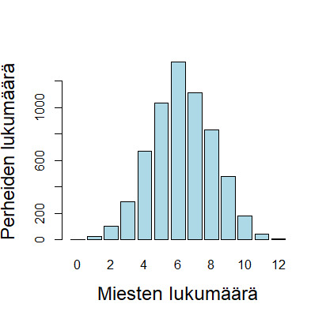

\lefthyphenmin=62
\righthyphenmin=62
# Satunnaisotokset: tilastollisen päättelyn näkökulma {#luku8}

Tarkastellaan seuraavaksi otoksia ja otosjakaumia "tilastollisemmin" mitä edellisten lukujen erityisesti otantaa koskevan johdannon yhteydessä. Tilastollinen päättely on keskeinen osa tilastotiedettä, sillä se mahdollistaa päätelmien yleistämisen otoksesta populaatioon/perusjoukkoon. Tämä ja seuraava luku toimivat esimerkkeinä formaaliin matemaattiseen esitykseen perustuvan tilastollisen päättelyn perusteista (otannan ja otantajakaumien näkökulmasta), jonka idea on yleisesti tehdä luotettavia johtopäätöksiä perusjoukosta otoksen perusteella. Tällä kurssilla käydään läpi (vain) tarvittavia yksityiskohtia sekä rakennetaan pohjia todennäköisyyslaskennan peruskurssin ([TILM3553](https://opas.peppi.utu.fi/fi/opintojakso/TILM3553/1734?period=2024-2027)) jälkeiselle tilastollisen päättelyn peruskurssille ([TILM3555](https://opas.peppi.utu.fi/fi/opintojakso/TILM3555/1731?period=2024-2027)).

## Satunnaisotos, yhteisjakauma ja tilastollinen malli {#alaluku81}

- Luvusta 4 muistamme, että tilastollisen tutkimuksen kohteena on satunnaisilmiöt, joita kuvataan satunnaismuuttujia käyttäen. Satunnaismuuttujilla on todennäköisyysjakaumat, joita tilastotieteessä kuvataan todennäköisyys- eli tiheysfunktion (tai diskreettien sm:n tapauksessa pistetodennäköisyysfunktion) avulla.  
  - Merkitään satunnaismuuttujaa isolla kirjaimella, $Y$, ja satunnaismuuttujan realisaatiota pienellä kirjaimella $y$. Otoskokoa, eli otokseen osallistuvien tilastoyksiköiden määrää merkitään $n$:llä ja tilastoyksiköitä indeksöidään alaindeksillä $i=1,\ldots,n$. 
  - Otoksen poimimisen jälkeen satunnaismuuttujat $Y_1, \ldots, Y_n$ saavat havaituiksi arvoikseen havaintoarvot $y_1, \ldots, y_n$ (ts. $Y_1=y_1, \ldots, Y_n = y_n$).
  - Näin havaintoaineisto on siis __satunnaisotos__, joka voidaan määritellä tarkemmin seuraavasti.

::: {.defblock .mikko data-latex="{}"}
**Satunnaisotos**  

Olkoot $Y_1, \ldots, Y_n$ riippumattomia ja samoinjakautuneita satunnaismuuttujia, joiden tiheysfunktiota (tf., tai pistetodennäköisyysfunktiota (ptnf)) merkitään $f(y, \theta)$:llä, jossa $y$:n on yksittäisen sm:jan $Y$ reaalisaatio ja $\theta$ on jokin jakauman muodon määräävä parametri (tai parametrit).  

Parametrin $\theta$ arvoa ei yleensä tunneta ja tavoitteena onkin päätellä, __estimoida__, sen arvo käytettävissä olevasta aineistosta.
:::

\

__Satunnaisotoksen tilastollinen malli__

- Havaintoarvot $y_1, \dots, y_n$ ovat kiinteitä lukuja, mutta ne vaihtelevat satunnaisesti otoksesta toiseen. Satunnaisotannassa __satunnaisuus liittyy siis havaintoarvojen vaihteluun satunnaisesti otoksesta toiseen__. 
  - Satunnaisuus ei siis liity otannan tuloksena saatuihin havaintoarvoihin, vaan otoksen poimintaan.
  - Toisin sanoen, yksittäisen tilastoyksikön havaintoarvo (esim. pituus) on kiinteä luku. Satunnaisotannassa satunnaisuus kumpuaa siis siitä, että tilastoyksikkö tulee valituksi otokseen sattumanvaraisesti. 

- Satunnaismuuttujien $Y_1, \ldots, Y_n$ __yhteisjakauma__ muodostaa (tiettyjen lisäoletusten jälkeen) __tilastollisen mallin__ havaintoarvojen satunnaiselle vaihtelulle eri otoksissa.
  - Yhteisjakaumaa merkitään $f(y_1,\dots,y_n;\theta)$, jossa havaitut arvot $y_i$ ovat kiinteitä ja parametri $\theta$ on tuntematon.
  - Koska tällä kurssilla satunnaismuuttujat $Y_1, \ldots, Y_n$ oletetaan __riippumattomiksi toisiinsa nähden__, niiden yhteisjakauma on tulomuotoa $f(y_1, \ldots, y_n; \theta) = f(y_1; \theta) \times \cdots \times f(y_n; \theta)$.
  - Tilastollisen päättelyn ensimmäinen tavoite ja tehtävä on pyrkiä havaitun aineiston $y_1,\dots,y_n$ avulla estimoimaan parametrin $\theta$ arvo niin, että havaintojen yhteisjakauma kuvaa aineistoa parhaalla mahdollisella tavalla.  

- Tässä $f(y_1, \ldots, y_n; \theta)$ on siis (tilastomatemaattisessa mielessä) tilastollinen malli: sen muodon määrää tutkijan tekemä aineistoa koskeva jakaumaoletus, mikä voi paikoin olla hyvinkin monimutkainen. Tilastollisen mallin monimutkaisuus ilmenee sen parametrien määrästä: mitä useampi parametri (erit. suhteessa havaintojen määrään), sitä monimutkaisempi malli. 
  - Useimmiten kuitenkin ajatellaan, että on käytettävä niin yksinkertaisia menetelmiä kuin mahdollista, mutta ei yhtään yksinkertaisempia. Tämä on ns. **parsimoonisuusperiaate** eli **vähäparametrisuus-** tai **säästeliäisyysperiaate**.
  - Vähäparametrisuusperiaatteen voidaan nähdä perustuvan ns. [Occamin partaveitsen -periaatteeseen](https://fi.wikipedia.org/wiki/Occamin_partaveitsi), jonka mukaan *"ilmiöitä selittävien tekijöiden määrän tulee olla mahdollisimman vähäinen"*, ts. tilastotieteessä menetelmien (mallien) tulee olla mahdollisimman yksinkertaisia, mutta silti riittäviä.
  - Tämä periaate ja sen suhde ns. **varianssin ja harhan väliseen kompromissiin** on erityisen tärkeä erityisesti tilastollisen ennustamisen ja viime vuosikymmeninä yleistyneen tilastollisen (kone)oppimisen sovellutuksissa (ks. tarkemmin alaluku \@ref(alaluku33)).

- Oletetaan, että $Y_1, \ldots, Y_n$ ovat aiempien oletusten pätiessä riippumattomia sm:jia ja että ne muodostavat  satunnaisotoksen jakaumasta, jonka odotusarvo on $\mu$ ja varianssi on $\sigma^2$.
  - Ts. oletamme

$$
\text{E}(Y_i) = \mu,  \quad \text{ja} \quad 
\mathrm{Var}(Y_i) = \sigma^2, \quad i=1,\ldots,n.
$$

  - Tässä tapauksessa mielenkiinnon kohteena olevat parametrit ovat siis $\mu$ ja $\sigma^2$ eli $\theta = (\mu \quad \sigma^2)$.
    - Toisin sanoen, tutkimuskysymyksestä johdetut hypoteesit voisivat koskea esimerkiksi näitä parametreja, tai tarkemmin niiden oikeita arvoja, jotka ovat siis tuntemattomia.
  - Tilastollisten mallien tehtävänä on siis estimoida nämä todennäköisyysjakaumien parametrit havaitun aineiston perusteella, joten keskeinen tilastollinen kysymys on, __että miten estimointi suoritetaan luotettavasti__.
    - Useimmiten tämä estimointi perustetaan nk. __uskottavuusfunktion__ käyttöön, josta lisää alempana.

::: {.eblock .kimmo data-latex="{}"}
**Esimerkki: satunnaisotos normaalijakaumasta**  

Normaalijakautuneiden satunnaismuuttujien satunnaisotokselle pätee $Y_1, \ldots, Y_n \indep, \,\, Y_i \thicksim \text{N}(\mu, \sigma^2),\,\, i=1,\ldots,n$.  

- Merkintä $\indep$ tarkoittaa, että sm:t $Y_1,\ldots,Y_n$ ovat riippumattomia ja samoin jakautuneita (toisinaan myös lyhyesti _iid_ tai _i.i.d_, joka tulee englannin kielen ilmaisusta "independent and identically distributed"). Merkintä soveltuu käytettäväksi muidenkin jakaumien tapauksessa.
- Esimerkiksi R-ohjelmassa voidaan generoida 10 havainnon ($n=10$) satunnaisotos standardinormaalijakaumasta (ts. $Y_i \thicksim \text{N}(0,1),\, i=1,\ldots,10$) komennolla rnorm(10).
:::

\newpage

## Tilastolliset mallit ja jakaumat {#luku82}

Tarkastellaan seuraavassa muutamia keskeisiä tilastollisia jakaumia. Esittelemme ensin keskeisintä jatkuvien satunnaismuuttujien jakaumaa, normaalijakaumaa, ennen muutamien diskreettien satunnaismuuttujien jakaumia.


### Normaalijakauma

- Jos satunnaismuuttuja $Y$ noudattaa __normaalijakaumaa__ odotusarvolla $\text{E}(Y)= \mu$ ja varianssilla $\mathrm{Var}(Y) = \sigma^2$, niin tällöin merkitään $Y \thicksim \text{N}(\mu, \sigma^2)$. 

- $Y$:n tiheysfunktio on muotoa (ks. kuva alla)
$$
f(y; \mu, \sigma^2) = \frac{1}{\sqrt{2 \pi \sigma^2}} \, e^{-\frac{1}{2} \Big(\frac{y- \mu}{\sigma} \Big)^2}, 
$$

jossa $e$ viittaa Neperin lukuun $e \approx 2.71828$.

- Ylläoleva tiheysfunktio määrittelee parven normaalijakaumia kun parametreille (vakioille) $\mu$ ja $\sigma^2$ annetaan erilaisia arvoja. Nämä kaksi parametria määräävät normaalijakauman tarkemman muodon. 
  - Alla olevassa kuvassa \@ref(fig:normaalijakauma2) on kuvattu erilaisia normaalijakauman tiheysfunktion muotoja eri parametriarvoille.

```{r normaalijakauma2, warning = FALSE, message = FALSE, echo = FALSE, message = FALSE, fig.cap="Normaalijakaumien muotoja eri parametriarvoilla.", fig.align='center', out.width = "100%"}
library(ggplot2)
theme_set(theme_bw())
#generate a normal distribution plot
ggplot(data.frame(x = c(-6, 6)), aes(x = x)) +
stat_function(fun = dnorm, args = c(0,0.5), aes(col = "N(0,0.5)")) + 
  stat_function(fun = dnorm, args = c(0,2), aes(col = "N(0,2)")) +
  stat_function(fun = dnorm, args = c(0,1), aes(col = "N(0,1)")) + 
  ggtitle("Erilaisia normaalijakaumia") +  
  labs(x = "", y = "") + 
  labs(colour = "Väri") 
```

::: {.eblock .kimmo data-latex="{}"}
**Esimerkki: Miesten pituus** 

- Tutkitaan miesten pituutta hyvin määritellyssä joukossa, kuten varusmiespalvelusta tiettynä vuonna suorittavien joukossa.
  - Pituus on ominaisuus, jonka voidaan nähdä määräytyvän monista perintö- ja ympäristötekijöistä. Pituutta voidaan siis pitää satunnaismuuttujana.
  - Oletetaan, että pituus noudattaa normaalijakaumaa. Näin ollen sm. $Y$ on valitun miehen pituus ja $Y \thicksim \text{N}(\mu, \sigma^2)$. 
- Tuntemattomien parametrien $\mu$ ja $\sigma^2$ tulkinta:
  - Odotusarvo $\mu = \text{E}(Y)$ on satunnaisesti valitun miehen pituuden odotettavissa oleva arvo.
  - Varianssi $\sigma^2 = \mathrm{Var}(Y) = \text{E} \Big[\Big(Y- \mu \Big)^2 \Big]$ kuvaa valitun miehen pituuden odotusarvostaan määrätyn poikkeaman (keskihajonnan) neliön odotettavissa olevaa arvoa (kuvaten ts. pituuksien jakauman keskittyneisyyttä/hajaantuneisuutta pituuksien odotusarvon ympärillä). 
:::


### Bernoulli-, binomi- ja Poisson-jakauma

- __Bernoulli-jakauma__ on todennäköisyysjakauma, jossa satunnaismuuttujalla $Y$ on kaksi mahdollista tulosvaihtoehtoa $Y=1$ tai $Y=0$.
  - Yleensä $Y=0$ tarkoittaa, että jokin tapahtuma ei tapahdu ja $Y=1$ että tapahtuu.
  - Todennäköisyys tapahtumalle $Y=1$ on $\text{P}(Y=1)=p$ ja vastaavasti vastatodennäköisyys $\text{P}(Y=0)=1-p$.
  - Bernoulli-jakaumaa merkitään $Y \thicksim B(p)$, jossa siis $0 < p < 1$.
  - Bernoulli-jakauman pistetodennäköisyysfunktio on muotoa
$$
f(y; p) = \text{P}(Y=y) = p^y (1-p)^{(1-y)},
$$
jossa $y$ on sm:n $Y$ realisaatio (havaittu arvo) ja parametri $p$ on tuntematon (voidaan estimoida otoksen avulla, kuten myöhemmin tullaan näkemään).

- Bernoulli-jakauman odotusarvo $\text{E}(Y)=p$ ja varianssi $\mathrm{Var}(Y)=p (1-p)$.

\

- __Binomijakauma__
  - Olkoon $Y_1, \ldots, Y_n$ riippumattomia satunnaismuuttujia ja $Y_i \thicksim B(p), \, i=1,\ldots,n$.
  - Jos $X = Y_1 + Y_2 + \ldots + Y_n$, niin  $X \thicksim \mathrm{Bin}(n,p)$. Ts. sm. $X$ noudattaa __binomijakaumaa__ parametrein $n$ ja $p$.
  - Pistetodennäköisyysfunktio:

$$
\text{P}(X=k) = \binom nk p^k (1-p)^{(n-k)}.
$$

  - Jakauman odotusarvo $\text{E}(X)=np$ ja varianssi $\mathrm{Var}(X) = n p (1-p)$.
  - Binomijakaumalla kyetään vastaamaan mm. kysymykseen millä todennäköisyydellä $n$:n kokoisessa otoksessa tapahtuu $k$ onnistumista. 

::: {.eblock .kimmo data-latex="{}"}
**Esimerkki: Miesten lukumäärä Saksin osavaltion perheissä 1876--1885**^[Ks. tarkemmin esimerkki 3.2 kirjassa (s. 67-68) Friendly, M., ja D. Meyer (2015). _Discrete Data Analysis with R. Visualization and Modeling Techniques for Categorical and Count Data._ Chapman & Hall/CRC.] 

Vuosien 1876--1885 aikana Saksin osavaltiossa rekisteröitiin yli neljä miljoonaa syntynyttä lasta. Tällöin vanhempien tuli ilmoittaa lapsen sukupuoli (mies tai nainen) heidän syntymätodistuksessaan. Myöhemmässä tutkimuksessa tutkittiin tarkemmin 6115 perhettä, joissa asui 12 lasta ja tarkemmin miesten (poikien) lukumäärää näissä perheissä.

Oheisessa taulukossa taulukoidaan miesten (poikien) lukumäärät näissä 12 lapseen perheissä. Tarkasteltava jakauma esitetään vielä erikseen oheisessa kuviossa \@ref(fig:miestenlkm). 

Tässä tilantessa mielenkiinnon kohteena saattaisi olla hypoteesi, jonka mukaan pojan (miehen) syntymätodennäköisyys $\text{P}(\mathrm{mies}) = p$ on $p=0.5$.
:::

```{r, echo = FALSE, message = FALSE, warning = FALSE}
library(ggplot2)
theme_set(theme_bw())
miehet = c(0,1,2,3,4,5,6,7,8,9,10,11,12)
perheet = c(3,24,104,286,670,1033,1343,1112,829,478,181,45,7)
saks = rbind.data.frame(miehet, perheet)
rownames(saks) = c("Miesten lkm", "Perheiden lkm")
colnames(saks) = c(0:12)
library(dplyr)
library(knitr)
library(kableExtra)
kable(saks, booktabs = TRUE) %>% 
  kable_styling(font_size = 12, latex_options = "scale_down")
```

\FloatBarrier

```{r miestenlkm, echo=FALSE, fig.cap="Miesten lukumäärä Saksin osavaltiossa 12:n lapsen perheissä.", fig.align='center', out.width = "750%"}

```

\FloatBarrier

__Poisson-jakauma__

- Jos satunnaismuuttuja $Y$ on Poisson-jakautunut, merkitään $Y \thicksim P(\lambda)$, jossa parametri $\lambda > 0$ on Poisson-jakauman parametri, jota kutsutaan myös ajoittain intensiteettiparametriksi.
- Poisson-jakaumaa voidaan käyttää tilanteissa, joissa sm. $Y$ on jokin lukumäärä ja sen pistetodennäköisyysfunktio on muotoa
$$
\text{P}(Y=k) = \frac{e^{-\lambda} \lambda^k}{k!}.
$$

- Odotusarvo ja varianssi ovat Poisson-jakauman tapauksessa samat: $\text{E}(Y) = \mathrm{Var}(Y) = \lambda$.

- Kuviossa \@ref(fig:poisson) on kuvattu Poisson-jakauman sovelluskohteita ja sen pistetodennäköisyysfunktion muotoa eri parametrin $\lambda$ arvoilla. 


```{r poisson, echo=FALSE, fig.cap="Esimerkki: Poisson-jakauman sovelluskohteita ja sen pistetodennäköisyysfunktio eri parametrin $\\lambda$ arvoilla.", fig.align='center', out.width = "100%"}
knitr::include_graphics("images/poisson.jpg")
```

::: {.eblock .kimmo data-latex="{}"}
**Esimerkki: Poisson-jakauma**

Tarkastellaan Englannin Valioliigakauden 1995--1996 otteluissa tehtyjä maalimääriä. Valioliiga (The F.A. Premier League) on korkein Englannin jalkapalloliigan sarjataso, jossa ensi kerran juuri kaudella 1995-1996 20 joukkuetta (aiemmin Valioliigan perustamisen kauden 1992--1993 alussa 22 joukkuetta) pelasivat keskenään kerran toisiaan vastaan koti- ja vieraskentällä. Otteluita oli siis yhteensä 380.

Tämä esimerkki perustuu edellä mainittuun Friendlyn ja Meyerin (2015) kirjan esimerkkiin 3.9 (s. 78-79), joka vastaavasti perustuu Alan J. Leen (1997) artikkeliin^[Alan J. Lee (1997). Modeling Scores in the Premier League: Is Manchester United Really the Best? _Chance_ 10(1), 15-19.], jonka esittämään kysymykseen (hypoteesiin) vastaus on tietenkin ilmeinen! Näin ollen seuraavassa tarkastellaankin kotijoukkueiden ja vierasjoukkueiden maalintekointensiteettiä Poisson-jakaumaan perustuen. Seuraavassa emme siis pyri mallintamaan tietyn spesifin ottelun lopputulosta vaan tarkastelemme "keskimääräisen" kotijoukkueen ja vierasjoukkueen "edustavaa" ottelua.

Seuraava taulukko raportoi tehtyjen maalimäärien jakaumat pelatuissa 380 ottelussa. Neljän tai yli neljän maalin tapaukset kirjataan 4+:nä maalina. Ts. esim. kys. kauden lopputulokset _Blackburn Rovers_ - _Nottingham Forest_ 7-0 ja _Bolton Wanderers_ - _Manchester United_ 0-6 tulevat aineistoon tuloksina 4+ vs. 0 ja 0 vs. 4+.
:::
```{r, echo = FALSE}
rivi1 = c(27,29,10,8,2,76)
rivi2 = c(59,53,14,12,4,142)
rivi3 = c(28,32,14,12,4,90)
rivi4 = c(19,14,7,4,1,45)
rivi5 = c(7,8,10,2,0,27)
rivi6 = c(140,136,55,38,11,380)

taulukko = rbind.data.frame(rivi1,rivi2,rivi3,rivi4,rivi5,rivi6)
rownames(taulukko) = c("0", "1", "2", "3", "4+", "Yht.")
colnames(taulukko) = c("0", "1", "2", "3", "4+", "Yht.")

kable(taulukko, booktabs = TRUE) %>%
  add_header_above(c("Kotij. maalien lkm." = 1, "Vierasj. maalien lkm." = 5, "Yht." = 1)) 
```

::: {.eblock .kimmo data-latex="{}"}
**Esimerkki (jatkuu): Poisson-jakauma**

Olettamalla, että koti- ja vierasjoukkueen todennäköisyys tehdä maali ottelun aikana on vakio, niin tällöin koti- ja vierasjoukkueen ottelun aikana tekemien maalien lukumäärää (ilman edellä käytettyä maalimäärien "katkaisua" neljään) voidaan melko hyvin approksimoida oletuksella, että nämä lukumäärät ovat Poisson-jakautuneita. Ts. $Y^H_i \thicksim P(\lambda_H)$ on sm., joka kuvaa $i$:n ottelun kotijoukkueen tekemien maalien lukumäärää ja intensiteettiparametrin $\lambda_H$ arvon määrittäminen kuuluu tilastollisen päättelyn ja erityisesti estimointiteorian piiriin. Vastaavasti vierasjoukkueen maalimäärät: $Y^A_i \thicksim P(\lambda_A)$. 

Osoittautuu, että parametreille $\lambda_H$ ja $\lambda_A$ saatavat estimaatit ovat $\lambda_H = 1.49$ ja $\lambda_A = 1.06$ ja ne vastaavat tässä yksinkertaistetussa tilanteessa koti- ja vierasjoukkueen keskimääräisiä maalimääriä:
:::

\FloatBarrier

```{r, echo = FALSE}
ka = c("1.486","1.063","2.550")
va = c("1.316","1.172","2.618")
taulukko = rbind.data.frame(ka, va)
rownames(taulukko) = c("Keskiarvo", "Varianssi")
colnames(taulukko) = c("Kotijoukkue (home)", "Vierasjoukkue (away)", "Yht.")

kable(taulukko, booktabs = TRUE) 
```

::: {.eblock .kimmo data-latex="{}"}
Tuloksista voidaan siis päätellä, että kotijoukkueen (odotettavissa oleva) maalimäärä on vierasjoukkuetta korkeampi (osoittaen kotiedun merkitystä jalkapallossa). Lisäksi edellä todetun Poisson-jakauman teoreettisten ominaisuuksien mukaisesti keskimääräiset maalimäärät ovat lähellä niiden variansseja, mikä osoittaa osaltaan (tässä yksinkertaistetussa tilanteessa), että Poisson-jakaumaan perustuva jakaumaoletus on kelvollinen.

On syytä todeta lopuksi, että tämän vahvasti yksinkertaistetun tilanteen sijaan tilastotieteessä on laaja ja kasvava kirjallisuuden haara jalkapalloa ja muuta urheilua koskevien tilastollisten menetelmien saralla. Nämä vaativat kuitenkin syvällisemmän ymmärryksen saavuttamiseksi jälleen huomattavasti laajempia tilastotieteen (aine- ja syventäviä) opintoja.
:::

## Tilastolliset tunnusluvut ja parametrien estimaattorit {#alaluku83}

- Erityisesti klassisessa tilastotieteessä tilastollinen päättely pohjautuu aineiston tilastollisen mallin kuvaamalle tilastolliselle stabiliteetille, joka ilmenee ajatuksena aineiston keruun toistamisesta.
    - Oletetaan, että tarkasteltavan aineiston on tuottanut satunnaisotanta tai satunnaiskoe, joka noudattaa tilastollista mallia $f(y_1, \ldots, y_n; \theta)$ (aiemmin merkinnöin).
    - Toistetaan aineiston keruu samoissa olosuhteissa yhä uudelleen ja uudelleen.
    - Saatava aineisto (numeeriset arvot) $y_1, \ldots, y_n$ vaihtelevat näin ollen valitun tilastollisen mallin jakauman kuvaamalla tavalla.

::: {.eblock .kimmo data-latex="{}"}
__Esimerkki: Normaalisti jakautunut aineisto__

- Tilastollisella stabiliteetillä tarkoitetaan sitä, että saman tilastollisen mallin /todennäköisyysjakauman generoimat aineistot ovat ominaisuuksiltaan samankaltaisia.  
- Esimerkiksi normaalijakautuneen aineiston tapauksessa tämä tarkoittaa sitä että eri otosten havainnot vaihtelevat saman odotusarvon ympärillä ja keskimäärin samalla tavalla (varianssilla).  
- Kuvassa \@ref(fig:normaaliaineisto) on esimerkkinä neljä satunnaisotosta samasta normaalijakaumasta, eli käyttäen samoja odotusarvo ja varianssiparametreja. Odotusarvona on $\mu = 180$ ja varianssina $\sigma^2 = 25$. 

\

- Nämä satunnaisotoksen kuvaajat ovat nk. histogrammeja, joka on yleinen tapa esittää tämänkaltaista aineistoa (huom. luokittelut tehdään tässä siis graafisen esityksen aikaansaamiseksi).   
  - Tässä tapauksessa jatkuvan muuttujan havaintoarvot on luokiteltu niin, että jokainen havainto kuuluu yhteen tasaväliseen luokkaan ja yhtä luokkaa kuvaa yksi pylväs.
  - Pylvään korkeus määräytyy luokan sisältämien arvojen lukumäärän eli frekvenssin mukaan. 
- Kuvaajista huomataan että valtaosa havainnoista on kaikissa tapauksissa keskittynyt odotusarvon ympärille ja arvojen vaihtelu on samankaltaista.
:::

```{r normaaliaineisto, echo=FALSE, fig.cap="Normaalisti jakautunut aineisto vaihtelee samalla tavalla. Harmaat palkit kuvaavat kyseiseen havaintoarvojen väliin kuuluvien havaintojen osuutta ja punainen käyrä on tarkasteltavan normaalijakauman tiheysfunktio.", fig.align='center', out.width="100%", warning=FALSE}
library(ggplot2)
library(ggpubr)
set.seed(1)

df <- data.frame(PF = rnorm(100, 180, sqrt(25)))
kuva1 = ggplot(df, aes(x = PF)) + 
    geom_histogram(aes(y =..density..),
                   breaks = seq(170, 190, by = 2.5), 
                   colour = "black", 
                   fill = "grey") +
  xlim(170, 190) +
stat_function(fun = dnorm, args = list(mean = 180, sd = 5), colour = "red") + theme_bw() + ylab("") + xlab("") + 
  scale_y_continuous(name = "", breaks = seq(0, 0.08, by = 0.01))

set.seed(2)
df <- data.frame(PF = rnorm(100, 180, sqrt(25)))
kuva2 = ggplot(df, aes(x = PF)) + 
    geom_histogram(aes(y =..density..),
                   breaks = seq(170, 190, by = 2.5), 
                   colour = "black", 
                   fill = "grey") +
  xlim(170, 190) +
stat_function(fun = dnorm, args = list(mean = 180, sd = 5), colour = "red") + theme_bw() + ylab("") + xlab("") + 
  scale_y_continuous(name = "", breaks = seq(0, 0.08, by = 0.01))

set.seed(3)
df <- data.frame(PF = rnorm(100, 180, sqrt(25)))
kuva3 = ggplot(df, aes(x = PF)) + 
    geom_histogram(aes(y =..density..),
                   breaks = seq(170, 190, by = 2.5), 
                   colour = "black", 
                   fill = "grey") +
  xlim(170, 190) +
stat_function(fun = dnorm, args = list(mean = 180, sd = 5), colour = "red") + theme_bw() + ylab("") + xlab("") + 
  scale_y_continuous(name = "", breaks = seq(0, 0.08, by = 0.01))

set.seed(4)
df <- data.frame(PF = rnorm(100, 180, sqrt(25)))
kuva4 = ggplot(df, aes(x = PF)) + 
    geom_histogram(aes(y =..density..),
                   breaks = seq(170, 190, by = 2.5), 
                   colour = "black", 
                   fill = "grey") +
  xlim(170, 190) +
stat_function(fun = dnorm, args = list(mean = 180, sd = 5), colour = "red") + theme_bw() + ylab("") + xlab("") + 
  scale_y_continuous(name = "", breaks = seq(0, 0.08, by = 0.01))

ggpubr::ggarrange(kuva1, kuva2, kuva3, kuva4, ncol = 2, nrow = 2)
```


- Satunnaisotoksesta voidaan laskea erilaisia __tunnuslukuja/otossuureita__, joita merkitään $T(Y)$:llä, ts. ne ovat aineiston funktioita 
$$
T(Y) = g(Y_1, \ldots, Y_n).
$$

- __Tunnusluvut ovat satunnaismuuttujien funktioina myös satunnaismuuttujia.__
  - Otoksen poimimisen jälkeen, havaintoarvoja käyttäen, voidaan laskea __tunnuslukujen havaitut arvot__ (jolloin ne ovat siis ei-satunnaisia). (realisaatio) pisteessä ($y_1,\ldots, y_n$) eli havaitussa aineistossa on

$$
t(y) = g(y_1, \ldots, y_n).
$$

- Esimerkkinä tunnusluvusta on keskiarvo $\bar{Y} = \frac{1}{n} \sum_{i=1}^{n} Y_i$. 
  - Otoskeskiarvo on havaittujen arvojen keskiarvo, kun se lasketaan kerätystä aineistosta, ts. $\bar{y} = \frac{1}{n} \sum_{i=1}^{n} y_i$.

- Jos tunnuslukua $T(Y)$ käytetään tilastollisen mallin parametrin (parametrien) $\theta$ estimointiin, niin tätä sanotaan tällöin parametrin __estimaattoriksi__, jota voidaan merkitä $\widehat{\theta}(Y) = g(Y_1,\dots,Y_n)$.
  - Estimaattorin otoskohtaisia arvoja kutsutaan __estimaateiksi__ ja merkitään $\widehat{\theta}(y)$.
  - Estimaattorilla on nk. todellinen arvo, $g(\theta)$, joka vastaa parametrin arvoa perusjoukon tasolla ja jota pyritään aineistoa käyttäen estimoimaan.
  - Toivottavaa olisi, että estimaatit $\widehat{\theta}(y) = g(y_1, \ldots, y_n)$ osuisivat mahdollisimman lähelle tunnusluvun todellista arvoa $g(\theta)$. Ts. satunnaismuuttujan eli tässä tapauksessa estimaattorin $\widehat{\theta}(Y)=g(Y_1, \ldots, Y_n)$ jakauman tulisi keskittyä mahdollisimman tiiviisti $g(\theta)$:n ympärille.

__Uskottavuusfunktio__

- Erityisesti klassisessa tilastotieteessä tilastollisen mallin parametrien estimointi perustetaan usein nk. suurimman uskottavuuden menetelmälle.  
  - Koska mielenkiinnon kohteena on tilastollisen mallin, eli tehdyn jakaumaoletuksen alaisen yhteisjakauman, parametrit, perustuu suurimman uskottavuuden estimointi näiden estimaattoreihin.
  - Tavoitteena on löytää sellaiset parametriarvot, jotka ovat havaitun aineiston kannalta uskottavimmat tilastollisen mallin parametrit.    

- Käytännössä suurimman uskottavuuden estimointi perustuu valitun tilastollisen mallin määrittelevälle tiheysfunktiolle tai pistetodennäköisyysfunktiolle, kun aineisto on havaittu.
  - Tarkemmin, nk. __uskottavuusfunktiota__ merkitään $L(\theta) = L(\theta;y_1,\dots,y_n) = f(y_1,\dots,y_n;\theta)$, jossa kirjain L tulee englannin kielen sanasta _likelihood function_. 
  - Uskottavuusfunktiossa aineisto on havaittu eli se tulkitaan kiinteäksi ja parametri $\theta$ on tuntematon muuttuja, jonka arvoa pyritään estimoimaan.
  - Koska tehty jakaumaoletus määrää yhteisjakauman muodon, voidaan suurimman uskottavuuden estimointi perustaa siitä johdettuihin todennäköisyyksiin. 
  - Lopulta valitaan sellaiset parametriarvot, jotka ovat aineiston valossa kaikkein _uskottavimmat_ ja kutsutaan niitä __suurimman uskottavuuden estimaateiksi__.
  - Suurimman uskottavuuden estimointiin ja siihen pohjaavaan päättelyyn syvennytään tarkemmin Tilastollisen päättelyn aineopintotasoisilla kursseilla ([TILM3561](https://opas.peppi.utu.fi/fi/opintojakso/TILM3561/5069?period=2024-2027) ja [TILM3707](https://opas.peppi.utu.fi/fi/opintojakso/TILM3707/100872?period=2024-2027)).


::: {.eblock .kimmo data-latex="{}"}
__Esimerkki: Normaalisti jakautuneen aineiston parametrien estimointi__

- Normaalijakauma on odotusarvon suhteen symmetrinen jakauma, joten odotusarvon estimointi voidaan perustaa havaitun aineiston "sijaintiin".   
  - Toisin sanoen, normaalisti jakautuneen aineiston odotusarvon estimaattorina toimii havaintoarvojen otoskeskiarvo, josta lisää alaluvussa \@ref(alaluku84).
- Vastaavasti normaalisti jakautuneen aineiston varianssi kuvaa havaintoarvojen keskittyneisyyttä/hajaantuneisuutta odotusarvon ympärillä.

- Uskottavuuspohjaisen päättelyn toimintaperiaatetta voidaan kuvata jälleen käyttäen normaalijakautunutta aineistoa esimerkkinä. 
  - Jatkaen edellistä esimerkkiä, kuvassa \@ref(fig:normaaliSUE) on kuvattuna $n=100$ satunnaisotos normaalijakaumasta histogrammina. 
  - Aineiston generoineen tilastollisen mallin odotusarvo on jälleen $\mu = 180$ ja varianssi $\sigma^2 = 25$. 
  - Kuvassa on myös piirrettynä normaalijakauman tiheysfunktion kuvaajia erilaisille parametriparin $(\mu, \,\, \sigma^2)$ arvoille. Mikä näistä olisi mielestäsi _uskottavin_ kandidaatti havaitulle aineistolle? Huomioi, että oikean aineiston tapauksessa parametrien arvoja ei tiedetä, vaan ne pitää päätellä eli estimoida aineistosta!
:::

```{r normaaliSUE, echo=FALSE, fig.cap="Normaalisti jakautunut aineisto. Mikä ylläolevista jakaumista on todennäköisimmin generoinut aineiston?", fig.align='center', out.width="100%", warning=FALSE}

set.seed(4)
df <- data.frame(PF = rnorm(100, 180, sqrt(25)))
ggplot(df, aes(x = PF)) + 
    geom_histogram(aes(y =..density..),
                   breaks = seq(170, 190, by = 2.5), 
                   colour = "black", 
                   fill = "grey") +
  xlim(165,200) +
  stat_function(fun = dnorm, args = list(mean = 170, sd = 10), aes(colour = "line1")) +
  stat_function(fun = dnorm, args = list(mean = 190, sd = 2),  aes(colour = "line2")) +
  stat_function(fun = dnorm, args = list(mean = 180, sd = 5),  aes(colour = "line3")) +
  stat_function(fun = dnorm, args = list(mean = 185, sd = 8), aes(colour = "line4")) + theme_bw() + labs(x = "Havaintoarvot", y = "", color = "Tiheysfunktiot") + 
  scale_colour_manual(values = c("line1" = "darkgreen", 
                                 "line2" = "deepskyblue3", 
                                 "line3" = "red", 
                                 "line4" = "darkorange"),
                      labels = c("N(170,100)", "N(190,4)", "N(180,25)", "N(185,64)"))
  
```


\
\FloatBarrier
__Estimaattorin ominaisuudet__

- Merkitään seuraavassa parametrin $\theta$ estimaattoria $\widehat{\theta}$:lla. Siltä voidaan toivoa seuraavia ominaisuuksia:

::: {.defblock .mikko data-latex="{}"}
**Harhattomuus**  

Estimaattorin odotettavissa oleva arvo yhtyy tuntemattoman parametrin $\theta$ todelliseen arvoon eli $\text{E}(\widehat{\theta}) = \theta$.

- Harhaton estimaattori tuottaa keskimäärin oikean kokoisia arvoja (estimaatteja) estimoitavalle parametrille.
- Estimaattorin tuottama arvo parametrille saattaa tietylle otokselle poiketa paljonkin parametrin todellisesta arvosta, mutta odotusarvon frekvenssitulkinnan mukaan estimaattorin tuottamat otoskohtaiset arvot parametrille jakautuvat otantaa toistettaessa (symmetrisesti) parametrin todellisen arvon ympärille.
:::

```{r unbiased, echo=FALSE, fig.cap="Havainnollistuksia estimaattoreiden ominaisuuksista.", fig.align='center', out.width = "100%"}
knitr::include_graphics("images/unbiased.jpg")
```

::: {.defblock .mikko data-latex="{}"}
**Tyhjentävyys**  

Tyhjentävä estimaattori käyttää kaiken otokseen sisältyvän parametria $\theta$ koskevan informaation.
:::

::: {.defblock .mikko data-latex="{}"}
**Tehokkuus**  

Kahdesta saman parametrin $\theta$ estimaattorista tehokkaampi on se, jonka varianssi on pienempi. Ts. $\widehat{\theta}^{(1)}$ on tehokkaampi kuin $\widehat{\theta}^{(2)}$, jos  $\mathrm{Var}(\widehat{\theta}^{(1)}) \le \mathrm{Var}(\widehat{\theta}^{(2)})$.
:::

::: {.defblock .mikko data-latex="{}"}
**Tarkentuvuus**  

Tarkentuvan estimaattorin $\widehat{\theta}$ arvot lähestyvät parametrin $\theta$ oikeaa arvoa otoskoon kasvaessa.
:::

- Voidaan osoittaa (yksityiskohdat sivuutetaan tällä kurssilla), että esimerkiksi yksinkertaisen satunnaisotoksen tapauksessa tavanomaisilla binomi- ja normaalijakauman parametrien estimaattoreilla on kaikki edellä mainitut hyvät ominaisuudet.
  - Näin ei ole yleisesti monimutkaisemmissa otantatilanteissa ja tilastollisisssa malleissa.
  - Estimaattoreiden kehittäminen erilaisten tilastollisten mallien tapauksessa kuuluu teoreettisen tilastotieteen alaan.

- Seuraavaksi perehdytään tarkemmin kahteen kenties useimmiten tarkasteltavaan tunnuslukuun: otoskeskiarvoon ja otosvarianssiin.


## Otoskeskiarvo ja otosvarianssi (estimaattoreina) {#alaluku84}

__Otoskeskiarvo__

- Oletetaan, kuten aiemmin, että $Y_1,\ldots,Y_n$ ovat riippumattomia sm:jia ja että ne muodostavat satunnaisotoksen jakaumasta, jonka odotusarvo on $\mu$, ts. $\text{E}(Y_i) = \mu$ ja varianssi on $\sigma^2$, ts. $\text{Var}(Y_i) = \sigma^2$. 
  - Havaintojen (satunnaismuuttujien) $Y_1, \ldots, Y_n$ __otoskeskiarvo__ on  

$$
\bar{Y} = \frac{1}{n}(Y_1 + \cdots + Y_n) = \frac{1}{n} \sum_{i=1}^{n} Y_i
$$

  - Yksittäisen otoksen otoskeskiarvo on tällöin sm:jien realisaatioiden aritmeettinen keskiarvo

$$
\bar{y} = \frac{1}{n} \sum_{i=1}^{n} y_i.
$$

  - Otoskeskiarvo on satunnaismuuttuja, jonka saama arvo vaihtelee satunnaisesti otoksesta toiseen satunnaisotannasta johtuen.
  - Kun satunnaismuuttujat ovat samoin jakautuneet odotusarvonaan $\mu$, on otoskeskiarvo jakauman odotusarvon harhaton estimaattori, ts. 

$$\text{E}(\bar{Y}) = \mu$$

  - Täten otoskeskiarvo kuvaa aineiston perusjoukon tilastollisen mallin odotusarvoa.


__Otosvarianssi__

- Aineiston sisältämää vaihtelua kuvataan __otosvarianssilla__
$$
S^2= \frac{1}{n-1} \sum_{i=1}^{n} (Y_i - \bar{Y})^2.
$$

  - Vastaavasti sm:jien vaihtelua perusjoukon tasolla kuvataan __populaatiovarianssilla__

$$
\sigma^2= \frac{1}{N} \sum_{j=1}^{N} (Y_j - \mu)^2,
$$
jota otosvarianssi harhattomasti estimoi.

- Otoskeskiarvo $\bar{Y}$ ja otosvarianssi $S^2$ ovat siis satunnaismuuttujia, joiden saamat arvot vaihtelevat $\bar{y}$ ja $s^2$ satunnaisesti otoksesta toiseen.

::: {.eblock .kimmo data-latex="{}"}
__Esimerkki: Normaalisti jakautuneen aineiston parametrien estimointi__

- Edellisiä esimerkkejä jatkaen, tarkastellaan seuraavaksi normaalisti jakautuneen aineiston parametriestimaatteja. 
- Kuvassa \@ref(fig:normaaliSUE2) on jälleen $n=100$ kokoinen otos normaalijakaumasta parametrein $\mu = 180$ ja $\sigma^2 = 25$.  
- Generoidusta aineistosta lasketaan otoskeskiarvoksi $\bar{y} = 180.5$ ja otosvarianssiksi $s^2 = 20.9$.  
  - Huomataan että otoskeskiarvo on todella lähellä oikeaa odotusarvoparametrin arvoa, mutta otosvarianssi on paljon pienempi. 
:::

\FloatBarrier
```{r normaaliSUE2, echo=FALSE, fig.cap="Normaalisti jakautuneen aineiston havainnollistus. 'Oikean jakauman' tiheysfunktion lisäksi (yhteen otokseen perustuvien) estimoitujen parametrien mukainen jakauma.", fig.align='center', out.width="100%", warning=FALSE}
set.seed(4)
df <- data.frame(PF = rnorm(100, 180, sqrt(25)))
#mean(df$PF);var(df$PF) #180.4826; 20.8791
ggplot(df, aes(x = PF)) + 
    geom_histogram(aes(y =..density..),
                   breaks = seq(170, 190, by = 2.5), 
                   colour = "black", 
                   fill = "grey") +
  xlim(165,200) +
  stat_function(fun = dnorm, args = list(mean = 180, sd = 5), aes(colour = "line1")) +
  stat_function(fun = dnorm, args = list(mean = mean(df$PF), sd = sd(df$PF)),  aes(colour = "line2")) +
 theme_bw() + labs(x = "Havaintoarvot", y = "", color = "Tiheysfunktiot") + 
  scale_colour_manual(values = c("line1" = "red", 
                                "line2" = "darkgreen"), 
                      labels = c("Oikeat parametriarvot: N(180,25)", "Estimoidut parametriarvot: N(180.5, 20.9)")) + theme(legend.position="bottom")
  
```
\FloatBarrier
::: {.eblock .kimmo data-latex="{}"}
__Esimerkki: Normaalisti jakautuneen aineiston parametrien estimointi (jatkuu)__

- Generoidaan seuraavaksi suurempi satunnaisotos samasta aineistosta valitsemalla $n=1000$. Tämä on kuvattu kuvaajassa \@ref(fig:normaaliSUE3).  
- Nyt estimaateiksi saadaan $\bar{y} = 179.83$ ja $s^2 = 23.49$.  
  - Otoskeskiarvo on taas varsin hyvä arvio oikeasta parametriarvosta ja otosvarianssikin on nyt lähempänä oikeaa. Otoskokoa kasvattamalla estimaatit lähestyisivät oikeita parametriarvoja, mikä (yleisellä tasolla tässä kohtaa) liittyy niiden estimaattorien tarkentuvuusominaisuuteen (ks. yläpuolella). 
:::

```{r normaaliSUE3, echo=FALSE, fig.cap="Normaalisti jakautuneen aineiston havainnollistus, suurempi otoskoko.", fig.align='center', out.width="100%", warning=FALSE}
set.seed(4)
df <- data.frame(PF = rnorm(1000, 180, sqrt(25)))
#mean(df$PF);var(df$PF) #179.8279; 23.48873
ggplot(df, aes(x = PF)) + 
    geom_histogram(aes(y =..density..),
                   breaks = seq(170, 190, by = 2.5), 
                   colour = "black", 
                   fill = "grey") +
  xlim(165,200) +
  stat_function(fun = dnorm, args = list(mean = 180, sd = 5), aes(colour = "line1")) +
  stat_function(fun = dnorm, args = list(mean = mean(df$PF), sd = sd(df$PF)),  aes(colour = "line2")) +
 theme_bw() + labs(x = "Havaintoarvot", y = "", color = "Funktiot") + 
  scale_colour_manual(values = c("line1" = "red", 
                                "line2" = "darkgreen"), 
                      labels = c("Oikeat parametriarvot: N(180,25)", "Estimoidut parametriarvot: N(179.83, 23.49)")) + theme(legend.position="bottom")
  
```


## Luvun 8 yhteenveto, keskeisiä termejä ja kokonaisuuksia.

-	Yleisempiä jakaumia: Normaalijakauma, Bernoulli-jakauma, binomijakauma ja Poisson-jakauma
- Satunnaisotos
- Yhteisjakauma
- (Satunnaisotoksen) tilastollinen malli
- Riippumattomat satunnaismuuttujat
- Tunnusluku/otossuure
- Estimaattori ja estimaatti
- (Hyvän) estimaattorin ominaisuuksia: Harhattomuus, tyhjentävyys, tehokkuus ja tarkentuvuus
- Otoskeskiarvo ja otosvarianssi estimaattoreina
- Normaalistijakautunut satunnaisotos
