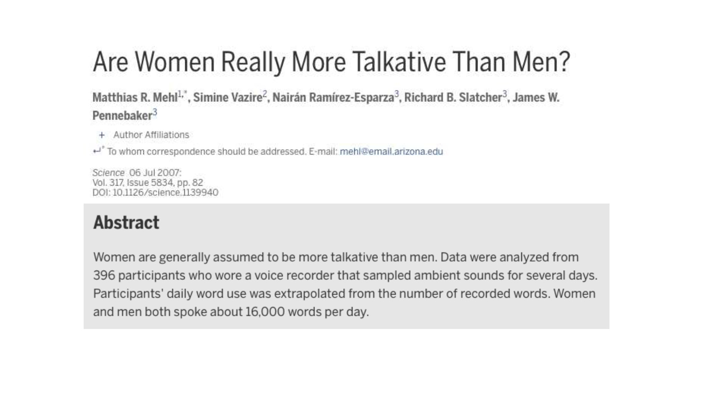
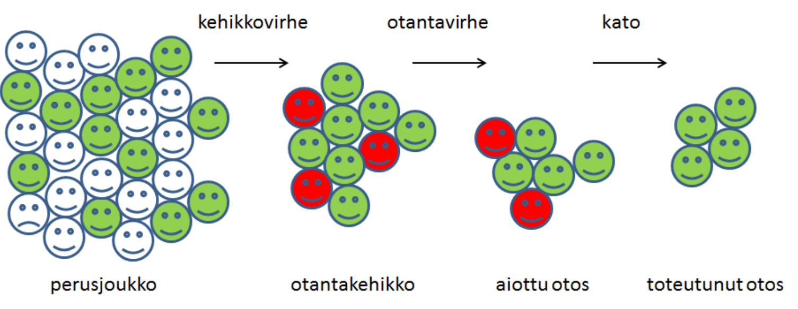
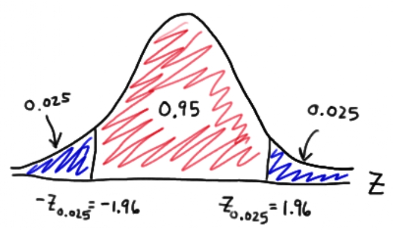
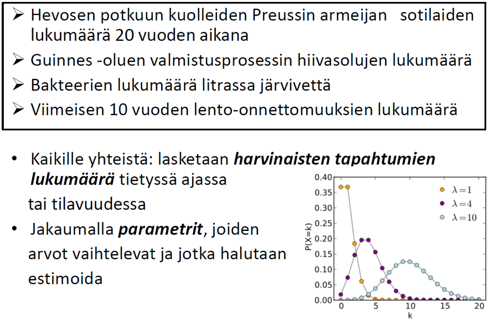

--- 
title: "TILM3701 - Tilastotiede ja data 2024"
author:
  - Koonneet
  - Henri Nyberg^[Turun yliopisto, matematiikan ja tilastotieteen laitos, henri.nyberg@utu.fi]
  - Roope Rihtamo^[Turun yliopisto, matematiikan ja tilastotieteen laitos, roope.rihtamo@utu.fi]
date: "`r Sys.Date()`"
site: bookdown::bookdown_site
output: bookdown::gitbook
documentclass: book
bibliography: [book.bib, packages.bib]
biblio-style: apalike
link-citations: yes
colorlinks: yes
urlcolor: blue
linkcolor: blue
github-repo: rstudio/bookdown-demo
description: "Tilastotieteen ensimmäinen kurssi."
header-includes: |
    \def\independenT#1#2{\mathrel{\rlap{$#1#2$}\mkern2mu{#1#2}}}
    \newcommand{\indep}{\perp \!\!\! \perp}
---

# Kurssin (osat I ja II rakenne) {-}
- Tilastotiede ja data -kurssi koostuu kahdesta erillisestä osasta, jotka tarjoavat opiskelijalle työkaluja tieteen ja tutkimuksen ymmärtämiseen tilastotieteen näkökulmasta käsin.
  - Lisäksi kurssi pyrkii antamaan, varsinkin alkuosaltaan, melko ei-matemaattisen johdannon tilastotieteen keskeisiin ideoihin ja perusteisiin.
- __Osa I__ (2op): Ensimmäinen osa toimii johdantokurssina tieteen ja tutkimuksen tekoon esittelemällä keskeisiä käsitteitä, käytäntöjä ja termejä, joita kvantitatiivisessa/määrällisessä tutkimuksessa tilastotieteen ja sen menetelmien osalta tarvitaan (ks. osaamistavoitteet alla).
  - Tarkoituksena on yleisellä tasolla johdatella tilastotieteen ja aineistojen (datan) maailmaan sekä pohtia myös näiden laajempaa merkitystä tieteellisen tutkimuksen hyvin keskeisinä osina.
  - Kurssin ensimmäisen osan lopuksi järjestetään tentti, joka arvioidaan hyväksytty/hylätty asteikolla.
  
- __Osa II__ (4op): Kurssin toisessa osassa syvennytään ensimmäisen osan teemoihin tarkastelemalla erityisesti tilastollisten menetelmien roolia tutkimuksessa.
  - Tarkoituksena on luoda pohja tosielämän satunnaisilmiöiden tutkimukselle tilastotieteen ja tilastollisten menetelmien keinoin.
  - Harjoitustehtävien tavoite on totuttaa opiskelija erityisesti matematiikan ja tilastotieteen opinnoissa yleiseen viikottaisten harjoitustehtävien tekemisen käytäntöön.
  - Kurssin toisen osan lopuksi järjestetään tentti, joka arvioidaan 0-5 arviointiasteikolla.

- Kurssilla vältetään kovin teknistä matemaattista esitystapaa, mutta erityisesti osassa II, tarvittavissa määrin, tullaan kuitenkin käyttämään tilastotieteen perusopinnoissa käytettäviä matemaattisia merkintöjä ja määritelmiä. 
  - Esim. todennäköisyyslaskennan ja tilastollisen päättelyn perusteita ei käydä vielä riittävällä matemaattisella tarkkuudella lävitse, vaan nämä tarkastelut jäävät tätä kurssia seuraavien kurssien ([TILM3553 Todennäköisyyslaskennan    peruskurssi](https://opas.peppi.utu.fi/fi/opintojakso/TILM3553/1734?period=2022-2024) tai [TILM3568 Todennäköisyyslaskenta   sivuaineopiskelijoille](https://opas.peppi.utu.fi/fi/opintojakso/TILM3568/3385?period=2 022-2024) sekä [TILM3555 Tilastollisen päättelyn  peruskurssi](https://opas.peppi.utu.fi/fi/opintojakso/TILM3555/1731?period=2022-2024)) asiaksi. Nämä kurssit, yhdessä alkuvaiheen pakollisten matematiikan kurssien lisäksi, muodostavat siis tämän kurssin kanssa lähtökohdan tilastotieteen opinnoille (Turun yliopistossa).

# Kurssimateriaali {-}

- Luennot eivät suoraan perustu yhteen kirjaan tai lähteeseen. Käytettyjä lähdemateriaaleja luetellaan alapuolella oheislukemiston myötä. 

- Oheislukemistoa (sopivilta osin):
  - Mellin, I. (2004). Johdatus tilastotieteeseen: Tilastotieteen johdantokurssi (1.kirja). Yliopistopaino, Helsingin yliopisto.
  - Mellin, I. (2000). Johdatus tilastotieteeseen: Tilastotieteen jatkokurssi (2.kirja). Yliopistopaino, Helsingin yliopisto.
  - Mellin, I. (2006). Tilastolliset menetelmät. Luentomoniste, Aalto yliopisto (TKK).
  - Holopainen, M. ja P. Pulkkinen (2008). Tilastolliset menetelmät. Sanoma Pro Oy.
  - Pahkinen, E. ja R. Lehtonen (1989). Otanta-asetelmat ja tilastollinen analyysi. Gaudeamus, Helsinki.
  - Pahkinen, E. ja R. Lehtonen (2004). Practical Methods for Design and Analysis of Complex Surveys. 2. painos, Wiley.
  - Sund, R. (2003). Tilastotiede käytännön tutkimuksessa -kurssi. Helsingin yliopisto.
  - Silver, N. (2014). Signaali ja kohina: Miksi monet ennusteet epäonnistuvat mutta jotkin eivät? Terra Cognita. (Suomentanut Kimmo Pietiläinen)
    - Englanninkielinen teos: Silver, N. (2015). The Signal and the Noise: Why So Many Predictions Fail--but Some Don't. Penguin Books; Illustrated edition
  - Pesonen, M. (2017). Kurssimateriaali kurssille Aineistonhankinta ja tutkimusasetelmat, Turun yliopisto.
  - Vartia, Y. (1989). Tilastotieteen perusteet. Yliopistopaino, Helsinki. II painos.

- Muita taustamateriaaleja
    - [Tilastokeskuksen tilastokoulu (linkki)](https://tilastokoulu.stat.fi/verkkokoulu_v2.xql?course_id=tkoulu_tilaj&lesson_id=1&subject_id=0&page_type=sisalto)
    - Tilastotieteen sanasto suomi-englanti-suomi, ks.Juha Alho, Elja Arjas, Juha Karvanen, Lasse Leskelä, Esa Läärä ja Pekka Pere (2023). [Tilastotieteen sanasto. Verkkoversio 9.4.2023. Suomen Tilastoseura.](https://sanasto.tilastoseura.fi/.)

- Suuret kiitokset VTM Visa Kuntzelle, VTM Emil Lehdelle ja filosofian ylioppilas Roni Karjanlahdelle kommenteista ja avusta materiaalin työstämisessä. Kaikki jäljelle jääneet painovirheet ovat materiaalin kokoajien.

# Osaamistavoitteet {-}

- Kurssin materiaali on koostettu em. lähteistä ja pyrkii paikoin pelkistettyyn esitysmuotoon mutta kuitenkin niin että materiaalin opiskelemalla kurssien osaamistavoitteet täyttyvät kokonaisuudessaan. 
- Osaamistavoitteet on listattu Turun yliopiston opinto-oppaassa matematiikan ja tilastotieteen laitoksen opintotarjonnasta kurssikuvauksien alta ([Osa 1](https://opas.peppi.utu.fi/fi/opintojakso/TILM3712/102471?period=2024-2027) ja [Osa 2](https://opas.peppi.utu.fi/fi/opintojakso/TILM3713/102472?period=2024-2027)) ja ne löytyvät alta vielä laajemmin. 

- __Osa I__: Opintojakson suoritettuaan opiskelija
  - on saanut kokonaiskuvan tilastotieteestä ja sen perusteista
  - on sisäistänyt tilastotieteen keskeisiä käsitteitä ja osaa niiden avulla tarkastella         kriittisesti tieteellisiä tutkimuksia
  - pystyy erottamaan edustavan otoksen ja näytteen
  - tuntee tilastotieteen keskeiset perustunnusluvut

- __Osa II__: Opintojakson suoritettuaan opiskelija on täydentänyt osassa I opittuja tilastotieteen perustietoja mm. seuraavilta osin
  - osaa hahmottaa tilastotieteen roolin omana tieteenalana ja eri sovellusalueiden           yhteydessä
  - tunnistaa erilaiset tutkimusasetelmat ja aineistotyypit
  - ymmärtää otannan ja otantateorian perusteet
  - hahmottaa tilastollisen riippuvuuden, korrelaation ja yksinkertaisen lineaarisen          regressiomallin idean
  - ymmärtää tilastollisen ennustaminen perusajatukset

# Kurssin sisältö {-}
Kurssin osien I ja II sisältöjä on listattu opinto-oppaassa ja laajemmin alla. Tämä listaus toimii hyvänä luettelona kurssin keskeisistä teemoista.

- __Osa I__
  - Tieteellinen tieto, tilastot ja arkitieto yhteiskunnassa
  - Tilastotiede tieteenalana ja sen suhde lähitieteisiin, kuten datatieteeseen (data science)
  - Sattuma ja satunnaisuus tilastotieteessä
  - Tilastolliset aineistot (data), niiden kerääminen ja mittaaminen
  - Tilastollinen riippuvuus ja korrelaatio

- __Osa 2__
  - Tilastolliset mallit ja jakaumat
  - Otantamenetelmien perusteet
  - Tilastollisen päättelyn perusteita
  - Regressioanalyysin perusteet
  - Tilastotieteen rooli uuden tieteellisen tiedon tuottamisessa
  - Aineisto- ja tutkimustyypit ja koeasetelmat tilastotieteessä
  - Tilastotieteen sovellusten ja sovellusalueiden esittelyä

Materiaalin seassa on eritelty väärikoodatuin tietolaatikoin erinäisiä tärkeitä tilastotieteellisiä konsepteja ja termejä sekä esimerkkejä tilastotieteen sovelluksista. Näistä ensin mainitut löytyvät Deltan violeteista laatikoista ja jälkimmäiset Statistikan oransseista.^[Toim. Huom. värit eivät täysin alkuperäisten värien kanssa yhteneväisiä.] Alla esimerkkilaatikot.

::: {.defblock data-latex="{}"}
**Konsepti tai termi**

Konseptin tai termin löyhä määritelmä.
:::

::: {.eblock data-latex="{}"}
**Esimerkki**

Aihetta koskeva esimerkki.
:::

<!--chapter:end:index.Rmd-->

\lefthyphenmin=62
\righthyphenmin=62
# (PART) Osa I {-}

# Johdantoa ja johdattelua tilastotieteeseen

_Ihmisellä on luontainen pyrkimys ymmärtää, mitä hänen ympärillään tapahtuu. Ymmärrys perustuu ihmisen tekemiin havaintoihin, joita luokittelemalla tai seuraamalla hän pyrkii löytämään säännönmukaisuuksia. Näiden säännönmukaisuuksien löytäminen vaatii loogisten johtopäätösten tekoa. Pelkän uteliaisuuden tyydyttämiseen ja älyllisen mielihyvän lisäksi ihminen pyrkii ennakoimaan tulevaa ja siten varautumaan tuleviin tapahtumiin... Edellä kuvattuja taitoja voi oppia._

Holopainen ja Pulkkinen (2008)

## Tilastotiede ja kurssin idea 

- Tämän tilastotieteen ensimmäisen kurssin ideana on (ainakin)
  - Esitellä ja johdatella __tilastolliseen ja tieteelliseen ajatteluun__ ja sen hyödyntämiseen eri tyyppisissä tutkimusongelmissa.
  - Esitellä tilastotieteen roolia __empiirisen tutkimusaineiston keräämisessä ja analyysissä__ sekä tarkastella tieteentekemisen ja tilastotieteen suhdetta.
  - Pohtia __tilastotieteen olemusta tieteenalana__ ja tarkastella tilastotieteen ja datatieteiden (data sciencen) samankaltaisuuksia ja eroja.
  - Pohtia __sattuman ja satunnaisuuden roolia__ jokapäiväisessä elämässä ja erityisesti osana tieteellistä tutkimusprosessia. 
  - Oppia tilastotieteen peruskäsitteitä ja (tilastollisen) tutkimuksenteon alkeita ja siihen liittyviä mahdollisia ongelmia esimerkiksi tilastollisten aineistojen keräämisessä.
  - Oppia tilastollisten aineistojen __kuvaamisen ja käsittelyn__ alkeita sekä tilasto(tieteellisen)llisen __mallintamisen__ ja __koeasetelmien__ peruskäsitteitä.
  
  
\vspace{0.75cm}

- Kurssilla käsitellään myös __tilastollisen päättelyn__ peruskäsitteitä ja perusteita kuten
  - Mitä on __todennäköisyys__ ja miten se tulkitaan tilastotieteessä sekä laajemmin tieteessä. Erityisesti tilastotieteen osalta keskiössä on tämän kurssin osalta __satunnaismuuttujat__ sekä niihin liitettävät käsitteet
    - __Odotusarvo__, __varianssi__ ja kahden (tai useamman) satunnaismuuttujan __korrelaatio__.
    - Satunnaismuuttujien __todennäköisyysjakaumien__ perusteita ja niiden yhteyksiä mm. normaalijakaumaan ja muutamiin muihin keskeisiin jakaumiin.
    - Tilastollinen malli työkaluna satunnaismuuttujien formaalissa mallintamisessa ja päättelyssä. Tilastolliseen malliin liittyy (usein) __parametreja__ joihin tilastollinen päättely kohdistuu.
    - Tilastollisten mallien __estimoinnin__ perusidea, eli miten tilastollisen mallin parametreille muodostetaan arvot käytettävissä olevan aineiston pohjalta. Esimerkiksi: mitä tarkoittaa tilastollisen mallin parametrin __estimaattori__ ja sen __harhattomuus__?
    - Alustavia tarkasteluja tilastollisen mallin uskottavuuden käsitteelle ja __luottamusväleille__ tilastollisen mallin estimoiduille parametreille.

\vspace{0.75cm}

- Toinen kurssin keskeisistä teemoista on tarkastella tieteellistä tutkimusprosessia teoriassa ja käytännössä. Tämä sisältää mm. seuraavia aiheita (joita siis käsitellään tällä kurssilla päällisin puolin varsin yleisestä näkökulmasta katsoen ja tarkemmat yksityiskohdat jätetään tätä kurssia seuraavien tilastotieteen kurssien aihepiireiksi):
  - __Tutkimusongelman__ asettaminen: mitä halutaan tutkia?
  - Tutkimusongelman täsmentäminen ja __tutkimusstrategian__ laatiminen: millä keinoin asetettuun tutkimusongelmaan voidaan vastata?
  - __Tutkimusaineiston__ (tai vain lyhyemmin __aineiston__ eli __datan__) kerääminen
    - __Aineiston ennakkoehdot__: mitkä ehdot tulee täyttyä, jotta asetettuun tutkimusongelmaan voidaan vastata?
    - __Otanta__ (ja mittaaminen): miten tutkimusaineisto kerätään niin, että se täyttää aineiston ennakkoehdot? Erilaisissa tutkimuksissa käytetään erilaisia aineistoja kuten:
      - Survey- eli haastatteluaineistot: aineisto kerätään haastattelemalla tutkimuskohteita
      - Rekisteriaineistot: aineisto on kerätty valmiiksi rekisteriin ja sitä käytetään tutkimukseen 
      - Aikasarja-aineistot tai pitkittäisaineistot: useita mahdollisesti korreloituneita havaintoja samoista tutkimuskohteista
      - Ynnä muita, ks. luku \@ref(luku12)
- __Aineiston kuvaaminen__: minkälaista aineistoa on kerätty ja vastaako se ennakkoehtoja? 
- __Aineiston analyysin__ lähtökohtia   
  - Mitä tilastollista mallia/malleja käytetään?
  - Mitä tarkoitetaan mallien tuntemattomien parametrien arvojen estimoinnilla?
  - Tilastollinen päättely (estimointitulosten pohjalta)

- __Johtopäätelmien__ tekeminen tilastollisen päättelyn pohjalta: saatiinko tutkimusongelmaan vastaus ja kuinka luotettava saatu vastaus on?

## Tilastotieteen asema tutkimusyhteisön ulkopuolella

- Tilastotiede on oppiaineena usein varsin tuntematon toisen asteen opinnoista valmistuneelle, sillä sitä ei juurikaan opeteta lukioissa tai ammattikouluissa huolimatta sen keskeisestä ja kasvavasta roolista tieteenteossa.
- Tiedeyhteisön ulkopuolellakin __tilastotiedettä ja tilastotieteilijöitä arvostetaan laajalti__. 
- __Tilastotiede onkin nostanut profiiliaan viimeisten vuosikymmenien aikana__ tietoteknisen kehityksen tuotua laajat tietoaineistot ja kehittyneet laskennalliset menetelmät lähes jokaisen kansalaisen saataville. 
- Tämä "_datavallankumous_" näkyy tilastotieteilijöiden kysynnässä työmarkkinoilla: erilaisten aineistojen määrän lisääntyessä kasvaa myös kysyntä työntekijöistä, jotka osaavat ammatitaitoisesti käsitellä, tulkita ja mallintaa tilastollisia aineistoja.
- Ei siis liene ihmekään, että erilaisten "data"-alkuisten työpaikkojen, kuten __datatieteilijä__ (eng. __data scientist__) tai __data-analyytikko__ (__data analyst__) määrä on kasvanut voimakkaasti jo pidempään. Kaikkia tieto- ja datainensiivisten ammattien tekijöitä yhdistää yksi tekijä: __heidän tulee hallita ja osata tilastotiedettä!__ 
  - Karkeistettuna mitä paremmin ja enemmän (laajemmin), sen parempi palkka ja monipuolisemmat työtehtävät!

## Kurssin luonne tilastotieteen opintojen esittelijänä

Kurssin mittaan esitellään tilastotieteen perusteiden lisäksi __miten Turun yliopistossa tilastotieteen opinnoissa syvennytään__ tällä kurssilla esiteltäviin menetelmiin, aineistotyyppeihin ja mallinnuskokonaisuuksiin. Tilastotieteen opintotarjontaan voi perehtyä [TY:n opinto-oppaan avulla](https://opas.peppi.utu.fi/fi/ohjelma/89589)!

```{r include=FALSE}
# automatically create a bib database for R packages
knitr::write_bib(c(
  .packages(), 'bookdown', 'knitr', 'rmarkdown'
), 'packages.bib')
```

<!--chapter:end:01-intro.Rmd-->

\lefthyphenmin=62
\righthyphenmin=62
# Tieteellinen tieto, tilastot ja arkitieto yhteiskunnassa {#luku2}

Tässä luvussa tarkastellaan tieteen ja tieteellisen tutkimusprosessin luonnetta erityisesti uuden **tutkitun** tiedon tuottamisen näkökulmasta. **Tiedelukutaidon** merkitys on kasvanut nyky-yhteiskunnassa, kun tiedejulkaisujen saavutettavuus ja tunnettuus on lisääntynyt mm. tieteen popularisoinnin ja median laajemman tiedeuutisoinnin vuoksi.   

::: {.eblock .kimmo data-latex="{}"}
**Esimerkki (tiedon rooli)**: Tiedon, erityisesti tieteellisen tiedon, rooli korostuu yhä enemmän myös kaikilla elämän osa-alueilla:  
  - Terveysteknologia (esim. sykemittarit tai Oura-sormus) perustuu lääke- ja terveystieteellisiin läpimurtoihin.  
  - Talouspoliittisia päätöksiä edeltää entistä suurempi määrä asiantuntijoiden taloustiedeperusteista analyysia.    
  - Jopa peruskouluopetus on murroksessa kasvatustieteen saavutusten myötä.  
  
:::

Voidakseen ymmärtää ja arvioida kriittisesti tiedeuutisia tulee lukijan olla tietoinen tieteellisen tutkimuksen luonteesta: miten tutkimusartikkeleja luetaan, mitä niiltä voidaan odottaa ja minkälaiset tulokset ovat uskottavia. **Tilastotiede näyttelee keskeistä roolia lähes kaikessa tutkimuksessa ja erityisesti erilaisten tutkimuskysymysten ja niitä vastaavien hypoteesien testauksessa**. Aloitetaan kurssin varsinainen oppimateriaali kunnianhimoisesti tarkastelemalla mitä tiede oikeastaan on.

## Mitä on tiede? {#alaluku21}

- Annetaan tieteen määritelmälle ensin muutamia pohtivia suuntaviivoja: 
  - *Tiede on __järjestelmällistä__ ja __järkiperäistä__ uuden tiedon hankintaa*.^[Haaparanta ja Niiniluoto (1986). Johdatus tieteelliseen ajatteluun. Filosofian laitoksen julkaisuja 3/86. Helsingin yliopisto.] Tiede (voidaan) siis ymmärtää toiminnaksi, jossa tavoitellaan ja hankitaan **tietoa**.
  - Tieteellinen tutkimus on tutkivan subjektin ja tutkimusobjektin välistä vuorovaikutusta.
  - Tiede pyrkii järjestämään tiedon yksinkertaisiksi kokonaisuuksiksi ja pyrkii löytämään säännönmukaisuuksia.
\
\
- Tiede on siis tiedon hankintaa, jonka kohteena on meitä ympäröivä todellinen maailma sen ilmiöineen ja tapahtumineen. 
  - Tiedon hankinnalla tarkoitetaan kumulatiivista prosessia, jossa ympäröivän maailman ilmiöitä ja niiden välisiä suhteita 
    i) selitetään, 
    ii) niitä koskevia käsityksiä vahvistetaan osoittamalla ne tosiksi (tai päinvastoin) sekä 
    iii) löydetään niistä uutta tietoa.
  - Tiede siis erottaa intuition ja "arkitiedon" oikeasta, tutkitusta tiedosta esittämällä reaalimaailmaa koskevia väitteitä ja osoittamalla ne todeksi tieteellisin menetelmin.
  - Tiede käsittää myös aiemman tutkimuksen ja se toimii kaiken tieteellisen tiedon jäsenneltynä kokonaisuutena.
  - Tieteen tekemiseen liittyvä vaatimus **uudesta tiedosta** kuitenkin sulkee tieteen ulkopuolelle toiminnot, joissa on kyse vain aikaisemmin hankittujen tietojen omaksumisesta ja järjestämisestä (vrt. opiskelu, komitea/selvitystyöt).
    - Aikaisemmin hankittujen tietojen vahvistaminen ja todentaminen, eli uuden tutkimuksen tekeminen, on kuitenkin tiedettä sen tuottaessa uutta tietoa.
\
\
- Tieteelle voidaan asettaa (ainakin) seuraavat kaksi sitä määrittelevää ominaisuutta.
  - **Järjestelmällisyys**: tieteellinen tiedonhankinta on yhteiskunnallisesti organisoitu tutkimusta tekevien (ja opetusta järjestävien) instituutioiden tehtäväksi, joka kokoaa tutkimustulokset systemaattisiksi tietojärjestelmiksi niin kansallisella kuin kansainvälisellä tasolla. 
    - Näihin instituutioihin lukeutuu yliopistot, korkeakoulut ja tutkimuslaitokset ja vastaavasti tietojärjestelmiksi mm. tieteelliset julkaisut.
    - Tiede ylittää järjestelmällisyytensä vuoksi tiedostamisen "arkitason" (vrt. aiemmat pohdinnat arkitiedon ja tieteellisen tiedon välillä).
  - **Järkiperäisyys**: Järkiperäisyyden vaatimus asettaa rajoitteita tieteelliselle ajattelutavalle. Tiede ei siis voi nojautua
    - Yksilölliseen vaistoon tai intuitioon
    - Suostutteluun
    - Propagandaan
    - "Jumalalliseen ilmoitukseen" tai vastaavaan
\
\
- Tieteen keskiössä on todellista maailmaa koskevat (tieteelliset) __teoriat__ ja niihin liitettävät __hypoteesit__.

:::{.defblock .mikko data-latex="{}"}
**Tieteellinen teoria**  

Tieteelliset teoriat ovat hyvin perusteltuja kuvauksia ja selityksiä siitä, miten ympäröivä maailmamme toimii tai esimerkiksi siitä miten eri ilmiöt ovat yhteyksissä toisiinsa. Ne ovat luotetuin, täsmällisin ja kattavin tieteellisen tiedon muoto. Teorian vahvuus riippuu siitä, kuinka laajoja ja erilaisia reaalimailman ilmiöitä sillä voidaan (yksinkertaisesti) selittää.

- Teoria muodostuu tieteellistä menetelmää käyttämällä ja se on kehittynyt ajassa kumulatiivisesti kertyneen tiedon myötä. Teoria muodostuu siis toistuvien sitä vahvistavien uusien havaintojen ja tutkimuksen myötä.
- Tieteellisen teorian pyrkimys on selittää ja/tai ennustaa^[Tässä yhteydessä ennustamisella tarkoitetaan yleismaailmallista ennustamista, joka poikkeaa _tilastollisesta ennustamisesta_ (ks. Luku \@ref(luku13)).] sen kohteena olevaa ilmiötä tyylikkäästi sekä yksinkertaisesti. Se on luonteeltaan induktiivinen ja alisteinen muutoksille tai jopa hylkäämiselle empiirisen todistusaineiston ("evidenssin") osoittaessa sen olevan puutteellinen tai väärä.
  - Tieteellisen teorian tulee siis olla empiirisesti testattavissa ja sen tekemät ennusteet osoitettavissa vääriksi (falsifioitavissa): teoriaan liittyvät ennustukset määrittelevät sen hyödyllisyyden, sillä teoria joka ei tee testattavia ennustuksia on hyödytön.
  - Teoriat kehittyvät vuorovaikutuksessa todellisen maailman kanssa kun tieteellisessä tutkimuksessa niitä ja erityisesti niihin liittyviä hypoteeseja testataan ja saatuja tuloksia tulkitaan vallitsevien teorioiden valossa.
    - Jos tulokset ovat linjassa teorian tekemien ennustusten kanssa, teoria vahvistuu (se "verifioidaan") ja riittävän evidenssin myötä se voidaan hyväksyä, eli siitä on _tieteellinen konsensus_: paras mahdollinen selitys kys. ilmiölle.
    - Jos tulokset poikkeavat teorian ennustuksista, ne tulkitaan teorian empiiriseksi vastaväitteeksi ("falsifikaatioksi"). Tällöin voidaan ensin tarkastella onko tulokset saatu uskottavalla _tieteellisellä menetelmällä_ ja mikäli näin on, ja seuraavatkin tutkimustulokset ovat vastaavia, teoriaa voidaan parantaa tai mahdollisesti muuttaa kokonaan.
  - Tämä tieteellisen tiedon kumuloituminen muokkaa teorioita vuosien saatossa täsmällisemmiksi ja paremmiksi kuvauksiksi ympäröivästä maailmasta.
    - On kuitenkin syytä huomauttaa että tieteellisetkään teoriat eivät ikinä ole (eikä niiden tarvitse olla) täydellisen täsmällisiä, jotta ne olisivat käyttökelpoisia ja hyödyllisiä. 
- Teorianmuodostukseen liittyy keskeisesti tieteellinen menetelmä, johon taas liittyy teorioita koskevien _hypoteesien_ testaaminen.
:::

\

:::{.defblock .mikko data-latex="{}"}
**Hypoteesi**  

  - Hypoteesi tarkoittaa teorioista johdettua tai aikaisemman tutkimuksen perusteella esitettyä ennakoitua ratkaisua tai selitystä tutkittavaan ongelmaan. 
  - Hypoteesi ilmaistaan teoriaa koskevana väitteenä, jonka paikkansapitävyyttä halutaan tutkia.
  - Hypoteeseja voidaan testata kokeellisesti ja näin saadut tiedot/tulokset voivat osoittaa hypoteesin vääräksi.
  - __Nollahypoteesi__ vastaa tavallisesti tyypillistä, odotettavissa olevaa tulosta, esimerkiksi ettei kahden mitatun ilmiön välillä ole yhteyttä tai että tietty hoito on tehotonta.
    - Nollahypoteesia _ei todisteta ("hyväksytä")_, vaan voidaan ainoastaan sanoa, ettei aineisto tarjoa todistusaineistoa nollahypoteesin hylkäämiselle.
  - Vastahypoteesi sisältää usein mielenkiinnon kohteena olevan tapahtuman, kuten "on eroa" tai "on vaikutusta".
    - Tiedeyhteisöllä on usein taipumus jättää julkaisematta tutkimustuloksia, joissa nollahypoteesi jää voimaan. Yleensä tämä tilanne syntyy, kun lopputulos ei eroa jo aikaisemmin otaksutusta. (Toki ajoittain tilanne on myös toisinpäin eli "toivotaan" nollahypoteesin hylkäämistä).
:::

\
\

- Tieteilijät yleensä perustavat hypoteesinsa aikaisemmin tehtyihin havaintoihin, joita ei voida selittää olemassa olevilla tieteellisillä teorioilla tyydyttävästi.
- Uuden tieteellisen tiedon tuottaminen ja jo tuotetun tiedon ymmärtäminen vaatii **tieteellisen ajattelutavan** omaksumista, jonka **perustana on lähes aina tilastollinen päättely**.
  - Tieteelliselle ajattelulle ja tiedon tuottamiselle on tunnusomaista, että se pohtii ja kehittelee **paradigmojaan** eli oman toimintansa perusteita. 

:::{.defblock .mikko data-latex="{}"}

**Paradigma** on tietyn alan oman tieteellisen toiminnan oppirakennelma, ajattelutapa ja peruste, joka mm. ohjaa tutkimuskysymysten asettelua, käytettäviä menetelmiä ja tulosten tulkintoja. Paradigmat elävät jatkuvassa muutoksessa tieteen kehityksen myötä.

  - Esimerkkinä toimii taloustieteen nk. "[uskottavuusvallankumous](https://www.taloustieteellinenyhdistys.fi/wp-content/uploads/2019/10/KAK_3_2019_nettiin-5-8.pdf)", jossa tilastollisten menetelmien myötä taloustieteellisen tutkimuksen painopiste tuntuu siirtyneen vahvemmin empiirisen kausaalitutkimuksen puolelle.

:::  

- Paradigmat siis ohjaavat uuden tieteellisen tiedon tuottamista asettamalla tutkimukselle yhtenevät raamit, jotka ohjaavat sitä, miten tutkimuskysymyksiä asetetaan ja miten niihin etsitään vastauksia sekä myös sitä, miten saatuja tuloksia tulkitaan.
  - Tieteellinen tieto perustuu siis eri tutkimusalojen tiedeyhteisöjen paradigmoihin ja täten siihen, minkälaista tutkimusta, ja mistä ilmiöistä, kannattaa tehdä.
  - Paradigmojen ei pidä ajatella olevan kaavoihin kangistuneita ajattelu- ja menettelytapoja, jotka oikeuttavat vain tietynlaisen tutkimuksen tekemisen. 
    - Päinvastoin, paradigmat ovat ajan myötä kumuloitunutta tietoa siitä, mitkä toimintatavat ja -menetelmät tuottavat uskottavaa, koko tiedeyhteisön hyväksymää tiedettä, joka täyttää hyvän tieteen kriteerit. 
    - On kuitenkin mahdollista, ja käytännössä varmaa, että vallitsevat paradigmat myös estävät osaltaan uusien löytöjen syntymistä: liian vahvasti alan paradigmojen kanssa ristiriidassa oleva tulos saattaa jäädä julkaisematta, mikäli tutkija ei pidä sitä lainkaan mahdollisena suhteessa vallitseviin paradigmoihin.
    - Samoin on käytännössä varmaa, että vallitsevat paradigmat muuttuvat ajan myötä uusien löytöjen myötä! 
  - Tieteelliseen ajattelutapaan kuuluu olennaisesti juuri __tiedon kumuloitumisen ymmärtäminen__: yksittäinen vahva tulos on vasta alku ja vahvistettu tieto jostain ilmiöstä, yhteydestä tai vaikutuksesta syntyy monien mittausten ja tutkimusten jatkumona.
  - Tietoa ei siis voida johtaa siitä, miltä asiat näyttävät, kuten on tyypillistä "arkiajattelussa". 
    - Tiede kehittää teorioita kriittisesti ja määrätietoisesti rationaalisen ajattelun keinoin.
    - Teorioita ja niihin liitettäviä hypoteeseja testataan tieteellisin menetelmin ja näin saadaan uutta tietoa tutkittavasta ilmiöstä.
  - Tiivistetysti voidaan sanoa että tiede on kumulatiivinen tutkimusprosessi, jossa hankitaan uutta tietoa ja samalla vahvistetaan vanhaa, mutta epävarmaa tietoa tieteellisin menetelmin. 
    - Tieteellisten menetelmien käyttöä ohjaa tutkimusalakohtaiset paradigmat, jotka ovat suuntaviivoja ja viiteistöjä siitä, minkälainen tutkimus tuottaa uskottavia tuloksia. 
  
  
  
```{r arki, echo=FALSE, fig.cap="Arkitieto ja tieteellinen tieto", fig.align='center', out.width = "100%"}
knitr::include_graphics("images/Arkitieto-tieteellinentieto.jpg")
```


## Tieteellinen menetelmä {#alaluku22}

- Milloin tutkimus sitten on tieteellistä? Tiede on tiedonhankintaa, jossa käytetään erityistä, mahdollisesti tilanteesta (sovelluksesta) riippuvaa, tieteellistä **menetelmää** eli **metodia**.

:::{.defblock .mikko data-latex="{}"}

**Tieteellinen menetelmä** on kullakin tieteen alalla vallitseva, ajan myötä kehittynyt ja nykyisten paradigmojen mukainen menettelytapa, jolla uutta tietoa tuotetaan ja vanhaa, mutta epävarmaa tietoa vahvistetaan. Se ei ole selkeä työvaiheiden luettelo tai menetelmähakemisto, vaan yleisesti hyväksytty ja hyväksi todettu tapa pyrkiä totuuteen erilaisten tutkimusongelmien ratkomisessa. Hyvälle tieteelliselle menetelmälle voidaan lukea seuraavia kriteerejä.

  - **Objektiivisuus ja loogisuus**
    - Tutkimuskohteen ominaisuudet ovat tutkijan mielipiteistä riippumattomia.
    - Tieteellinen tieto tutkimuskohteesta syntyy tutkijan ja tutkimuskohteen vuorovaikutuksen tuloksena.
    - Tiedon lähteenä on tutkimuskohteesta saatava kokemus.
    - Tutkimuskohteesta voidaan saada totuudellista tietoa, jonka laadusta myös tutkijayhteisö voi olla yhtä mieltä.
  - **Kriittisyys**
    - Ilmenee niinä vaatimuksina, joita **hypoteesin** asettamiselle, testaamiselle ja hyväksymiselle on asetettu.
    - Tieteellisten hypoteesien tulee olla intersubjektiivisesti testattavissa eli niillä täytyy olla yhdessä sopivien lisäoletusten kanssa sellaisia seurauksia, joiden totuus tai virheellisyys voidaan julkisesti tarkistaa.
  - **Autonomisuus**
    - Tieteen tulosten arvioiminen on (tiukasti ottaen) tieteellisen yhteisön oma asia, johon tieteen ulkopuolella olevat ryhmät eivät saa vaikuttaa.
    - Ei ole hyväksyttävää vedota siihen, että väitteen totuus olisi toivottavaa tai epätoivottavaa esimerkiksi poliittisista, uskonnollisista tai moraalisista syistä.
  - **Edistyvyys**
    - Tieteen edistyminen merkitsee kasvun eli tulosten määrällisen lisääntymisen ohella sitä, että virheellisiä hypoteeseja tai teorioita korvataan uusilla tuloksilla, jotka ovat tosia tai ainakin vähemmän virheellisiä kuin aikaisemmat.
  - **Toistettavuus ja yleistettävyys**
    - Tieteen tulokset tulee olla muiden tutkijoiden toistettavissa eli replikoitavissa. Toistettavuudelle (paikoin myös uusittavuudelle, joskin merkitys vaihtelee) on erilaisia määritelmiä. 
:::  

- Tarkastellaan lähemmin erästä määritelmää erilaisille toistettavuuden lajeille. Esittelemme tässä Hamermeshin (2007)^[Hamermesh, D. S. (2007). Replication in economics. _Canadian Journal of Economics/Revue canadienne d’ ́economique_ 40 (3), 715–733.] esittämän erilaisten replikointien jaottelun:
  - **Puhdas replikointi**: toinen tutkija, käyttäen täysin samaa tutkimusaineistoa ja samaa tilastollista menetelmää kuin alkuperäisessä tutkimuksessa, saa täsmälleen samat tutkimustulokset.
  - **Tilastollinen replikointi**: toinen tutkija, käyttäen eri tutkimusaineistoa (otosta), joka on kuitenkin poimittu samasta populaatiosta (ks. Luku \@ref(luku5) ja osan II Luku \@ref(luku8)), mutta samaa menetelmää, saa vastaavanlaisia tuloksia, jotka vahvistavat alkuperäisen tutkimuksen perustulokset.
  - **Tieteellinen replikointi**: toinen tutkija, käyttäen samoja asioita mittaavaa tutkimusaineistoa, joka on kuitenkin kerätty eri populaatiosta, ja käyttäen samankaltaista, mutta ei identtistä menetelmää, saa vastaavanlaisia tuloksia, jotka vahvistavat alkuperäisen tutkimuksen perustulokset.

\

- Teorioiden sisältämiä väitteitä voidaan muotoilla __tieteellisiksi malleiksi__, joihin voidaan liittää hypoteeseja, joita testataan tieteellisin menetelmin käyttäen ilmiö(i)stä mitattua havaintoaineistoa. 
  - Tieteelliset mallit ovat yksinkertaistuksia reaalimaailmasta ja ne kuvaavat tutkimuksen aihetta jostain näkökulmasta tarkasteltavana systeeminä. 
  - Mallit hyödyntävät matemaattista esitystapaa, sillä se tarjoaa formaalin ja objektiivisen tutkimusaiheen kuvauksen sekä mahdollistaa siihen liittyvän loogisen päättelyn havaitun, empiirisen aineiston pohjalta.
  - __Tilastolliset mallit__ ovat käytännössä tieteellisten mallien formaaleja matemaattisia esityksiä, jotka lisäksi mahdollistavat mallia koskevan tilastollisen päättelyn esimerkiksi hypoteesien ja niiden
testaamisen avulla. Päättely perustuu tilastotieteen teoriaan, joka mahdollistaa päättelyn epävarman ja satunnaisen aineiston tapauksissa.
  - Hypoteesien asettamisen voidaan ajatella tutkittavaa ilmiötä koskeviksi ennusteiksi, joita verrataan havaittuun aineistoon. Mikäli havaittu aineisto ei sovi testattavaan teoriaan tai siihen liittyviin hypoteeseihin, voidaan (hieman yksinkertaistaen) teoriaa kehittää paremmaksi. Tämä vuoropuhelu vie tiedettä eteenpäin ja tuottaa lisää tutkittua tietoa ympäröivästä maailmasta.

- Hypoteesien testaaminen on yhtäältä tieteellisten teorioiden kehittämisen ja vahvistamisen ja toisaalta kritiikin keskiössä.
  - Metodologinen pluralismi: Kaikkia menetelmiä voi soveltaa hyvin tai huonosti, mutta niitä voi käyttää myös luovasti väärin. 

## Tilastojen yleisestä roolista yhteiskunnassa {#alaluku23}

- Ihminen ei voi toimia maailmassa järkevästi, ellei hän pysty muodostamaan oikeata kuvaa maailmasta ja sen tilasta. Nykyaikana oikeaa kuvaa varten tarvitaan maailmaa ja sen tilaa merkityksellisesti ja oikein kuvaavia, ajantasaisia **(tilasto)tietoja**.
\
\
- Yhteiskunnan kaikilla sektoreilla toiminnan seuranta, päätöksenteko ja ennakointi perustuvat eri sektoreita kuvaaviin **(tilasto)tietoihin** ja niiden analysoinnissa käytettäviin **tilastollisiin menetelmiin**.  
  - Oikein todellisuutta kuvaavat, ajantasaiset (tilasto)tiedot ovat välttämättömiä modernin yhteiskunnan toiminnalle.
  - Esimerkiksi päätöksenteko sekä julkisella että yksityisellä sektorilla (elinkeinoelämässä) perustuu pitkälti yhteiskuntaa ja elinkeinoelämää kuvaaviin (tilasto)tietoihin ja tilastollisten menetelmien tuottamiin tuloksiin sekä niiden perusteella tehtäviin päätöksiin. 
    - Esimerkkejä ovat tietyt konkreettiset (talous)poliittiset toimenpiteet (talous)tilastojen perusteella. Lisäksi tuotantoprosessien ohjaus ja laadunvalvonta teollisuudessa sekä markkinatutkimus kaupan alalla perustuvat tilastollisiin menetelmiin.
  - (Tilasto)tietojen saatavuutta voidaan pitää jopa toimivan demokratian edellytyksenä.
\
\
- Koska todellisuutta kuvaaviin (tilasto)tietoihin sisältyy (lähes) aina **epävarmuutta** ja **satunnaisuutta**, tilastotiede ja tilastolliset menetelmät luovat perustan tilastojen tuotannolle, jalostukselle ja analysoinnille. 
  - Niinpä tilastojen tuotannon, jalostuksen ja analysoinnin menetelmien kehittäminen on keskeinen osa tilastotieteen tehtäväkenttää.
  - Samoin tilastotieteen menetelmien ymmärtämisellä on keskeinen rooli tietoyhteiskunnassa toimimisessa ja vaikuttamisessa. 
\
\

::: {.eblock .kimmo data-latex="{}"}
**Esimerkki (väite)**: Naiset puhuvat enemmän kuin miehet.

- Lähtökohta väitteen (hypoteesin) tutkimiseen:
  - Uskomus on väärä kunnes toisin todistetaan.
  - Lähdetään liikkeelle olettamuksesta, että miehet ja naiset puhuvat yhtä paljon.
  - Olettamuksen tueksi tai kumoamiseksi täytyy kerätä todistusaineistoa.
  - Jotta tutkimukseen saataisiin täysin varma vastaus, kaikki miesten ja naisten puheet ihmiskunnan olemassa olon ajalta pitäisi pystyä laskemaan = mahdotonta.

- Mitä siis tehdä?
  - Täytyy tyytyä tutkimaan osajoukkoja miehistä ja naisista (otos), mihin tarvitaan **otantamenetelmiä** (käsitellään laajemmin luvuissa \@ref(luku5) ja \@ref(luku7)).
  - Arvotaan satunnaisesti tutkimushenkilöitä miesten ja naisten joukosta ja mitataan kuinka paljon he puhuvat.
  - Satunnaisuus tärkeää, sillä jos valikoitaisiin tarkoituksella puheliaita tai vähäsanaisia tutkimushenkilöitä, tulokset vääristyisivät.
  
- Jokaiseen mittaukseen liittyy virhe.
  - Täysin satunnainenkaan __otos__ ei edusta täydellisesti koko väestöä. Joukkoon saattaa valikoitua puhtaasti sattumaltakin poikkeuksellisen puheliaita tai harvasanaisia naisia tai miehiä.
  - Millaisia sekoittavia tekijöitä tulee mieleen? Mitkä seikat voisivat vaikuttaa tutkittavaan asiaan?
  - Otoskoolla, eli sillä kuinka monta tutkimishenkilöä tutkitaan, on keskeinen rooli tutkimuksen luotettavuudelle. Mitä suurempi otos, sitä pienemmäksi sattuman osuus käy ja vastaavasti mitä pienempi otos, sitä suurempi on yksittäisten sattumien vaikutus. 
    - Tilastolliset mallit turvautuvat todennäköisyyksiin erottaakseen sattuman vaikutuksen: kun aineisto on kerätty, halutaan tietää kuinka todennäkoistä on, että uskomus pitää paikkaansa.

- Palataan takaisin esimerkkiimme: Yleisen uskomuksen mukaan naiset puhuvat enemmän kuin miehet.
  - Tutkimuksen mukaan miehet vaikuttavat kuitenkin puhuvan yhtä paljon kuin naisetkin.
  - Laajemmat tutkimukset osoittavat, että __tilanteella__ on puheen määrään paljon suurempi vaikutus kuin sukupuolella.
- Kiitos tilastotieteen, väärä uskomus on korvautunut tiedolla!
:::

\FloatBarrier
```{r talkative, echo=FALSE, fig.cap="Are women really more talkative than men?", fig.align='center', out.width = "100%"}

```

\FloatBarrier
## Mitä on tutkimus? {#alaluku24}

- Tiede tavoittelee tietoa, mutta mistä? 
  - Jokaisen tutkimuksen lähtökohtana on (tai ainakin pitäisi useimmiten olla) tiedollisen uteliaisuuden, käytännön tarpeiden tai teorian kehittämispyrkimyksen herättämä ongelma, johon tutkimuksen avulla etsitään vastausta. Tutkimus yrittää käsittää sekä tutkitun ilmiön, että sen tajunnassa synnyttämät spontaanit mielikuvat tai arkipäivän tiedot.
  - Tutkimus siis pyrkii löytämään täysin uutta tietoa, varmentamaan (mahd. aiempien tutkimusten myötä) syntyneitä vallitsevia mutta epävarmoja käsityksiä sekä tarkistamaan vakiintuneen tiedon paikkansapitävyyttä.
  - Valtaosa tieteestä asemoituu kahden viimeisen kohdan alaisuuteen vaikka tieteen popularisoinnissa (mm. median toimesta) usein keskitytäänkin uusiin tiedemaailmaa ja joskus "käytännön" elämää järisyttäviin löydöksiin, jotka tosin voivat olla hyvin epävarmoja!
  - Lisää tieteen popularisoinnista jaksossa \@ref(alaluku46).
\
\
- Millaisia kysymyksiä **tutkimuksessa** asetetaan (voidaan asettaa)?
  - **Kuvaus**: Kuinka suuri on yli 65-vuotiaiden osuus Suomen väestöstä?
  - **Riippuvuuden kuvaus**: Ovatko paljon mainostavat yritykset kannattavampia kuin vähän mainostavat?
  - Kuvattujen ilmiöiden **selittäminen** ja **ymmärtäminen**. Miksi vanhempien sosioekonominen asema vaikuttaa ekonomien työhönsijoittumiseen? Tämän tutkimuskysymyksen tapauksessa pyrkimys on lähinnä selittää (ymmärtää) ilmiötä.
  - **Ennustaminen**: Jos kansantulon kasvu pienenee x\%, työttömyyden ennustetaan kasvavan y tuhannella.
  - Kohdetta kuvaavien käsitteiden ja teorioiden rakentaminen, teorioiden ansioiden ja puutteiden arviointi.
- Myöhemmin materiaalissa (luvussa \@ref(luku11)) keskustellaan vielä tarkemmin miten tilastotieteessä ilmiön ymmmärtäminen (selittäminen) ja ennustaminen eroavat toisistaan.
\
\
- **Tutkimuksen rajat?** Onko niitä?
  - Tutkimus antaa aina __vajavaisen kuvan__ tutkimuskohteesta.
    - Kehittynytkin tieteellinen teoria tai malli on aina reaalimaailman yksinkertaistus: tutkimus on aina alisteinen käytetylle menetelmälle ja sen oletuksille! 
  - Ymmärtämiseen tarvittava havaintomaailman hahmotus (saattaa) tuottaa ideologisesti ja historiallisesti sitoutuneita yksinkertaistavia sekä luonteeltaan usein hyvin teoreettisia abstraktioita.
    - Alakohtainen substanssitietous sekä sen vahvuuksien ja puutteiden sekä historiallisen ja ideologisen kontekstin tiedostaminen on ensiarvoisen tärkeää kaikessa tutkimuksessa!
  - Joka tapauksessa täyteen neutraaliuteen ja objektiivisuuteen on mahdotonta päästä. Tästä huolimatta on hyvä ja tärkeää pystyä tunnistamaan tämä haaste.
  - Tutkimusta voi tehdä joistakin arvolähtökohdista, mutta sen tulisi olla näkyvää. Omien arvojen mahdollisimman selvä eksplikointi on yksi keino, jolla voi yrittää vähentää piiloarvojen vaikutusta tutkimukseen.
    - Arvot ilmenevät esimerkiksi tutkimuksessa käytetyissä käsitteissä, jotka harvoin ovat arvovapaita. Useimmat käsitteet voidaan korvata toisilla, joilla on paikoin hyvin erilainen arvosisältö, joskin arvottava lataus saattaa myös olla paikoin tarkoituksellista! Joka tapauksessa arvopainotteisten valintojen tunnistaminen on vaikeaa.
    - Toisaalta arvoihin sitoutuminen on väistämätöntä, sillä se on sosiaalisen olemassaolon sivutuote. Yhteiskunnan jäseninä meillä on tuskin mahdollisuuksia (täydellisesti) irroittautua arvoistamme kun pyrimme esim. ammatillisiin päämääriin.
      - Myös päinvastainen ongelma olemassa: Tutkimusta arvioidaan siihen perustellusti tai perusteettomasti kiinnitettyjen arvonäkökohtien mukaan!

\
\

- Tutkimukseen kuuluu olennaisesti myös oman tutkimustyön kuvaaminen, ts. kertomus siitä, miten esitettyihin tuloksiin on päästy.
  - Tämän myötä tieteelliselle ajattelulle on ominaista automaattinen **itsensä korjaaminen**.
  - Tutkimuskysymys, valitut menetelmät, käytetty aineisto ja tehdyt johtopäätökset perataan auki tutkimusartikkelissa/raportissa, joka sitten lähetetään **vertaisarvioitavaksi** tietelliseen julkaisuun, jossa muut alan asiantuntijat arvioivat sen ja päättävät hyväksytäänkö se julkaistavaksi.
- **Vertaisarvioinnissa** yksi tai useampi, tehdystä tutkimuksesta riippumaton, saman alan tutkija lukee ja tarkastaa tehdyn tutkimusartikkelin, arvioi sitä ja suosittaa tietellisen julkaisun arvioinnista vastaavalle päätoimittajalle (editorille) kyseisen artikkelin hyväksymistä tai hylkäämistä.
  - Vertaisarviointi ei aina takaa sitä, että julkaistu tutkimus olisi virheetön ja erinomaisesti tehty, vaan myös väärää tietoa pääsee välillä vertaisarviointiprosessin läpi.
  - Tämä ei kuitenkaan poista tieteellisen prosessin luotettavuutta, sillä uusi tieto varmentuu vasta usean samaa tutkimuskysymystä tutkineen ja vastaavat tulokset saaneen tutkimuksen myötä. Toisin sanoen, tieteellisen prosessin voidaan ajatella konvergoituvan totuuteen, vaikka yksittäisiä virhearviointeja sattuisikin.
\
- **Tutkimuksen kieli**
  - Tutkimus edellyttää arkikieltä täsmällisempää kommunikaatiota. 
  - Ongelmaan liittyvien käsitteiden huolellinen määritteleminen ja erittely on tarpeellista. 
    - Käsitteiden ja eri aloilla, osin samoista asioista käytettävien, toisistaan eroavien termien systemaattinen määrittely ja jäsentely selkeyttää tiedeyhteisön välistä kommunikointia.
    - Eivät korvaa empiiristä tietoa vaan vaikuttavat tiedon järjestymiseen ja sen perusteella tehtäviin päätelmiin.


\

::: {.eblock .kimmo data-latex="{}"}
**Esimerkki: Luonnontieteelliset vs. yhteiskunnalliset sovellutukset**: 

- Luonnontieteiden lainalaisuuksia: Monet luonnontieteelliset ilmiöt ovat luonteeltaan varsin pysyviä.
  - Voidaan tehdä luotettavasti laajojakin yleistyksiä.
  - Selityksiä voidaan empiirisesti testata.
  - Luotettavia matemaattisia esityksiä voidaan kehittää.
- Yhteiskuntatieteissä (yhteiskuntatieteiden historiallisuuden myötä) erinäisiä lainalaisuuksia ja tyypillisiä piirteitä:
  - Usein tutkitaan **yhteiskunnallisia ilmiöitä**, jotka eivät suurelta osin ole toistettavissa.
  - Vaihtelevat huomattavasti ajan myötä (aiemmin voimassaolleet lainalaisuudet eivät välttämättä ole enää voimassa ja päinvastoin), mikä vaikeuttaa tilastollista analyysiä.
  - Yhteiskunnallisten ilmiöiden mittaaminen?
    - Yhteiskunnan rakenne ja toiminta on ehdollinen siinä käytettävän merkitysjärjestelmän suhteen. Kysymys **mittaamisesta** on asetettava suhteessa tähän käsitejärjestelmään. Joudutaan tekemään erilaisia kompromisseja eksaktisuus- ja systemaattisuusvaatimusten sekä arkikielen monimerkityksellisyyden välillä.
:::


## Tutkimuksen vaiheet ja tulosten julkaiseminen {#alaluku25}

- Tieteellinen tutkimus ja asiantuntijatyö tuottavat valtavan määrän perusteltua, luotettavaa tutkimustietoa. Ks. tarkemmin tieteellisestä julkaisemisesta [linkin](https://blogs.uef.fi/tiedonhaku-yhteiskuntatiede/tieteelliset-julkaisut/) tapauksessa erityisesti yhteiskuntatieteiden alalla, mutta perusperiaatteet pätevät myös muiden tieteenalojen tapauksessa.

- [Vastuullisen tieteen](https://vastuullinentiede.fi/fi/julkaiseminen) artikkelit tarjoavat tietoa siitä, kuinka tutkittua tietoa tuotetaan, julkaistaan ja arvioidaan luotettavasti ja yhteisesti hyväksytyllä tavalla. Jotta tiede vaikuttaa koko yhteiskunnan hyväksi, toiminnan on oltava vastuullista tutkimuksen jokaisessa vaiheessa.
  
- Helsingin yliopisto tarjoaa lisäksi [Tiedelukutaidon perusteet -kurssia](https://tiedelukutaito.mooc.fi/) MOOC-toteutuksena (Massive Open Online Course).     
    - Keskustelethan ennen kurssin käymistä oman alasi koulutussuunnittelijan (tai vastaavan vastuuhenkilön) kanssa siitä, soveltuuko kyseinen kurssi sisällytettäväksi johonkin omaan opintokokonaisuuteesi.    

\

- Tiedeviestintä on tiedeyhteisöjen sisäistä ja ulkoista tiedonvälitystä ja vuorovaikutusta. 
  - Julkisuus ja avoimuus tekevät tutkimuksesta tiedettä. 
  - Tutkimuksesta viestiminen ei ole vain tutkimustuloksista viestimistä. Vastuullinen tiedeviestintä lisää luottamusta tieteelliseen tietoon. 
  - Tieteellinen julkaiseminen on tutkijoille tärkeä meritoitumisen tapa, ja siksi on tärkeää, että tekijyys määritellään niin, että se palkitsee tutkijat oikeudenmukaisesti.

```{r nice-tab, tidy=FALSE, include = FALSE}
knitr::kable(
  head(iris, 20), caption = 'Here is a nice table!',
  booktabs = TRUE
)
# you can reference tables generated from `knitr::kable()`, e.g., see Table \@ref(tab:nice-tab).
```

##  Luvun 2 yhteenveto, keskeisiä termejä ja kokonaisuuksia.

- Tieteellinen teoria
- Hypoteesi
- Tieteellinen menetelmä ja hyvän tieteellisen menetelmän kriteerit
- Epävarmuus
- Mitä on tutkimus


<!--chapter:end:02-tieto_tilastot.Rmd-->

\lefthyphenmin=62
\righthyphenmin=62
# Tilastotiede tieteenalana {#luku3}

Tässä luvussa hahmottelemme tilastotieteen piirteitä tieteenalana. Käymme läpi tilastotieteelle ominaisia piirteitä, jotka erottavat sen niin lähitieteistä, kuten matematiikasta ja tietojenkäsittelytieteestä, kuin myös sovellusaloista. Usein näkee tilastotieteen typistettävän vain työkaluksi eri sovellusalojen empiiriseen tutkimukseen siitäkin huolimatta että tilastotieteellä on oma rikas teoriapohjansa sekä kiistaton asema omana tieteenalanaan. 

Tieteenalan määritteleminen lyhyesti on aina hieman hankalaa. Tästä huolimatta seuraavassa yritämme osaltaan vastata seuraaviin kysymyksiin:

- Mitä tilastotiede on ja mitä se ei ole? Miksi tilastotiede ei ole vain sovellettua matematiikkaa tai matematiikalla höystettyä tietojenkäsittelyä?
- Mihin tilastotiedettä käytetään? Onko tilastotieteellä käyttöä ns. “akatemian” eli tutkimusyhteisön ulkopuolella?
- Minkälaista on tyypillinen tilastotiedettä kohtaan esitetty kritiikki?

## Lisää tilastotieteen perustermejä {#alaluku31}

Seuraavia tilastotieteen esittelyä ja karakterisointeja ajatellen määritellään seuraavassa lisää tilastotieteellisen tutkimuksen peruskäsitteitä. Näihin käsitteisiin paneudutaan osaltaan tarkemmin mm. luvussa \@ref(luku5).

- Tilastotieteellinen tutkimus tarkastelee reaalimaailman ilmiöitä. Täten tutkimuskohteena on tavallisessa elämässä tavattavia asioita, ihmisiä tai tapahtumia. Tutkimuskohteita kutsutaan **tilastoyksiköiksi** ja niiden joukkoa kutsutaan **populaatioksi (perusjoukoksi)**. 

\newpage
::: {.eblock .kimmo data-latex="{}"}
**Esimerkki: vaalitutkimus**: 

- Politiikan tutkimuksen alalla yksi mielenkiintoinen tutkimuskohde on tutkia kuntavaaleissa äänestävien ihmisten tuloja.
  - Tällöin jokainen äänioikeuttaan käyttävä muodostaa oman tilastoyksikkönsä.
  - Vastaavasti populaationa (perusjoukkona) (ks. alla) toimii kaikki äänestysikäiset kansalaiset, jotka äänioikeuttaan käyttävät.
  
- Toinen tutkimuskysymys voisi käsitellä kuntien välistä äänestysaktiivisuutta.
  - Tällöin jokainen kunta muodostaa oman tilastoyksikkönsä ja vastaavasti kaikki Suomen kunnat muodostavat populaation.
  - Kuntien äänestysaktiivisuus saadaan kuitenkin tutkimalla kunnan sisäistä äänestysaktiivisuutta.
    -  Toisin sanoen, voidaksemme mitata kuntien äänestysaktiivisuutta, tulee ensiksi selvittää kuntien äänestysikäiset kansalaiset ja äänioikeuttaan käyttävät.
:::

- Pohdi: miksi pelkästään äänioikeuttaan käyttävien tutkiminen saattaisi olla tutkimuksen tulosten luotettavuuden kannalta ongelmallista?

::: {.defblock .mikko data-latex="{}"}
**Populaatio**  

Konkreettinen tai hypoteettinen tutkimuskohteiden joukko, joka koostuu kaikista tilastoyksiköistä
:::

- Populaation muodostavilta tilastoyksiköiltä tarkastellaan niiden ominaisuuksia, eli **tilastollisia muuttujia**. 
  - Edellisissä esimerkeissä nämä olisivat esim. äänestäjien tulot ja kuntien äänestysprosentti. 
  - Mielenkiinnon kohteena olevia tilastollisia muuttujia kutsutaan **tutkimusmuuttujiksi** (tulot ja kuntien äänestysprosentti) ja niiden lisäksi voidaan kerätä lisätietoa eli **taustamuuttujia** (näitä voisivat olla esimerkiksi asuinpaikka ja kunnan väkiluku).
  - Tilastoyksiköiden tilastollisilla muuttujilla on tietty mahdollisten arvojen joukko, ja näillä arvoilla on jokin **jakauma** populaatiossa (ks. luku \@ref(luku4)). 
    - Esimerkiksi tulot voivat määritelmästä riippuen saada minkä tahansa positiivisen arvon mutta äänestysprosentti on luonnollisesti rajattu nollan ja sadan prosentin väliin.

::: {.defblock .mikko data-latex="{}"}
**Tilastoyksikkö ja tilastollinen muuttuja**  

Populaation muodostavilta tilastoyksiköiltä (populaation alkioilta) tarkastellaan  tilastollisia muuttujia, joita voidaan mitata tai havaita.
:::

- Kun tarkasteltavien tilastoyksikön tilastollisten muuttujien (numeeriset) arvot havaitaan, kutsutaan näiden arvojen joukkoa **havainnoksi**


::: {.defblock .mikko data-latex="{}"}
**Havainto**  

Havainto muodostuu tilastoyksikön tarkasteltavien tilastollisten muuttujien havaitusta arvoista.
:::

- Kerättyjen havaintojen joukko muodostaa **havaintoaineiston**, eli **datan**.

::: {.defblock .mikko data-latex="{}"}
**Havaintoaineisto/data**  

Havaintoaineisto, data, on tilastoyksiköiden tilastollisista muuttujista kerätty havaintojen joukko.
:::


**Tiivistettynä**: 

- Populaatio koostuu tutkimuksen kohteena olevista tilastoyksiköistä.
- Tilastoyksiköistä havaitaan/mitataan tutkimuksen kannalta mielenkiintoisia tilastollisten muuttujien numeerisia arvoja.
- Nämä havainnot muodostavat havaintoaineiston, eli datan, jota voidaan käyttää tutkimuksessa ja tutkia **populaation ominaisuuksia**.

\newpage

## Mitä tilastotiede on ja mitä se ei ole? {#alaluku32}

- Aloitetaan tarkastelemalla erinäisiä **tilastotieteen "karakterisointeja"** eri tahojen ja tutkijoiden toimesta:
  - __*Tilastotiede on tietotuotannon teknologiaa*__, *jonka avulla voidaan suorittaa kvantitatiivisten tietojen joukkotuotantoa ja havaintoihin perustuvia tieteellisiä ja käytännöllisiä päätöksiä. Tilastotiede on siis yksikköjen muodostamaan joukkoon liittyvän numeerisen tietoaineiston keräämistä, analysointia ja tulkintaa koskeva tiede*.^[[Leo Törnqvistin]( https://fi.wikipedia.org/wiki/Leo_T%C3%B6rnqvist), Suomen ensimmäisen tilastotieteen professorin, esittämä luonnehdinta (Vartia, 1989).]
  - __*Tilastotiede on yleinen menetelmätiede*__, *jota sovelletaan, jos reaalimaailman ilmiöstä halutaan tehdä johtopäätöksiä ilmiötä kuvaavien kvantitatiivisten tai numeeristen tietojen perusteella sellaisissa tilanteissa, joissa tietoihin liittyy epävarmuutta tai satunnaisuutta*.^[Mellin (2005).]
  - *Vale, emävale, tilasto*.^[[Mark Twain](https://fi.wikipedia.org/wiki/Mark_Twain) popularisoi tämän lausahduksen teoksessaan *Chapters from My Autobiography* jo vuonna 1907. Huomionarvoista toki on, että valtaosa "modernin" tilastotieteen, jolle nykytilastotiede pohjautuu, teoriakehityksestä on tapahtunut vasta Twainin teoksen julkaisun jälkeen. Esimerkiksi Ronald Fisher, jota pidetään modernin tilastotieteen isänä, julkaisi merkityksellisimmät työnsä vasta 1920- ja 30-lukujen aikana. Tällä lentävällä lausahduksella ei siis ole mitään tekemistä nykyisten tilastollisten menetelmien kanssa.]
  - *Statistics concerns what can be learned from data*.^[(A.C. Davison)]
  - *"Maalaisjärjen tehostamista"*.^[Sund, (2003)]

- Tilastotiede siis **kehittää** ja **soveltaa menetelmiä** ja (tilastollisia) **malleja**, joiden avulla reaalimaailman ilmiöistä voidaan tehdä johtopäätöksiä ilmiöitä kuvaavien numeeristen tai kvantitatiivisten tietojen perusteella tilanteissa, joissa tietoihin liittyy **epävarmuutta ja satunnaisuutta**.
  - Tilastollisten menetelmien avulla pyritään löytämään reaalimaailman satunnaisia ilmiöitä kuvaavista numeerisista (eli kvantitatiivisista) tiedoista **systemaattisia piirteitä** joita jalostetaan sellaiseen muotoon, että ilmiöistä voidaan tehdä päätelmiä. 
    - Vrt. signaalin ja kohinan erottaminen (ks. Silver, 2014)^[Silver, N. (2014). Signaali ja kohina: Miksi monet ennusteet epäonnistuvat mutta jotkin eivät? Terra Cognita. (Suomentanut Kimmo Pietiläinen)].
  - Tilastolliset mallit perustuvat todennäköisyyslaskentaan ja niillä mallinnetaan reaalielämän ilmiöiden alla piileviä prosesseja tai mekanismeja. Näiden prosessien tuottamia tietoja (aineistoja) tiivistetään usein graafisiksi esityksiksi ja tunnusluvuiksi sekä tilastollisten mallien parametreiksi, joiden pohjalta johtopäätöksiä tehdään.
  - Tässä onnistuakseen tilastollisten menetelmien tuleekin pyrkiä erottelemaan **sattuma** ja **systemaattisuus** tarkasteltavissa ilmiöissä tai, tarkemmin, niitä kuvaavissa aineistoissa, jotta johtopäätökset olisivat luotettavia.

\

**Voidaan sanoa, että saadakseen tarkemmin selville mitä tilastotiede on, pitää opiskella tilastotiedettä ja sen käyttöä!**

\

**Mitä tilastotiede ei ole**

- __Tilastotiede ei ole vain tilastojen tuotantoa__
  - Vaikka sana **tilasto** tuo useimmille ensimmäisenä mieleen yhteiskuntaa ja sen toimintaa kuvaavat **numeeristen tietojen järjestelmälliset kokoelmat**, tilastotiede ei suinkaan ole ainoastaan tilastojen ja niiden tekemisen oppia.
    - Tämä siitäkin huolimatta, että niiden menetelmien konstruointi, joilla näitä tilastoja tuotetaan, jalostetaan ja analysoidaan on keskeinen osa tilastotiedettä. Tilastot ovat siis usein tilastotieteen soveltajan tutkimuskohteena ja tilastojen laadinnassa käytetään apuna tilastotieteen menetelmiä.
    - Suomessa [Tilastokeskus](https://www.stat.fi/) toimii virallisena tilastoviranomaisena ja tilastotuottajana. Tätä **tilastotuotannon** kokonaisuutta nimitetään ajoittain **tilastotoimeksi**. **Tilastotieteen käyttöalue on paljon tätä laajempi**. 
    - Ajoittain käytettävää terminologiaa ja luokittelua:    
      - Tilastoala = Tilastotiede + Tilastotoimi  
      - Tilastotiede = Teoreettinen tilastotiede + Soveltava tilastotiede  
      - Tilastotoimi = Tilastojen tuotanto + Tilastojen hyödyntäminen  
      
          
- Tilastotieteen kannalta mikä tahansa reaalimaailman ilmiötä kuvaava **numeeristen tai kvantitatiivisten tietojen järjestelmällinen kokoelma** voi muodostaa **tilastollisen aineiston** ja siten tilastollisen tutkimuksen mahdollisen kohteen.
  - Esimerkiksi kaikki **empiirisen** tai **kvantitatiivisen** tutkimuksen tutkimus- tai havaintoaineistot ovat tilastotieteen kannalta tilastollisia aineistoja.

\

- Tilastotiede sijoittuu tieteiden kentässä matematiikan, filosofian ja tietojenkäsittelytieteen rinnalle. Tästä huolimatta se ei kuitenkaan ole yksiselitteisesti minkään näiden osa-alue.
  - **Tilastotiede ei ole matematiikan osa-alue**, sillä tilastotiede lähestyy tieteellistä ongelmanratkaisua eri tavoin:
    - Matematiikka on tietyllä tavalla aina eksaktia ja sen tulokset perustuvat formaaliin deduktioon ja loogisiin todistuksiin, johtaen usein "eksaktiin" ratkaisuun tai matemaattisesti formaaliin ratkaisun loogiseen esitystapaan.
    - Tilastotiede sen sijaan on aina konteksti- ja aineistopohjaista ja perustuu induktiiviseen päättelyyn. Saadut tulokset ovat aina epävarmoja - koska ne kuvailevat epävarmaa tietoa generoivia prosesseja!
      - Tilastotiede on siis hyvä nähdä omana tieteenalanaan matemaattisesta esitystavastaan huolimatta. Eihän esimerkiksi myöskään fysiikkaa (sentään) pidetä matematiikan osa-alueena!
  - **Tilastotiede ei ole myöskään tietojenkäsittelytieteen osa-alue**, vaikkakin useiden laskennallisten menetelmien ja tehokkaan tietojenkäsittelyn rooli tilastollisissa analyyseissä on jatkuvasti kasvanut. 
    - Tietojenkäsittelytieteen teoria ei rakennu tilastotieteen tavoin ajatukselle epävarmoista ja satunnaisista reaalimaailman ilmiöistä.

- Vaikka nämä ja jotkin muut alat jakavat tilastotieteen kanssa useita piirteitä ja ominaisuuksia, on tilastotiede kuitenkin siis perustellusti oma tieteenalansa. Tämä erottelun vaikeus jo itsessään todistaa kuinka keskeinen rooli tilastotieteellä on eri aloilla! 
  - Tilastotiede ei siis kuulu yksiselitteisesti sen lähitieteiden alle, vaan muodostaa oman tieteenalan omine teorioineen ja tieteellisine premisseineen. Käsittelemme myöhemmin tilastotieteen roolia matematiikan ja/tai datatieteiden ("data science") kokonaisuudessa ja keskustelemme tarkemmin näiden erojen luonteesta.

\
\

**Mitä tilastotiede (ainakin) on**

- **Tilastotiede yleisenä menetelmätieteenä**
  - Tieteellistä tietoa ympäröivästä maailmasta hankitaan tieteellisillä **menetelmillä/metodeilla** (ks. tieteellisen menetelmän kriteerit luku \@ref(luku2))), joiden avulla tutkitaan jotain ilmiötä tai sen generoimaa kvantitatiivista mutta epävarmaa tietoa sisältävää aineistoa. 
  - Tilastotieteessä kehitetyt ja kehitettävät menetelmät antavat tutkijoille yhtenevät ja tiedeyhteisön hyväksymät raamit, jotka mahdollistavat (tilastollisen) päättelyn ja päätöksenteon epävarman tiedon vallitessa. Näin voidaan uskottavasti ja luotettavasti tiivistää tietoa, jota erilaiset aineistot sisältävät, perustaa johtopäätöksiä näille tiivistyksille ja saavuttaa uusia tieteellisiä löytöjä.
    - Tilastotieteen menetelmien käyttö ja soveltaminen onkin siis aina alakohtaista. Tästä huolimatta tilastollisia menetelmiä sovelletaan aina johonkin **aineistoon**!
  - Tilastotieteen nähdäänkin usein kuuluvan ns. **menetelmätieteisiin**, joissa mm.:
    - Kehitetään työkaluja muiden tieteiden tutkimusongelmien ratkaisuksi
    - On myös oma sovelluksista vapaa teorianmuodostuksensa
  - Menetelmäkehityksen näkökulma tilastotieteeseen: *tilastotiede kehittää matemaattisia* __*malleja*__ *satunnaisilmiöitä kuvaavia kvantitatiivisia tietoja generoiville prosesseille.* Koska tietoihin liittyy **epävarmuutta** tai **satunnaisuutta**, **tilastolliset mallit** perustuvat **todennäköisyyslaskentaan**.
    - Juuri sattuman ja epävarmuuden huomioiminen tutkimusasetelmissa erottaa tilastotieteen muista menetelmätieteistä!

- Tilastollisia menetelmiä voidaan soveltaa tietojen keruun, jalostuksen ja analysoinnin jokaisessa vaiheessa. Päämääränä on jalostaa tiedot muotoon, joka mahdollistaa tutkittavaa reaalimaailman ilmiötä koskevien johtopäätösten tekemisen käytettyjen menetelmien pohjalta, eli ns. **tilastollisen päättelyn**.
  - Tutkimuksessa on pystyttävä valitsemaan ja käyttämään menetelmiä, jotka antavat aineistosta vastauksia haluttuihin kysymyksiin. Tämä vaatii yhtä lailla sovellusalakohtaista osaamista (ns. **substanssiosaamista**) kuin myös kattavaa **menetelmäosaamista**.

\
\

- Tilastotieteessä lähtökohtana ja ratkaisevassa asemassa on siis aina jonkin satunnaisilmiön generoima __aineisto__, josta haluamme oppia tai tietää lisää, kenties voidaksemme tehdä suuria yhteiskunnallisia päätöksiä sen pohjalta!
  - Tämä aineistokeskeisyys yhtäältä erottaa tilastotieteen rajatieteistään ja toisaalta tuo sen lähemmäksi niitä ja sovellusalojaan.
  - Aineistoa analysoidaan, kuvaillaan ja mallinnetaan tilastollisin menetelmin, joiden kehittäminen on keskeinen osa tilastotiedettä. 
  - Pelkkä menetelmien kehittäminen kuuluu pitkälti matemaattisen/teoreettisen tilastotieteen osa-alueelle.
  - Pelkkä ainestoon keskittyminen ja (mekaaninen) analysointi voi sen sijaan olla joissain tilanteissa pitkälti tietojenkäsittelyä.
- **Tilastollinen "mallintaminen"** löytyykin näiden välistä ja se sisältää eri alojen sovelluksista kumpuavan tarpeen uusien menetelmien kehittämiseen.
  - Tämä vuoropuhelu muodostaa tilastotieteelle luonnollisen "takaisinkytkennän" teoreettisen ja soveltavan puolen välillä: uudet teoreettiset menetelmät vastaavat soveltavan tilastotieteen ongelmiin mutta herättävät aina uusia kysymyksiä, jotka palautuvat taas teoreettisen tilastotieteilijän pöydälle!
  - Luonnollisesti valtaosa tilastotieteilijöistä ja lähitieteiden harrastajista asettuvat näiden äärimmäisten luonnehdintojen välimaastoon eikä tarkkaa luokittelua ole sinänsä tarpeen tehdä ja korostaa.
  - Joka tapauksessa tilastotieteen kehityksen keskiössä ovat aina sovellusalakohtaiset ongelmat, joista useat palautuvat yleisemmälle tasolle teoreettisen tilastotieteen kehityspolkuihin. 
  
  
  
## Tilastotieteen suhde lähitieteisiin {#alaluku33}

- Kuvio \@ref(fig:datasc)^[Kuvan lähde: [Duchesnay (2020)](https://duchesnay.github.io/pystatsml/introduction/machine_learning.html)] tarjoaa karkean yleistyksen tietojenkäsittelytieteen (Computer Science) ja sovellusalan (Application domain) sekä tilastotieteen (Statistics) ja matematiikan (Mathematics) välisistä yhteyksistä. On selvää että tilastotieteellä on paljon päällekäisyyksiä lähitieteidensä kanssa ja joskus näkeekin (huolimatta edellä tehdyistä huomioista) että tilastotiede niputetaan yhteen matematiikan tai tietojenkäsittelytieteen kanssa. 

```{r datasc, echo=FALSE, fig.cap="Tilastotieteen ja rajatieteiden yhteyksiä kuvaava Venn-diagrammi. (Duchesnay, 2020)", fig.align='center', out.width = "100%"}
knitr::include_graphics("images/data_science.jpg")
```


- Yritetään siis vielä hahmotella tilastotieteen suhdetta sitä lähimpänä olevaan (soveltavaan) matematiikkaan.
  - Tilastotieteessä olennaisen otantateorian (Luku \@ref(luku5)) voisi ajatella olevan matemaattisesti määritelty teoria, jossa myös on aineiston käsite, mutta se ei tee siitä vielä varsinaisesti tilastotiedettä.
  - Matematiikassa kuvataan ongelma ja esitetään se teorian muodossa, eli malli on _"parametreista havaintoihin"_.
  - Tilastotieteessä ongelma on käänteinen, edetään _"havainnoista parametreihin"_, mutta ongelman matemaattinen kuvaus vaaditaan ensin.
  - Tilastotiede esittää menetelmiä ja käsitteitä tämän käänteisen ongelman ratkaisemiseen.
    - Karkeasti erotellen tilastotieteessä käsiteltävät ongelmat lähtevät aina havainnoista eli aineistosta ja matematiikassa suunta on teoriasta aineistoon.
    - Voidaankin siis sanoa, että tilastotieteen erottaa puhtaasta matematiikasta se, että siinä tutkitaan menetelmiä eli metodeja, jotka mahdollistavat päättelyn/tiedon hankinnan puutteellisesta tai epävarmasta tiedosta.

- Ilmiöiden kuvaamiseen ja käyttäytymisen ennakoimiseen käytetään usein **mallia**. Mallit (matemaattiset/tilastolliset mallit) voidaan jakaa **deterministisiin** ja **stokastisiin** malleihin.
    - Deterministisen mallin tapauksessa, tiettyjen alkuehtojen (alkuarvojen) vallitessa voidaan määrittää tarkasteltavan ilmiön lopputulos. Esimerkkejä ovat esim. monet fysiikan lait.
    - Stokastiset mallit perustuvat todennäköisyyslaskentaan. Stokastisia malleja käytetään kun alkuehtojen perusteella ei voida varmasti määrittää tarkasteltavan ilmiön lopputulosta. Tällöin eri vaihtoehtoihin liittyvät tietyt __esiintymistodennäköisyydet__. Esimerkkejä ovat esim. kolikonheitto tai sään ennustaminen.
    - Kun jotain ilmiötä kuvataan stokastisen mallin avulla, voidaan käyttää (joudutaan käyttämään) tilastollisia menetelmiä. Vaikka käytännössä laskenta hoidetaan tietokoneohjelmien avulla, meidän tilastotieteen tutkijoina ja käyttäjinä on huolehdittava tutkimusprosessin onnistuneesta toteutuksesta muilta osin.

\
\

- Tilastotiede ei myöskään ole puhtaasti tietojenkäsittelyä, vaikka tilastotiede onkin luonteeltaan aineistopohjaista ja aineistojen sisältämää tietoa on käsitelty osin samoin kuin tietojenkäsittelyssä siitä asti kun se on ollut mahdollista (tietokoneen keksimisen myötä).
  - Tilastotieteen ja tietojenkäsittelytieteen ero on lähitieteistä selvin: tilastotieteellä on "mekaanisesta" tai teoreettisesta tietojenkäsittelystä selkeästi erillinen ja oma teoriapohjansa.
    - Siinä missä tilastotieteen teoria perustuu aineiston stokastiselle mallintamiselle, tietojenkäsittely on enemmänkin algoritmista ajattelua, missä aineistolla on ratkaisevalla tavalla erilainen rooli.
  - Lisäksi suomen kielessä tietojenkäsittely ymmärretään laajemmassa mielessä ohjelmoitavissa olevaksi automatisoimiseksi, jota tilastotiede ei perusolemukseltaan suinkaan ole.

\
\

- Tarkastellaan seuraavaksi tilastotieteen suhdetta viime vuosien aikana paljon suosiota keränneeseen **datatieteeseen (data science)** johon voidaan katsoa lukeutuvan mm.
  - Tilastotiede ja matematiikka
    - Erityisesti tilastollinen data-analytiikka ja satunnaisen aineiston mallintaminen sekä soveltuvat soveltavan matematiikan osa-alueet.
  - Tietojenkäsittely
    - Tietoteknologian kehityksen myötä taitavien tietojenkäsitteljöiden kysyntä on kasvanut merkittävästi. Lähes jokaisella alalla kerätään entistä enemmän dataa lähes kaikesta, ja jonkun pitäisi osata myös käsitellä sitä! 
    - Datatieteen voidaankin osaltaan katsoa syntyneen tästä elinkeinoelämän tarpeesta asiantuntijoille, jotka osaavat käsitellä suuria tietoaineistoja (dataa) sekä mallintaa niitä hyödyllisellä tavalla.
  - Sovellusala
    - Datatiede on luonteeltaan pääosin soveltavaa ja sen alaan lukeutuvia menetelmiä sovelletaan aina johonkin tosielämän ongelmaan. Tästä syystä substanssiosaaminen sovellusalalta on datatieteilijälle erityisen tärkeää ja nykypäivänä datatieteilijän rooli onkin pirstaloitunut yhä enemmän eri sovellusalojen datatieteisiin. 
    - Tästä huolimatta datatieteilijöiden käyttämät mallinnusmenetelmät ovat usein varsin samanlaisia, sillä ne pohjautuvat edelleen tilastotieteen ja matematiikan teoriapohjaan. Ilman jälkimmäisten riittävää osaamista, liikutaan datatieteen osalta vaarallisilla vesillä! (Ks. oheinen kuva ja keskustelu alla).  
- Datatieteellä ei usein nähdä olevan omaa historiallisen tieteellisen prosessin luomaa teoriapohjaa vaan sen voidaan katsoa olevan kokoelma eri alojen tieteellisiä menetelmiä ja tuloksia, jotka voidaan yhdistää tavalla, jonka "datavallankumous" (ks. kuva \@ref(fig:datarevolution)) mahdollistaa ja jotka ovat keskeisessä roolissa dataintensiivisissä sovellutuksissa.

```{r datarevolution, echo=FALSE, fig.cap="Datavallankumous (Hilbert, M. ja Lopez, P. (2011) The Worlds Technological Capacity to Store, Communicate and Compute Information. Science, 332(6025), 60-65.", fig.align='center', out.width = "100%"}
knitr::include_graphics("images/datarevolution.jpg")
```

- __"Danger zone"__
  - Kuvan \@ref(fig:datasc) "danger zone" ([Duchesnay, 2020](https://duchesnay.github.io/pystatsml/introduction/machine_learning.html)) kuvaa tilannetta, jossa ilmiöiden/mallien tilastotieteellinen perusta unohdetaan.
  - Tilastotieteen näkökulman ohittava (laiminlyövä) soveltaja ei aina kykene suhtautumaan kriittisesti muodostuvaa ennustemallia, tai ennustetulosta, kohtaan eikä täten päädy parhaisiin mahdollisiin (tarkimpiin) ennustetuloksiin tilanteessa, jossa jokin toinen malli kuvaisi ilmiötä annettua mallia paremmin.
  - Ko. soveltaja ottaa mallin sekä sen antaman ennustetuloksen annettuna, eikä mieti _mistä kyseinen ennustetulos johtuu_. Jotta tarkat ennustetulokset toteutuvat jatkossakin (kun uutta aineistoa, dataa, tulee saataville), on ennustajan oleellista huomioida mitkä tekijät johtivat tarkkaan ennustulokseen.
  - Eri menetelmät sopivat eri sovelluskohteisiin. Tilastotieteilijä osaa useimmiten tunnistaa eri sovelluskohteisiin sopivat menetelmät paremmin kuin tietojenkäsittelijä. Vastaavasti tehokkaan/onnistuneen ohjelmointikoodin kirjoittamisessa tilanne on usein toisinpäin.

## Tilastotieteen osa-alueet {#alaluku34}

- Tilastotiede on saanut alkunsa siitä, että yhteiskunnan modernisoituessa on tarvittu yhä enemmän tietoja erilaisiin hallinnollisiin tarpeisiin. Samalla on syntynyt tarve kehittää menetelmiä joiden avulla tilastojen luotettavuutta on voitu parantaa.
  - Kehitys oli pitkään ns. ongelmasta menetelmään ja tutkimusalojen erilaisuudesta johtuen myös tilastotiede on kehittynyt vastaamaan monipuolisesti erilaisiin menetelmällisiin ongelmiin!
  - Tämä on johtanut osaltaan siihen, että tilastotiede jakautuu moniin osa-alueisiin. Osa-alueita on niin paljon, että alan huiputkaan eivät voi hallita niitä kaikkia! 
- Tästä huolimatta tilastotiede voidaan karkeasti jakaa teoreettiseen ja soveltavaan osa-alueeseen, jotka toimivat alituisessa vuoropuhelussa.

__Soveltava tilastotiede__

:::{.defblock .mikko data-latex="{}"}
**Soveltava tilastotiede**  

on nimensä mukaisesti teoreettisen tilastotieteen kehittämien menetelmien soveltamista jonkin tutkimusalan empiiriseen ongelmaan. Suurin osa tilastotieteen menetelmistä on alun perin kehitetty jonkin konkreettisen tutkimusongelman innoittamana. 
:::

- Yleisesti ottaen eri tieteenaloilla kohdattavat menetelmäsuuntaukset voidaan jakaa kahteen luokkaan tutkimusaineistojen tyypin perusteella:
  - **Kvantitatiivinen** eli __määrällinen tutkimus__ on tutkimusta, jossa tutkimusongelma on muotoiltu tarkasti etukäteen ja tutkimuskysymyksiin vastataan käyttäen tilastollisia menetelmiä pyrkien **selittämään ja ennustamaan** tutkimuksen kohteena olevaa ilmiötä.
    - Täsmällisten ja laskennallisten tilastollisten menetelmien käyttäminen numeeriseen aineistoon on kvantitatiiviselle tutkimukselle ominaisin piirre.
    - Perustuu yleensä satunnaisotokseen (kts. luvut \@ref(luku4) ja \@ref(luku5)) ja tutkimusaineisto on tiivistetty numeeriseksi havaintomatriisiksi, jolle oleellinen vaatimus on sen totuudellisuus.
    - __Kritiikki__: määrällinen tutkimus on (paikoin) sokea tutkittavien ilmiöiden sellaiselle luonteelle, jota ei pystytä kvantifioimaan, eli muuntamaan numeeriseen muotoon. Näihin voidaan katsoa lukeutuvan mm. tunteet, merkitykset ja kokemukset, ellei tutkija keksi niiden numeeriselle mittaamiselle uskottavaa keinoa.  
  - **Kvalitatiivinen** eli __laadullinen tutkimus__ on tutkimusta, jossa tutkimuksen kohteena olevaa ilmiötä ja sen merkitystä sekä tarkoitusta pyritään **ymmärtämään** kokonaisvaltaisella tavalla.
    - Laadullisessa tutkimuksessa annetaan usein tilaa tutkimuksen kohteena olevien ilmiöiden ja/tai ihmisten näkökulmille, vaikuttimille, kokemuksille ja tuntemuksille. Tutkimusyksikköjen otanta on täten usein harkinnanvaraista.
    - Laadullisessa tutkimuksessa tutkimusongelma muotoutuu tutkimuksen edetessä ja sille tyypillistä on hypoteesittomuus, eli tutkimus on tarkoitus aloittaa mahdollisimman vähin ennakko-oletuksin. Ennakko-oletuksista on kuitenkin mahdotonta täysin irtautua, joten niiden ilmi tuominen esioletuksina tai "tutkimushypoteeseina" eli arvauksina tuloksista on osa tutkimusta.
    - Kritiikkiä: laadullinen tutkimus ei pysty vastaamaan kysymykseen miksi, sillä ilman määrällisiä (numeraalisia) aineistoja ei ilmiöiden välisiä riippuvuuksia kyetä tutkimaan: __laadullisessa tutkimuksessa menetetäänkin mahdollisuus tutkia ilmiöiden todellisia syitä__.
      - Laadullinen tutkimus nähdään usein vähemmän objektiivisena ja sen otosta koskevia tuloksia ei useinkaan voida yleistää koskemaan perusjoukkoa.
  
```{r, echo = FALSE}
#  - Usein pyritään vastaamaan kysymyksiin "miksi?", "miten?" ja "millainen?", joista laadullinen tutkimus kykenee vastaamaan korkeintaan viimeiseen.
```

\
\

- __Yleisenä menetelmätieteenä tilastotiedettä voidaan (ja myös pitäisi) soveltaa kaikilla reaalimaailmaa tutkivilla tieteenaloilla, joiden tutkimusaineistot voidaan esittää kvantitatiivisessa muodossa.__
  - Tilastollisten menetelmien käyttö on siis huomattavan paljon yleisempää määrällisessä kuin laadullisessa tutkimuksessa.
- Menetelmien soveltamisen tarkoituksena on (voi olla):
  **i)** __kuvailla ja tiivistää tietoa__, jota havaittu aineisto sisältää 
  **ii)** sovellusalan oman **teorian empiirinen testaus** tai 
  **iii)** edellisten pohjalta tehtävä **tilastollinen päättely**.
  - **Deskriptiivisellä eli kuvailevalla tilastotieteellä** tarkoitetaan sellaisten menetelmien soveltamista, joiden avulla havaintoaineistosta voidaan esimerkiksi laskea tunnuslukuja, kuvata havaintomuuttujien jakaumia ja visualisoida aineiston generoimaa ilmiötä tai siitä johdettuja tunnuslukuja.
  - **Tilastollinen päättely** on sen sijaan aineiston tarkasteluun/kuvailuun sekä mallintamiseen perustuvaa päätöksentekoa, jossa kvantitatiiviseen aineistoon kuuluva epävarmuus ja satunnaisuus on otettu huomioon. 
    - Keskeinen tilastollisen päättelyn käyttötarkoitus soveltajille on usein **teorian ja siihen liitettävien hypoteesien testaaminen**, joka voi johtaa joko teorian vahvistumiseen (*verifiointiin*) tai sen vääräksi osoittamiseen (*falsifioimiseen*) (ks. luku \@ref(alaluku21)).
    - On myös syytä muistaa, että yksi tutkimus ei vielä osoita teoriaa oikeaksi tai vääräksi vaan siihen tarvitaan useita tutkimuksia sekä erilaisia tutkimusasetelmia ja -menetelmiä. 
  - Kuvaileva tilastotiede ja tilastollinen päättely kulkevat soveltavassa tilastollisessa tutkimuksessa käsi kädessä.


```{r soveltava, echo=FALSE, fig.cap="Soveltava tilastotiede", fig.align='center', out.width = "100%"}
knitr::include_graphics("images/soveltava.jpg")
```

\newpage

__Teoreettinen tilastotiede__

:::{.defblock .mikko data-latex="{}"}
**Teoreettinen tilastotiede**  
kehittää (tilasto)matemaattisia malleja kuvaamaan satunnaisilmiöitä- ja prosesseja, jotka generoivat reaalimaailman ilmiöitä kuvaavia numeerisia tai kvantitatiivisia tietoja, joihin liittyy epävarmuutta ja satunnaisuutta.
:::

- Teoreettinen tilastotiede luo pohjan tilastollisten menetelmien ymmärtämiselle, soveltamiselle ja kehittämiselle.
  - Ilman riittävää ymmärrystä tilastollisten menetelmien toimintaperiaatteista niiden soveltaja on vaarassa tehdä virhepäätelmiä! (ks. alaluku \@ref(alaluku35) tilastotieteen kritiikistä)

- Mallit perustuvat todennäköisyyslaskentaan, ja niitä kutsutaan __tilastollisiksi malleiksi, stokastisiksi malleiksi tai todennäköisyysmalleiksi__.
  - Tilastolliset mallit perustuvat laajalti niin kutsuttuun uskottavuusfunktioon. Se on malli, joka riippuu havaintoaineiston lisäksi yhdestä tai useammasta parametrista. (ks. tarkemmin luku \@ref(luku9))
  - Uskottavuusfunktion arvo kertoo kuinka todennäköisenä voidaan havaittua aineistoa pitää, mikäli sen oletetaan olevan peräisin vastaavasta mallista jollain parametriarvoilla.
  - Uskottavuuspäättelyn perusajatuksena on, että se tai ne parametriarvot, joilla uskottavuusfunktion arvo maksimoituu kuvaa aineiston generoinutta prosessia parhaiten.
  - Aineistoa koskevia hypoteeseja voidaan testata käyttäen uskottavuusfunktion maksimia vastaavaa tilastollista mallia!
  - *"Kaikki mallit ovat vääriä, mutta jotkut ovat käyttökelpoisia."* (Box, 1976).

\
\

- Uskottavuusfunktiot perustuvat aina satunnaisilmiöiden mahdollisia arvoja kuvaaviin nk. **tiheysfunktioihin** tai **pistetodennäköisyysfunktioihin**.
  - Nämä funktiot kuvaavat jonkin satunnaismuuttujan (satunnaisilmiön) saamien arvojen jakaumaa.
  - Esimerkiksi kolikonheitto on satunnaisilmiö ja sillä on vain kaksi arvoa^[Kolikon kantilleen jäämistä ei tässä lasketa mahdolliseksi tapahtumaksi.] ja kolikonheittoa voidaan kuvata nk. binomijakaumalla, jota merkitään $\text{Bin}(n,p)$, jossa $n$ on heittojen lukumäärä ja $p$ on kruunan todennäköisyys.
  
::: {.eblock .kimmo data-latex="{}"}
**Esimerkki: kolikonheitto**: 

- Eräs klassinen yksinkertainen todennäköisyyslaskennassa ja tilastotieteessä käytettävä esimerkki käsittelee kolikonheittoa. 
- Kuvitellaan että olemme heittäneet kolikkoa 40 kertaa ja saatu kruuna 40/40 tapauksessa.
  - Kolikonheittoa seuranneet havainnot muodostavat nyt havaintoaineiston, jonka pohjalta voidaan perustellusti kysyä, että onko uskottavaa että kolikonheitto noudataa binomijakaumaa $\text{Bin}(40, 0.5)$?
  - Toisin sanoen, kuinka uskottavana voidaan pitää sitä että kyseinen kolikko on tavallinen, painottamaton kolikko?
  
:::


```{r perus, echo=FALSE, fig.cap="Tilastotiede ja todennäköisyys", fig.align='center', out.width = "100%"}
knitr::include_graphics("images/perustuu.jpg")
```

\
\

- **Todennäköisyyslaskenta** luo tilastotieteelliselle epävarmuuden mallintamiselle vahvan ja uskottavan matemaattisen perustan. 
  - Todennäköisyyslaskentaa opetetaan tarkemmin (tätä kurssia seuraavilla) kursseilla [TILM3553 Todennäköisyyslaskennan peruskurssi pääaineopiskelijoille](https://opas.peppi.utu.fi/fi/opintojakso/TILM3553/1734), [TILM3568 Todennäköisyyslaskenta sivuaineopiskelijoille](https://opas.peppi.utu.fi/fi/opintojakso/TILM3568/3385) ja [SMAT5306 Todennäköisyyslaskennan jatkokurssi](https://opas.peppi.utu.fi/fi/opintojakso/SMAT5306/4400).


```{r teoreettinen, echo=FALSE, fig.cap="Esimerkki teoreettisesta tilastotieteestä ja tilastollisesta päättelystä.", fig.align='center', out.width = "100%"}
knitr::include_graphics("images/teoreettinen.jpg")
```

\newpage

## Tilastotieteeseen kohdistunutta kritiikkiä {#alaluku35}

- Tilastotieteen rooli tiedeyhteisössä on niin tärkeä että sitä kohtaan on ymmärrettävästi esitetty myös paljon kritiikkiä. Valtaosa kritiikistä kohdistuu joko tilastotieteen matemaattisuuteen tai sitten siinä tarvittaviin oletuksiin, jotka mahdollistavat esimerkiksi hypoteesien testaamisen. 
  - Usein kritiikki on aiheetonta ja johtuu sen esittäjän puutteellisesta tilastotieteen ymmärryksestä. Perusteettoman kritiikin esittäminen toista tieteenalaa kohtaa ei kuitenkaan ole vieras ilmiö juuri millään alalla. 

- Tässä alaluvussa käymme läpi yleisimpiä kritiikin muotoja, joita tilastotiedettä kohtaan esitetään ja pyrimme tarjoamaan vastauksia/vastineita silloin kun niitä voidaan antaa. 
  - On syytä korostaa, että seuraavassa käsiteltävät näkökulmat ovat monin paikoin sellaisia, joiden ymmärtämiseksi vaaditaan laajempia tilastotieteen opintoja mitä tällä kurssilla käsitellään. Eli tilastotieteen opintojen edetessä seuraavat, kriittisetkin, näkökulmat tulevat yhä paremmin ymmärrettäväksi.

\
\

__"Yleismaailmallinen" kritiikki__

- Tilastotieteessä käytettävien tunnuslukujen, kuten keskiarvon, reaalimaailman vastineet ovat joskus mielivaltaisia. 
  - Esimerkiksi keskiarvo on ajoittain ongelmallinen tunnusluku, sillä lienee varsin selvää, että keskimääräistä ihmistä ei ole olemassa vaikka tilastotieteessä näitä tunnuslukuja usein lasketaankin. 
  
::: {.eblock .kimmo data-latex="{}"}
**Esimerkki ("mahdoton" keskiarvo)**:  
- Puhekielessä kuulee paikoin tilastotiedettä kritisoitavan nk. "Keskiarvo-Kimmon" avulla, eli kuvitteellisella ihmisellä, joka on 1,8 lapsen vanhempi ja 1,5 auton omistaja.  
- Lisäksi joskus kuulee tilastotieteilijöitä kritisoitavan lausumalla "_Jos toinen jalka on jääkylmässä vedessä ja toinen kiehuvassa vedessä, niin tilastotieteilijän mielestä ihmisellä on tällöin keskimäärin hyvä olla_"

:::


- **Korrelaatio** on **tunnusluku**, joka kuvaa kahden muuttujan välistä riippuvuutta (palaamme tähän tarkemmin luvussa \@ref(luku6)). Se ei kuitenkaan kuvaa millään tavoin **kausaalisuutta**, eli sitä kumpi aiheuttaa kumman, jos kumpikaan.^[Tyler Vigen on kerännyt [verkkosivuilleen (ks. linkki)](https://www.tylervigen.com/spurious-correlations) mitä moninaisimpia esimerkkejä kahdenvälisistä nk. _näennäisistä_ korrelaatioista.] 
    - Esimerkiksi "jäätelön syönti ja hukkumiskuolemat" -tapauksessa havainnollisesti todetaan jäätelönkulutuksen ja  hukkumiskuolemien lukumäärän korreloivan keskenään, mutta taustalla vaikuttava tekijä onkin lämmin kesä, joka vaikuttaa molempiin.
- Vaikkei näiden esimerkkien oikeellisuutta ole syytä kiistää, niin tilastollisen tiedon arvioinnissa on kuitenkin syytä päästä syvemmälle. 

\
\

__Kritiikki matemaattisuutta kohtaan__

- Ehkä merkittävin kritiikki tilastollisia menetelmiä kohtaan kohdistuu kritiikin näkökulmasta perusteettomaan, tai ainakin liian vahvaan, matemaattisuuden tuomaan itsevarmuuteen. Voidaankin siis perustellusti kysyä, että __onko tieteellisyys = matemaattisuus__?
  - Useat tieteenalat käyttävät tutkimuksessaan edistyneitäkin tilastollisia menetelmiä siitä huolimatta, että tutkijoiden tilastomatemaattinen pohjakoulutus ei välttämättä ole riittävällä tasolla kyseisten menetelmien kokonaisvaltaiseen ymmärtämiseen.
    - Helppokäyttöisistä tilasto-ohjelmistoista on riittävät perustaidot omaaville käyttäjille erittäin paljon hyötyä mutta koneiden ja ohjelmien käytön opettelu ei kuitenkaan ole varsinaista tilastotiedettä (tarvitaan enemmän tilastotieteen opintoja).
    - Laskentatehon ja modernin tietojenkäsittelyteknologian ansiosta monimutkaisiakin tilastollisia analyysejä on kuitenkin mahdollista tehdä vaikka tutkijalla olisi tilastotieteestä vain perustiedot, jos sitäkään. 
    - Pahimmillaan tämä saattaa johtaa siihen, että analyyseja tehdään ymmärtämättä mitä itse asiassa ollaan tekemässä.
  - Tilastollisten analyysien hyödyllisyyden ja järkevyyden ehtona on kuitenkin käytettävien menetelmien, aineiston ja tutkittavan ilmiön pintaa syvemmälle ulottuva tuntemus.
    - Käytettävien tilastollisten menetelmien oletukset on osattava ottaa huomioon ja toisaalta odottamattomien tulosten syyt on pystyttävä jäljittämään.
      - Teknistä esitystä käyttävää tutkijaa saatetaan pitää erityisen uskottavana, koska hän kykenee käyttämään vaikeita menetelmiä. Tästä huolimatta tutkimusongelma ei saisi päästä unohtumaan. 
      - Tutkijan tulisikin varmistua siitä, että käytettävät menetelmät todella vastaavat asetettuihin tutkimuskysymyksiin ja että tutkimusongelma on ratkaistavissa käytettävillä menetelmillä.
      - Tekninen esitys ei takaa onnistunutta tilastollista tutkimusta eri näkökulmista katsoen. Monet tilastolliset menetelmät ovat vaikeita ja vaativat soveltajiltaan paljon.
      - Lisäksi on hyvä muistaa, että käytettävien menetelmien lähtökohdat ja oletukset eivät matemaattisuudestaan huolimatta ole välttämättä neutraaleja!
    - Kaikkia tieteentekijöitä ei voida velvoittaa opiskelemaan edistynyttä abstraktia tilastotieteen teoriaa (tilastomatematiikkaa), mutta menetelmien oikeaoppinen käyttö kuitenkin vaatii riittävää ymmärrystä. 

\
\

__Kritiikki yksinkertaistuksia kohtaan__

- Edellisiä kohtia yleisemmin tilastotiedettä on kritisoitu siitä, että se ei kykene riittävällä tasolla huomioimaan reaalimaailman kompleksisuutta.
  - Merkittävässä osassa tilastollisia analyyseja lähtökohtana on usko "todellisen" maailman ja näin ollen aineistoa generoivien mekanismien olemassaoloon. 
    - Tätä saatetaan usein pitää kuitenkin kyseenalaisena: voiko "tosielämän stokastiikasta" muka todella löytyä säännönmukaisuuksia? 
    - Tämä kysymys on kuitenkin pitkälti tieteenfilosofinen ja palautuu lopulta sovellusalaan sekä tutkimusongelmaan ja -kysymykseen: tilastollisten menetelmien toimivuutta voidaan helposti testata esimerkiksi simulaatiokokeilla.  
  - Tilastotiedettä on myös kritisoitu sen "sokeudesta" sosiaaliseen vuorovaikutukseen liittyviin subjektiivisiin kokemuksiin kuten tunteisiin, kokemuksiin ja ei-numeerisiin havaintoihin.
    - Tämä kritiikki ei kuitenkaan suoranaisesti ole tilastotieteen kritiikkiä, vaan jälleen sovellusalakohtainen ja erityisesti tutkimuskysymyksen asettelua koskeva ongelma. 
      - Tuntemuksia ja kokemuksia voidaan hyvin testata tilastollisin menetelmin, mikäli tutkija osaa uskottavasti määritellä niille numeerisen mittauksen kriteeristöt! 
      - Tämä on kuitenkin vaikeaa, sillä aivan kaikkea ei voida kvantifioida: kirjoitetun tekstin tai sosiaalisten merkitysten tulkinnan sekä elämysten kuten musiikin ja taiteen aiheuttamien mielikuvien ja tunteiden voidaan perustellusti nähdä olevan hyvin haastavia kvantifioida. 
    - Näiden aiheiden tulkinta, ymmärtäminen ja tutkiminen ulottuu kvantitatiivisen tutkimuksen ulkopuolelle.
  - Mikäli tutkittavasta ilmiöstä pystyy kvantitatiivisilla mittauksilla saada relevanttia tietoa, tulisi aineiston analyysin apuna joka tapauksessa aina käyttää tilastollisia menetelmiä!
  - Vaikka kvantitatiivisia aineistoja ei voi pitää objektiivisina faktoina asioiden tilasta, se ei tarkoita, etteivätkö tulokset voisi olla käyttökelpoisia.

\
\

__Temppukokoelmakritiikki__

- Eräs ehkä osin implisiittinen kritiikki tilastotiedettä kohtaan on sen pitäminen nk. __"temppukokoelmana".__  
  - Tilastotieteen voi nähdä koostuvan numeeristen tietojen jalostamisen menetelmistä. Tämä näkemys, joka on usein tahaton, pelkistää tilastotieteen _vain_ __menetelmäkokoelmaksi__, vailla omaa teoriaa. 
  - Eri tutkimusalojen empiirisessä työssä (liian) usein vain kerätään aineisto ja vasta sitten mietitään mitä sillä voitaisiin tehdä.
  - Usein apuun haetaan tilastotieteilijä, jonka odotetaan loihtivan (tilastollisen) ratkaisun ongelmaan kuin ongelmaan. 
    - Joskus tämä toki onnistuukin, mutta useimmiten ei. 
    - Tilastotiede ei siis ole "työkalupakki", josta valitsemalla oikeanlaisen menetelmän voi vastata mihin tahansa tutkimuskysymykseen!
  - Tilastolliset menetelmät tulee ymmärtää ja niitä tulee soveltaa kaikissa soveltavan tutkimuksen vaiheissa, jotta tutkimusongelmaan kyetään vastaamaan eikä turhaa työtä tule tehdyksi. 
  - Karkeasti luokitellen tilastotieteilijät kehittävät menetelmiä, joita soveltajat käyttävät.  
    - Soveltavia tilastotieteilijöitä löytyy kuitenkin yhä kiihtyvissä määrin! Erityisesti eri rajatieteiden alueilla, kuten alaluvussa \@ref(alaluku36) lyhyesti esitellään.


__Tilastotieteen väärinkäyttö__

- Tilastotiedettä on myös mahdollista käyttää väärin monin eri tavoin, joka edelleen altistaa koko tieteenalan (perusteettomalle) kritiikille! 
  - Tilastoja ja tilastotiedettä käytetään paljon väärin, mutta tämä on usein tahatonta (esim. puutteellisesta koulutuksesta johtuvaa).
    - Joskus kuitenkin näkee tarkoituksellista tilastojen vääristelyä tai tahallista tilastollisten menetelmien väärinkäyttöä! Ylen jutussa [_"Jäätelö lisää hukkumiskuolemia – vai miten se menikään? Vältä nämä tilastojen tulkinnan kompastuskivet"_](https://yle.fi/aihe/artikkeli/2021/03/27/jaatelo-lisaa-hukkumiskuolemia-vai-miten-se-menikaan-valta-nama-tilastojen) on kuvattu useita esimerkkejä, jolla tilastoja voidaan esittää tai tulkita väärin!
    - __Kansalaisten tiedelukutaidon__ ja tilastollisten menetelmien tuntemuksen merkitys on kasvanut viime vuosikymmeninä ja kasvanee jatkossa yhä, kun esimerkiksi erilaiset "vaihtoehtotieteet" ovat nousseet suositummiksi. 
    - Tilastotieteen ymmärrys auttaa itse kutakin tunnistamaan virheellisiä tai puutteellisin tiedoin tehtyjä päätelmiä ja täten helpottaa tietoyhteiskunnassa toimimista ja kriittistä ajattelua!

- Yleisiä tilastollisten menetelmien väärinkäyttötapoja ovat esimerkiksi seuraavat:
  - __"Kolmannen tyypin virhe"__: kun tilastollisia menetelmiä käyttämällä saadaan oikeita vastauksia, mutta vääriin kysymyksiin! Esimerkiksi jos tutkija ei täysin ymmärrä minkälaisia vastauksia käytettävissä olevasta aineistosta ja valitulla menetelmällä voidaan saada, voi hän syyllistyä kolmannen tyypin virheeseen. Tällöin voi nimittäin käydä niin, että hän tulkitsee tilastolliset testit täysin oikein, mutta luulee väärin niiden vastaavaan eri kysymykseen kuin on esitetty. 
  - Black-box ilmiö: saadaan _ehkä_ oikeita vastauksia, mutta ei tiedetä _miksi_ ja _mihin_ kysymyksiin.
    - Totaalinen tilastollisen päättelyn osaamattomuus saattaa johtaa tutkijan täysin väärille urille ja esimerkiksi jokseenkin epäoleelliseen tekniseen näpertelyyn monimutkaisten mallien kanssa.

::: {.eblock .kimmo data-latex="{}"}
**Esimerkki: Kolmannen tyypin virhe**

- Oletetaan että haluat tutkia onko kahden eri ikäryhmän ihmisten pituuksissa eroja ja sinulla on käytettävissä edustava otos molempien ikäluokkien edustajista. 
- Päätät tutkia _yksisuuntaisesti_ onko toisen ryhmän, ryhmän A, keskipituus _pienempi_ kuin ryhmän B. 
  - Testitulos osoittaa, että voit hylätä nollahypoteesin, jonka mukaan ryhmien        _keskipituus olisi sama_. 
  - Kolmannen tyypin virhe syntyy silloin, jos tosiasiallisesti testin hylkääminen     johtui siitä, että ryhmän A keskipituus olikin _suurempi_ kuin ryhmän B            keskipituus, mutta tätä et testin tuloksen perusteella voi tietää!   
:::

## Tilastotieteen sovellusaloja ja "rajatieteitä" {#alaluku36}

- Yleisenä menetelmätieteenä tilastotiedettä sovelletaan useilla eri tieteenaloilla.
  - Jokaisella sovellusalalla on oma erillinen teoriapohjansa sekä empiiriset käytänteet, joten substanssitietous on sovellettaessa erityisen tärkeää. 
    - Huolimatta vaihtelevista empiirisistä käytännöistä sovellusmenetelmän taustalla on (lähes aina) kuitenkin tilastotieteen alalla kehitetty menetelmä.
    - Sovellusaloilla ongelmanratkaisussa yhdistetäänkin metodiseen osaamiseen välttämättä myös substanssitietoutta. Tämän myötä soveltavan tilastollisen tutkimuksen kenttä on laaja ja rikas.
  - Osa näistä sovelluskentistä on kehittynyt vahvassa yhteisvaikutuksessa tilastotieteen ja lähitieteiden (viime aikoina erityisesti koneoppimisen) yhteydessä.

- Usein on pystyttävä arvioimaan ongelmanasettelun ja tulosten tarkoituksenmukaisuutta ja pyrkiä välttymään siltä että tutkijan tieteelliset ja yhteisölliset sitoumukset heijastuisivat tutkimuksen kulkuun.

- Tilastotieteen pääaineopiskelun osalta substanssitietous saavutetaan usein sivuaineopintojen perusteella. Vastaavasti toisinpäin muiden aineiden pääaineopiskelijoiden kohdalla, jolloin tilastotiede voi yhtä hyvin toimia (laajalti opiskeltuna) vahvana sivuaineena.

- Jokaisella tieteenalalla, jonka tutkimusaineistot voidaan esittää numeerisessa tai kvantitatiivisessa muodossa voi soveltaa/voisi soveltaa/pitäisi soveltaa tilastollisia menetelmiä sekä tutkimusaineistoja kerättäessä että niitä analysoitaessa. 
  - Siten jokainen empiirisen tutkimuksen havaintoaineisto on tilastollisen tutkimuksen mahdollinen kohde.
  - Esim. kokeellinen tutkimus käyttää apunaan tilastollisia menetelmiä.

- Koska tilastotieteellä on sovelluksensa miltei kaikilta tieteenhaaroilla, on syntynyt nk. "rajatieteitä":
  - Sovellusaloja, joilla tilastotieteen soveltaminen on muodostunut omaksi tutkimuskohteekseen/tieteenlajikseen (ks. linkit):
    - [Psykologia: psykometriikka,](https://en.wikipedia.org/wiki/Psychometrics) 
    - [Sosiaalitieteet: sosiometria,](https://en.wikipedia.org/wiki/Sociometry) 
    - [Taloustiede: ekonometria,](https://en.wikipedia.org/wiki/Econometrics) 
    - [Kemia: kemometria,](https://en.wikipedia.org/wiki/Chemometrics) 
    - [Bio- ja lääketiede: biometria,](https://en.wikipedia.org/wiki/Biometrics) 
    - [Epidemiologia,](https://en.wikipedia.org/wiki/Epidemiology) 
  - Soveltavan (sovelletun) matematiikan tutkimusaloja, jotka ovat osaltaan päällekkäisiä tilastotieteen kanssa
      - [Informaatioteoria,](https://en.wikipedia.org/wiki/Information_theory)
      - [Matemaattinen tilastotiede,](https://en.wikipedia.org/wiki/Mathematical_statistics)
      - [Todennäkäsyyslaskenta,](https://en.wikipedia.org/wiki/Probability)
      - [Operaatioanalyysi](https://en.wikipedia.org/wiki/Operations_research)
  - Tietojenkäsittelytieteen alaan (osittain) lukeutuvia tutkimusaloja
      - [Laskennalliset menetelmät,](https://en.wikipedia.org/wiki/Computational_science)
      - [Data mining,](https://en.wikipedia.org/wiki/Data_mining)
      - [Knowledge discovery,](https://en.wikipedia.org/wiki/Knowledge_extraction)
      - [Hahmontunnistus,](https://en.wikipedia.org/wiki/Pattern_recognition) 
      - [Tekoäly,](https://en.wikipedia.org/wiki/Artificial_intelligence)
      - [Koneoppiminen](https://en.wikipedia.org/wiki/Machine_learning)
- Ja paljon muita!

## Luvun 3 yhteenveto, keskeisiä termejä ja kokonaisuuksia.

Tilastotieteen perustermejä:  
  - Populaatio  
  - Tilastoyksikkö ja tilastollinen muuttuja  
  - Havainto  
  - Havaintoaineisto eli data  

Mitä tilastotiede on ja mitä se ei ole?  
  - Tilastotieteen suhde lähitieteisiin, kuten matematiikkaan, tietojenkäsittelytieteeseen ja datatieteeseen.  

Tilastotieteen osa-alueet  
  - Soveltava tilastotiede (ml. kvantitatiivinen ja kvalitatiivinen tutkimus)  
  - Teoreettinen tilastotiede (tilastollisen mallin ajatus ja merkitys)  

Tilastotieteen sovellusalat ja "rajatieteet" (ks. tarkemmin luentomoniste ja sieltä löytyvät linkit!)  

Tilastotieteen kritiikki  

<!--chapter:end:03-tilastotiede.Rmd-->

---
output:
  pdf_document: default
  html_document: default
always_allow_html: true
---
\lefthyphenmin=62
\righthyphenmin=62
# Sattuma ja satunnaisuus tilastotieteessä {#luku4}

```{r random, echo=FALSE, fig.cap="Hauska kuva satunnaisuudesta.", fig.align='center', out.width = "100%"}
knitr::include_graphics("images/im_so_random.jpg")
```

Tässä luvussa pohdimme sattuman ja satunnaisuuden roolia tilastotieteessä ja tieteessä ylipäätään. Satunnaisuudella tarkoitetaan yleensä säännönmukaisuuden puuttumista ja ennustamattomuutta ja kenties juuri siksi sitä voidaan pitää yhtenä maailman vaikuttavimmista ilmiöistä. Jokainen haluaisi tietää mitä tuleman pitää ja siksi sattuma tekee elämästä mielenkiintoista. Se muokkaa niin meitä itseämme kuin meitä ympäröivää maailmaa mitä merkityksellisimmin tavoin - joskus jopa vasten tahtoamme ja usein vailla täyttä ymmärtystämme!

Ihmisen oma kokemus on kuitenkin altis kaikenlaisille virhepäätelmille, joita kutsutaan myös __kognitiivisiksi vinoumiksi__. Haluamme löytää systematiikkaa ja tarkoitusta kaaoksesta sekä merkityksiä ja syy-seuraussuhteita sellaisista tapahtumista, jotka kuuluvat normaalivaihtelun piiriin. Tällaisissa tilanteissa usein tilastollinen tarkastelu paljastaakin ilmiön todellisen, alkuperäisestä kuvitelmasta poikkeavan luonteen. Erottaakseen systemaattinen vaihtelu satunnaisesta ja ymmärtääkseen oikeasti merkityksellisiä syy-seuraussuhteita, satunnaisuutta on välttämätöntä ymmärtää. Tämä välttämättömyys pätee erityisesti tiedeyhteisön jäseniin, jotka pyrkivät tutkimaan ympäröivän maailman satunnaisia ilmiöitä. 

Tilastotiede perustuu satunnaisilmiöiden ja niiden generoimien aineistojen tutkimiseen, joten sen ymmärtäminen on keskeisessä roolissa niin tilastotieteen kuin muidenkin tieteiden ja lopulta maailman ymmärtämisessä.

## Satunnaisilmiöt ja satunnaismuuttujat tilastotieteessä {#alaluku41}

__Satunnaisilmiöt__

- Edellisestä luvusta muistamme, että tilastotieteellisen tutkimuksen kohteena on aina jokin tilastoyksikköjen tutkimusmuuttujista koostuva havaintoaineisto, jonka pohjalta pyritään tekemään päätelmiä perusjoukosta/populaatiosta. 
- Tilastolliset muuttujat tulkitaan satunnaisiksi, ja tilastollisen tutkimuksen tavoite onkin siis tutkia sitä populaatiotason satunnaisilmiötä, joka havaitut eli toteutuneet arvot on generoinut.
  - Yksi tilastotieteen olennainen tehtävä onkin kehittää  __tilastollisia malleja__, joiden avulla tutkimuksen kohteena olevaa satunnaisilmiöitä voidaan kuvata, selittää ja ennustaa.
  - Tilastollisen mallin satunnaisten piirteiden kuvaus perustuu  __todennäköisyyslaskentaan__.

::: {.defblock .mikko data-latex="{}"}
**Satunnaisilmiö**

Reaalimaailman ilmiö on satunnaisilmiö, jos seuraavat ehdot pätevät:

- Ilmiöllä on useita erilaisia tulosvaihtoehtoja.
- Sattuma määrää mikä tulosvaihtoehdoista toteutuu, eli yksittäistä tulosta ei voida tietää etukäteen.
- Vaikka tulos vaihtelee ilmiön toistuessa satunnaisesti, käyttäytyy tulosvaihtoehtojen suhteellisten osuuksien jakauma tilastollisesti stabiilisti ilmiön toistokertojen lukumäärän kasvaessa.
:::

- __Tilastollisella stabiiliudella__ tarkoitetaan sitä, että on mahdollista arvioida kuinka __todennäköisiä__ erilaiset tapahtumat, eli satunnaisilmiön tulosvaihtoehdot ovat. 
  - Toisin sanoen satunnaisilmiön tulosvaihtoehtoihin on liityttävä säännönmukaisuutta, jonka on tultava esille ilmiön toistuessa.

::: {.eblock .kimmo data-latex="{}"}
**Esimerkkejä satunnaisilmiöistä**  

- Helpoin esimerkki on uhkapelit, kuten kortti- ja noppapelit, arpajaiset, lotto tai ruletti: näitä käytetäänkin usein todennäköisyyslaskennan peruskursseilla satunnaisilmiöiden esittelyyn.
- Lukion biologian tunneilta muistetaan, että perinnöllisyyskin on osaltaan sattumaa: se määrää kummalta vanhemmalta perittävä geenikopio on peräisin.
  - Vastaavasti populaatiotasolla eri ominaisuuksien jakautuminen yksilöiden ja populaatioiden välillä on satunnaista.
  - Populaatiotaso voi tässä tarkoittaa esimerkiksi erilaisten eliöiden eri alueilla eläviä populaatioita, joiden välisiä eroja pyritään tutkimaan ja selittämään.
  - Vastaavasti ihmisten, ihmisryhmien ja ihmisten muodostamien organisaatioiden sisäisessä ja välisessä käyttäytymisessä on useita satunnaisia elementtejä.
- Jopa deterministiseen toimintaperiaatteeseen tähtäävässä tehdastuotannossa käy satunnaisia virheitä tuotteiden valmistusprosesseissa, jotka ilmenevät esimerkiksi viallisina tuotteina. 
- Vastaavasti luonnontieteellisiin mittauksiin liittyy mittausvirheitä, jotka kuuluvat satunnaisvaihtelun piiriin. Esimerkiksi varhaisissa valonnopeusmittauksissa mittausvirheet saattoivat olla suuriakin!
- Myös kvanttimekaniikan ja hiukkasfysiikan tutkimat ilmiöt ovat perusluonteeltaan satunnaisia.
:::

__Satunnaismuuttujat__

- Tilastollista vaihtelua ilmentävät tilastolliset muuttujat tulkitaan __satunnaismuuttujiksi__ ja havainnot (havaintoarvot) voidaan näin ollen tulkita näiden satunnaismuuttujien realisoituneiksi arvoiksi. Tällöin tilastollisen tutkimuksen kohteena on nämä havainnot generoinut _satunnaisilmiö_. 
  - Satunnaismuuttuja siis kuvaa tarkasteltavan mitattavan ominaisuuden (satunnais)vaihtelua tutkimuksen kohteiden, eli tilastoyksiköiden joukossa.
  - Mitattavan ominaisuuden mahdolliset arvot määräävät satunnaismuuttujan luonteen. Yleisesti satunnaismuuttujat jaetaan kahteen luokkaan:  __jatkuviin__ ja __diskreetteihin__. 
  - Satunnaismuuttujan __todennäköisyysjakauma__ määrää erilaisten tulosvaihtoehtojen todennäköisyyden ja mahdollistaa täten tilastollisen analyysin ja päättelyn. 
    - Satunnaisuus eroaa mielivaltaisesta prosessista siinä, että satunnaista ilmiötä voidaan kuvata jollakin __tilastollisella lailla/mallilla__ kun taas mielivaltaista prosessia ei.
  - Satunnaismuuttujat voidaan luokitella myös __kvalitatiivisiin__ ja __kvantitatiivisiin__ muuttujiin (ks. \@ref(alaluku53)).
    - Kvalitatiivisiin muuttujiin liittyy luokittelu- tai järjestysasteikko.
    - Kvantitatiivisiin muuttujiin välimatka- ja suhdeasteikko.

::: {.defblock .mikko data-latex="{}"}
**Satunnaismuuttuja** 

Satunnaismuuttuja (usein lyhyesti sm., englanniksi random variable, merkitään esim. $Y$, ja kutsutaan ajoittain myös stokastiseksi muuttujaksi) on todennäköisyyslaskennan peruskäsite, jolla tarkoitetaan satunnaisilmiön määräämää lukua.  

- Satunnaismuuttujan $Y$ realisoituvaa arvoa $y$ kutsutaan realisaatioksi tai toteumaksi.  

- Tilastollinen aineisto muodostuu useiden satunnaismuuttujien (tilastoyksiköiden tutkimusmuuttujien) realisoituneista arvoista.  

- Realisoituneiden arvojen vaihtelua tilastoyksiköiden välillä kutsutaan satunnaisvaihteluksi ja sitä kuvataan satunnaismuuttujan todennäköisyysjakaumalla.
:::

::: {.defblock .mikko data-latex="{}"}
**Jatkuvat ja diskreetit satunnaismuuttujat** 

- Satunnaismuuttuja $Y$ on jatkuva, jos se voi saada ylinumeroituvan määrän arvoja tai ts. minkä tahansa arvon joltain väliltä, kuten tyypillisesti minkä tahansa arvon joltain reaalilukuväliltä.
- Satunnaismuuttuja $Y$ on diskreetti, jos se voi saada vain joitain mahdollisia arvoja (vain yksittäisiä, äärellisen tai numeroituvasti äärettömän määrän, arvoja).     
  - Yksinkertaisimmillaan diskreetti satunnaismuuttuja $Y$ on kaksiarvoinen (binäärinen), jolloin sen mahdollisia arvoja tyypillisesti merkitään $y=0$ tai $y=1$.
:::


::: {.eblock .kimmo data-latex="{}"}
**Esimerkki: sademäärä satunnaismuuttujana**

- Huomista sadantaa eli sademäärää tietyllä alueella voidaan pitää (ennen huomista sadepäivää) satunnaismuuttujana $Y$ ja mitattua sademäärää (sadepäivän jälkeen) täten sademäärän yhtenä realisaationa $y$. 
  - Yleensä sademäärää kohdellaan jatkuvana muuttujana millilitroissa, joka jaetaan sadetta mitanneen astian suuaukon pinta-alalla.
  - Mikäli kuitenkin määritetään toteumaksi jonkin sademäärän raja-arvon, esimerkiksi yksi milli, ylittävä sademäärä, on kyseessä diskreetti kaksiarvoinen (binäärinen) muuttuja (sademäärä on joko yli tai alle yksi milli).
- Tutkija voisi olla esimerkiksi kiinnostunut sadannan eroista kuntien tai alueiden välillä tietyssä maasssa sekä tähän kenties vaikuttavista syistä.
  - Tätä tutkiakseen hän tarvitsisi tilastollisen aineiston tutkimus- ja taustamuuttujineen eri alueilta, joka voitaisiin kerätä esimerkiksi satunnaisotannalla asettamalla sadannan mittaavia astioita satunnaisesti kyseisille alueille.
:::

- Toisaalta ajoittain tietyn suureen/ilmiön mallinnuksessa voidaan perustellusti käyttää molempiin luokkiin kuuluvien satunnaismuuttuja- ja tilastollisen mallityypin vaihtoehtoja. 
  - Esimerkki: Esimerkiksi Suomen COVID19-tartuntatapauksia tutkittaessa, tartunnan saaneiden lukumäärä oli periaatteessa diskreetti satunnaismuuttuja, joka sai yksittäisen (kokonaisluku)arvon joka kuukausi, mutta käytännössä lukumäärät ovat tässä tapauksessa sen verran suuria, että niitä mallinnetaan tyypillisesti jatkuva-arvoisena muuttujana. 
  - Vastaavasti esimerkiksi potilaan jonotusaika päivystyksessä voi periaatteessa saada minkä tahansa arvon tietyltä reaalilukuväliltä ($[0,\infty)$, ts. mikä vain positiivinen arvo) ja tällöin käytettäisiin jatkuviin sm:jiin perustuvia tilastollisia menetelmiä.


## Satunnaisilmiöiden tilastollinen mallintaminen {#alaluku42}

- Seuraavaksi käydään vaiheittain läpi sitä, miten reealimaailman satunnaisilmiöitä voidaan tilastollisin menetelmin mallintaa. 
- Tilastollisen tutkimuksen lähtökohta on aina aineisto. Aineiston tulee kuvata tutkittavaa satunnaisilmiötä sillä tavalla, että esitettyihin tutkimuskysymyksiin voidaan vastata ja/tai hypoteeseja testata. 
  - Aineiston sisältämät satunnaismuuttujat määräävät käytettävän tilastollisen mallin, joka kuvaa tutkittavan ilmiön satunnaista luonnetta.
  - Lopulta tätä tilastollista mallia voidaan käyttää hypoteesien testaamiseen. 
  - Kaikkiin näihin vaiheisiin syvennytään tulevissa jaksoissa vielä tarkemmin, mutta tämän osion tarkoituksena on havainnollistaa sitä, miten tilastotieteessä mallinnetaan satunnaisilmiöitä.

__Tilastollisen aineiston kerääminen__

- Tilastotieteessä __tilastollisen tutkimusaineiston keräämistä__ voidaan pitää hyvänä esimerkkinä satunnaisilmiöstä.
  - Voimme ajatella, että tilastollisen tutkimuksen kohteet on aina valittu arpomalla.
  - Arvonta on mainio esimerkki satunnaisilmiöstä, sillä siihen liittyy aina ennustamattomuutta: vaikka yksittäisen arvonnan tulosta ei voi tietää etukäteen, noudattaa se kuitenkin todennäköisyyden lakeja.
  - Koska arvonnan tulos, eli mitkä perusjoukon tilastoyksiköt tulevat valituksi, vaihtelee satunnaisesti arvontakerrasta toiseen, myös tutkimuksen kohteita kuvaavat tiedot vaihtelevat satunnaisesti arvontakerrasta toiseen.
  - Tutkimuksen kohteita kuvaavien tietojen käyttäytymisessä havaitaan kuitenkin arvontaa toistettaessa juuri sitä säännönmukaisuutta, jota kutsutaan tilastolliseksi stabiliteetiksi. __Tämä säännönmukaisuus on tilastollisen tutkimuksen kohde.__
  - Tilastollisen aineiston keräämistä, eli otantateoriaa, ja sen tavoitteita käsitellään Osan 1 luvussa \@ref(luku5) ja otantamenetelmiä vielä syvemmin Osan 2 luvussa \@ref(luku7). 
  
::: {.eblock .kimmo data-latex="{}"}
**Esimerkki: Tilastollisten aineistojen kerääminen arpomalla**  

- __Satunnaisotanta__: Otannalla^[\ Erityisesti erilaisten otantamenetelmien yhteydessä, joita tarkastellaan tarkemmin luvussa \@ref(luku7).] tarkoitetaan laveasti tutkimusaineistojen keräämisen menetelmiä. Erilaisten virhelähteiden kontrolloimiseksi tutkimuksen kohteet on syytä valita arpomalla. 
  - Esimerkiksi tutkittaessa peruskouluopetusta, kaikkien koulujen tutkiminen olisi liian työlästä ja kallista. Tällöin sovelletaan erilaisia otantamenetelmiä, jotka varmistavat että tutkimukseen valikoituu satunnaisesti edustava otos Suomen kouluista. Aineisto voitaisiin kerätä esimerkiksi kaksivaiheiselle ryväsotannalla kaikista Suomen peruskouluista (Ks. Osan II Luku \@ref(luku7)).
- __Satunnaistetut kokeet__: Kokeellisessa tutkimuksessa tavoitteena on vertailla erilaisten käsittelyiden vaikutuksia kokeen kohteisiin. Erilaisten virhelähteiden kontrolloimiseksi käsittelyt on syytä arpoa kohteille.  
  - Esimerkiksi lääketutkimuksessa on tärkeää, että testattavan lääkeaineen vaikutusta tutkittaessa testattavaksi henkilöiksi ei valikoidu esimerkiksi juuri tietyn ikäisiä ihmisiä. Lääkeaine saattaa vaikuttaa eri tavoin eri ikäisiin koehenkilöihin, joten satunnaisotanta eri ikäisistä on tarpeen tutkimusta tehdessä. 

:::

- Satunnaisotannalla kerätyissä aineistoissa satunnaisuus perustuu siihen, että satunnaismuuttujien toteutuvat arvot (ja niistä lasketut tunnusluvut kuten keskiarvo) vaihtelevat satunnaisesti otoksesta toiseen, kun otokseen valikoituu satunnaisesti eri tilastoyksiköitä, joilta mitatut/kerätyt tutkimusmuuttujien arvot vaihtelevat.
  - Tämä vaihtelu on kuitenkin stabiilia, eli eri otokset ilmentävät samaa satunnaisilmiötä. 
  - Toisin sanoen, otantaa toistettaessa eri aineistojen sisältämä satunnaisvaihtelu on aineiston generoineen todennäköisyysjakauman mukaista myös otosten välillä.
  - Tilastotieteen tehtävä on tuottaa __tilastollisia malleja__ tälle satunnaisilmiöissä havaittavalle tilastolliselle stabiliteetille.

- Kerätyn (tai havaitun) aineiston pohjalta pyritään tekemään tutkimuskysymystä vastaavia päätelmiä tutkimuksen kohteena olevasta ja aineiston generoineesta satunnaisilmiöstä. 
  - Tutkimuskysymyksen tulee tilastollisessa tutkimuksessa olla sellainen, että sitä vastaavat testattavat hypoteesit koskevat aineiston generoinutta satunnaisilmiötä, jota mitatut tutkimusmuuttujat ilmentävät. 
  - Kun näin on, tutkimuskysymykseen voidaan vastata käytössä olevan aineiston avulla käyttäen tilastollisia menetelmiä.

__Tilastollisen muuttujan todennäköisyysjakauma__

- Tilastolliset menetelmät perustuvat todennäköisyyslaskennan^[Todennäköisyyslaskentaa käsitellään lyhyesti tulevissa luvuissa mutta varsinaisesti tarkemmin 2. periodin kurssilla [TILM3553 Todennäköisyyslaskennan peruskurssi](https://opas.peppi.utu.fi/fi/opintojakso/TILM3553/1734?period=2022-2024) ja (erityisesti sivuaineopiskelijoille) [TILM3568 Todennäköisyyslaskenta sivuaineopiskelijoille](https://opas.peppi.utu.fi/fi/opintojakso/TILM3568/3385?period=2022-2024).] tuloksiin ja tarjoavat keinon hallita satunnaisuuden aiheuttamaa epävarmuutta. 
- __Tilastolliset mallit__ perustuvat satunnaismuuttujan mahdollisten tulosvaihtoehtojen todennäköisyyksiä kuvaavalle __todennäköisyysjakaumalle__, joka määrää millä todennäköisyydellä satunnaismuuttuja saa erilaisia arvoja.
  - __Diskreetin satunnaismuuttujan__ todennäköisyysjakauma voidaan usein esittää taulukkomuodossa. Eri arvojen todennäköisyydet muodostavat kyseisen satunnaismuuttujan todennäköisyysjakauman, __pistetodennäköisyysfunktion__, jota voidaan havainnollistaa esimerkiksi pylväsdiagrammilla (ks. alla oleva esimerkki ja kuvaaja \@ref(fig:kannatusmittaus)). 
  - __Jatkuvan satunnaismuuttujan__ arvot muodostavat jonkin reaaliakselin välin, joka sisältää äärettömän määrän lukuja. Tämän vuoksi jatkuvan satunnaismuuttujan todennäköisyysjakauman esittäminen taulukon kautta ei ole luontevaa, vaan jakauma esitetään yleensä satunnaismuuttujan __tiheysfunktion__ avulla.
    - Pistetodennäköisyys- ja tiheysfunktiot siis määräävät satunnaismuuttujan mahdollisille arvoille todennäköisyydet väliltä $[0,1]$. 
- Havaitulle aineistolle perustettava tilastollinen malli perustuu satunnaismuuttujan todennäköisyysjakaumalle, joka riippuu yhdestä tai useammasta __parametrista__ ja kuvaa kyseisen muuttujan säännönmukaista satunnaisvaihtelua.
  - Tilastollinen malli riippuu siis tehdystä todennäköisyysjakaumaoletuksesta sekä havaitusta aineistosta eli mielenkiinnon kohteena olevan satunnaismuuttujan realisaatioista.
  - Tavoitteena on pyrkiä arvioimaan sitä populaatiotason todennäköisyysjakaumaa, joka on tutkimusaineiston generonut. 
    - Tarkemmin sanottuna tavoitteena on pyrkiä arvioimaan tämän populaatiotason todennäköisyysjakauman parametreja, jotka määräävät todennäköisyysjakauman muodon ja täten mahdollisten tulosvaihtoehtojen todennäköisyydet!

::: {.eblock .kimmo data-latex="{}"}
**Esimerkki: Diskreetin aineiston jakauma: poliittisten puolueiden kannatusmittaus**  

- Poliittisten puolueiden kannatustutkimuksia mittaavia galluppeja tehdään erityisesti vaalien alla usean tilastollisia kyselytutkimuksia tekevän tahon toimesta.   
- Puoluevalintaa (tai valitsematta jättämistä) voidaan pitää äänestysikäisten keskuudessa satunnaismuuttujana, jolla on äärellinen määrä tulosvaihtoehtoja: puolueiden määrän lisäksi vastaaja voi ilmoittaa ettei tiedä ketä aikoo äänestää tai että ei aio äänestää ollenkaan.
- Täten puolueiden kannatus on diskreetti muuttuja ja kannatustutkimuksessa kohdepopulaatio on äänestysikäiset (täysi-ikäiset) Suomen kansalaiset.
- Tässä tapauksessa paras arvio (nk. suurimman uskottavuuden estimaatti, ks. luku \@ref(luku8)) todennäköisyydelle, että satunnaisesti valittu äänestysikäinen kansalainen äänestää tiettyä puoluetta on kyseisen puolueen saama osuus kaikista kyselyyn vastanneista, kunhan otos on __edustava__ (ks. \@ref(luku5)).
- Oheisessa taulukossa on esitelty tuloksia [Taloustutkimuksen Ylelle suorittamasta puolueiden eduskuntavaalikannatusta mittaavasta tutkimuksesta](https://yle.fi/a/74-20096107), jossa haastateltiin 2481 ihmistä puhelinhaastatteluina ja internetpaneelina aikavälillä 7.6.-2.7.2024.
  - Haastatelluista 1910 kertoi puoluekantansa ja tutkimuksen virhemarginaalin kerrottiin olevan suurimmillaan 1,9 prosenttiyksikköä suuntaansa (ks. Osan II luku \@ref(luku9)).
- Tässä tapauksessa mielenkiinnon kohteena olevat tilastollisen mallin parametrit ovat juurikin edellä mainitut äänestystodennäköisyydet!   
  - Saadut todennäköisyydet (estimaatit) on esitetty alla olevassa taulukossa sekä kuvaajassa \@ref(fig:kannatusmittaus).

| Puolue    | SDP | VAS | KOK | KESK | RKP | KD | VIHR | PS | LIIK | MUU |
|:---------:|:---:|:---:|:---:|:----:|:---:|:--:|:----:|:--:|:----:|:---:|
| Kannatus-%|20,1 |11,6 |21,2 |12,2  |3,9  |3,7 |8,3   |15,3|1,9   |1,8  |

:::

```{r kannatusmittaus, warning = FALSE, message = FALSE, echo = FALSE, message = FALSE, fig.cap="[Taloustutkimuksen Ylelle](https://yle.fi/a/74-20096107) teettämän eduskuntavaalien kannatustutkimukseen vastanneiden valitsemien puolueiden osuus vastanneista (aakkosjärjestyksessä).", fig.align='center', out.width = "100%"}
library(ggplot2)
library(dplyr)
theme_set(theme_bw())
#generate a normal distribution plot
kannatukset = c(20.1,11.6,21.2,12.2,3.9,3.7,8.3,15.3,1.9,1.8)/100
puolueet = c("SDP", "VAS", "KOK", "KESK", "RKP", "KD", "VIHR", "PS", "LIIK", "MUU")
ekdat = bind_cols("Kannatusosuus" = kannatukset, "Puolueet" = puolueet)
ekdat %>% arrange(desc(Kannatusosuus)) %>% ggplot(aes(x = Puolueet, y = Kannatusosuus, fill = Puolueet)) + geom_col() + 
  scale_fill_manual(values = c("lightblue", "darkgreen", "darkblue", "pink", "grey", "blue", "yellow", "darkred", "red", "green")) + theme_bw() + theme(legend.position="none")
```

__Parametrien estimointi ja niiden testaus__

- Satunnaisilmiötä kuvaava tilastollinen malli perustuu siis johonkin parametriseen todennäköisyysjakaumaan ja pyrkii approksimoimaan "todellista" aineiston generoinutta ilmiötä. 
  - Todennäköisyysjakaumat riippuvat __parametreista__ ja keskeinen oletus erityisesti klassisessa tilastotieteessä on, että aineiston generoinutta satunnaisilmiötä kuvaa jokin vakioinen mutta __tuntematon parametriarvo__ (tai niiden joukko).
  - Keskeinen tehtävä tilastotieteessä onkin pyrkiä __estimoimaan__, eli jollain keinolla arvioimaan, mitkä nämä tuntemattomat parametriarvot ovat, sillä ne kuvaavat aineiston generoinutta satunnaisilmiötä, joka lopulta on mielenkiinnon kohteena.

- Tilastollinen aineisto koostuu usean tilastoyksikön havaitusta tai mitatusta tutkimusmuuttujan (sm.) realisaatiosta ja tavoitteena on aineiston avulla arvioida sitä todennäköisyysjakaumaa, joka kyseiset realisoituneet arvot on generoinut.
  - Lähtökohtana voidaan siis pitää sitä, että tutkimusmuuttujan realisaatiot ovat peräisin samasta todennäköisyysjakaumasta. 
  - Tälle oletukselle voidaan perustaa __havaintoaineiston yhteisjakauma__ (ks. Luku \@ref(luku8)), joka on se todennäköisyysjakauma joka aineiston on generoinut, mutta jonka parametriarvot ovat tuntemattomia.

- Tilastollisen mallin pohjana oleva todennäköisyysjakauma määrittää yhdessä havaintojen kanssa nk. __uskottavuusfunktion__, jota käytetään tuntemattomien parametriarvojen estimoimiseen.
  - Aineistoa kuvaavan tilastollisen mallin uskottavuus pyritään maksimoimaan, mikä tarkoittaa valitun todennäköisyysjakauman sovittamista havaintoaineistoon mahdollisimman hyvin.
  - Tässä nk. "suurimman uskottavuuden estimoinnissa"  aineiston generoiman (oletetun) todennäköisyysjakauman parametriarvot __estimoidaan__ (eli arvioidaan) käytettävän otoksen/aineiston avulla.
  - Perusjoukkoa parhaiten kuvaavan (eli "aineiston generoineen") parametrin arvo pyritään siis estimoimaan aineiston perusteella ja saatuja parametriarvoja kutsutaan __estimaateiksi__.
  - Suurimman uskottavuuden estimointiin syvennytään tarkemmin Osan II luvussa \@ref(luku8).

- Parametrien estimoinnin lisäksi usein __testataan__ parametreja koskevia oletuksia (eli hypoteeseja). 
  - Toisin sanoen, testaamalla arvioidaan tilastollisen mallin parametreihin liitettäviä hypoteeseja suhteessa aineistosta saatuihin estimaatteihin.
  - Näin voidaan testata, onko jokin asetettu hypoteesi uskottava nyt havaitun aineiston ja siihen perustuvien estimointitulosten valossa.

::: {.eblock .kimmo data-latex="{}"}
**Esimerkki: Testaus uskottavuuspohjaisessa tilastollisessa päättelyssä**  

- Palataan aiemmin esitettyyn kuviteltuun esimerkkiin tutkijasta, joka haluaa tutkia sademääriä.
- Sanotaan, että tutkija on kiinnostunut tutkimaan väitettä, jonka mukaan Turussa sataa keskimäärin yli 800 milliä vuodessa.
- Oletetaan lisäksi, että tutkijalla on käytettävänä satunnaisotantaan perustuva arvio Turun sademääristä vuosilta 1980-2023 ja että vuosittaiset sademäärät ovat riippumattomia ja samoin jakautuneet.
- Nyt tutkija voi suorittaa väitteen tilastotieteellisen tutkimuksen muodostamalla tilastollisen mallin käytettävissä olevasta aineistosta, jonka tavoite on kuvata Turun keskimääräistä vuosittaista sademäärää.
  - Asetettua hypoteesia voidaan siis testata suhteessa estimointituloksiin, jotka kuvaavat vuosittaisen sademäärän odotettavissa olevaa arvoa.
  - Vastaavasti tutkija voi muodostaa tilastollisen ennustemallin, joka huomioi sademäärissä mahdollisesti esiintyvän pitkän aikavälin muutoksen ja tehdä mallin pohjalta ennusteen tulevan vuoden sademäärästä. Tilastollista ennustamista käsitellään Osan II luvussa \@ref(luku13). 
:::

- Estimointi ja hypoteesien testaus ovat tilastolliseen tutkimukseen liittyvän __tilastollisen päättelyn__ keskeisiä välineitä, joiden avulla tutkittavasta ilmiöstä pyritään tekemään johtopäätöksiä siitä kerätyn havaintoaineiston perusteella.
  - Estimoitujen parametrien testaus voi vastata esimerkiksi seuraavanlaisiin kysymyksiin: 
    - Onko suomalaisten miesten keskipituus 180\ cm?
    - Vaikuttaako yliopistokoulutus tulevaisuuden ansioihin?
    - Auttaako tietty lääkeaine jonkin sairauden hoidossa?
    - Voiko osakemarkkinoiden tuottoja ennustaa?

- Parametrien testaus on osa tilastollista päättelyä, johon palataan tarkemmin luvussa \@ref(luku8)


## Tilastolliset tunnusluvut ja estimaattorit: esimerkkinä normaalijakauma {#alaluku43}

__Tilastolliset tunnusluvut__  

- Perehdytään seuraavaksi esimerkin avulla tilastollisiin tunnuslukuihin ja estimaattoreihin käyttäen hieman tilastotieteessä tarvittavaa matemaattista notaatiota.  
- Satunnaismuuttujan todennäköisyysjakauman tietoa voidaan tiivistää tunnuslukuihin, joista keskeisimpiä ovat __odotusarvo__, __varianssi__ ja __keskihajonta__.

::: {.defblock .mikko data-latex="{}"}
**Odotusarvo** 

Satunnaismuuttujan $Y$ odotusarvo $\text{E}(Y)$ kuvaa satunnaismuuttujan odotettavissa olevaa arvoa.

- Muodostamalla satunnaiskokeen tulosten __painotettu keskiarvo__, jossa kunkin tuloksen painona on vastaavan tapauksen todennäköisyys, niin saatua arvoa sanotaan odotusarvoksi $\text{E}(Y)$. 
- Odotusarvo kuvaa jakauman painopistettä.
- Merkinnän $\text{E}(Y)$ käyttö juontaa juurensa englannin kielen sanoihin expectation ("odotus") ja expected value ("odotusarvo").
:::

::: {.eblock .kimmo data-latex="{}"}
**Esimerkki: Nopanheiton odotusarvo** 

Perinteikäs esimerkki odotusarvosta on tavallisen kuusitahoisen nopan silmäluvun odotusarvo. Nopanheitto on diskreetti satunnaisilmiö ja tavallisen painottamattoman nopan tapauksessa jokaisen silmäluvun todennäköisyys on yhtä suuri. Merkitään nopan silmälukua (sm) $Y$ ja sen realisaatiota $y$. Nopan silmäluvun realisaatioiden mahdolliset arvot ovat $Y = \{1,2,3,4,5,6\}$ ja niiden todennäköisyydet ovat $P(Y=y) = \frac{1}{6}$.

Nopanheiton silmäluvun odotusarvo määritetään siis painotettuna keskiarvona $$E(Y) = \sum_{i=1}^6 y \cdot P(Y=y)  = 1 \cdot \frac{1}{6} + 2 \cdot \frac{1}{6} + 3 \cdot \frac{1}{6} + 4 \cdot \frac{1}{6} + 5 \cdot \frac{1}{6} + 6 \cdot \frac{1}{6} = \frac{7}{2} = 3.5$$
:::

- Odotusarvon lisäksi kiinnostuksen kohteena on usein jakauman keskittyneisyys (hajaantuneisuus). Ts. kun halutaan puolestaan kuvata satunnaismuuttujan arvojen vaihtelua, tutkitaan todennäköisyysjakauman __varianssia__ ja __keskihajontaa__.

::: {.defblock .mikko data-latex="{}"}
**Varianssi** 

Satunnaismuuttujan $Y$ hajontaa voidaan mitata varianssilla
$$
\mathrm{Var}(Y) = \text{E}\Big[\Big(Y-\text{E}(Y)\Big)^2\Big],
$$
tai sen neliöjuuren eli __keskihajonnan__ avulla
$$
\text{D}(Y) = \sqrt{\mathrm{Var}(Y)}.
$$

- Mitä lähempänä nollaa keskihajonta ja varianssi ovat, sitä todennäköisempää on, että satunnaismuuttujan arvo on lähellä odotusarvoa.
- Merkintöjen $\mathrm{Var}(Y)$ ja $\text{D}(Y)$ taustalla on englannin kielen sanat variance (varianssi) ja deviation, joka tarkoittaa "poikkeamaa"/"hajontaa". 
:::

- Odotusarvon ja varianssin (keskihajonnan) tavanomaiset **estimaattorit** ovat otoskeskiarvo ja otosvarianssi (otoshajonta), joihin tutustuaan alla normaalijakauman erityistapauksessa.

__Normaalijakauman parametrit__

- Käydään seuraavaksi läpi tilastollisen mallin parametrien merkitystä normaalijakauman tapauksessa. 
- Normaalijakauma on yksi keskeisimpiä ja tärkeimpia todennäköisyysjakaumia tilastotieteessä ja sen avulla voidaan helposti kuvata jakauman parametrien vaikutusta sen muotoon.
  - Normaalijakauman tiheysfunktio määrittelee parven normaalijakaumia kun parametreille (vakioille) $\mu$ (odotusarvoparametri) ja $\sigma^2$ (varianssiparametri) annetaan erilaisia arvoja. 
  - Alla olevassa kuvassa \@ref(fig:normaalijakauma) on kuvattu erilaisia normaalijakauman tiheysfunktion muotoja eri parametriarvoilla.

```{r normaalijakauma, warning = FALSE, message = FALSE, echo = FALSE, message = FALSE, fig.cap="Normaalijakaumien muotoja eri parametriarvoilla.", fig.align='center', out.width = "100%"}
library(ggplot2)
theme_set(theme_bw())
#generate a normal distribution plot
ggplot(data.frame(x = c(-6, 8)), aes(x = x)) +
  stat_function(fun = dnorm, args = c(-2,0.5), aes(col = "N(-2,0.5)")) + 
  stat_function(fun = dnorm, args = c(0,1), aes(col = "N(0,1)")) +
  stat_function(fun = dnorm, args = c(0,2), aes(col = "N(0,2)")) + 
  stat_function(fun = dnorm, args = c(3,2), aes(col = "N(3,2)")) + 
  ggtitle("Erilaisia normaalijakaumia") +  
  labs(x = "", y = "") + 
  labs(colour = "Väri") 
```

- Tiheysfunktio kuvaa satunnaismuuttujan eri tulosvaihtoehtojen (vaaka-akselin numeeriset arvot) todennäköisyyksiä.
  - Täten esimerkiksi satunnaismuuttujan, joka on normaalisti jakautunut odotusarvonaan $\mu = 3$ ja varianssinaan $\sigma^2 = 2$, merkitään $Y \thicksim N(3,2)$, realisaatiot ovat keskittyneet odotusarvon ympärille niin, että suuret poikkeamat odotusarvosta kumpaankaan suuntaan ovat vähemmän todennäköisiä kuin pienemmät poikkeamat.
  - Toisin sanoen, kuten yllä, normaalijakauman parametreista odotusarvo kuvaa sitä mikä on satunnaisilmiön generoimien realisaatioiden odotettavissa oleva arvo. 
    - Täten odotusarvo $\mu$ kuvaa normaalijakauman tapauksessa sen "sijaintia". Huomioi, että tämä on erityisesti normaalijakauman ominaisuus eikä yleispätevä sääntö. Tässä pisteessä normaalijakauman tiheysfunktion arvo maksimoituu, eli se kuvaa sitä realisaatiota, joka on kaikkein todennäköisin!
  - Vastaavasti varianssi kuvaa sitä, kuinka paljon realisaatiot keskimäärin poikkeavat odotusarvosta. 
    - Kuvassa \@ref(fig:normaalijakauma) huomataan, että suuremmat varianssin arvot "leventävät" normaalijakauman tiheysfunktiota, jolloin suuremmat poikkeamat ovat suhteellisesti todennäköisempiä.
    - Varianssin yksikkö on satunnaismuuttujan yksikkö korotettuna toiseen potenssiin, joten sen tulkinta on hankalaa. Tällöin on usein helpompaa hahmottaa satunnaismuuttujan hajontaa varianssin neliöjuurella, eli keskihajonnalla, jonka yksikkö on sama kuin satunnaismuuttujan yksikkö.
  
__Otoskeskiarvo ja otosvarianssi normaalijakauman parametrien estimaattoreina__

- Kuten yllä mainittiin, tilastollisessa tutkimuksessa on tavoitteena estimoida aineiston generoineen todennäköisyysjakauman tuntemattomat parametrit käyttäen havaintoaineistoa.
- Normaalijakauman tapauksessa tämä on suoraviivaista, joten esitellään nyt lyhyesti normaalijakauman parametrien estimaattorit: __otoskeskiarvo__ ja __otosvarianssi__.
- Merkitään satunnaismuuttujaa isolla kirjaimella, $Y$, ja satunnaismuuttujan realisaatiota pienellä kirjaimella $y$. Otoskokoa, eli otokseen osallistuvien tilastoyksiköiden määrää merkitään $n$:llä ja tilastoyksiköitä indeksöidään alaindeksillä $i=1,\ldots,n$. 
  - Otoksen poimimisen jälkeen satunnaismuuttujat $Y_1, \ldots, Y_n$ saavat havaituiksi arvoikseen havaintoarvot $y_1, \ldots, y_n$ (ts. $Y_1=y_1, \ldots, Y_n = y_n$).
  - Näin havaintoaineisto on siis __satunnaisotos__, joka voidaan määritellä tarkemmin seuraavasti.

::: {.defblock .mikko data-latex="{}"}
**Satunnaisotos normaalijakaumasta**  

Olkoot $Y_1, \ldots, Y_n$ riippumattomia ja normaalisti jakautuneita satunnaismuuttujia, joille pätee $Y_i \thicksim N(\mu,\sigma^2)$, jossa $\mu$ ja $\sigma^2$ ovat normaalijakauman muodon määräävät parametrit.  

Parametrien $\mu$ ja $\sigma^2$ arvoja ei tunneta ja tavoitteena onkin päätellä, __estimoida__, niiden arvot käytettävissä olevasta aineistosta.
:::

__Otoskeskiarvo__

- Havaintojen (satunnaismuuttujien) $Y_1, \ldots, Y_n$ __otoskeskiarvo__ on  

$$
\bar{Y} = \frac{1}{n}(Y_1 + \cdots + Y_n) = \frac{1}{n} \sum_{i=1}^{n} Y_i
$$

  - Yksittäisen otoksen otoskeskiarvo on tällöin sm:jien realisaatioiden aritmeettinen keskiarvo

$$
\bar{y} = \frac{1}{n} \sum_{i=1}^{n} y_i.
$$

  - __Otoskeskiarvo on satunnaismuuttuja__, jonka saama arvo vaihtelee satunnaisesti otoksesta toiseen johtuen satunnaisotannasta.
  - Kun satunnaismuuttujat ovat samoin jakautuneet odotusarvonaan $\mu$, on otoskeskiarvo jakauman odotusarvon harhaton estimaattori, ts. 

$$\text{E}(\bar{Y}) = \mu$$

- __Täten aineiston otoskeskiarvo kuvaa aineiston perusjoukon tilastollisen mallin odotusarvoa__. Toisin sanoen, otoskeskiarvo on estimaattori, joka (harhattomasti, ks. Osan II Luku \@ref(luku8)) estimoi aineiston generoineen todennäköisyysjakauman odotusarvoa! 
  - Huomioi, että satunnaisuudesta johtuen otoskeskiarvo voi poiketa paljonkin jakauman odotusarvosta. Tästä huolimatta otoskeskiarvo on kuitenkin tietyssä mielessä paras mahdollinen arvio todellisen jakauman odotusarvosta!  
  
__Otosvarianssi__

- Aineiston sisältämää vaihtelua kuvataan __otosvarianssilla__
$$
S^2= \frac{1}{n-1} \sum_{i=1}^{n} (y_i - \bar{y})^2.
$$

  - Vastaavasti sm:jien vaihtelua perusjoukon tasolla kuvataan __populaatiovarianssilla__

$$
\sigma^2= \frac{1}{N} \sum_{j=1}^{N} (Y_j - \mu)^2,
$$
jota otosvarianssi (harhattomasti, ks. Osan II Luku \@ref(luku8)) estimoi.

- Otoskeskiarvo $\bar{Y}$ ja otosvarianssi $S^2$ ovat siis satunnaismuuttujia, joiden saamat arvot vaihtelevat satunnaisesti otoksesta toiseen, mutta jotka toimivat saatavilla olevasta aineistosta laskettuna kohdepopulaation jakauman parametrien estimaattoreina.
  - Estimaattoreihin, niiden ominaisuuksiin ja tarkempaan teoriaan perehdytään tarkemmin Osan II luvussa \@ref(luku8).


## Tilastotieteen koulukunnat

- Tilastotiede voidaan jakaa kahteen merkittävään paradigmaan sen mukaan, miten **tilastolliseen päättelyyn**, ml. hypoteeseihin ja niiden testaamiseen, suhtaudutaan. Näitä ovat __klassinen eli frekventistinen tilastotiede__ sekä __Bayesilainen tilastotiede__. Tarkastellaan seuraavaksi minkälaisia eroja ja yhtäläisyyksiä näiden koulukuntien välillä on.


__Frekventistinen tilastotiede__  

- Klassisessa eli frekventistisessä tilastotieteessä ajatellaan että hypoteesien testaaminen tulee perustua yksinomaan havaittuun aineistoon ja siihen liitettävään tilastolliseen malliin.
  - Luvuissa \@ref(alaluku42) ja \@ref(alaluku43) esitellyt lähestymistavat ja menetelmät lukeutuvat klassisen tilastotieteen koulukuntaan.
- Nimi "frekventistinen" juontuu siitä, että tilastollisen mallin perustana oleva todennäköisyysjakauma määrittää satunnaismuuttujan mahdollisten arvojen todennäköisyydeksi niiden suhteellisen osuuden äärettömästä määrästä realisaatioita, ts. niiden suhteellisen frekvenssin. 
- Klassisessa tilastotieteessä havaittuun aineistoon _sovitetaan_ tilastollinen malli, joka vastaa saatua aineistoa parhaiten.
  - Tämä tilastollinen malli voidaan (useimmiten) perustaa nk. __uskottavuusfunktioon__, joka on _aineiston_ sekä yhden tai useamman _parametrin_ funktio ja joka saavuttaa suurimman arvonsa nk. "suurimman uskottavuuden pisteessä". 
  - Uskottavuusfunktio kertoo kuinka todennäköisenä havaittua aineistoa voidaan pitää, mikäli sen oletetaan olevan peräisin vastaavasta mallista jollain parametriarvolla. 
    - Täten ne parametriarvot, joilla uskottavuusfunktion arvo maksimoituu, _kuvaavat aineiston generoimaa prosessia parhaiten_, annettuna malli- eli jakaumaoletus. 
  - Uskottavuusfunktioihin ja tilastollisten mallien parametrien estimointiin tutustuaan tarkemmin kurssin seuraavan osan luvussa \@ref(luku7).

- Tutkimuskysymyksen mukaisia hypoteeseja testataan tilastollisen mallin avulla: havaittu aineisto määrittää uskottavuusfunktion perusteella sellaiset hypoteesit, jotka jäävät joko voimaan tai tulevat hylätyiksi.

- Klassisessa tilastotieteessä hypoteesien testaus perustuu siis vain aineistoon eli tilastollinen päättely on induktiivista: aineiston avulla otosta koskeva päätelmä voidaan yleistää koskemaan perusjoukkoa. 
  - Kaikki päättely on toki alisteista tehdyille oletuksille koskien käytettävää tilastollista mallia.

\

__Bayesilainen tilastotiede__

- Bayesilainen tilastotiede on tilastotieteen toinen suuri paradigma ja on saanut nimensä englantilaiselta harrastelijamatemaatikko ja presbyteeripappi [Thomas Bayesilta](https://fi.wikipedia.org/wiki/Bayesil%C3%A4inen_tilastotiede), jota pidetään Bayesilaisen tilastotieteen isänä.
- Bayesilainen tilastotiede ulottaa todennäköisyyskäsityksen, eli tn-jakauman, myös aineistoa koskevien hypoteesien puolelle: kuinka todennäköisenä jotain hypoteesia voidaan pitää jo ennen tutkimusaineiston keräämistä?
  - Myös Bayesilaisessa tilastotieteessä hyödynnetään uskottavuusfunktiota, mutta hypoteesien testaus ei perustu niinkään frekventistiseen ajatukseen todennäköisyyksistä suhteellisina osuuksina äärettömässä sarjassa.
  - Bayesilaiset perustavat sen sijaan hypoteesien testaamisen tutkimuskysymystä koskevien ennakkokäsitysten päivittämiselle sen jälkeen, kun aineisto on havaittu. 
  - Nämä ennakkokäsitykset voidaan kuvata todennäköisyysjakaumana, priorijakaumana, jota päivitetään ns. posteriorijakaumaksi kun aineisto havaitaan. Näin päättely perustuu priorijakauman ja aineiston uskottavuusfunktion väliselle kompromissille!
- Ajatusta ennakkokäsityksistä todennäköisyyksinä käytetään niin Bayesilaisen tilastotieteen kritiikkinä kuin puolustuksena.
  - Lopulta olemme kaikki Bayesilaisia: jokaisella on sisäisiä ennakkokäsityksiään, myös tutkijoilla! Nämä ennakkokäsitykset voivat perustua esimerkiksi aiempaan tutkittuun tietoon, mutta myös uskomuksiin.
  - Prioritiedon hyödyntäminen tilastollisessa tutkimuksessa on usein perusteltua, mutta prioritiedon käyttämistä voidaan pitää myös subjektiivisena ja täten ongelmallisena tulosten luotettavuuden kannalta.
  - Bayesilaista tilastotiedettä tarkastellaan tarkemmin esimerkiksi kursseilla [TILM3577 Bayes-päättely](https://opas.peppi.utu.fi/fi/opintojakso/TILM3577/6969) sekä [TILM3601 Bayes-laskenta](https://opas.peppi.utu.fi/fi/opintojakso/TILM3601/21033).


## Sattuman rooli tieteenteossa: Vale-emävale-tilasto? {#alaluku46}

Erityisesti nykypäivänä ei-tieteellinen tieto ja tarkoituksellinen disinformaatio, joita perustellaan heppoisin havainnoin, leviävät internetissä kulovalkean tavoin. On tiedeyhteisön ja tutkijoiden moraalinen vastuu taistella näitä uskomuksia vastaan __popularisoimalla tiedettä__. Tämä saattaa kuitenkin ajoittain jopa pahentaa ongelmaa, sillä popularisoinnissa päteviltäkin tutkijoilta voi unohtua _satunnaisuuden voima_.^[\ Tämä jakso perustuu osin psykometriikan yliopisto-opettajan Jari Lipsasen [blogiin](https://blogs.helsinki.fi/med-viikonjuttu/2021/02/22/vale-emavale-tilasto) vuodelta 2021.]

- Kuten todettua, tilastollisessa tutkimuksessa mielenkiinnon kohteena on satunnaisilmiöiden tutkiminen ja erityisesti systemaattisen ja satunnaisen vaihtelun (signaalin ja kohinan) erottaminen sekä muuttujien välisten riippuvuuksien tutkiminen.
  - Kiinnostuksen kohteena on siis hyvin harvoin vain jokin yksittäinen tunnusluku, kuten keskiarvo, varianssi tai korrelaatio (palaamme näihin myöhemmin luvussa \@ref(luku6)).
  - Tieteen popularisointi on yksi tutkijoiden ja yliopistojen tiedeyhteisön tärkeimmistä yhteiskunnallisista tehtävistä, mutta valitettavan usein se typistyy yksittäisen viimeisimmän tutkimustuloksen esittelyksi.

- Yliopistoyhteisössä kuitenkin luonnollisesti luotamme kumuloituneeseen tutkittuun tietoon ja tiedämme, että __yksittäinen tutkimus on vasta hyvä alku__.
  - Ihmistieteitä, kuten ilmeisesti erityisesti psykologiaa sekä osin myös muiden ohella lääke- ja taloustiedettä, on viimeisen vuosikymmenen ajan puhuttanut paljon niin sanottu __replikaatiokriisi__, sillä useaa arvostettuakaan tutkimusta ei ole saatu __toistettua eli replikoitua__.
  - On ymmärrettävää, että replikaatiokriisi, varsinkin jos se on (alakohtaisesti) laajalle levinnyttä, murentaa kansalaisten luottamusta tieteellisiin tuloksiin. 
  - Toistettavuus on yksi tutkimuksen peruskriteereistä, joka erottaa tieteellisen tiedon muista tietolähteistä, joten sen puuttuminen herättää ymmärrettävästi huolta tieteellisen prosessin toimivuudesta. 
  - Replikaatiokriisin voi kuitenkin myös tulkita toisin: ilman kriittisyyttä omia (ja muiden) tuloksia kohtaan, ei mitään kriisiä olisikaan, joten silkka sen olemassaolo on osoitus tieteellisen prosessin toimivuudesta.

- Kun tuntee ja tunnistaa sattuman voiman ja ymmärtää kaikki mahdolliset satunnaisuuden lähteet, jotka altistavat tutkimusprosessin virheille, tulee samalla ymmärtäneeksi että eri tavoin koeteltu, useassa tutkimuksessa kumuloitunut tieto tulisi olla kaiken tieteen popularisoinnin keskiössä yksittäisten, mahdollisesti uusien ja yllättävien tutkimustulosten sijaan.
  - Tähän mennessä olemme jo oppineet, että tälle on myös vahvat tilastolliset perustelut: satunnaisen tiedon maailmassa mikään ei ole täysin varmaa, ei edes kaikkein edistyneimpien tilastomenetelmien avulla!
  
## Luvun 4 yhteenveto, keskeisiä termejä ja kokonaisuuksia.

-	Satunnaisilmiö
-	Satunnaismuuttuja
-	Jatkuvat ja diskreetit satunnaismuuttujat ja niihin liittyvät pistetodennäköisyysfunktio ja tiheysfunktio
-	Todennäköisyysjakauma
-	Tilastollinen malli (todennäköisyysmalli)
-	Odotusarvo ja varianssi
-	Frekventistinen ja Bayesiläinen tilastotiede
-	Tieteen popularisointi ja sen suhde (yksittäiseen) tutkimukseen

<!--chapter:end:04-random.Rmd-->

\lefthyphenmin=62
\righthyphenmin=62
# Tilastolliset aineistot, niiden kerääminen ja mittaaminen {#luku5}

Edellisessä luvussa käsiteltiin tilastotieteen suhtautumista satunnaisilmiöihin. Tässä luvussa tarkastelemme lähemmin miten reaalimaailman satunnaisilmiöistä kerätään tietoa ja miten niitä voidaan mitata. Tilastotieteen perusoppimäärä rakentuu ajatukselle ilmiöiden tutkimisesta rajallisen ja epävarman tiedon vallitessa. Käytännössä tämä tarkoittaa sitä, että tutkimuksen kohteena olevat rajalliset aineistot sisältävät niin systemaattista kuin satunnaisuudesta johtuvaa vaihtelua. Tilastollisten menetelmien avulla pyrimme erottamaan systemaattisen vaihtelun satunnaisesta sekä tekemään tilastollista päättelyä aineiston generoimasta mekanismista. Lyhyesti tämä tarkoittaa aineiston systemaattisen vaihtelun tilastollista mallintamista ja sen parametrien estimointia otoksesta, joka kattaa vain (pienen) osajoukon koko populaation (perusjoukon) tilastoyksiköistä. 

Voidaksemme tehdä uskottavaa päättelyä "havainnoista parametreihin", tulee otoksen olla riittävän __edustava__. Tämän luvun keskeisin oppi onkin, että miten __otanta__ tulisi suorittaa, jotta havaintoaineisto olisi __edustava otos__ populaatiosta, silloin kun aineisto kerätään otannalla. Vaikka aineiston hankinta vaatii yleensä runsaasti käytännön työtä, kannattaa se tehdä huolellisesti, sillä huonosti toteutetun otannan vuoksi tutkimusongelman kannalta keskeisiä johtopäätöksiä ei voida tehdä! 

## Kertausta: Data eli aineisto {#alaluku51}

- __Tilastollinen tutkimus__ aloitetaan tutkimusaineiston keruun suunnittelulla.
- Kertauksen vuoksi: tilastollinen tutkimusaineisto (havaintoaineisto) koostuu perusjoukon eli populaation tilastoyksiköiden havaituista tilastomuuttujien arvoista. 

```{r pophav, echo=FALSE, fig.cap="Populaatiosta havaintoon.", out.width="90%"}
knitr::include_graphics("images/populaatiostahavaintoon.jpg")
```

- Havaintoaineisto voidaan koota taulukoksi, johon listataan tilastoyksiköt riveille ja tilastomuuttujat sarakkeisiin. Jos havaintoaineisto koostuu $n$ tilastoyksiköstä, joista jokaisesta on kerätty esim. $m$:stä tilastomuuttujasta havainnot, niin aineisto voidaan kirjoittaa taulukon muotoon:

| |tilastomuuttuja 1 |tilastomuuttuja 2 | $\dots$ |tilastomuuttuja $m$ |
|--------------------|--------------------|--------------------|------|--------------------|
| tilastoyksikkö  1 | $x_{1,1}$ | $x_{1,2}$ | $\dots$ | $x_{1,m}$ |
| tilastoyksikkö  2 | $x_{2,2}$ | $x_{2,2}$ | $\dots$ | $x_{2,m}$ |
| $\vdots$ | $\vdots$ | $\vdots$ | | $\vdots$ |
| tilastoyksikkö $n$| $x_{n,1}$ | $x_{1,2}$ | $\dots$ | $x_{n,m}$ |

- Tässä siis rivillä $i$ on $i$. __tilastoyksikön__ havainto ja sarakkeessa $j$ on $j$. tilastollisesta muuttujasta havaittu arvo $x_{i,j}$. Ts. yhdellä rivillä on yhden tilastoyksikön tiedot kaikista tilastomuuttujista ja yksi sarake on kaikkien tilastoyksiköiden tiedot yhdestä tilastomuuttujasta.

- Usein (varsinkin parhaillaan kiihtyvällä vauhdilla) kerättävät havaintoaineistot ovat niin suuria, ettei edellisenkaltaisesta havaintotaulukosta voida usein suoraan tarkastelemalla nähdä aineiston pääpiirteitä. 
    - Tällöin voi olla tarpeen luokitella aineistoa taulukon muodostamiseksi.  
    - Luokittelussa on kysymys aineiston tiivistämisestä kohtuullisen kokoiseksi ja havainnollisempaan muotoon. 
      - Luokittelussa tilastomuuttujan arvot sijoitetaan eri luokkiin siten, että yhden tilastomuuttujan arvo voi kuulua vain yhteen luokkaan. 
      - Luokka ilmoitetaan yleensä luokkavälinä, kuten reaalilukuvälinä. Esimerkiksi henkilön ikä on tapana luokitella ikäjakauman kuvaamisessa 10-vuotisluokkiin (15-24, 25-34, ...), vaikka periaatteessa ikä voitaisiin ilmoittaa minuutinkin tarkkuudella.  
      - Luokkien lukumäärään vaikuttavat muun muassa tilastomuuttujan arvojen vaihteluväli ja havaintoaineiston laajuus. 
      - Luokittelussa pyritään siihen, että luokkien lukumäärä saadaan tarvittaessa luokkia yhdistämällä kohtuulliseksi ja että luokat valitaan tasavälisesti eli siten, että kahden peräkkäisen luokan alarajojen erotus on vakio. 
      - Kun aineistoa luokitellaan, aineiston luettavuus paranee mutta toisaalta osa tiedoista menetetään eivätkä yksittäiset havaintoarvot ole enää tiedossa.  
    - Emme vielä tällä kurssilla käsittele tilastografiikan esittämistä, mutta sitä käsitellään mm. [Tilastollisen päättelyn peruskurssi (TILM3555)](https://opas.peppi.utu.fi/fi/opintojakso/TILM3555/1731?period=2024-2027) tarkemmin. 
      - Graafiset menetelmät ovat joka tapauksessa erittäin tärkeä osa aineiston havainnollistamista. 
      - Kuvat helpottavat aineiston tulkitsemista ja toimivat usein perusteltuna lähtökohtana monimutkaisempien tilastollisten mallien (ja algoritmien) sovittamiselle.  

\

- Kvantitatiivisen tutkimuksen aineistoksi kelpaa periaatteessa kaikki havaintoihin perustuva informaatio, joka on __mittauksen__ avulla muutettavissa numeeriseen muotoon. 
  - Havaintoyksiköiden tilastollisten muuttujien numeerisia arvoja kutsutaan __havaintoarvoiksi__ tai __havainnoiksi__.
  - Kaikki havaitut tilastolliset muuttujat eivät ole aina mielenkiintoisia. Tutkimuksen kannalta mielenkiintoisia muuttujia kutsutaan __tutkimusmuuttujiksi__, joiden lisäksi havaintoaineisto pitää mahdollisesti sisällään __taustamuuttujia__.
    - Esimerkiksi, jos tutkimuksella halutaan tietoa suomalaisen aikuisväestön mielipiteistä, havaintoyksikköinä ovat aikuisväestöön kuuluvat henkilöt. Jos halutaan tietoa suomalaisista kunnista, havaintoyksikköinä ovat Suomen kunnat jne.
    - Ensimmäisessä tapauksessa tilastollisina muuttujina on aikuisväestön mielipiteet, joita voidaan selvittää esimerkiksi kyselytutkimuksella. Toisaalta voidaan myös kerätä taustamuuttujiksi haastatelluista muita tietoja, kuten asuinpaikka, ikä ja ammatti. 
  - Kaikkia mielenkiintoisia muuttujia ei kuitenkaan välttämättä voida havaita, eli niille ei voida määrittää numeerista arvoa. Tällöin puhutaan nk. __latenteista muuttujista__, eli muuttujista joita ei suoraan havaita mutta joiden oletetaan vaikuttavan havaittavien muuttujien taustalla. Latentteja muuttujia voidaan rakentaa tilastollisten mallien avulla käyttäen hyödyksi niihin liittyviä havaittuja muuttujia.
    - Latentteja muuttujia ovat esimerkiksi elämänlaatu, onnellisuus, konservatiivisuus, yms.

\

- Tilastollinen tutkimus voi olla joko __kokonaistutkimus__ tai __otantatutkimus__.

::: {.defblock .mikko data-latex="{}"}
**Kokonaistutkimus**  

Kokonaistutkimus on tutkimus, jossa tutkitaan kaikki tutkimuksen kohteena olevan perusjoukon alkiot, ts. kaikki ajateltavissa olevat kohteet tutkitaan. 

- Kokonaistutkimus on yleinen tutkimustapa silloin, kun kohdeperusjoukko on selvästi määritelty ja sen alkioita koskevat tilastolliset muuttujat ovat helposti mitattavissa.
- Esimerkiksi, jos tutkitaan Suomen kuntia, niin kokonaistutkimuksessa tutkitaan kaikki kunnat. Kunnista on useimmissa tilanteissa mahdollista kerätä mielenkiinnon kohteena olevia tilastollisia muuttujia.
- Toisaalta, jos tutkitaan jonkin lääkeaineen vaikutuksia ihmisiin, niin kokonaistutkimuksessa tutkittaisiin jokainen ihminen erikseen. Selvää on, että tällainen kokonaistutkimus olisi liian vaikeaa toteuttaa. 
:::

::: {.defblock .mikko data-latex="{}"}
**Otantatutkimus**  

Otantatutkimuksessa tutkimus kohdistetaan johonkin (populaation/perusjoukon) osajoukkoon, joka poimitaan sopivaa __otantamenetelmää__ käyttäen (ks. Osan II Luku \@ref(luku7)) ja populaatiota/perusjoukkoa koskevat johtopäätelmät tehdään tähän otokseen perustuen.

- Otantatutkimus on usein luonnollinen valinta, sillä koko populaation tutkiminen ei useinkaan ole mahdollista tai kannattavaa.
  - Esimerkiksi aseiden patruunoita valmistava tehtailija ei voi tutkia toimivatko kaikki ammukset. Myöskään valaisimien valmistaja tuskin tekee kokonaistutkimuksia valmistamiensa tuotteiden kestoajan selvittämiseksi.   
- Perusjoukosta otokseen poimittuja alkioita kutsutaan __otosyksiköiksi__ ja niiden muodostama osajoukko, eli __otos__, on se osa perusjoukkoa, joka tutkitaan tutkimusaineiston keräämisen jälkeen.
  - Lääketutkimusta tehdäänkin poikkeuksetta otantatutkimuksena (ja kontrolloituina kokeina, ks. alempaa), jolloin lääkettä testataan vain osajoukolla koko ihmispopulaatiosta ja tämän osajoukon alkiot ovat otosyksiköitä.
  - Näin toimimalla, ja riittävän edustavalla otoksella, saadaan kuitenkin tarpeeksi tietoa lääkeaineen vaikutuksista ja tulokset voidaan yleistää populaatiotasolle ja lääke ottaa käyttöön.
- Otantatutkimus on halvempi kuin kokonaistutkimus ja tulokset saadaan nopeammin! 
:::

- Otantatutkimuksessa keskitytään siis perusjoukkoa edustavan mutta pienemmän, mieluusti satunnaisesti valitun otoksen tutkimiseen.
  - Otantatutkimuksissa tiedot kerätään useimmiten haastattelemella, kirjallisella/sähköisellä kyselyllä tai suoraan tietorekistereistä. Tiedonkeruun toteuttaminen (eri sovelluksissa) määrää osaltaan käytettävän otantamenetelmän.
  - Teoriassa äärelliseen perusjoukkoon kohdistuvat kokonaistutkimukset voidaan aina tulkita otantatutkimuksiksi (perusjoukko tulkitaan otokseksi hypoteettisesta äärettömästä perusjoukosta)!
    - Esimerkiksi Galilein tekemät painovoiman vaikutusta kappaleiden putoamisaikaan liittyneet mittaukset. Koetuloksia (mittauksia) voidaan pitää otoksena äärettömästä mahdollisten koetulosten joukosta. Tällöin ainoa mahdollisuus ilmiön tutkimiseen on käyttää otantaa.

- Otantatutkimuksen tulokset voivat olla luotettavampia kuin kokonaistutkimuksen.
  - Otantatutkimuksessa voidaan panostaa enemmän huolelliseen ja tarkkaan mittaamiseen sekä valitun otoksen tavoittamiseen.
  - Kokonaistutkimuksessa vastauskato ja tarkasteltavan populaation valintavirhe ovat mahdollisia siinä missä otantatutkimuksessakin.
  
- Otantateoria on yksi tilastotieteen keskeisimpiä oppeja ja tarjoaa teoreettisen kehikon empiiristen tutkimusten tulosten yleistämiseen. Tarkastellaan siis tarkemmin otannan ideaa seuraavassa alaluvussa. Otannan toteuttamista, otantamenetelmiä, tarkastellaan Osan II luvussa \@ref(luku7).

## Otannan idea {#alaluku52}

- Otantatutkimuksen (karkeat) suunnittelu- ja työvaiheet ovat seuraavat:
    1. Tavoitteiden asettaminen
    2. Perusjoukon (populaation) asettaminen
    3. Otantakehikko
    4. Kerättävän informaation sisältö (mitä tietoa todella tarvitaan, mitä voidaan jättää pois, suunnitellaan kysymykset ja mahdollinen kyselylomake)
    5. Otoskoon määrittäminen
    6. Suoritetaan otoksen poiminta, tietojen keräys ja tarkastus
    7. Aineiston taulukointi ja analysointi
    8. Raportin laatiminen

- Otantatutkimuksessa ajatuksena on siis poimia __edustava otos__ siitä populaatiosta (perusjoukosta), joka on mielenkiinnon kohteena eli jota halutaan tutkia ja josta halutaan tietoja.
  - __Tavoiteperusjoukko__ on joukko, johon otannan myötä saatavat tutkimustulokset halutaan yleistää. Toisin sanoen, se mistä haluamme tietoja määrää populaation.
  - __Kohdeperusjoukko__ on joukko, jota koskevia tietoja halutaan kerätä.
    - Esimerkiksi äänestysikäiset Suomen kansalaiset.
    - Usein tavoiteperusjoukko = kohdeperusjoukko.
    - Tavoiteperusjoukko voi joskus olla laajempi (esim. "ihmiset" vs. "suomalaiset").

- Tutkimuksessa (edustavaan) otokseen poimitut tilastoyksiköt, näiden tilastolliset muuttujat ja niiden arvot muodostavat __otosaineiston__ eli siis tutkimus- tai havaintoaineiston (__datan__).
    - Tutkimuskysymykseen vastatakseen tutkija valitsee sopivan tilastollisen mallin ja estimoi sen parametrit tähän otokseen perustuen.
    - Perusoletuksena on otoksen ja valitun tilastollisten mallin pohjalta suoritettavan tilastollisen päättelyn __yleistettävyys koko populaatioon__.
    - Otos valitaan erilaisia __otantamenetelmiä__ hyödyntäen pyrkien varmistamaan otoksen __edustavuus__ (perusjoukko pienoiskoossa, ks. kuva \@ref(fig:otanta)).

::: {.defblock .mikko data-latex="{}"}
**Edustavuus**  

Tutkimukseen valitut yksiköt edustavat koko populaatiota, ts. tutkimukseen valittu osajoukko kuvaa perusjoukon ominaisuuksia kattavasti.
:::

- Keskeistä tutkimuksen ja sen edustavuuden kannalta on, että tutkija osaa kerätä sisällöllisesti ja määrällisesti __sopivan kokoisen__ aineiston. 
- Tietyn otoksen edustavuutta arvioidessa voidaan käyttää apuna seuraavia kysymyksiä:
  - Miksi päädyttiin tämän kokoiseen otokseen?
    - __Otoskoko__ vaikuttaa siihen miten hyvin otoksesta tehdyt johtopäätökset voidaan yleistää koskemaan koko perusjoukkoa, ts. kuinka luotettavia ne ovat. 
    - Tämä johtuu siitä, että yksittäisten otosyksiköiden ominaisuudet saattavat vaihdella suuresti ja kasvattamalla otoskokoa perusjoukon systemaattiset piirteet tulevat otoskoon kasvaessa yhä paremmin esille. 
    - Kun otoskoko vastaa populaation kokoa, on kyseessä tietenkin kokonaistutkimus, joka kertoo kaiken perusjoukosta. Otoskoon valintaan ja määräämiseen palataan myöhemmin luvussa \@ref(luku9).
  - Käytettiinkö apuna tilastotieteellisesti vankkaa suunnittelua otoskoon määrittämiseksi ja/tai miten pyrittiin varmistamaan tärkeisiin analyysiryhmiin kuuluvien riittävä määrä aineistossa? 
  - Harkittiinko muita otantamenetelmiä ja miksi päädyttiin juuri käytössä olleeseen menetelmään?

- Edustavuuteen vaikuttaa keskeisesti se, millä tavoin otanta pystytään suorittamaan, ts. mihin kohdeperusjoukkoon otanta kohdistetaan.
  - __Kehikkoperusjoukko__ on rekisterin, luettelon tms. peittämä osa kohdeperusjoukkoa. Kyseessä on siis se osa kohdeperusjoukkoa, josta otanta ylipäänsä pystytään suorittamaan eli __otantakehikko__.
  - __Otantakehikon alipeitto__ esiintyy, kun otantakehikosta puuttuu osa kohdeperusjoukon alkioista (esim. tutkimus suoritetaan puhelinhaastattelulla, mutta osa aiottuun otokseen kuuluvista haastateltavista ei omista puhelinta). 
  - Vastaavasti __otantakehikon ylipeittoa__ esiintyy, kun otantakehikkoon kuuluu kohdeperusjoukkoon kuulumattomia alkioita.
    - Nämä ovat nk. __kehikkovirheitä__. Lisäksi esimerkiksi kyselytutkimuksissa tai rekisteriaineistoissa saattaa esiintyä __katoa__, eli osa vastauksista jää uupumaan tai niitä ei jostain syystä mitata.
    - __Otantavirhe__ taas on satunnaisuudesta johtuvaa tilastollisten muuttujien vaihtelua otoksesta toiseen ja se onkin ainoa virhelaji, jonka suuruutta voidaan tilastollisin menetelmin arvioida. 

```{r otanta, echo=FALSE, fig.cap="Otannan eri virhelajit.", fig.align='center', out.width="100%"}

```

- Edustavan otoksen avulla on mahdollista tehdä perusjoukkoa koskevaa tilastollista päättelyä, sillä otos kuvaa perusjoukon ominaisuuksia riittävän hyvin. Tämä on yksi tilastotieteen keskeisimpiä oppeja mutta myös kriittisen tiedelukutaidon ja arkijärjen kannalta tärkeää.  

::: {.eblock .kimmo data-latex="{}"}
**Esimerkki: Kotitalouksien tulot, tuloerot ja pienituloisuusrajan kehitys 1987-2005 (Tilastokeskus)**  

- Tilastoyksikkö on kotitalous, joten kaikkien kotitalouksien tutkiminen (kokonaistutkimus, ks. alla) olisi vaikeaa, kallista ja aikaavievää. 
- Tutkittavaksi valitaan vain muutama tuhat kotitaloutta (ts. otantatutkimus) ja selvitetään näiden tulot.
  - Tuloja, pienituloisuusrajaa ja tuloeroja on havainnollistettu kuvassa \@ref(fig:tuloerot).
- On mahdollista tehdä __kaikkia__ suomalaisia kotitalouksia koskevia johtopäätöksiä, jos tutkitut yksiköt ovat __edustava otos__ suomalaisista kotitalouksista. Ts. osajoukkoa koskevat päätelmät voidaan yleistää koskemaan perusjoukkoa, mikäli osajoukko on edustava otos perusjoukosta.
:::


__Otos vai näyte?__

- Joskus kohdeperusjoukko on sellainen, ettei siitä voi kerätä edustavaa otosta.
  - Tämä voi johtua esimerkiksi siitä, että ei tiedetä keitä kohdeperusjoukkoon kuuluu eikä täten myöskään sen kokoa. Tällöin ei tietenkään voida myöskään suorittaa satunnaisotantaa.
- Vastaavasti jos tutkimukseen poimitaan ne tiedettyyn perusjoukkoon kuuluvat tilastoyksiköt, jotka sattuvat olemaan "saatavilla" tutkimuksen tekemishetkellä, niin kyseessä on __näyte__. Tällöin näyte ei kata ilmiön koko vaihtelua edustavan satunnaisotoksen tapaan.
  - Esimerkiksi perinteiset katukyselyt eivät ole hyvä otantatapa, sillä kadulla liikkujat eivät välttämättä kovin hyvin edusta tutkittavaa perusjoukkoa, ellei perusjoukkona ole kyseisellä kadulla kyseiseen aikaan liikkuvat ihmiset.
  - Vastaavasti surullisenkuuluisat X:ssä (ent. Twitter) toteutetut, tietyn henkilön omalle seuraajakunnalleen osoittamat kyselyt eivät muodosta edustavaa otosta edes X:n käyttäjistä, saati sitten koko kohdeperusjoukosta! Ellei sitten kohdeperusjoukko ole juurikin kyseisen käyttäjän seuraajat, joskin näin kyseisiä kyselytuloksia harvemmin tulkitaan. 
- __Koska näyte ei ole edustava otos, ei sen perusteella voida tehdä perusjoukkoa koskevia yleistyksiä luotettavasti.__ 
  - Tämä on yksi tilastollisen tutkimuksen tavoitteista, joten näytteiden käyttö ei ole suositeltavaa! 

::: {.eblock .kimmo data-latex="{}"}
**Esimerkki: Rikollisuuden tutkiminen harkinnanvaraisen näytteen avulla**  

- Kriminologian tutkija haluaa selvittää mitkä tekijät selittävät kesämökkimurtoja tehtailevien rikollisten motivaatiota rikoksilleen. 
- Mikään rekisteri Suomessa ei kata kaikkia kesämökkimurtoja tehneitä ihmisiä, sillä osa näistä rikollisista ei jää koskaan kiinni. 
  - Täten tutkija ei voi muodostaa satunnaisotantaa kohdeperusjoukosta, vaan hän joutuu tyytymään esimerkiksi oikeuden pöytäkirjoista selviäviin kesämökkimurroista kiinnijääneisiin tilastoyksiköihin, joista hän valikoi tutkimukseensa sopivat yksilöt.
  - Tällöin kyseessä on __harkinnanvarainen näyte__, sillä ei voida taata näytteeseen valikoitujen tilastoyksiköisen olevan edustava otos kohdeperusjoukosta!
    - Harkinnanvarainen näyte voi kuvata kohdeperusjoukkoa hyvin, mutta on kuitenkin alisteinen tutkijan suorittamalle harkinnalle, joka voi olla tiedostamatta tai tiedostaen jollain tavalla vääristynyttä.

:::


\FloatBarrier

```{r tuloerot, echo=FALSE, fig.cap="Tuloerot.", fig.align='center', out.width="100%"}
knitr::include_graphics("images/tuloerot.jpg")
```

## Mittaaminen ja mitta-asteikot {#alaluku53}

__Mittaaminen__ 

- Kumpaa tahansa tutkimusotetta (kokonais- tai otantatutkimus) noudatettaessa tietojen keräämisessä on olennaisena osana kohteiden ominaisuuksien __mittaaminen__. 
- Tilastotieteellinen tutkimus perustuu aina mitattaviin satunnaisilmiöihin: tavoitteena on mittaamalla liittää jokin luku ilmiötä kuvaavaan ominaisuuteen, ts. mitata kyseisen satunnaismuuttujan havaittua arvoa.
    - Mittaaminen vaatii aina mittauksen kohteen, hyvin määritellyn mitattavan ominaisuuden ja __mittarin__, joka liittää mielekkäät lukuarvot mitattavaan ominaisuuteen.
    - Erilaiset mittarit heijastavat ilmiön ominaisuuksia eri tavoin ja eri tarkkuudella
        - Esimerkiksi, jos tutkitaan opiskelijoiden pituuden kehitystä, niin mitataan pituutta eri aikoina. Pituudet voidaan mitata senttimetreissä, metreissä, kilometreissä tai vaikkapa tuumissa.
        - Mittari on hyvä, jos sen antama mittaus on
          - __(i) validi__ eli mittaus esittää oikein mitattavaa ominaisuutta (senttimetri mittaa pituutta, gramma ei) ja 
          - __(ii) luotettava__ eli mittaus on __harhaton__ ja __toistettavissa__. 
        - Määritellään nämä termit vielä erikseen, sillä ne ovat keskeisiä tilastotieteessä.

::: {.defblock .mikko data-latex="{}"}
**Mittarin harhattomuus**  

Mittari on harhaton, jos se ei systemaattisesti ali- tai yliarvioi mitattavan ominaisuuden määrää.
:::

- Harhaton mittari siis antaa keskimäärin oikeita mittauksia mitattavasta ominaisuudesta.

- Harhattomuutta pidetään myös hyvänä ominaisuutena tilastollisten mallien parametrien estimaattoreille. Tähän palataan myöhemmin luvussa \@ref(luku8).

::: {.defblock .mikko data-latex="{}"}
**Mittarin toistettavuus**  

Mittari on toistettava, jos se tuottaa keskimäärin samanlaisia mittauksia samanlaisista otoksista eli se on johdonmukainen ja mittausvirheet ovat pieniä.
:::

- Huonosti toistettava mittari antaa tilastoyksiköiden samankaltaisille ominaisuuksille hyvin erilaisia arvoja riippuen otoksesta.

- __Mittausten reliabiliteettia/luotettavuutta__ arvioidessa voidaan pohtia esimerkiksi seuraavia kysymyksiä:
  - Kuinka hyvin mittaustulokset ovat toistettavissa? Kuinka paljon niissä on ei-sattumanvaraisuutta?
  - Mittausten validiteetti: kuinka hyvin pystyttiin mittaamaan sitä, mitä oli tarkoitus mitata?

- Kun mittaaminen on luotettavaa ja validia, tutkimusaineisto on __sisäisesti luotettavaa__.
- Aineiston __ulkoinen luotettavuus__ toteutuu silloin, kun tutkittu otos edustaa perusjoukkoa eli on edustava. 
  - Validi mittaaminen ei pelasta otosta, jos se ei ole edustava!
- Jokaisen tutkimuksen tulosten luotettavuuden perusteena on käytetty aineisto, kuinka se on hankittu ja mistä lähteestä. Kun käytetään luotettavaksi havaittuja mittareita, voidaan kustakin aineistosta laskea erikseen tunnuslukuja mittauksen luotettavuudelle. Esimerkkinä __luottamusväli__:
  - Väli, joka vaihtelee otoksesta toiseen ja joka usein sisältää mielenkiinnon kohteena olevan parametrin, kun otantakoetta toistetaan!
  - Luottamusväliä käytetään määrittämään estimaatin luotettavuutta.
  - Väliestimointia tarkastellaan tarkemmin luvussa \@ref(luku9).
    
```{r luottamus, echo=FALSE, fig.cap="Normaalijakaumaan perustuva 95\\% luottamusväli.", fig.align='center', out.width="75%"}

```

- Luotettavuudella voidaan tarkoittaa myös tutkimuksen __objektiivisuutta / puolueettomuutta__.
    - __Objektiivinen totuus__, tutkimustulokset ovat samat riippumatta siitä kuka pätevä tutkija tutkimuksen on tehnyt.
    - Tulosten tulisi olla luotettavia, mutta luotettavatkin tulokset voivat olla puolueellisia siinä mielessä, että ne tarkastelevat asiaa vain yhdeltä näkökannalta!
    - Esim. tarkastellaan yrityksen henkilöstökysymyksiä, työn organisointia ja työmoraalia, ongelmien tarkastelua johdon vs. henkilöstön näkökulmasta.
  

::: {.eblock .kimmo data-latex="{}"}
**Esimerkki: C-vitamiinin vaikutus syövän hoidossa**  

- Annettiin C-vitamiinia 100:lle terminaalivaiheen syöpäpotilaalle ja
seurattiin kuolleisuutta ([Cameron and Pauling, 1976](https://pubmed.ncbi.nlm.nih.gov/1068480/)). 
  - Pyrittiin luomaan tärkeiden ominaisuuksien suhteen samanlaisia verrokkiryhmiä ja valittiin kutakin potilasta kohden 10 verrokkia, jotka olivat samanlaisia iän, sukupuolen, primääri-kasvaimen sijaintipaikan ja histologisen kasvaintyypin suhteen. 
  - Seuranta-aika: aika hetkestä, jolloin todettiin tavanomaisten hoitojen olevan tehottomia, kuolinhetkeen saakka. 
  - Tulos: C-vitamiinia saaneet käsittelyryhmän potilaat elivät 4 kertaa kauemmin ($p < 0.0001$) (Edellinen $p$ viittaa p-arvoon, ks. Osan II Luku \@ref(luku9)). 

- Ristiriitaista evidenssiä saatiin tutkimuksessa, jossa vastaava tutkimusongelma, mutta toteutettu satunnaistettuna kokeena ([Moertel et al. 1985](https://pubmed.ncbi.nlm.nih.gov/3880867/)). 
  - Satunnaistettiin potilaat, joilla pitkälle edennyt paksunsuolen tai peräsuolen syöpä, C-vitamiinia saavien ja lumelääkettä saavien ryhmiin. 
  - Tulos: kontrolliryhmän potilaat elivät keskimäärin hieman pidempään, mutta ero ei tilastollisesti merkitsevä.

- Mistä kahden tutkimuksen erot johtuivat? 
  - Huonolla tuurilla kaltaistetut verrokit erosivat käsittelyryhmän potilaista joillakin merkittävillä tavoilla, joita ei oltu mitattu! Miten kvantifioida "huonoa tuuria"? 

- Tilastolliset menetelmät tekevät juuri tämän: "Mikä on todennäköisyys, että havaittu tulos (tai sitä enemmän nollahypoteesista poikkeava tulos) olisi syntynyt vain sattumalta?" 
  - Ilman satunnaistamista tuota kenties merkittävää ei-mitattua eroa ei pystytä varmuudella kontrolloimaan. 
  - Todellisuudessa ero johtui siitä, että ensin mainitun tutkimuksen kontrollit valittiin jo kuolleista syöpäpotilaista, eikä heihin liittynyt enää mitään satunnaisuutta!
:::

\

__Mitta-asteikot__

- Kuten satunnaismuuttujia koskeneessa luvussa \@ref(luku4) opittiin, satunnaisilmiöillä on erilaisia tulosvaihtoehtoja, jotka kantavat satunnaismuuttujien todennäköisyysjakaumia.
  - On syytä huomauttaa, että vaikka mitattava ilmiö ei olisikaan numeerinen, se voidaan aina "koodata" eli muuntaa numeeriseksi. Esimerkiksi perinteisen kaksiarvoisen mies-nainen -muuttujan tapauksessa voidaan käyttää tunnuksia 0 ja 1.

- Ilmiön luonteesta riippuen voidaan näille tulosvaihtoehdoille käyttää erilaisia __mitta-asteikkoja__. 
  - __Laatueroasteikko/luokitteluasteikko__ (nominaaliasteikko): Muuttujan mittaustaso on tällöin sellainen, että sen arvot voidaan luokittaa toisistaan eroaviin luokkiin. Ts. mihin luokkaan kohde kuuluu mitattavan ominaisuuden perusteella? 
    - Tilastoyksiköt luokitellaan ennaltamääriteltyihin luokkiin. Luokkien järjestyksellä ei ole merkitystä.
    - Kukin tilastoyksikkö kuuluu vain yhteen luokkaan. Tällöin kahdesta tilastoyksiköstä/havainnosta voidaan päätellä vain kuuluvatko ne saamaan luokkaan vai eivät. 
    - Emme pysty määrittelemään empiirisesti mielekästä järjestystä havaintoarvojen välillä.
    - Esimerkkejä: Sukupuoli, veriryhmä tai kotikunta.

  - __Järjestysasteikko__ (ordinaaliasteikko): Tällöin muuttujan arvot voidaan luokittelun lisäksi asettaa empiirisesti mielekkääseen järjestykseen. Tällöin siis mittauksen kohteella on "enemmän mitattavaa ominaisuutta" kuin jollakin toisella kohteella.
    - Tilastoyksiköt luokitellaan ennalta määrättyihin luokkiin, joilla on yksikäsitteinen järjestys.
    - Esimerkkejä: Sotilasarvo, sosiaaliryhmä, kilpailun tulos tai sairauksien tarttuvuus.

  - __Välimatka-asteikko__ (intervalliasteikko): Luokittamisen ja järjestyksen asettamisen lisäksi havaintoarvojen välimatkalla on empiirisesti mielekäs tulkinta. Ts. intervalliasteikon tasoisen muuttujan arvoista voidaan sanoa, kuinka paljon toinen arvo on toista suurempi (pienempi).
    - Välimatka-asteikolla pystytään mittaamaan yksittäisten luokkien tai havaintoarvojen ero. Esimerkiksi: Lämpötilan mittaaminen celcius-asteina. Pystymme numeroarvoina ilmoittamaan onko tänään lämpimämpi, yhtä lämmin vai kylmempi sää kuin eilen ja kuinka monta astetta muutos on.
    - Kuinka paljon kahden mittauksen kohteen ominaisuudet eroavat toisistaan.
    - Intervalliasteikon tasoisen muuttujan arvoista voidaan sanoa, kuinka paljon toinen arvo on toista suurempi (pienempi). 
    - Mittarin nollapiste on kuitenkin "keinotekoinen" ja siten vapaasti valittavissa. Samoin voidaan valita käytettävä mittayksikkö vapaasti sekä yhteen- ja vähennyslasku ovat sallittuja.
    - Oleellista on vain se, että  havaintojen välisellä välimatkalla on aina empiirisesti mielekäs tulkinta.
  
  - __Suhdeasteikko__: Jos intervalliasteikon ominaisuuksien lisäksi on määriteltynä yksikäsitteinen mittalukujen absoluuttinen nollapiste.
    - Esimerkiksi kuuden euron hintainen tuote on kaksi kertaa niin kallis kuin kolmen euron tuote.
    - Kunnan veroäyri tai henkilön pituus: Absoluuttinen nollapiste on 0.
    - Nollapisteen ollessa absoluuttinen, se "pysyy paikallaan" ja mittalukujen suhteet pysyvät samoina.

```{r, echo = FALSE, include=FALSE}
#- Mittausmalli: Mittauksiin voi sisältyä mittausvirhettä: Kaikki satunnaisvaihtelu ei ote peräisin otannasta
#- Mittausmalli oleellinen: Latentteja tekijöitä mitataan "kysymyksillä", joihin liittyy mittausvirhettä. Kysymysten lineaarikombinaatioina muodostetaan asteikko, joka kuvaa "mahdollisimman hyvin" latentteja tekijöitä.
```

- Mitta-asteikot voidaan jakaa kahteen luokkaan: __Luokittelu- ja järjestysasteikkoa kutsutaan kvalitatiivisiksi asteikoiksi__. Tällöin muuttujien arvot kuvaavat vain tilastoyksiköiden laadullisia piirteitä. 

- Vastavasti __välimatka- ja suhdeasteikkoa kutsutaan kvantitatiivisiksi asteikoiksi__, koska tällöin mittaluvut kuvaavat jonkin ominaisuuden määrää.

- Tilastollisen analyysin kannalta mitta-asteikkojen merkitys on siinä, että tilastollisten (matemaattisten) operaatioiden sallittavuus määräytyy muuttujan mitta-asteikon mukaan. Mitä "korkeampi" mitta-asteikko, sitä enemmän on käytettävissä olevia analyysimenetelmiä. Esimerkiksi keskiarvon laskeminen on eräs tilastollinen operaatio, ja se ei ole sallittu kvalitatiivisille muuttujille.

\
__Aineistotyyppejä__ 

- Aineistotyyppejä käsitellään tarkemmin vielä myöhemmin (Osan II Luvussa \@ref(luku10)), mutta alla on lueteltuna yleisimpiä aineistotyyppejä, jotka usein määräävät sen, millaisia tilastollisia malleja tutkimuksessa käytetään.
  - Poikkileikkausaineisto: Tietoja useista tutkimuskohteista yhdeltä ajanhetkeltä tai aikäväliltä
  - Aikasarja-aineisto: Tietoja samasta tutkimuskohteesta eri ajanhetkiltä
  - Paneeliaineisto: Tietoja useilta ajanhetkiltä useista tutkimuskohteista
  - Tapahtumahistoria-aineisto: Tietoja tapahtumahetkiltä

## Kontrolloidut kokeet ja suorat havainnot {#alaluku54}

- Tarkastellaan seuraavaksi kahta tyyppiesimerkkiä tilastollisen tutkimusaineiston keräämisen asetelmista:
  - __Kontrolloiduit kokeet__ ovat sellaisia kokeellisia tutkimusasetelmia, joissa tutkimuksen kohteet altistetaan suunnitelmallisesti erilaisiin koeolosuhteisiin, jotta voidaan selvittää miten kohteet reagoivat muutoksiin.
  - __Suoria havaintoja__ kerätessä koeolosuhteita ei pyritä aktiivisesti muuttamaan vaan ainoastaan seurataan miten erilaiset olosuhteet ja niissä tapahtuvat muutokset vaikuttavat kohteisiin.
  
- Näistä tutkimusasetelmista kontrolloidut kokeet ovat tietenkin ihanteellisempia tutkimuksen tekemiselle, sillä tutkijan on mahdollista tarkastella tutkittavaa asiaa koeolosuhteissa "eristyksissä".
- Kontrolloidut kokeet eivät kuitenkaan ole aina mahdollisia, jolloin on käytettävä suoria havaintoja.
  - Tällöin tutkimuskohdetta ei suunnitelmallisesti altisteta koeolosuhteille ("käsittelyille") vaan muuttuvien olosuhteiden vaikutuksia tilastoyksikköihin seurataan passiivisesti.
  - Toisin sanoen tutkimuksen kohteena olevat tilastoyksiköt eivät välttämättä edes tiedä osallistuvansa tutkimukseen.

- Lisäksi usein tehdään hoito/käsittelyvastetta koskevia vertailuja erilaisissa olosuhteissa, joka osaltaan vaikuttaa tulosten uskottavuuteen, sillä tutkittaviin tilastoyksiköihin voi vaikuttaa olosuhteiden muutosten lisäksi muut ulkopuoliset tekijät.
  - Näiden __selittävien__ ja __sekoittavien tekijöiden__ vaikutusten kontrollointi on suoria havaintoja tehtäessä vaativa tehtävä.
  - Mikäli ulkopuolisia tekijöitä ei havaita ja/tai pystytä mittaamaan, tai muuten jostain syystä olla lisätty ja käytetty käytettävässä tilastollisessa mallissa, voi kyseeseen tulla ns. __puuttuvien selittäjien harha__, joka tarkoittaa sitä että havaittuihin tuloksiin vaikuttaa jokin havaitsematon tekijä, jonka vaikutusta ei kyetä kvantifioimaan puutteellisten havaintoarvojen vuoksi.

- Suoria havaintoja tehtäessä ei voida (usein) selvittää vasteen ja olosuhteiden __kausaalista__ yhteyttä. Suorilla havainnoilla voidaan lähinnä saada selville onko vasteella ja olosuhteilla jokin yhteys (korrelaatio) (ks. luku \@ref(luku6)).

- Suorien havaintojen keräämiseen liittyy olennaisesti joitain riskejä ja toisaalta rajoituksia. Riskit liittyvät käytännössä otoksen harhaisuuteen (erit. valikoitumisharha).
  - Esimerkiksi jos havaintoja tehtäessä suositaan systemaattisesti joitakin tulosvaihtoehtoja. Tämä suosiminen voi olla tahallista tai tahatonta.
  - Tämä tilastoyksiköiden __valikoituminen__ otokseen aiheuttaa harhaa, sillä otokseen valikoituva osajoukko saattaa ylikorostaa perusjoukon joitain ominaisuuksia.

::: {.defblock .mikko data-latex="{}"}
**Valikoituminen**  

Valikoitumista tapahtuu, jos otokseen poiminta ei ole riippumatonta tilastoyksikön ominaisuuksista. Tätä kutsutaan valikoitumisharhaksi.
 
- Esimerkiksi verrattaessa sydän- ja verisuonitautipotilaiden hoitotoimenpiteitä potilaat eivät mahdollisesti ole valikoituneet yhtä todennäköisesti pallolaajennukseen, ohitusleikkaukseen tai lääkehoitoryhmään, sillä taudin vakavuus saattaa jo määritellä mikä hoitotoimenpide valitaan.

- Valikoituminen on iso ongelma seurantatutkimuksissa, sillä harhaisten havaintotulosten, eli harhaisen otoksen, perusteella ei voida tehdä luotettavia johtopäätöksiä perusjoukosta!
:::

- Harhan syntymistä pyritään välttämään valitsemalla havaintojen kohteet perusjoukosta satunnaisesti (ellei tavoitteena ole tutkia kaikkia perusjoukon alkioita). 
  - Tämä merkitsee satunnaisotannan soveltamista havaintojen kohteiden valintaan, eli otokseen poimittavien tilastoyksiköiden valintaan sovelletaan __satunnaistamista__, jolloin sattuma määrää mitkä perusjoukon alkioista tulevat poimituksi otokseen (tutkimuksen kohteiksi)!

::: {.defblock .mikko data-latex="{}"}
**Satunnaistaminen**  

Tilastoyksiköiden poimimista populaatiosta otokseen riippumatta muiden yksiköiden poiminnasta tai kyseisten (poimittavien) yksiköiden ominaisuuksista.

- Satunnaistaminen takaa sen, että mahdolliset sekoittavat tekijät ovat jakaantuneet tasaisesti tutkittavassa joukossa. Tällöin sekoittavat tekijät eivät aiheuta harhaa otokseen ja tutkimuksen tulokset voidaan yleistää koko populaatioon.

- Satunnaistaminen poistaa otannasta valikoitumisharhan, sillä otokseen poiminta suoritetaan riippumatta tilastoyksiköiden ominaisuuksista. Satunnaistaminen on ainoa puolueeton tapa poimia otos (ei suosi mitään perusjoukon osaa)!
:::

- Satunnaistaminen (osaltaan) mahdollistaa __tilastollisen päättelyn__, jonka avulla otoksesta saatuja tietoja voidaan hyödyntää tehtäessä päätelmiä koko perusjoukosta.
  - Tilastollisen päättelyn avulla voidaan muodostaa esimerkiksi jakaumien ja tilastollisten mallien tuntemattomille parametreille arviot (piste-estimaatit) ja arvioida niiden epävarmuutta (keskivirheet ja luottamusvälit) sekä testata tarkasteltavaan ilmiöön liittyviä hypoteeseja (ks. Osan II Luvut \@ref(luku8) ja \@ref(luku9)).

- Johtopäätelmien pätevyys riippuu mm. siitä, kuinka hyvin otanta on suoritettu. Tämän vuoksi on tärkeää ymmärtää otannan perusperiaatteet ja erilaisten otantamenetelmien luonne.

- Kontrolloiduissa kokeissa satunnaistaminen jakaa yksilöt __riippumatta yksilön omista ilmiöön vaikuttavista muuttujista__ joko __käsittely- tai kontrolliryhmään__ (eng. treatment ja control).
  - Se takaa, ettei valikoitumista jonkin käsittelyä edeltävän ominaisuuden mukaan esiinny.
  - Tämä tarkoittaa __altisteen__ (käsittely / "treatment") antamista (täysin) satunnaisesti kokeeseen valituille yksilöille, riippumatta näiden taustamuuttujien arvoista.
  - Nämä yksilöt sinänsä voivat olla satunnaisotos jostain populaatiosta (tai ainakin niiden toivotaan olevan), mutta satunnaistaminen tarkoittaa siis käsittelyn kohdentamista koeyksilöille, ei satunnaisotantaa sinänsä.
  - Esimerkiksi tutkittavat voidaan satunnaistaa lääkehoito- ja placeboryhmiin, jotta mahdolliset erot tutkittavien iässä, sukupuolessa ja muissa taustamuuttujissa eivät aiheuta systemaattista harhaa, kun tutkitaan lääkehoidon vaikutusta.


## Luvun 5 yhteenveto, keskeisiä termejä ja kokonaisuuksia.

**Termejä**  
- Otanta  
- Perusjoukko/populaatio  
- Otos/otosaineisto/data  
- Havainto/havaintoarvo  
- Edustavuus ja edustava otos  
- Tilastoyksikkö ja tilastomuuttuja  
- Tutkimusmuuttuja ja taustamuuttuja(t)  
- Kokonaistutkimus vs. otantatutkimus  
- Otoskoko   
- Otantakehikko  
- Mittaaminen  
- Mittarin harhattomuus ja toistettavuus  
- Kontrolloidut kokeet vs. suorat havainnot  
- Selittävät ja sekoittavat tekijät  
- Puuttuvien selittäjien harha  
- Valikoituminen  
- Satunnaistaminen  
- Käsittely- ja kontrolliryhmät  

**Mitta-asteikot**  
-	Kvalitatiiviset ja kvantitatiiviset muuttujat
-	Laatueroasteikko/luokitteluasteikko (nominaaliasteikko)  
-	Järjestysasteikko (ordinaaliasteikko)  
-	Välimatka-asteikko (intervalliasteikko)  
-	Suhdeasteikko  
- Kvalitatiiviset ja kvantitatiiviset muuttujat  

<!--chapter:end:05-otanta.Rmd-->

---
output:
  pdf_document: default
  html_document: default
always_allow_html: true
---
\lefthyphenmin=62
\righthyphenmin=62
# Tilastollinen riippuvuus ja korrelaatio {#luku6}

- Tarkastelemme tässä luvussa tilastollisia tutkimusasetelmia, joissa on mukana kaksi tai useampia __muuttujia__. 

- Pyrimme vastaamaan tässä ja seuraavissa luvuissa (ainakin) seuraaviin kysymyksiin:

  - Miten kahden (tai useamman) muuttujan samanaikainen tarkastelu vaikuttaa tilastolliseen analyysiin?
  - Mitä tarkoitetaan kahden muuttujan tilastollisella riippuvuudella ja miten se eroaa eksaktista riippuvuudesta?
  - Mitä tarkoitetaan korrelaatiolla?
  - Mikä on korrelaation ja riippuvuuden suhde?
  - Miten korrelaatiota ja sen voimakkuutta voidaan estimoida?

- Käsittelemme myös Osan II luvussa \@ref(luku10) regressioanalyysia yhden selittäjän lineaarisen regressiomallin tapauksessa. Pitemmälle meneviä regressioanalyysin kysymyksiä käsitellään koko tilastotieteen opinto-ohjelman lävitse, kuten perusteellisesti [Lineaariset ja yleistetyt lineaariset mallit -kurssin](https://opas.peppi.utu.fi/fi/opintojakso/TILM3588/5071?period=2024-2027) myötä.

## Muuttujien väliset riippuvuudet {#alaluku61}

- Tieteellisen tutkimuksen tärkeimmät ja mielenkiintoisimmat kysymykset liittyvät tavallisesti __tutkimuksen kohteena olevaa ilmiötä kuvaavien muuttujien välisiin riippuvuuksiin__.

- Jos tilastollisen tutkimuksen kohteena olevaan ilmiöön liittyy useampia kuin yksi muuttuja, yhden muuttujan tilastolliset menetelmät antavat tavallisesti vain rajoittuneen kuvan ilmiöstä.

- Sovellusten kannalta ehkä merkittävin osa tilastotiedettä käsittelee kahden tai useamman muuttujan välisten riippuvuuksien kuvaamista ja mallintamista.

::: {.eblock .kimmo data-latex="{}"}
**Esimerkkejä riippuvuustarkasteluista**  

- Miten työttömyysaste Suomessa (% työvoimasta) riippuu BKT:n (bruttokansantuotteen) kasvuvauhdista Suomessa, Suomen viennin volyymista sekä BKT:n kasvuvauhdista muissa EU-maissa ja USA:ssa? Taloustieteilijät pyrkivät yleisesti löytämään muitakin lainalaisuuksia. Esimerkkejä tällaisista ovat riskin ja tuoton välinen suhde osakesijoittamisessa, hajauttaminen pienentää riskiä ja/tai alhainen korkotaso suosii sijoittamista pörssiin.  
- Miten alkoholin kulutus (l per capita vuodessa) riippuu alkoholijuomien hintatasosta, ihmisten käytettävissä olevista tuloista ja alkoholin saatavuudesta?  
- Miten todennäköisyys sairastua keuhkosyöpään riippuu tupakoinnin määrästä ja kestosta?  
- Miten vehnän hehtaarisato (t/ha) riippuu kesän keskilämpötilasta ja sademäärästä sekä maan muokkauksesta, lannoituksesta ja tuholaisten torjunnasta?  
- Miten betonin lujuus (kg/cm2)  riippuu sen kuivumisajasta?  
- Miten kemiallisen aineen saanto (%) riippuu valmistusprosessissa käytettävästä lämpötilasta? 
:::

\

- __Eksakti__ vs. __tilastollinen riippuvuus__.
  - Tarkastelemme tässä esityksessä yksinkertaisuuden vuoksi pääasiassa kahden muuttujan välistä riippuvuutta:
    - (i) Muuttujien välinen riippuvuus on __eksaktia__, jos toisen arvot voidaan ennustaa tarkasti (täydellisesti) toisen saamien arvojen perusteella.
    - (ii) Muuttujien välinen riippuvuus on __tilastollista__, jos niiden välillä ei ole eksaktia riippuvuutta, mutta toisen muuttujan arvoja voidaan käyttää apuna toisen muuttujan arvojen mallintamisessa ja mahdollisesti myös ennustamisessa.

- Tilastollinen riippuvuus ja __korrelaatio__.
  - Kahden muuttujan välistä (lineaarista) tilastollista riippuvuutta kutsutaan tilastotieteessä (tavallisesti) __korrelaatioksi__.
  - Korrelaation eli (lineaarisen) tilastollisen riippuvuuden voimakkuutta mittaavia tilastollisia tunnuslukuja kutsutaan korrelaatiokertoimiksi.
  - Korrelaatiot muodostavat perustan muuttujien välisten riippuvuuksien ymmärtämiselle.
  - Vaikka korrelaatiot muodostavat perustan muuttujien välisten riippuvuuksien ymmärtämiselle, riippuvuuksia halutaan tavallisesti analysoida myös tarkemmin.
  - __Regressioanalyysi__ on tilastollinen menetelmä, jossa jonkin, ns. selitettävän muuttujan tilastollista riippuvuutta joistakin toisista, ns. selittävistä muuttujista pyritään mallintamaan regressiomalliksi kutsuttavalla tilastollisella mallilla. Käsittelemme johdantoa regressioanalyysiin vielä myöhemmin luvussa \@ref(luku10).

## Kahden muuttujan havaintoaineiston kuvaaminen {#alaluku62}

- Kuten yhden muuttujan havaintoaineistojen tapauksessa, lähtökohdan kahden tai useamman muuttujan havaintoaineistojen kuvaamiselle muodostaa tutustuminen havaintoarvojen jakaumaan.

- Havaintoarvojen jakaumaa voidaan kuvailla ja esitellä tiivistämällä havaintoarvoihin sisältyvä informaatio sopivaan muotoon:
  - Havaintoarvojen jakaumaa kokonaisuutena voidaan kuvata sopivasti valituilla graafisilla esityksillä.
  - Havaintoarvojen jakauman karakteristisia ominaisuuksia voidaan kuvata sopivasti valituilla otostunnusluvuilla (ks. otostunnusluvut ja otosjakaumat luvussa \@ref(luku9)).

- Koska useampiulotteisten kuvioiden kuin kaksiulotteisten muodostaminen ei ole usein kovin mielekästä, kolmen tai useamman muuttujan havaintoaineistoja havainnollistetaan tavallisesti niin, että muuttujia tarkastellaan pareittain.

- Kahden järjestys-, välimatka- tai suhdeasteikoillisen muuttujan havaittujen arvojen pareja havainnollistetaan tavallisesti graafisella esityksellä, jota kutsutaan hajontakuvioksi tai pistediagrammiksi ("pistekaavio" engl. scatter plot). Ks. esimerkiksi kuva \@ref(fig:isatjapojat1). 

- Usean muuttujan havaintoaineistojen karakteristisia ominaisuuksia voidaan kuvata muuttujakohtaisilla otostunnusluvuilla.
  - Muuttujakohtaiset otostunnusluvut eivät kuitenkaan voi antaa informaatiota muuttujien välisistä riippuvuuksista.
  - Muuttujien parittaisia tilastollisia riippuvuuksia voidaan kuvata sopivasti valitulla korrelaation mitalla.

\

__Pistediagrammi (hajontakuvio)__

- Tarkastellaan tilannetta, jossa tutkimuksen kohteina olevista havaintoyksiköistä on mitattu kahden järjestys-, välimatka- tai suhdeasteikollisen muuttujan $X$ ja $Y$ arvot.

- Muuttujien $X$ ja $Y$ arvojen samaan havaintoyksikköön liittyvien parien $(X,Y)$ muodostamaa havaintoaineistoa voidaan kuvata graafisesti pistediagrammilla.

- Pistediagrammi sopii erityisesti kahden muuttujan välisen riippuvuuden havainnollistamiseen. Se on keskeinen työväline korrelaatio- ja regressioanalyysissa.

::: {.defblock .mikko data-latex="{}"}
**Pistediagrammi**  

Olkoot $X$ ja $Y$ järjestys-, välimatka- tai suhdeasteikollisia muuttujia, joiden havaitut arvot ovat $x_1, x_2, \ldots, x_n$ ja $y_1, y_2, \ldots, y_n$. Oletetaan lisäksi, että havaintoarvot $x_i$ ja $y_i$ liittyvät samaan havaintoyksikköön kaikille $i = 1, 2, \ldots, n$. Havaintoarvojen parien $(x_i, y_i)$ pistediagrammi saadaan esittämällä lukuparit niiden määrittelemien pisteiden tasokoordinaatistossa.
:::

::: {.eblock .kimmo data-latex="{}"}
**Esimerkki: Isän ja pojan pituus**  

- Perinnöllisyystieteen mukaan lapset perivät geneettiset ominaisuutensa vanhemmiltaan.
- Periytyykö isän pituus heidän pojilleen?
- Havaintoaineisto koostuu 300:ta isän ja heidän poikiensa pituuksien muodostamasta lukuparista $(x_i , y_i),\, i = 1, 2, \ldots, 300$, jossa $x_i$ = isän $i$ pituus ja $y_i$ = isän $i$ pojan pituus.
- Yhtä pitkillä isillä näyttää olevan monen mittaisia poikia.
- Mutta: Lyhyillä isillä näyttää olevan keskimäärin lyhyempiä poikia kuin pitkillä isillä ja pitkillä isillä näyttää olevan keskimäärin pitempiä poikia kuin lyhyillä isillä.
- Tällaisten tilastollisten riippuvuuksien analysoimista lineaaristen regressiomallien avulla tarkastellaan myöhemmin luvussa \@ref(luku10). 
:::

```{r isatjapojat1, echo=FALSE, fig.cap="Isien ja poikien pituudet. Lähde: Mellin (2006).", fig.align='center', out.width = "75%"}
knitr::include_graphics("images/Isien-poikien-pituudet-Mellin.jpg")
```

## Tunnusluvut {#alaluku63}

- Kahden välimatka- tai suhdeasteikollisen muuttujan havaintoarvojen parien muodostamaa jakaumaa voidaan karakterisoida seuraavilla tunnusluvuilla:
  - Havaintoarvojen keskimääräistä sijaintia kuvataan aritmeettisilla keskiarvoilla.
  - Havaintoarvojen hajaantuneisuutta tai keskittyneisyyttä kuvataan keskihajonnoilla tai (otos-)variansseilla.
  - Havaintoarvojen (lineaarista) riippuvuutta kuvataan otoskovarianssilla ja otoskorrelaatiokertoimella.

- Ts. oletetaan seuraavassa, että meillä on käytettävissä välimatka- tai suhdeasteikollisten muuttujien $x$ ja $y$ havaittuja arvoja $x_1, x_2, \ldots, x_n$ ja $y_1, y_2, \ldots, y_n$. Oletetaan lisäksi, että havaintoarvot $x_i$ ja $y_i$ liittyvät samaan havaintoyksikköön kaikille $i = 1, 2, \ldots, n$ muodostaen havaintoyksikkökohtaisia havaintoarvojen pareja $(x_i, y_i)$.

- Käsitellään seuraavassa otoskeskiarvoa ja otosvarianssia. 

- Havaintoarvojen $y_1, y_2,\ldots, y_n$ aritmeettinen keskiarvo on
$$
    \bar{y} = \frac{1}{n} \sum_{i=1}^{n} y_i.
$$
Vastaavalla tavalla voidaan määritellä havaintojen $x_1, x_2, \ldots, x_n$ (aritmeettinen) keskiarvo $\bar{x}=\frac{1}{n}\sum_{i=1}^{n}x_i$.
  - Havaintoarvojen pareista $(x_i, y_i ), \, i = 1, 2,\ldots,n,$ laskettujen aritmeettisten keskiarvojen, otoskeskiarvojen, $\bar{x}$ ka $\bar{y}$ muodostama lukupari ($\bar{x}, \bar{y})$ on havaintoarvojen parien muodostamien pisteiden painopiste.
  - Havaintoarvojen aritmeettinen keskiarvo kuvaa havaintoarvojen keskimääräistä sijaintia.
  - Osoittautuu, että (aritmeettinen) keskiarvo toimii tilastollisessa mielessä hyvänä estimaattorina satunnaismuuttujan $Y$ odotusarvolle. 

\

- __Otosvarianssi__: Havaintoarvojen $y_1, y_2,\ldots, y_n$ (otos-) varianssi (on todettu jo aiemmin) on muotoa
$$
    s^2_y = \frac{1}{n-1} \sum_{i=1}^{n} (y_i - \bar{y})^2,
$$
jossa $\bar{y}$ on on y-havaintoarvojen aritmeettinen keskiarvo.  
  - Jälleen vastaavalla tavalla voidaan määritellä x-havaintoarvojen (otos-) varianssi $s^2_x$.
  - Havaintoarvojen varianssi mittaa havaintoarvojen hajaantuneisuutta tai keskittyneisyyttä havaintoarvojen aritmeettisen keskiarvon suhteen.
    
- __(Otos-) keskihajonta__: Havaintoarvojen $y_1, y_2,\ldots, y_n$ (otos-) keskihajonta
$$
    s_y = \sqrt{s^2_y} = \sqrt{\frac{1}{n-1} \sum_{i=1}^{n} (y_i - \bar{y})^2},
$$
jossa $\bar{y}$ on on y-havaintoarvojen aritmeettinen keskiarvo. Huomaa suhde otosvarianssiin.
  - Jälleen vastaavalla tavalla voidaan määritellä x-havaintoarvojen (otos-) keskihajonta $s_x$.
  - Havaintoarvojen keskihajonta mittaa havaintoarvojen hajaantuneisuutta tai keskittyneisyyttä havaintoarvojen aritmeettisen keskiarvon suhteen.

\

## Satunnaismuuttujien kovarianssi ja korrelaatio {#alaluku64}

- Tarkastellaan välimatka- tai suhdeasteikollisten satunnaismuuttujien $X$ ja $Y$ (Pearsonin tulomomentti-) korrelaatiokerrointa $\rho_{XY}$ ja sen estimointia.

- Tällä kurssilla emme tarkastele tarkemmin tilastollisia testejä korrelaatiokertoimelle $\rho_{XY}$, kuten:
  - Yhden otoksen testi korrelaatiokertoimelle
  - Korrelaatiokertoimien vertailutesti
  - Korreloimattomuuden testaaminen

- Jälleen kerran, lisätietoja ja tarkempia yksityiskohtia moniulotteisista satunnaismuuttujista ja jakaumista tarkastellaan todennäköisyyslaskennan kursseilla.

::: {.defblock .miko data-latex="{}"}
**Satunnaismuuttujien kovarianssi ja korrelaatio**  

 Olkoon $(X, Y)$ satunnaismuuttujien $X$ ja $Y$ muodostama järjestetty pari. Olkoot 
$$
\mu_X = \text{E}(X) \qquad \mathrm{ja} \qquad  \mu_Y = \text{E}(Y)
$$
satunnaismuuttujien $X$ ja $Y$ odotusarvot ja
\begin{align*}
\sigma^2_X &= \mathrm{Var}(X) = \text{D}^2(X) = \text{E}[(X - \mu_X)^2] \\
\sigma^2_Y &= \mathrm{Var}(Y) = \text{D}^2(Y) = \text{E}[(Y - \mu_Y)^2]
\end{align*}

satunnaismuuttujien $X$ ja $Y$ varianssit. $D^2(\cdot)$ on satunnaismuuttujan (populaatiotason) keskihajonta. 

\

Määritellään satunnaismuuttujien $X$ ja $Y$ kovarianssi $\sigma_{XY}$ kaavalla
$$
\sigma_{XY} = \mathrm{Cov}(X,Y) = \text{E}[(X-\mu_X)(Y-\mu_Y)]
$$

Määritellään satunnaismuuttujien $X$ ja $Y$ korrelaatio $\rho_{XY}$ kaavalla
$$
\rho_{XY} = \mathrm{Cor}(X,Y) = \frac{\sigma_{XY}}{\sigma_{X} \sigma_{Y}},
$$
jossa siis $\sigma_X = \sqrt{\mathrm{Var}(X)} = \sqrt{\text{D}^2(X)}$ ja $\sigma_Y = \sqrt{\mathrm{Var}(Y)} = \sqrt{\text{D}^2(Y)}$
:::

- Satunnaismuuttujien $X$ ja $Y$ korrelaatiota
$$
\rho_{XY} = \mathrm{Cor}(X, Y)
$$
kutsutaan ajoittain siis __Pearsonin korrelaatiokertoimeksi__ (tulomomenttikorrelaatiokertoimeksi).
  - Pearsonin korrelaatiokerroin $\rho_{XY}$ mittaa satunnaismuuttujien $X$ ja $Y$ lineaarisen riippuvuuden voimakkuutta. Ts. sm:jien välistä (lineaarista) yhteyttä.

- Pearsonin korrelaatiokerrointa voidaan estimoida Pearsonin __otoskorrelaatiokertoimella__.

::: {.defblock .mikko data-latex="{}"}
**Pearsonin otoskorrelaatiokerroin**

Havaintoarvojen $(x_i, y_i)$ pareista laskettu __otoskovarianssi__ on
$$
s_{xy} = \frac{1}{n-1} \sum_{i=1}^{n} (x_i - \bar{x}) (y_i - \bar{y}),
$$
jossa $\bar{x}$ ja $\bar{y}$ ovat havaintoarvojen $x$ ja $y$ aritmeettiset keskiarvot.
\
Otoskovarianssin $s_{xy}$ avulla voidaan määritellä $x$- ja $y$-havaintoarvojen lineaarisen tilastollisen riippuvuuden voimakkuuden mittari, jota kutsutaan Pearsonin otoskorrelaatiokertoimeksi. Pearsonin otoskorrelaatiokerroin $r_{xy}$ saadaan otoskovarianssista $s_{xy}$ __normeerausoperaatiolla__, jossa otoskovarianssi $s_{xy}$ jaetaan $x$- ja $y$-havaintoarvojen keskihajonnoilla $s_x$ ja $s_y$. 
\
Ts. havaintoarvojen pareista $(x_i, y_i), i = 1, 2, \ldots, n,$ laskettu Pearsonin otoskorrelaatiokerroin on siis
$$
r_{xy} = \frac{s_{xy}}{s_x s_y} = \frac{\sum_{i=1}^{n} (x_i - \bar{x}) (y_i - \bar{y})}{\sqrt{\sum_{i=1}^{n} (x_i - \bar{x})^2} \sqrt{\sum_{i=1}^{n} (y_i - \bar{y})^2}} , 
$$
jossa $s_{xy}$ on $x$- ja $y$-havaintoarvojen otoskovarianssi, $s_x$ on $x$-havaintoarvojen keskihajonta ja $s_y$ on $y$-havaintoarvojen keskihajonta. 
:::

- Otoskorrelaatiokertoimen estimaattori voidaan johtaa sekä momenttimenetelmällä että suurimman uskottavuuden menetelmällä, jotka ovat tyypillisiä estimointimenetelmiä tilastotieteessä ja tarkemmin tilastollisessa päättelyssä.

- Otoskovarianssi:
  - Huomaa, että $x$- ja $y$-havaintoarvojen otoskovarianssit niiden itsensä kanssa ovat niiden variansseja.
  - Otoskovarianssi $s_{xy}$ mittaa $x$- ja $y$-havaintoarvojen yhteisvaihtelua niiden aritmeettisten keskiarvojen ympärillä.
  - Otoskovarianssilla on taipumus saada positiivisia (negatiivisia) arvoja, jos havaintopisteiden muodostama "pistepilvi (pisteparvi)" näyttää nousevalta (laskevalta) oikealle mentäessä; ks. pistediagrammin ilmeen ja Pearsonin otoskorrelaatiokertoimen yhteys, jota käsitellään seuraavaksi.

- Pearsonin otoskorrelaatiokertoimella $r_{xy}$ on seuraavat ominaisuudet:
  i) $-1 \le r_{xy} \le 1$
  ii) $r_{xy} = \pm 1$, jos ja vain jos $y_i = \alpha + \beta x_i$, jossa $\alpha$ ja $\beta$  ovat reaalisia vakiota ja $\alpha,\beta \neq 0$. 
  iii)	Korrelaatiokertoimella $r_{xy}$ ja kovarianssilla $s_{xy}$ on aina sama etumerkki

- Pearsonin otoskorrelaatiokerroin $r_{xy}$: Tulkinta/tulkintoja:
  - Havaintoarvojen pareista $(x_i, y_i), i = 1,2, \ldots, n,$ laskettu Pearsonin otoskorrelaatiokerroin $r_{xy}$ mittaa $x$- ja $y$-havaintoarvojen lineaarisen tilastollisen riippuvuuden voimakkuutta.
  - Jos $r_{xy} = \pm 1$, niin $x$- ja $y$-havaintoarvojen välillä on eksakti eli funktionaalinen lineaarinen riippuvuus, mikä merkitsee sitä, että kaikki havaintopisteet $(x_i, y_i)$ asettuvat samalle suoralle.
  - Jos $r_{xy} = 0$, niin $x$- ja $y$-havaintoarvojen välillä ei voi olla eksaktia lineaarista riippuvuutta.
  - Vaikka $r_{xy} = 0$, $x$- ja $y$-havaintoarvojen välillä saattaa silti olla jopa eksakti epälineaarinen riippuvuus.

- __Havainnollistus__: Alapuolella esitettävät kuviot (Kuva \@ref(fig:korrelaatioMellin)) havainnollistavat kahden muuttujan havaittujen arvojen ($n = 30$) pistediagrammin ilmeen ja korrelaation välistä yhteyttä.

\FloatBarrier

```{r korrelaatioMellin, echo=FALSE, fig.cap="Havainnollistuksia Pearsonin otoskorrelaatiokertoimen arvosta ja erilaisista $xy$-pisteparvista. Lähde: Mellin (2006).", fig.align='center', out.width = "90%"}

```

- Ks. seuraavasta [linkistä](http://guessthecorrelation.com/) lisää havainnollistuksia. 
  - _Guess the correlation_ pelissä pääset arvioimaan esitettävän pisteparven korrelaation voimakkuutta erilaisissa simuloiduissa tilanteissa: http://guessthecorrelation.com/

\FloatBarrier

- __Kausaalisuus__
  - Muuttujan $x$ arvojen muutos vaikuttaa muuttujan $y$ arvoihin (syy-vaikutussuhde), jos seuraavat kolme ehtoa täyttyvät:
    - muuttujan $x$ muutos esiintyy ajallisesti ennen $y$:n muutosta.
    - muuttujissa $x$ ja $y$ tapahtuvien muutosten välillä on riippuvuutta.
    - muuttujassa $y$ tapahtunutta muutosta ei voida selittää millään muilla tekjöillä.

- Kausaalisuhteita selvitettäessä on tunnettava etukäteen ilmiötä koskevat aiemmat teoriat ja tutkimukset tarkasti, jotta voidaan ottaa huomioon ilmiöön vaikuttavat tekijät

- Todellisuus on usein monimutkaisempi, kuin mitä kausaalisuhde kuvaa: __kahden muuttujan yhteisvaihtelu ei riitä todisteeksi siitä, että kyseessä olevien muuttujien välillä on kausaalista yhteyttä__
  - Kuvassa \@ref(fig:spuriouskorrelation) on esimerkki todella vahvasta yhteisvaihtelusta jäädykejogurtin (eng. frozen yougurt) kulutuksen ja väkivaltarikosten välillä Yhdysvalloissa.
  - Kyseisten havaintojen korrelaatioksi vuosien 1990-2021 välillä saadaan $r_{xy} = 0.947$, joka on erittäin suurta, kun huomioidaan että kyseiset muuttujat eivät tunnu liittyvän toisiinsa mitenkään.
  - Kyseessä onkin nk. "näennäinen korrelaatio", eli tilanne, jossa kaksi muuttujaa korreloi vahvasti vailla mitään syytä. 
  - Näin voi tapahtua täysin sattumalta! Voit etsiä lisää esimerkkejä Tyler Vigenin tarjoamalta [Spurious Correlations](https://tylervigen.com/spurious-correlations) -verkkosivulta!

```{r spuriouskorrelation, echo=FALSE, fig.cap="Esimerkki nk. näennäisestä korrelaatiosta (eng. spurious correlation). Lähde: Tyler Vigen.", fig.align='center', out.width = "90%"}
knitr::include_graphics("images/spuriouscorrelation.png")
```

- Yhteisvaihtelu voi johtua myös kolmannen muuttujan vaikutuksesta molempiin muuttujiin tai virheellisestä otannasta, vaikka muuttujat olisivatkin perusjoukossa toisistaan riippumattomia.
  - Klassinen esimerkki tällaisesta "puuttuvan muuttujan harhasta" on hukkumiskuolemien ja jäätelön kulutuksen näennäinen yhteys, jos tarkastellaan vain niiden välistä korrelaatiota.
  - Tosiasiassa molempia selittää lämpimät kelit, jolloin ihmiset uivat enemmän, mutta myös syövät enemmän jäätelöä!

\FloatBarrier

```{r simpson, echo=FALSE, fig.cap="Simpsonin paradoksi", fig.align='center', out.width = "75%"}
knitr::include_graphics("images/simpson.jpg")
```

\FloatBarrier

\newpage
::: {.defblock .mikko data-latex="{}"}
**Esimerkki: Simpsonin paradoksi - Berkeleyn sukupuolisyrjintä**

__Simpsonin paradoksilla__ tarkoitetaan tilannetta, jossa kahden muuttujan välinen korrelaatio muuttuu päinvastaiseksi otettaessa huomioon jokin kolmas muuttuja, joka korreloi molempien muuttujien kanssa.

- Yksi tunnetuimmista esimerkeistä Simpsonin paradoksista on Berkeleyn yliopiston sukupuolisyrjintätapaus. 
  - Yliopisto haastettiin oikeuteen vuonna 1973 sukupuolisyrjinnästä. 
  - Väitettiin, että yliopistoon olisi miesten helpompi päästä kuin naisten, sillä yhteensä 8442:sta mieshakijasta 44 % hyväksyttiin kun samat luvut olivat naisilla 4321 ja 35 %. 
  - Mieshakijoista pääsi siis 9 prosenttiyksikköä enemmän sisälle kuin naisista.

- Tarkasteltaessa erikseen eri tiedekuntia huomattiin, että itseasissa useammassa tiedekunnissa naisia on päässyt sisälle isompi osuus hakijoista. 
  - Tämä johtui siitä, että naiset hakivat opiskelemaan aloja, joille sisäänpääsystä käytiin kovempaa kilpailua. Toisin sanoen, naisten hakemukset keskittyivät aloille, joilla oli vähemmän aloituspaikkoja.
  - Aineisto kuudesta isoimmasta tiedekunnasta on listattu alla olevaan taulukkoon.
:::

\FloatBarrier

```{r, echo = FALSE, message = FALSE, warning = FALSE}
library(dplyr)
library(knitr)
library(kableExtra)
A = c("A", 825,62,108, 82)
B = c("B", 560,63,25, 68)
C = c("C", 325, 37,593,34)
D = c("D", 417,33,375, 35)
E = c("E", 191,28,393,24)
Fe = c("F", 373,6,341, 7)
taulukko = rbind.data.frame(A,B,C,D,E,Fe)
colnames(taulukko) = c("Tiedekunta", "Hakijat", "Hyväksytyt %", "Hakijat", "Hyväksytyt %")
kable(taulukko, booktabs = TRUE) %>% 
  kableExtra::kable_styling(font_size = 12) %>% 
  kableExtra::add_header_above(c("Miehet" = 3, "Naiset" = 2))
```

\FloatBarrier

- Vielä tiivistäen korrelaatiokertoimen tulkintavirheitä aiheuttavat useimmiten seuraavat seikat:
  - Riippuvuudesta ei välttämättä seuraa syy-seuraussuhdetta.
  - Kolmas muuttuja eli kahden muuttujan välinen yhteys selittyy yhteisestä syystä (esimerkiksi lämpimästä kesästä).
  - Muuttujien välinen yhteys ei ole lineaarinen.
  - Poikkeavien havaintojen vaikutus.
- Puutteita: Korrelaatiokertoimella on kaksi puutetta:
  - Se mittaa vain lineaarista riippuvutta.
  - Se ei ole (tilastollinen) malli, jonka avulla nähtäisiin, miten toinen muuttuja vaikuttaa toiseen muuttujaan. 

## Muita tunnuslukuja {#alaluku65}

Tilastollisia analyysejä tehtäessä johtopäätösten ja objektiivisten tulkintojen tueksi tarvitaan tunnuslukuja. Mm.  otoskeskiarvoa tunnuslukuna tarkasteltiin jo edellä. Tunnuslukuja on paljon, ja jokainen niistä valottaa muuttujan jakaumaa eri näkökulmista. 

Jakaumien tunnusluvut voidaan jakaa sijaintilukuihin, hajontalukuihin ja muihin tunnuslukuihin. Kahdesta ensimmäisestä esimerkkejä ovat keskiarvo ja varianssi tai keskihajonta (välimatka- ja suhdeasteikon havaintojen tapauksessa). Esitellään seuraavassa vielä lyhyesti muutamia muita tunnuslukuja.

- __Moodi__: Moodi eli tyyppiarvo on havaintoaineiston yleisin muuttujan arvo tai se on luokka, jolla on suurin frekvenssi.
- __Mediaani__: Mediaani on järjestetyn havaintoaineiston keskimmäinen arvo (jos havaintoarvoja on pariton määrä, parillisessa tapauksessa esitetään jompikumpi keskimmäisistä arvoista tai joskus niiden keskiarvo). Mediaani siis jakaa järjestetyn havaintoaineiston kahteen osaan siten, että puolet arvoista on mediaania pienempiä ja puolet arvoltaan mediaania suurempia.
  - Luokitteluasteikolla mitattaville muuttujille ei ole olemassa luontevia sijaintilukuja keskilukujen yhteydessä pl. moodi.

- Järjestysasteikolla mitatuille muuttujille voidaan mediaanin lisäksi määrittää __fraktiileja__: pp%:n fraktiili jakaa tilastoaineiston kahteen osaan siten, että kyseistä fraktiilia pienempiä havaintoarvoja on pp%. 
  - Eniten käytettyjä fraktiileja ovat __kvartiilit__. __Alakvartiili__ $Q_1$ on 25 \%:n fraktiili, ja __yläkvartiili__ $Q_3$ on 75 \% fraktiili.
  - Tietyistä fraktiileista käytetään nimitystä __desiili__. Ensimmäinen desiili $D_1$ on 10 \% fraktiili ja esim. yhdeksäs desiili $D_9$ on 90 \% fraktiili.

- Hajontalukuja: Varianssin/keskihajonnan lisäksi, jos muuttuja on mitattu vähintään järjestysasteikolla, sille voidaan määrittää vaihteluväli ja kvartiiliväli. 
  - __Vaihteluväli__ kuvaa aineiston kokonaispeittoa ja siinä ilmoitetaan aineiston pienin havainto ja suurin havainto. Ts. vaihteluväli=(pienin havainto, suurin havainto). 
  - __Kvartiiliväli__ = ($Q_1, Q_3$).

- Satunnaisotoksille voidaan laskea myös niiden jakauman muotoa kuvaavat tunnusuluvut __vinous__ ja __huipukkuus__. Vinous ja huipukkuus voidaan määrittää välimatka- ja suhdeasteikon muuttujille. 
  - Vinous ja huipukkuus mittaavat kumpikin omalla tavallaan jakauman poikkeamaa normaalijakaumasta.
    - Normaalijakauman vinous on 0 ja huipukkuus on 3.
  - Kuvassa \@ref(fig:vinotjakaumat) on kuvattuna satunnaisotos jakaumasta, joka on oikealle vino ja huipukas. 
    - Vertailun vuoksi kuvaajassa on piirretty myös normaalijakauman tiheysfunktio käyttäen otoskeskiarvoa ja otosvarianssia odotusarvon ja varianssin parametreina (ks. Luku \@ref(luku4)).  
    - Huomataan, että oikealle vinossa jakaumassa suuremmat realisaatiot ovat suhteellisesti todennäköisempiä kuin pienemmät. Kuvatu aineiston vinous on $2.13$, joka tarkoittaa oikealle vinoa jakaumaa. Vastaavasti negatiiviset arvot vinoudelle kuvaavat vasemmalle vinoa jakaumaa. 
    - Vastaavasti huomataan että aineiston havainnot ovat verrattain keskittyneitä, eli että jakauma josta aineisto on peräisin on huipukas. Kuvatun aineiston huipukkuus saa arvon $10.85$, eli se on selvästi huipukkaampi kuin normaalijakauma.
    - Vinoa ja huipukasta jakaumaa ilmentävät havaintoaineistot ovat tyypillisiä tutkimusta tehdessä ja niiden käsittely, mallintaminen ja niihin sovellettavat tilastollisen päättelyn menetelmät vaativat jälleen pidemmälle meneviä tilastotieteen opintoja!

```{r vinotjakaumat, echo = FALSE, message = FALSE, warning = FALSE, fig.cap="Esimerkki vinosta jakaumasta.", fig.align='center'}
library(ggplot2)
set.seed(5)
vinoaineisto = data.frame("vino" = rlnorm(5000, meanlog = 3, sdlog = 0.6))

ggplot(vinoaineisto, aes(x = vino)) + 
    geom_histogram(aes(y =..density..),
                   breaks = seq(-20, 220, by = 2.5), 
                   colour = "black", 
                   fill = "grey") +
  xlim(-20, 220) +
  stat_function(fun = dlnorm, args = list(meanlog = 3, sdlog = 0.6), aes(colour = "Vinon jakauman tiheysfunktio"), size = 0.8) + 
  stat_function(fun = dnorm, 
                args = list(mean = mean(vinoaineisto$vino), sd = sd(vinoaineisto$vino)), 
                aes(colour = "Normaalijakauman tiheysfunktio"), size = 0.8) + 
  theme_bw() + ylab("") + xlab("") +
  scale_colour_manual("", values = c("blue", "red")) + theme(legend.position="bottom")
```


## Luvun 6 yhteenveto, keskeisiä termejä ja kokonaisuuksia.

- Eksakti ja tilastollinen riippuvuus
- Korrelaatio
- Kovarianssi
- Pearsoninkin korrelaatiokerroin ja otoskorrelaatiokerroin
- Pistediagrammi
- Kausalisuus vs. korrelaatio
- Muut tunnusluvut (moodi, mediaani, fraktiilit, kvartiilit, vinous ja huipukkuus)

<!--chapter:end:06-korrelaatio.Rmd-->

\lefthyphenmin=62
\righthyphenmin=62
# (PART) Osa II {-}

# Otantamenetelmät {#luku7}
```{r, echo = FALSE, message = FALSE, warning = FALSE}
library(dplyr)
library(knitr)
library(kableExtra)
```


## Otantamenetelmät {#alaluku71}

- Tässä jaksossa tarkastellaan erilaisia __otantamenetelmiä__. Näiden menetelmien tarkoitus on suorittaa otosaineiston (tutkimusaineiston) kerääminen niin, että se huomioi aiemmin esitellyt hyvän otannan kriteerit, ts. että sen tuottama otos on edustava ja luotettava. Näin ollen otos kuvaa koko perusjoukkoa.
  - Otantamenetelmän, joskus myös __otanta-asetelman__, valinta on tietenkin vahvasti sovellusalakohtainen: käytettävät aineistot ja täten otantamenetelmät määräytyvät pitkälti tehtävän tutkimuksen luonteen perusteella. Ts. käytännön tilanteet poikkeavat toisistaan lopulta varsin paljon ja eri tilanteisiin tarvitaan omat menetelmänsä.
  - Otanta-asetelmalla tarkoitetaan erityisesti otoksen poimintaan käytettyä __satunnaistuksen menetelmää__.

- Otannan tavoitteena on tietenkin **edustava otos**. Otoksen edustavuuteen vaikuttaa käytännön otannassa se, miten todennäköistä kullakin perusjoukon alkiolla (populaation tilastoyksiköllä) on tulla poimituksi otokseen. Tätä kutsutaan __sisältymistodennäköisyydeksi__.

::: {.defblock .mikko data-latex="{}"}
**Sisältymistodennäköisyys**  

Sisältymistodennäköisyys kuvaa sitä (tunnettua) todennäköisyyttä, jolla perusjoukon alkio tulee poimituksi otokseen.
:::

- Käytännössä otoksen poiminta suoritetaan niin, että $n$:n alkion otos ($n$ on otoskoko) poimitaan jollakin satunnaisotannan menetelmällä $N$:n alkion perusjoukosta ($N$ on siis perusjoukon koko).
- Perusjoukon yksittäinen alkio (tilastoyksikkö) $k$ tulee poimituksi $n$:n alkion otokseen (tutkimusaineistoon) tunnetulla __sisältymistodennäköisyydellä__ $\pi_k$,
$$
0 < \pi_k \le 1, \quad k = 1, \ldots, N,
$$
jossa siis $N$ on perusjoukon alkioiden lukumäärä. Toisin sanoen, kaikilla perusjoukon alkioilla on oma nollaa suurempi todennäköisyytensä (voi olla 1), $\pi_k$, tulla poimituksi otokseen.
  - Sisältymistodennäköisyys voi olla sama kaikille perusjoukon alkioille tai vaihdella perusjoukon eri osajoukkojen (alkioryhmien) välillä. Tämä tulee huomioida otantamenetelmän valinnassa, jotta saadun otoksen edustavuus ei vaarannu.
  - Sisältymistodennäköisyyttä voidaan käyttää monimutkaisemmassa otantateoriassa __asetelma__- ja __analyysipainojen__ muodostamisessa sekä uudelleenpainotuksessa (vastauskadon korjaus). 

- Tässä luvussa käsitellään erilaisia perinteisiä otantamenetelmiä sekä sitä, minkälaisten perusjoukkojen tilanteissa mikäkin otantamenetelmä on sopivin.
  - __Yksinkertainen satunnaisotanta__ (YSO): perinteisin otantamenetelmä, jossa jokaisella tietyn kokoisella otoksella sama mahdollisuus tulla valituksi.
  - __Systemaattinen otanta__ (SYS): eli tasavälisessä, otannassa poimintakehikkoon (perusjoukkoon) kuuluvat alkiot järjestetään jonoon ja siitä poimitaan otokseen joka k. alkio.
  - __Ositettu otanta__: perusjoukko (populaatio) jaetaan ominaisuuksiltaan yhtenäisiin eli homogeenisiin __ositteisiin__, joista jokaisesta poimitaan erillinen otos.
  - __Ryväsotanta__ tai joskus myös __moniasteinen otanta__: Hyödynnetään perusjoukossa esiintyvää kerroksellisuutta, eli hierarkkisuutta otannassa.

### Yksinkertainen satunnaisotanta

- __Yksinkertaisessa satunnaisotannassa__ (YSO) jokaisella tilastoyksiköllä (perusjoukon alkiolla) on nollasta poikkeava todennäköisyys tulla valituksi otokseen. 
  - Otannan satunnaisuus tulee siis siitä, että jokainen tilastoyksikkö poimitaan otokseen _satunnaisesti_! (Ks. luku \@ref(luku4))
  - YSOaa pidetään otannan perusmuotona, jossa jokaisella perusjoukon alkiolla on lähtökohtaisesti yhtä suuri todennäköisyys tulla valituksi otokseen.
    - YSO on periaatteiltaan intuitiivinen ja helppo ymmärtää. Lisäksi se on tietyissä tilanteissa usein helppo toteuttaa.
  - Tällöin on selvää että myös jokaisella perusjoukon samankokoisella osajoukolla on sama todennäköisyys tulla valituksi. 
  - Toisin sanoen, todennäköisyys tulla poimituksi ei riipu tilastoyksikön ominaisuuksista tai siitä minkälaisia ominaisuuksia jo poimituilla otosyksiköillä on. 
  - Satunnaisotanta siis selvästi korjaa valikoitumisharhaa (ks. aiempi luku \@ref(alaluku54)) satunnaistamalla otokseen valikoitumisen täysin! YSO voidaankin aina tulkita arvonnaksi. Käytännön työssä arvonta onkin oiva satunnaistamisen keino.

- __YSO:n toteuttaminen__
  - Käytännössä yksinkertainen satunnaisotanta etenee vaiheittain:
    - Tutkimuksen alussa tutkijalla tulisi olla käytettävänään (ts. tulisi koostaa) lista kaikista perusjoukon havaintoyksiköistä **(alkioista)**. Tämä muodostaa tutkimuksen __otantakehikon__.
    - Tämän jälkeen jokaiseen perusjoukon alkioon voidaan liittää numeeriset tunnukset.
    - Sitten valitaan haluttu otoksen koko. Otoskoon määrittäminen on keskeinen osa koesuunnittelua, ks. luku \@ref(alaluku66)
    - Otantakehikosta arvotaan perusjoukon alkiot otokseen yksi kerrallaan.
    - Käytännössä arvonta voidaan toteuttaa satunnaislukuja generoimalla (tuottamalla) niin että jokaisen otantakehikon alkion sisältymistodennäköisyys on yhtä suuri.^[Satunnaislukujen generointia käsitellään ja opetellaan mm. kursseilla [TILM3517 R-kielen alkeet](https://opas.peppi.utu.fi/fi/opintojakso/TILM3517/5068?period=2022-2024) ja [TILM3705 Johdatus laskennalliseen tilastotieteeseen.](https://opas.peppi.utu.fi/fi/opintojakso/TILM3705/92210)]

- YSO:n __poimintastrategiat__: Käytännössä yksinkertainen satunnaisotanta voidaan suorittaa kahdella eri tavalla: __palauttaen__ tai __palauttamatta__. 
  - Tarkastellaan, aiemman mukaisesti, __äärellistä populaatiota__ (perusjoukkoa), jossa on $N$ alkiota ja tarkoituksena on poimia $n$:n alkion kokoinen otos (huom. $n<N$). Olkoon $i$ yksittäisen alkion indeksiluku (ts. jokainen alkio on numeroitu esimerkiksi tavalla $i = 1,\ldots,N$).

__YSO:n poiminta palauttaen__

- Kun poiminta suoritetaan __palauttaen__, niin poimittu alkio palautetaan aina ennen uuden alkion arpomista takaisin perusjoukkoon, jolloin alkio voi tulla poimituksi otokseen useita kertoja. 
  - Kyseessä on siis otanta __takaisinpanolla__ (with replacement).
  - Tällöin alkioiden arvonnat ovat riippumattomia: alkion todennäköisyys tulla poimituksi otokseen ei riipu siitä kuinka monta alkiota otokseen on jo poimittu. 
  - Alkion $i$ sisältymistodennäköisyys on tällöin selvästi 

$$
\pi_i = \frac{1}{N}, \quad \forall \, i
$$ 

- Otantaan palauttaen liittyviä todennäköisyyksiä hallitaan __binomijakauman__ avulla (ks. luku \@ref(luku4)), joka johtaa yksinkertaiseen __tilastolliseen malliin__ YSO:a käytettäessä.

- Poiminta palauttaen, tai otanta takaisinpanolla, on toisaalta varsin epärealistinen otantamenetelmä useassa tutkimuksessa. Esimerkiksi lienee mahdotonta testata samaa lääkettä useaan otteeseen samaan aikaan yhdellä koehenkilöllä.

__YSO:n poiminta palauttamatta__

- Kun poiminta suoritetaan __palauttamatta__, poimittua alkiota ei palauteta perusjoukkoon poiminnan jälkeen eikä se täten voi tulla poimituksi otokseen kuin kerran.
  - Kyseessä on siis otanta __ilman takaisinpanoa__ (without replacement).
  - Tällöin alkioiden arvonnat eivät enää ole riipumattomia: alkion todennäköisyys tulla poimituksi otokseen riippuu siitä kuinka monta alkiota otokseen on jo poimittu.
  - Alkion $i$ sisältymistodennäköisyys on tällöin vastaavasti 

$$
\pi_i = \frac{1}{N - A_i},
$$  

  - Tässä $A_i$ on jo poimittujen alkioiden lukumäärä ennen kyseistä __otositeraatiota__: ensimmäisen poiminnan kohdalla $A_i = 0$, toisen kohdalla $A_i = 1$ ja niin edespäin. 
    - Ilman takaisinpanoa populaatiosta voidaan poimia ${N \choose n}$ erilaista otosta.^[Kun otosyksiköiden järjestyksellä ei ole merkitystä. ${N \choose n}$ on ns. binomikerroin, joka saadaan kaavasta ${N \choose n} = \frac{N!}{n!(N-n)!},$ jossa $N! = N \cdot (N-1) \cdot (N-2) \cdots 1$ on $N$:n kertoma.] 
    - Otantaan palauttamatta liittyviä todennäköisyyksiä hallitaan __hypergeometrisen jakauman__ avulla, joka johtaa (melko) yksinkertaiseen __tilastolliseen malliin__ YSO:a käytettäessä.

\newpage

::: {.eblock .kimmo data-latex="{}"}
**Esimerkki: Yksinkertaisen satunnaisotannan poimintastrategiat**  

- Esimerkki: Poimitaan palloja kulhosta satunnaisesti. 
  - Jos yksittäinen pallo (alkio) voi tulla poimituksi useammin kuin kerran, eli pallo palautetaan kulhoon sen poiminnan jälkeen, on kyseessä yksinkertainen satunnaisotanta takaisinpanolla.
  - Vastaavasti jos pallo voi tulla valituksi vain kerran, eli pallo poistetaan kulhosta sen poiminnan jälkeen, on kyseessä otanta ilman takaisinpanoa.
:::

__Otoskoon vaikutus YSO:n__

- Yksinkertaisen satunnaisotannan erot takaisinpanolla ja ilman takaisinpanoa riippuvat otantakehikon (tai yleisemmin perusjoukon) koosta. Mikäli poimittava otos muodostaa suuren osan perusjoukosta (ts. $\frac{n}{N}$ on "suuri", eli lähellä yhtä) menetelmät poikkeavat olennaisesti.
- Toisaalta, jos perusjoukko on ääretön niin menetelmillä ei ole käytännössä eroa (ts. kun $N \longrightarrow \infty$ niin $\frac{n}{N} \longrightarrow 0$ eli todennäköisyys että sama alkio poimittaisiin otokseen useammin kuin kerran lähestyy nollaa otoskoon lähestyessä ääretöntä). 
  - Monesti onkin (teoreettiselta) kannalta järkevää olettaa että otos poimitaan äärettömästä perusjoukosta vaikka perusjoukko tosiasiallisesti olisikin äärellinen (mutta riittävän "iso"). 
  - Tällöin voidaan olettaa käytettävän otantaa takaisinpanolla, sillä siinä käytettävät tilastolliset mallit ovat yksinkertaisempia kuin otannassa ilman takaisinpanoa ja tämä helpottaa tilastollisessa päättelyssä käytettäviä kaavoja.
    

__YSO: Potentiaaliset ongelmat__

- Monissa tapauksissa ei kuitenkaan ole helppoa saada listaa kaikista perusjoukon havaintoyksiköistä (jolloin menetelmän käyttö on mahdotonta). 
- Kyselytutkimuksissa perusjoukko on usein suuri ja laajalle alueelle hajaantunut. Henkilökohtaisten, kasvotusten toteutettavien, haastattelujen tekeminen vaatisi suuria resursseja (haastattelijat joutuisivat esim. matkustamaan ympäri Suomea satunnaisotokseen valikoituneiden henkilöiden asuinpaikkojen mukaan).
- Tällaisissa tutkimustilanteissa käytetäänkin usein muunlaisia otantamenetelmiä. 

### Systemaattinen otanta

- Systemaattisessa, eli tasavälisessä, otannassa poimintakehikkoon (perusjoukkoon) kuuluvat alkiot järjestetään jonoon ja siitä poimitaan otokseen joka $k$. alkio.
    - Esimerkiksi, jos oletetaan että perusjoukkoon kuuluu 1000 tilastoyksikköä ja valittu otoskoko on 100, niin otos voidaan poimia perusjoukon alkioiden järjestetystä listasta poimimalla siitä joka kymmenes yksikkö.
    - Systemaattinen otanta ei oikeastaan kuulu satunnaisotannaksi laskettaviin menetelmiin, koska siinä ei sovelleta arvontaa.
    - Yksinkertainen satunnaisotanta voidaan kuitenkin nähdä systemaattisen otannan erikoistapauksena (eli systemaattinen otanta voidaan toteuttaa satunnaisotantana), missä perusjoukon alkiot järjestetään jonoon __satunnaistamalla__.         
      - Ts. jonon järjestys on satunnainen, eli joka $k$. jonon alkio on "satunnaisotos" otantakehikosta. 
    - Systemaattinen otanta tuottaa tällöin samat johtopäätelmät kuin yksinkertainen satunnaisotanta, jos perusjoukon alkioiden järjestys on tutkittavan ilmiön kannalta satunnainen! Toisin sanoen, harhaa ei synny mikäli perusjoukon alkioiden järjestys ei riipu sellaisesta ominaisuudesta, jota tutkitaan.
    - Systemaattisen otannan suhteen potentiaaliseksi ongelmaksi muotoutuu havaintoyksikkölistan mahdollinen säännöllinen jaksollisuus, jota se ei havaitse ja jolloin satunnaisotanta toimisi (kenties) paremmin. 
        - Ongelmia syntyy esimerkiksi silloin, jos tiedot perusjoukosta koostuvat heteropariskunnista ja poimintaintervalli on parillinen luku. Tällöin seurauksena voi olla, että otokseen saattaisi valikoitua ainoastaan joko miehiä tai naisia.

- Myös systemaattisessa otannassa tarvitaan siis lista tai rekisteri kaikista perusjoukon havaintoyksiköistä ja sitä sovelletaankin tavallisesti YSO:n sijasta silloin, kun perusjoukon alkioista on käytettävissä tietorekisteri, luettelo tai havaintoja kerätään ajassa tai tilassa.
  - Esimerkiksi mielipidekyselyn kohteet poimitaan (voitiin poimia) puhelinluettelosta (tai vastaavasta rekisteristä) valitsemalla haastateltavaksi jokaiselta aukeamalta ensimmäisenä esiintyvä henkilö tai jotain tuotetta valmistavan tehtaan laaduvalvonnassa  valitsemalla laatuarviointiin joka sadas tuote, joka hihnalta valmistuu. Muita esimerkkejä ovat esim. liikenne-, jäsenrekisteri- tai kassajonossa seisovien otantayksiköiden poiminta otokseen.
    
    
### Ositettu otanta

- Ositettu otanta on sopiva menetelmä tilanteisiin, joissa perusjoukko koostuu jonkin ominaisuuden suhteen homogeenisista ryhmistä, ts. alkioryhmistä (osista). Ositettu otanta pyrkii varmistamaan, että tutkittava otos on edustava kaikkien (tutkimuksen kannalta) olennaisten ryhmien osalta.
  - Esimerkiksi jos tavoitteena on tutkia jonkin maan erilaisten ja usein hyvin eri kokoisten kieliryhmien taloudellista asemaa. Kaikista ryhmistä tulisi saada edustava otos. 
  - Tällöin maan koko populaatioon kohdistettu yksinkertainen satunnaisotanta ei olisi järkevää, sillä otoskoon pitäisi olla (todennäköisesti) hyvin suuri, että jokaisesta kieliryhmästä saataisiin poimittua edustava otos.
  - Ositetun otannan avulla otos voitaisiin kerätä niin, että jokaisesta ryhmästä (ositteesta) poimitaan osaotos yksinkertaisella satunnaisotannalla tai systemaattisella otannalla ja nämä osaotokset yhdistetään yhdeksi otokseksi.

- Ositettu otanta voi (oikein toteutettuna ja sopivassa asetelmassa) tuottaa paljon tarkempaa tietoa kuin yksinkertainen satunnaisotanta samaa otoskokoa käytettäessä! Voidaan esimerkiksi käyttää tietoa siitä, että otosyksiköt ovat joka ositteessa keskenään samankaltaisia.
- Ositetun otannan käyttöön suurissa kyselytutkimuksissa liittyy samoja ongelma kuin yksinkertaiseen ja systemaattiseen satunnaisotantaan. 
  - Otokseen valikoituneet vastaajat voivat olla mm. levittäytyneinä suurelle maantieteelliselle alueelle. Näin ollen otannan suorittaminen vaatii suuria kustannuksia.
  - Onko (järkevä) osittaminen ylipäätään mahdollista toteuttaa tarkasteltavassa sovelluskohteessa?

### Ryväsotanta
- Ryväsotanta soveltuu tilanteisiin, joissa perusjoukko on "ryvästeistä" eli se voidaan jakaa luonnollisiin ryhmiin eli rypäisiin (eng. _clusters_).
- Rypäät indikoivat aineiston luontaista hierarkkista, eli monitasoista- tai asteista rakennetta.
  - Esimerkkejä tällaisista ryhmistä ovat erilaiset yritykset tai koululuokat. Esimerkiksi yritykset muodostavat luonnollisesti eri rypäitä, joiden alkiot ovat työntekijöitä ja koululuokat muodostavat koulun sisällä omia luonnollisia rypäitään ja opiskelijat ovat alkioita näissä rypäissä. 

- Huomionarvoista onkin, että toisin kuin ositetussa otannassa, ryväsotannassa rypäiden oletetaan olevan toistensa kanssa riittävän samankaltaisia, että jokaista rypästä ei tarvitse erikseen tutkia.
  - Tämä onkin yksi ryväsotannan tärkeimpiä motivointeja, sillä sitä usein perustellaan kustannustehokkuudella: sen sijaan että poimitaan satunnaisia koululaisia mahdollisesti suuresta määrästä kouluja, voidaan poimia satunnaisia rypäitä (kouluja), joista tutkimusyksiköt eli koululaiset poimitaan.
  - Lisäksi koulun sisällä koululuokat muodostavat alirypäitä, joista voidaan edelleen poimia satunnaisotos, jotta päästään tutkimaan perusjoukon alkioita eli koululaisia esim. haastattelututkimuksen muodossa.
  - Tavoitteena on vähentää tietojen keruun aiheuttamia kustannuksia samalla varmistaen, että otos on kuitenkin mahdollisimman edustava! 

- Ryväsotannan voi suorittaa __yksi__- tai __kaksivaiheisena__ (__yksiasteinen/kaksiasteinen ryväsotanta__).
    - __Kaksivaiheisessa ryväsotannassa__
        - __Ensimmäisessä vaiheessa__ poimitaan joukko rypäitä kaikkien rypäiden joukosta, eli vain osa rypäistä on mukana lopullisessa otoksessa.  
        - __Toisessa vaiheessa__ poimitaan ensimmäisessä vaiheessa poimituista rypäistä alkiotason otokset.
    - __Yksivaiheisessa ryväsotannassa__ toisessa vaiheessa valitaan kaikki ensimmäisen vaiheen otosrypäiden alkiot, jolloin toisen vaiheen otanta typistyy ensimmäisen vaiheen rypäiden alkioiden kokonaistutkimukseksi. 
    - Poiminnan eri vaiheissa voidaan soveltaa yksinkertaista satunnaisotantaa tai systemaattista otantaa.

- Ryväsotantaa käytetään usein suuria haastattelututkimuksia tehtäessä. Erityisesti, ryväsotantaa voidaan hyödyntää myös silloin, kun tutkijalla ei ole käytettävissään kattavaa listaa kaikista havaintoyksiköistä, mutta näiden muodostamat rypäät on määritettävissä.

- Ryväsotannan heikkoutena pidetään sitä, ettei aina ole helppoa muodostaa rypäitä, jotka ovat toistensa kaltaisia. Tulosten tarkkuus myös riippuu moninpaikoin siitä, kuinka hyvin rypäisiin jako onnistuu.

\newpage

::: {.eblock .kimmo data-latex="{}"}
**Esimerkkejä ryväsotannasta**  

- Esimerkki 1: 
  - Poimitaan oppilaitoksen opiskelijoista otos arpomalla ensin otos luokkahuoneista (=rypäistä). 
  - Arvotuissa luokkahuoneissa käydään sitten suorittamassa kysely. 
    - Esim. Oppilaitoksen opiskelijoista voidaan poimia otos arpomalla ensin otos luokkahuoneista, jolloin luokkahuoneet ovat nk. rypäitä. 
    - Mahdollisia ongelmia? Miten huomoida päivä- ja iltaopiskelijat? Tämän voisi toteuttaa arpomalla otos luokkahuoneista päiväsaikaan ja toinen otos ilta-aikaan. Tässä yhdistetään ryväsotantaan ositettu otanta, jolla taataan päivä- ja iltaopiskelijoiden edustus.

- Esimerkki 2: Tutkittaessa tänä vuonna peruskoulun aloittavia voidaan ensin poimia otos kouluista, jolloin koulut ovat rypäitä. Tämän jälkeen arvotaan kustakin otokseen tulleesta koulusta tietty määrä tutkimuksen kohderyhmään kuuluvia oppilaita.
:::

## Otantaesimerkkejä {#alaluku72}

::: {.eblock .kimmo data-latex="{}"}
**Esimerkki: Työllisyys ja työttömyys, Tilastokeskuksen työvoimatutkimus**  

- Työvoimatutkimus on otostutkimus, jonka avulla tilastoidaan 15--74-vuotiaan väestön työmarkkinoille osallistumista, työllisyyttä, työttömyyttä ja työaikaa (yhden viikon aikana) kuukausittain, neljännesvuosittain ja vuosittain. 
  - Työvoimatilastoja käytetään työvoimapoliittisten ennusteiden ja suunnitelmien laadinnassa, toimien seurannassa ja päätöksenteon tukena. 
  - Työmarkkina-aseman perusluokittelussa väestö jaetaan työllisiin, työttömiin ja työvoiman ulkopuolisiin.
    - Työlliset ja työttömät muodostavat työvoiman.
  - Työvoimatutkimuksen __perusjoukon__ muodostavat Suomessa vakinaisesti asuvat 15--74-vuotiaat henkilöt.
  - Työvoimatutkimuksen otos poimitaan __ositetulla satunnaisotannalla__ väestön keskusrekisteriin perustuvasta Tilastokeskuksen väestötietokannasta kahdesti vuodessa. 

- Ositetun satunnaisotoksen poiminta:
  - Tutkimus on paneelitutkimus, jossa samaa henkilöä haastatellaan viisi kertaa. 
  - Joka kuukauden otokseen kuuluu noin 12 000 henkilöä, keskimäärin noin joka 300. henkilö perusjoukosta. 
  - Yhden tutkimuskuukauden otos koostuu viidestä rotaatioryhmästä, jotka ovat tulleet tutkimukseen mukaan eri aikoina. Otos vaihtuu asteittain siten, että kolmena peräkkäisenä kuukautena vastaamisvuorossa ovat eri henkilöt. 

- Julkisuudessa seurataan useimmiten kuukausittain työllisyyden ja työttömyyden muutoksia edellisen vuoden vastaavasta kuukaudesta. Vaihtoehtoisesti voidaan käyttää kausitasoitettuja lukuja, jolloin tilannetta voidaan verrata edelliseen kuukauteen. 
:::

\

::: {.eblock .kimmo data-latex="{}"}
**Esimerkki: Terveys 2000**  

- Terveys 2000 -tutkimuksen tavoite oli tuottaa ajankohtainen kattava kuva työikäisen ja iäkkään väestön terveydestä ja toimintakyvystä selvittämällä tärkeimpien terveysongelmien yleisyyttä ja syitä sekä niihin liittyvän hoidon, kuntoutuksen ja avun tarvetta. 
- Tutkimus koskee (koski) 18 vuotta täyttänyttä Suomen aikuisväestöä (perusjoukko), josta valitaan valtakunnallisesti edustava 10 000 henkilön otos. 
- Poimittiin kaksivaiheinen ryväsotos terveyskeskuspiireistä.
  - Ositus perustui yliopistosairaaloiden vastuualuiden väestömäärään suhteutettuun kiintiöintiin.
  - Suurimmat 15 terveyskeskuspiiriä poimittiin otokseen ja lopuista 65:stä piiristä poimittiin loppuotos kussakin ositteessa systemaattisella (PPS) otannalla (sisältymistodennäköisyys suhteessa alkion kokoon).
:::

## Otannan haasteita vielä kootusti {#alaluku73}

- __Poimintaharha__: Otos ei edusta populaatiota. Vaarana varsinkin silloin, kun otokseen tulleet populaation alkiot ovat valikoituneet tai ovat itse valinneet itsensä otokseen. Vastaavasti toisinaan otoksen peitto ei ole hyvä eli tällöin otanta ei kata koko perusjoukkoa tai se kattaa perusjoukon ja vähän muutakin.
  - Jos television ajankohtaisohjelma pyytää katsojia twiittaamaan mielipiteensä ajankohtaisesta asiasta, kyseessä on itse valikoituva näyte (osallistujat valitsevat itse itsensä).

- Jos poimitaan tutkimukseen ne perusjoukon alkiot, jotka ovat tutkimuksen tekemishetkellä 'saatavilla', niin kyseessä on __näyte__. Näyte ei siis kata ilmiön koko vaihtelua edustavan satunnaisotoksen tapaan.
  - Esimerkiksi perinteiset katukyselyt eivät ole hyvä otantatapa, sillä kadulla liikkujat eivät välttämättä kovin hyvin edusta tutkittavaa perusjoukkoa, ellei perusjoukkona ole kyseisellä kadulla kyseiseen aikaan liikkuvat ihmiset.

- __Vajaapeittävyys__: Populaation alkioista ei ole välttämättä täydellistä luetteloa

- __Vastauskato__: Tutkimuksen kohteita ei tavoiteta tai he kieltäytyvät vastaamatta. Kadon vuoksi lopullinen otoskoko saattaa jopa karsiutua pois tai jokin osajoukko on aliedustettuna.

- __Vastausharha__: Kysymykset voivat olla huonosti muotoiltuja tai vastaajat voivat antaa vääriä tietoja.

## Luvun 7 yhteenveto, keskeisiä termejä ja kokonaisuuksia.

**Otantamenetelmät**
-	Yksinkertainen satunnaisotanta (YSO)  
-	Systemaattinen otanta (SYS)  
-	Ositettu otanta  
-	Ryväsotanta  
- Sisältymistodennäköisyys  
- YSO takaisinpalauttaen ja YSO takaisin palauttamatta  
- Poimintaharha  
- Vajaapeittävyys  
- Vastauskato  
- Vastausharha  
- Näyte  

<!--chapter:end:07-otantamenetelmat.Rmd-->

\lefthyphenmin=62
\righthyphenmin=62
# Satunnaisotokset: tilastollisen päättelyn näkökulma {#luku8}

Tarkastellaan seuraavaksi otoksia ja otosjakaumia "tilastollisemmin" mitä edellisten lukujen erityisesti otantaa koskevan johdannon yhteydessä. Tilastollinen päättely on keskeinen osa tilastotiedettä, sillä se mahdollistaa päätelmien yleistämisen otoksesta populaatioon/perusjoukkoon. Tämä luku toimii esimerkkinä formaaliin matemaattiseen esitykseen perustuvan tilastollisen päättelyn perusteista (otannan ja otantajakaumien näkökulmasta), jonka ideana on yleisesti tehdä luotettavia johtopäätöksiä perusjoukosta otoksen perusteella. Tällä kurssilla käydään läpi (vain) tarvittavia yksityiskohtia sekä rakennetaan pohjia todennäköisyyslaskennan peruskurssin ([TILM3553](https://opas.peppi.utu.fi/fi/opintojakso/TILM3553/1734?period=2024-2027)) jälkeiselle tilastollisen päättelyn peruskurssille ([TILM3555](https://opas.peppi.utu.fi/fi/opintojakso/TILM3555/1731?period=2024-2027)).

## Satunnaisotos, yhteisjakauma ja tilastollinen malli {#alaluku81}

- Luvusta 4 muistamme, että tilastollisen tutkimuksen kohteena on satunnaisilmiöt, joita kuvataan satunnaismuuttujia käyttäen. Satunnaismuuttujilla on todennäköisyysjakaumat, joita tilastotieteessä kuvataan todennäköisyys- eli tiheysfunktion (tai pistetodennäköisyysfunktion) avulla.  
  - Merkitään satunnaismuuttujaa isolla kirjaimella, $Y$, ja satunnaismuuttujan realisaatiota pienellä kirjaimella $y$. Otoskokoa, eli otokseen osallistuvien tilastoyksiköiden määrää merkitään $n$:llä ja tilastoyksiköitä indeksöidään alaindeksillä $i=1,\ldots,n$. 
  - Otoksen poimimisen jälkeen satunnaismuuttujat $Y_1, \ldots, Y_n$ saavat havaituiksi arvoikseen havaintoarvot $y_1, \ldots, y_n$ (ts. $Y_1=y_1, \ldots, Y_n = y_n$).
  - Näin havaintoaineisto on siis __satunnaisotos__, joka voidaan määritellä tarkemmin seuraavasti.

::: {.defblock .mikko data-latex="{}"}
**Satunnaisotos**  

Olkoot $Y_1, \ldots, Y_n$ riippumattomia ja samoinjakautuneita satunnaismuuttujia, joiden tiheysfunktiota (tf., tai pistetodennäköisyysfunktiota (ptnf)) merkitään $f(y, \theta)$:llä, jossa $y$:n on yksittäisen sm:jan $Y$ reaalisaatio ja $\theta$ on jokin jakauman muodon määräävä parametri (tai parametrit).  

Parametrin $\theta$ arvoa ei yleensä tunneta ja tavoitteena onkin päätellä, __estimoida__, sen arvo käytettävissä olevasta aineistosta.
:::

\

__Satunnaisotoksen tilastollinen malli__

- Havaintoarvot $y_1, \dots, y_n$ ovat kiinteitä lukuja, mutta ne vaihtelevat satunnaisesti otoksesta toiseen. Satunnaisotannassa __satunnaisuus liittyy siis havaintoarvojen vaihteluun satunnaisesti otoksesta toiseen__. 
  - Satunnaisuus ei siis liity otannan tuloksena saatuihin havaintoarvoihin, vaan otoksen poimintaan.
  - Toisin sanoen, yksittäisen tilastoyksikön havaintoarvo (esim. pituus) on kiinteä luku. Satunnaisotannassa satunnaisuus kumpuaa siis siitä, että tilastoyksikkö tulee valituksi otokseen sattumanvaraisesti. 

- Satunnaismuuttujien $Y_1, \ldots, Y_n$ __yhteisjakauma__ muodostaa (tiettyjen lisäoletusten jälkeen) __tilastollisen mallin__ havaintoarvojen satunnaiselle vaihtelulle eri otoksissa.
  - Yhteisjakaumaa merkitään $f(y_1,\dots,y_n;\theta)$, jossa havaitut arvot $y_i$ ovat kiinteitä ja parametri $\theta$ on tuntematon.
  - Koska tällä kurssilla satunnaismuuttujat $Y_1, \ldots, Y_n$ oletetaan __riippumattomiksi toisiinsa nähden__, niiden yhteisjakauma on tulomuotoa $f(y_1, \ldots, y_n; \theta) = f(y_1; \theta) \times \cdots \times f(y_n; \theta)$.
  - Tilastollisen päättelyn ensimmäinen tavoite ja tehtävä on pyrkiä havaitun aineiston $y_1\,dots,y_n$ avulla estimoimaan parametrin $\theta$ arvo niin, että havaintojen yhteisjakauma kuvaa aineistoa parhaalla mahdollisella tavalla.  

- Tässä $f(y_1, \ldots, y_n; \theta)$ on siis tilastollinen malli: sen muodon määrää tutkijan tekemä aineistoa koskeva jakaumaoletus, mikä voi paikoin olla hyvinkin monimutkainen. Tilastollisen mallin monimutkaisuus ilmenee sen parametrien määrästä: mitä useampi parametri (erit. suhteessa havaintojen määrään), sitä monimutkaisempi malli. 
  - Useimmiten kuitenkin ajatellaan, että on käytettävä niin yksinkertaisia menetelmiä kuin mahdollista, mutta ei yhtään yksinkertaisempia. Tämä on ns. **parsimoonisuusperiaate** eli **vähäparametrisuus-** tai **säästeliäisyysperiaate**.
  - Vähäparametrisuusperiaatteen voidaan nähdä perustuvan ns. [Occamin partaveitsen -periaatteeseen](https://fi.wikipedia.org/wiki/Occamin_partaveitsi), jonka mukaan *"ilmiöitä selittävien tekijöiden määrän tulee olla mahdollisimman vähäinen"*, ts. tilastotieteessä menetelmien (mallien) tulee olla mahdollisimman yksinkertaisia, mutta silti riittäviä.
  - Tämä periaate ja sen suhde ns. **varianssin ja harhan väliseen kompromissiin** on erityisen tärkeä erityisesti tilastollisen ennustamisen ja viime vuosikymmeninä yleistyneen tilastollisen (kone)oppimisen sovellutuksissa (ks. tarkemmin alaluku \@ref(alaluku33)).

- Oletetaan, että $Y_1, \ldots, Y_n$ ovat aiempien oletusten pätiessä riippumattomia sm:jia ja että ne muodostavat  satunnaisotoksen jakaumasta, jonka odotusarvo on $\mu$ ja varianssi on $\sigma^2$.
  - Ts. oletamme

$$
\text{E}(Y_i) = \mu,  \quad \text{ja} \quad 
\mathrm{Var}(Y_i) = \sigma^2, \quad i=1,\ldots,n.
$$

  - Tässä tapauksessa mielenkiinnon kohteena olevat parametrit ovat siis $\mu$ ja $\sigma^2$ eli $\theta = (\mu \quad \sigma^2)$.
    - Toisin sanoen, tutkimuskysymyksestä johdetut hypoteesit voisivat koskea esimerkiksi näitä parametreja, tai tarkemmin niiden oikeita arvoja, jotka ovat siis tuntemattomia.
  - Tilastollisten mallien tehtävänä on siis estimoida nämä todennäköisyysjakaumien parametrit havaitun aineiston perusteella, joten keskeinen tilastollinen kysymys on, __että miten estimointi suoritetaan luotettavasti__.
    - Useimmiten tämä estimointi perustetaan nk. __uskottavuusfunktion__ käyttöön, josta lisää alempana.

::: {.eblock .kimmo data-latex="{}"}
**Esimerkki: satunnaisotos normaalijakaumasta**  

Normaalijakautuneiden satunnaismuuttujien satunnaisotokselle pätee $Y_1, \ldots, Y_n \indep, \,\, Y_i \thicksim \text{N}(\mu, \sigma^2),\,\, i=1,\ldots,n$.  

- Merkintä $\indep$ tarkoittaa, että sm:t $Y_1,\ldots,Y_n$ ovat riippumattomia ja samoin jakautuneita (toisinaan myös lyhyesti _iid_ tai _i.i.d_, joka tulee englannin kielen ilmaisusta "independent and identically distributed"). Merkintä soveltuu käytettäväksi muidenkin jakaumien tapauksessa.
- Esimerkiksi R-ohjelmassa voidaan generoida 10 havainnon ($n=10$) satunnaisotos standardinormaalijakaumasta (ts. $Y_i \thicksim \text{N}(0,1),\, i=1,\ldots,10$) komennolla rnorm(10).
:::

\newpage

## Tilastolliset mallit ja jakaumat {#luku82}

Tarkastellaan seuraavassa muutamia keskeisiä tilastollisia jakaumia. Esittelemme ensin keskeisintä jatkuvien satunnaismuuttujien jakaumaa, normaalijakaumaa, ennen muutamien diskreettien satunnaismuuttujien jakaumia.


### Normaalijakauma

- Jos satunnaismuuttuja $Y$ noudattaa __normaalijakaumaa__ odotusarvolla $\text{E}(Y)= \mu$ ja varianssilla $\mathrm{Var}(Y) = \sigma^2$, niin tällöin merkitään $Y \thicksim \text{N}(\mu, \sigma^2)$. 

- $Y$:n tiheysfunktio on muotoa (ks. kuva alla)
$$
f(y; \mu, \sigma^2) = \frac{1}{\sqrt{2 \pi \sigma^2}} \, e^{-\frac{1}{2} \Big(\frac{y- \mu}{\sigma} \Big)^2}, 
$$

jossa $e$ viittaa Neperin lukuun $e \approx 2,71828$.

- Ylläoleva tiheysfunktio määrittelee parven normaalijakaumia kun parametreille (vakioille) $\mu$ ja $\sigma^2$ annetaan erilaisia arvoja. Nämä kaksi parametria määräävät normaalijakauman tarkemman muodon. 
  - Alla olevassa kuvassa \@ref(fig:normaalijakauma2) on kuvattu erilaisia normaalijakauman tiheysfunktion muotoja eri parametriarvoille.

```{r normaalijakauma2, warning = FALSE, message = FALSE, echo = FALSE, message = FALSE, fig.cap="Normaalijakaumien muotoja eri parametriarvoilla.", fig.align='center', out.width = "100%"}
library(ggplot2)
theme_set(theme_bw())
#generate a normal distribution plot
ggplot(data.frame(x = c(-6, 6)), aes(x = x)) +
stat_function(fun = dnorm, args = c(0,0.5), aes(col = "N(0,0.5)")) + 
  stat_function(fun = dnorm, args = c(0,2), aes(col = "N(0,2)")) +
  stat_function(fun = dnorm, args = c(0,1), aes(col = "N(0,1)")) + 
  ggtitle("Erilaisia normaalijakaumia") +  
  labs(x = "", y = "") + 
  labs(colour = "Väri") 
```

::: {.eblock .kimmo data-latex="{}"}
**Esimerkki: Miesten pituus** 

- Tutkitaan miesten pituutta hyvin määritellyssä joukossa, kuten varusmiespalvelusta tiettynä vuonna suorittavien joukossa.
  - Pituus on ominaisuus, jonka voidaan nähdä määräytyvän monista perintö- ja ympäristötekijöistä. Pituutta voidaan siis pitää satunnaismuuttujana.
  - Oletetaan, että pituus noudattaa normaalijakaumaa. Näin ollen sm. $Y$ on valitun miehen pituus ja $Y \thicksim \text{N}(\mu, \sigma^2)$. 
- Tuntemattomien parametrien $\mu$ ja $\sigma^2$ tulkinta:
  - Odotusarvo $\mu = \text{E}(Y)$ on satunnaisesti valitun miehen pituuden odotettavissa oleva arvo.
  - Varianssi $\sigma^2 = \mathrm{Var}(Y) = \text{E} \Big[\Big(Y- \mu \Big)^2 \Big]$ kuvaa valitun miehen pituuden odotusarvostaan määrätyn poikkeaman (keskihajonnan) neliön odotettavissa olevaa arvoa (kuvaten ts. pituuksien jakauman keskittyneisyyttä/hajaantuneisuutta pituuksien odotusarvon ympärillä). 
:::


### Bernoulli-, binomi- ja Poisson-jakauma

- __Bernoulli-jakauma__ on todennäköisyysjakauma, jossa satunnaismuuttujalla $Y$ on kaksi mahdollista tulosvaihtoehtoa $Y=1$ tai $Y=0$.
  - Yleensä $Y=0$ tarkoittaa, että jokin tapahtuma ei tapahdu ja $Y=1$ että tapahtuu.
  - Todennäköisyys tapahtumalle $Y=1$ on $\text{P}(Y=1)=p$ ja vastaavasti vastatodennäköisyys $\text{P}(Y=0)=1-p$.
  - Bernoulli-jakaumaa merkitään $Y \thicksim B(p)$, jossa siis $0 < p < 1$.
  - Bernoulli-jakauman pistetodennäköisyysfunktio on muotoa
$$
f(y; p) = \text{P}(Y=y) = p^y (1-p)^{(1-y)},
$$
jossa $y$ on sm:n $Y$ realisaatio (havaittu arvo) ja parametri $p$ on tuntematon (voidaan estimoida otoksen avulla, kuten myöhemmin tullaan näkemään).

- Bernoulli-jakauman odotusarvo $\text{E}(Y)=p$ ja varianssi $\mathrm{Var}(Y)=p (1-p)$.

\

- __Binomijakauma__
  - Olkoon $Y_1, \ldots, Y_n$ riippumattomia satunnaismuuttujia ja $Y_i \thicksim B(p), \, i=1,\ldots,n$.
  - Jos $X = Y_1 + Y_2 + \ldots + Y_n$, niin  $X \thicksim \mathrm{Bin}(n,p)$. Ts. sm. $X$ noudattaa __binomijakaumaa__ parametrein $n$ ja $p$.
  - Pistetodennäköisyysfunktio:

$$
\text{P}(X=k) = \binom nk p^k (1-p)^{(n-k)}.
$$

  - Jakauman odotusarvo $\text{E}(X)=np$ ja varianssi $\mathrm{Var}(X) = n p (1-p)$.
  - Binomijakaumalla kyetään vastaamaan mm. kysymykseen millä todennäköisyydellä $n$:n kokoisessa otoksessa tapahtuu $k$ onnistumista. 

::: {.eblock .kimmo data-latex="{}"}
**Esimerkki: Miesten lukumäärä Saksin osavaltion perheissä 1876--1885**^[Ks. tarkemmin esimerkki 3.2 kirjassa (s. 67-68) Friendly, M., ja D. Meyer (2015). _Discrete Data Analysis with R. Visualization and Modeling Techniques for Categorical and Count Data._ Chapman & Hall/CRC.] 

Vuosien 1876--1885 aikana Saksin osavaltiossa rekisteröitiin yli neljä miljoonaa syntynyttä lasta. Tällöin vanhempien tuli ilmoittaa lapsen sukupuoli (mies tai nainen) heidän syntymätodistuksessaan. Myöhemmässä tutkimuksessa tutkittiin tarkemmin 6115 perhettä, joissa asui 12 lasta ja tarkemmin miesten (poikien) lukumäärää näissä perheissä.

Oheisessa taulukossa taulukoidaan miesten (poikien) lukumäärät näissä 12 lapseen perheissä. Tarkasteltava jakauma esitetään vielä erikseen oheisessa kuviossa \@ref(fig:miestenlkm). 

Tässä tilantessa mielenkiinnon kohteena saattaisi olla hypoteesi, jonka mukaan pojan (miehen) syntymätodennäköisyys $\text{P}(\mathrm{mies}) = p$ on $p=0.5$.
:::

```{r, echo = FALSE, message = FALSE, warning = FALSE}
library(ggplot2)
theme_set(theme_bw())
miehet = c(0,1,2,3,4,5,6,7,8,9,10,11,12)
perheet = c(3,24,104,286,670,1033,1343,1112,829,478,181,45,7)
saks = rbind.data.frame(miehet, perheet)
rownames(saks) = c("Miesten lkm", "Perheiden lkm")
colnames(saks) = c(0:12)
library(dplyr)
library(knitr)
library(kableExtra)
kable(saks, booktabs = TRUE) %>% 
  kable_styling(font_size = 12, latex_options = "scale_down")
```

\FloatBarrier

```{r miestenlkm, echo=FALSE, fig.cap="Miesten lukumäärä Saksin osavaltiossa 12:n lapsen perheissä.", fig.align='center', out.width = "750%"}
knitr::include_graphics("images/Miesten_lkm.jpg")
```

\FloatBarrier

__Poisson-jakauma__

- Jos satunnaismuuttuja $Y$ on Poisson-jakautunut, merkitään $Y \thicksim P(\lambda)$, jossa parametri $\lambda > 0$ on Poisson-jakauman parametri, jota kutsutaan myös ajoittain intensiteettiparametriksi.
- Poisson-jakaumaa voidaan käyttää tilanteissa, joissa sm. $Y$ on jokin lukumäärä ja sen pistetodennäköisyysfunktio on muotoa
$$
\text{P}(Y=k) = \frac{e^{-\lambda} \lambda^k}{k!}.
$$

- Odotusarvo ja varianssi ovat Poisson-jakauman tapauksessa samat: $\text{E}(Y) = \mathrm{Var}(Y) = \lambda$.

- Kuviossa \@ref(fig:poisson) on kuvattu Poisson-jakauman sovelluskohteita ja sen pistetodennäköisyysfunktion muotoa eri parametrin $\lambda$ arvoilla. 


```{r poisson, echo=FALSE, fig.cap="Esimerkki: Poisson-jakauman sovelluskohteita ja sen pistetodennäköisyysfunktio eri parametrin $\\lambda$ arvoilla.", fig.align='center', out.width = "100%"}

```

::: {.eblock .kimmo data-latex="{}"}
**Esimerkki: Poisson-jakauma**

Tarkastellaan Englannin Valioliigakauden 1995--1996 otteluissa tehtyjä maalimääriä. Valioliiga (The F.A. Premier League) on korkein Englannin jalkapalloliigan sarjataso, jossa ensi kerran juuri kaudella 1995-1996 20 joukkuetta (aiemmin Valioliigan perustamisen kauden 1992--1993 alussa 22 joukkuetta) pelasivat keskenään kerran toisiaan vastaan koti- ja vieraskentällä. Otteluita oli siis yhteensä 380.

Tämä esimerkki perustuu edellä mainittuun Friendlyn ja Meyerin (2015) kirjan esimerkkiin 3.9 (s. 78-79), joka vastaavasti perustuu Alan J. Leen (1997) artikkeliin^[Alan J. Lee (1997). Modeling Scores in the Premier League: Is Manchester United Really the Best? _Chance_ 10(1), 15-19.], jonka esittämään kysymykseen (hypoteesiin) vastaus on tietenkin ilmeinen! Näin ollen seuraavassa tarkastellaankin kotijoukkueiden ja vierasjoukkueiden maalintekointensiteettiä Poisson-jakaumaan perustuen. Seuraavassa emme siis pyri mallintamaan tietyn spesifin ottelun lopputulosta vaan tarkastelemme "keskimääräisen" kotijoukkueen ja vierasjoukkueen "edustavaa" ottelua.

Seuraava taulukko raportoi tehtyjen maalimäärien jakaumat pelatuissa 380 ottelussa. Neljän tai yli neljän maalin tapaukset kirjataan 4+:nä maalina. Ts. esim. kys. kauden lopputulokset _Blackburn Rovers_ - _Nottingham Forest_ 7-0 ja _Bolton Wanderers_ - _Manchester United_ 0-6 tulevat aineistoon tuloksina 4+ vs. 0 ja 0 vs. 4+.
:::
```{r, echo = FALSE}
rivi1 = c(27,29,10,8,2,76)
rivi2 = c(59,53,14,12,4,142)
rivi3 = c(28,32,14,12,4,90)
rivi4 = c(19,14,7,4,1,45)
rivi5 = c(7,8,10,2,0,27)
rivi6 = c(140,136,55,38,11,380)

taulukko = rbind.data.frame(rivi1,rivi2,rivi3,rivi4,rivi5,rivi6)
rownames(taulukko) = c("0", "1", "2", "3", "4+", "Yht.")
colnames(taulukko) = c("0", "1", "2", "3", "4+", "Yht.")

kable(taulukko, booktabs = TRUE) %>%
  add_header_above(c("Kotij. maalien lkm." = 1, "Vierasj. maalien lkm." = 5, "Yht." = 1)) 
```

::: {.eblock .kimmo data-latex="{}"}
**Esimerkki (jatkuu): Poisson-jakauma**

Olettamalla, että koti- ja vierasjoukkueen todennäköisyys tehdä maali ottelun aikana on vakio, niin tällöin koti- ja vierasjoukkueen ottelun aikana tekemien maalien lukumäärää (ilman edellä käytettyä maalimäärien "katkaisua" neljään) voidaan melko hyvin approksimoida oletuksella, että nämä lukumäärät ovat Poisson-jakautuneita. Ts. $Y^H_i \thicksim P(\lambda_H)$ on sm., joka kuvaa $i$:n ottelun kotijoukkueen tekemien maalien lukumäärää ja intensiteettiparametrin $\lambda_H$ arvon määrittäminen kuuluu tilastollisen päättelyn ja erityisesti estimointiteorian piiriin. Vastaavasti vierasjoukkueen maalimäärät: $Y^A_i \thicksim P(\lambda_A)$. 

Osoittautuu, että parametreille $\lambda_H$ ja $\lambda_A$ saatavat estimaatit ovat $\lambda_H = 1.49$ ja $\lambda_A = 1.06$ ja ne vastaavat tässä yksinkertaistetussa tilanteessa koti- ja vierasjoukkueen keskimääräisiä maalimääriä:
:::

\FloatBarrier

```{r, echo = FALSE}
ka = c("1.486","1.063","2.550")
va = c("1.316","1.172","2.618")
taulukko = rbind.data.frame(ka, va)
rownames(taulukko) = c("Keskiarvo", "Varianssi")
colnames(taulukko) = c("Kotijoukkue (home)", "Vierasjoukkue (away)", "Yht.")

kable(taulukko, booktabs = TRUE) 
```

::: {.eblock .kimmo data-latex="{}"}
Tuloksista voidaan siis päätellä, että kotijoukkueen (odotettavissa oleva) maalimäärä on vierasjoukkuetta korkeampi (osoittaen kotiedun merkitystä jalkapallossa). Lisäksi edellä todetun Poisson-jakauman teoreettisten ominaisuuksien mukaisesti keskimääräiset maalimäärät ovat lähellä niiden variansseja, mikä osoittaa osaltaan (tässä yksinkertaistetussa tilanteessa), että Poisson-jakaumaan perustuva jakaumaoletus on kelvollinen.

On syytä todeta lopuksi, että tämän vahvasti yksinkertaistetun tilanteen sijaan tilastotieteessä on laaja ja kasvava kirjallisuuden haara jalkapalloa ja muuta urheilua koskevien tilastollisen menetelmien saralla. Nämä vaativat kuitenkin syvällisemmän ymmärryksen saavuttamiseksi jälleen huomattavasti laajempia tilastotieteen (aine- ja syventäviä) opintoja.
:::

## Tilastolliset tunnusluvut ja parametrien estimaattorit {#alaluku83}

- Erityisesti klassisessa tilastotieteessä tilastollinen päättely pohjautuu aineiston tilastollisen mallin kuvaamalle tilastolliselle stabiliteetille, joka ilmenee ajatuksena aineiston keruun toistamisesta.
    - Oletetaan, että tarkasteltavan aineiston on tuottanut satunnaisotanta tai satunnaiskoe, joka noudattaa tilastollista mallia $f(y_1, \ldots, y_n; \theta)$ (aiemmin merkinnöin).
    - Toistetaan aineiston keruu samoissa olosuhteissa yhä uudelleen ja uudelleen.
    - Saatava aineisto (numeeriset arvot) $y_1, \ldots, y_n$ vaihtelevat näin ollen valitun tilastollisen mallin jakauman kuvaamalla tavalla.

::: {.eblock .kimmo data-latex="{}"}
__Esimerkki: Normaalisti jakautunut aineisto__

- Tilastollisella stabiliteetillä tarkoitetaan sitä, että saman tilastollisen mallin /todennäköisyysjakauman generoimat aineistot ovat ominaisuuksiltaan samankaltaisia.  
- Esimerkiksi normaalijakautuneen aineiston tapauksessa tämä tarkoittaa sitä että eri otosten havainnot vaihtelevat saman odotusarvon ympärillä ja keskimäärin samalla tavalla (varianssilla).  
- Kuvassa \@ref(fig:normaaliaineisto) on esimerkkinä neljä satunnaisotosta samasta normaalijakaumasta, eli käyttäen samoja odotusarvo ja varianssiparametreja. Odotusarvona on $\mu = 180$ ja varianssina $\sigma^2 = 25$. 

\

- Satunnaisotoksen kuvaajat ovat nk. histogrammeja, joka on yleinen tapa esittää luokiteltua aineistoa.  
  - Tässä tapauksessa havainnot on luokiteltu havaittujen arvojen perustella niin, että jokainen havainto kuuluu yhteen luokkaan ja yhtä luokkaa kuvaa yksi pylväs.   
  - Pylvään korkeus määräytyy luokan sisältämien arvojen lukumäärän eli frekvenssin mukaan. 
- Kuvaajista huomataan että valtaosa havainnoista on kaikissa tapauksissa keskittynyt odotusarvon ympärille ja arvojen vaihtelu on samankaltaista.
:::

```{r normaaliaineisto, echo=FALSE, fig.cap="Normaalisti jakautunut aineisto vaihtelee samalla tavalla.", fig.align='center', out.width="100%", warning=FALSE}
library(ggplot2)
library(ggpubr)
set.seed(1)

df <- data.frame(PF = rnorm(100, 180, sqrt(25)))
kuva1 = ggplot(df, aes(x = PF)) + 
    geom_histogram(aes(y =..density..),
                   breaks = seq(170, 190, by = 2.5), 
                   colour = "black", 
                   fill = "grey") +
  xlim(170, 190) +
stat_function(fun = dnorm, args = list(mean = 180, sd = 5), colour = "red") + theme_bw() + ylab("") + xlab("") + 
  scale_y_continuous(name = "", breaks = seq(0, 0.08, by = 0.01)) + 
  geom_rug(aes(x = PF, y = NULL))

set.seed(2)
df <- data.frame(PF = rnorm(100, 180, sqrt(25)))
kuva2 = ggplot(df, aes(x = PF)) + 
    geom_histogram(aes(y =..density..),
                   breaks = seq(170, 190, by = 2.5), 
                   colour = "black", 
                   fill = "grey") +
  xlim(170, 190) +
stat_function(fun = dnorm, args = list(mean = 180, sd = 5), colour = "red") + theme_bw() + ylab("") + xlab("") + 
  scale_y_continuous(name = "", breaks = seq(0, 0.08, by = 0.01)) + 
  geom_rug(aes(x = PF, y = NULL))

set.seed(3)
df <- data.frame(PF = rnorm(100, 180, sqrt(25)))
kuva3 = ggplot(df, aes(x = PF)) + 
    geom_histogram(aes(y =..density..),
                   breaks = seq(170, 190, by = 2.5), 
                   colour = "black", 
                   fill = "grey") +
  xlim(170, 190) +
stat_function(fun = dnorm, args = list(mean = 180, sd = 5), colour = "red") + theme_bw() + ylab("") + xlab("") + 
  scale_y_continuous(name = "", breaks = seq(0, 0.08, by = 0.01)) + 
  geom_rug(aes(x = PF, y = NULL))

set.seed(4)
df <- data.frame(PF = rnorm(100, 180, sqrt(25)))
kuva4 = ggplot(df, aes(x = PF)) + 
    geom_histogram(aes(y =..density..),
                   breaks = seq(170, 190, by = 2.5), 
                   colour = "black", 
                   fill = "grey") +
  xlim(170, 190) +
stat_function(fun = dnorm, args = list(mean = 180, sd = 5), colour = "red") + theme_bw() + ylab("") + xlab("") + 
  scale_y_continuous(name = "", breaks = seq(0, 0.08, by = 0.01)) + 
  geom_rug(aes(x = PF, y = NULL))

ggpubr::ggarrange(kuva1, kuva2, kuva3, kuva4, ncol = 2, nrow = 2)
```


- Satunnaisotoksesta voidaan laskea erilaisia __tunnuslukuja/otossuureita__, joita merkitään $T(Y)$:llä, ts. ne ovat aineiston funktioita 
$$
T(Y) = g(Y_1, \ldots, Y_n).
$$

- __Tunnusluvut ovat satunnaismuuttujien funktioina myös satunnaismuuttujia.__
  - **Tunnusluvun havaittu arvo** (realisaatio) pisteessä ($y_1,\ldots, y_n$) eli havaitussa aineistossa on  

$$
t(y) = g(y_1, \ldots, y_n).
$$
  - Esimerkkinä tunnusluvusta on keskiarvo $\bar{Y} = \frac{1}{n} \sum_{i=1}^{n} Y_i$.
  - Otoksen poimimisen jälkeen, havaintoarvoja käyttäen, voidaan laskea tunnuslukujen havaitut arvot (jolloin ne ovat siis ei-satunnaisia). 
  - Esimerkiksi keskiarvo on havaittujen arvojen keskiarvo, kun se lasketaan kerätystä aineistosta.

- Jos tunnuslukua $T(Y)$ käytetään tilastollisen mallin parametrin (parametrien) $\theta$ estimointiin, niin tätä sanotaan tällöin parametrin __estimaattoriksi__, jota merkitään $\widehat{\theta}(Y) = g(Y_1,\dots,Y_n)$.
  - Estimaattorin otoskohtaisia arvoja kutsutaan __estimaateiksi__ ja merkitään $\widehat{\theta}(y)$.
  - Estimaattorilla on nk. todellinen arvo, $g(\theta)$, joka vastaa parametrin arvoa perusjoukon tasolla ja jota pyritään aineistoa käyttäen estimoimaan.
  - Toivottavaa olisi, että estimaatit $\widehat{\theta}(y) = g(y_1, \ldots, y_n)$ osuisivat mahdollisimman lähelle tunnusluvun todellista arvoa $g(\theta)$. Ts. satunnaismuuttujan eli tässä tapauksessa estimaattorin $\widehat{\theta}(Y)=g(Y_1, \ldots, Y_n)$ jakauman tulisi keskittyä mahdollisimman tiiviisti $g(\theta)$:n ympärille.

__Uskottavuusfunktio__

- Erityisesti klassisessa tilastotieteessä tilastollisen mallin parametrien estimointi perustetaan usein nk. suurimman uskottavuuden menetelmälle.  
  - Koska mielenkiinnon kohteena on tilastollisen mallin, eli tehdyn jakaumaoletuksen alaisen yhteisjakauman, parametrit, perustuu suurimman uskottavuuden estimointi näiden estimaattoreihin.
  - Tavoitteena on löytää sellaiset parametriarvot, jotka ovat havaitun aineiston kannalta uskottavimmat tilastollisen mallin parametrit.    

- Käytännössä suurimman uskottavuuden estimointi perustuu valitun tilastollisen mallin määrittelevälle tiheysfunktiolle tai pistetodennäköisyysfunktiolle, kun aineisto on havaittu.
  - Tarkemmin, nk. __uskottavuusfunktiota__ merkitään $L(\theta) = L(\theta;y_1,\dots,y_n) = f(y_1,\dots,y_n;\theta)$, jossa kirjain L tulee englannin kielen sanasta _likelihood function_. 
  - Uskottavuusfunktiossa aineisto on havaittu eli se tulkitaan kiinteäksi ja parametri $\theta$ on tuntematon muuttuja, jonka arvoa pyritään estimoimaan.
  - Koska tehty jakaumaoletus määrää yhteisjakauman muodon, voidaan suurimman uskottavuuden estimointi perustaa siitä johdettuihin todennäköisyyksiin. 
  - Lopulta valitaan sellaiset parametriarvot, jotka ovat aineiston valossa kaikkein _uskottavimmat_ ja kutsutaan niitä __suurimman uskottavuuden estimaateiksi__.
  - Suurimman uskottavuuden estimointiin ja siihen pohjaavaan päättelyyn syvennytään tarkemmin Tilastollisen päättelyn aineopintotasoisilla kursseilla ([TILM3561](https://opas.peppi.utu.fi/fi/opintojakso/TILM3561/5069?period=2024-2027) ja [TILM3707](https://opas.peppi.utu.fi/fi/opintojakso/TILM3707/100872?period=2024-2027)).


::: {.eblock .kimmo data-latex="{}"}
__Esimerkki: Normaalisti jakautuneen aineiston parametrien estimointi__

- Normaalijakauma on odotusarvon suhteen symmetrinen jakauma, joten odotusarvon estimointi voidaan perustaa havaitun aineiston "sijaintiin".   
  - Toisin sanoen, normaalisti jakautuneen aineiston odotusarvon estimaattorina toimii havaintoarvojen otoskeskiarvo, josta lisää alaluvussa \@ref(alaluku84).   
- Vastaavasti normaalisti jakautuneen aineiston varianssi kuvaa havaintoarvojen keskittuneisyyttä/hajaantuneisuutta odotusarvon ympärillä.

- Uskottavuuspohjaisen päättelyn toimintaperiaatetta voidaan kuvata jälleen käyttäen normaalijakautunutta aineistoa esimerkkinä. 
  - Jatkaen edellistä esimerkkiä, kuvassa \@ref(fig:normaaliSUE) on kuvattuna $n=100$ satunnaisotos normaalijakaumasta histogrammina. 
  - Aineiston generoineen tilastollisen mallin odotusarvo on jälleen $\mu = 180$ ja varianssi $\sigma^2 = 25$. 
  - Kuvassa on myös piirrettynä normaalijakauman tiheysfunktion kuvaajia erilaisille parametriparin $(\mu, \,\, \sigma^2)$ arvoille. Mikä näistä olisi mielestäsi _uskottavin_ kandidaatti havaitulle aineistolle? Huomioi, että oikean aineiston tapauksessa parametrien arvoja ei tiedetä, vaan ne pitää päätellä eli estimoida aineistosta!
:::

```{r normaaliSUE, echo=FALSE, fig.cap="Normaalisti jakautunut aineisto. Mikä ylläolevista jakaumista on todennäköisimmin generoinut aineiston?", fig.align='center', out.width="100%", warning=FALSE}

set.seed(4)
df <- data.frame(PF = rnorm(100, 180, sqrt(25)))
ggplot(df, aes(x = PF)) + 
    geom_histogram(aes(y =..density..),
                   breaks = seq(170, 190, by = 2.5), 
                   colour = "black", 
                   fill = "grey") +
  xlim(165,200) +
  stat_function(fun = dnorm, args = list(mean = 170, sd = 15), aes(colour = "line1")) +
  stat_function(fun = dnorm, args = list(mean = 190, sd = 3),  aes(colour = "line2")) +
  stat_function(fun = dnorm, args = list(mean = 180, sd = 5),  aes(colour = "line3")) +
  stat_function(fun = dnorm, args = list(mean = 185, sd = 10), aes(colour = "line4")) + theme_bw() + labs(x = "Havaintoarvot", y = "", color = "Tiheysfunktiot") + 
  scale_colour_manual(values = c("line1" = "darkgreen", 
                                 "line2" = "deepskyblue3", 
                                 "line3" = "red", 
                                 "line4" = "darkorange"),
                      labels = c("N(170,15)", "N(190,3)", "N(180,5)", "N(185,10)")) + 
  geom_rug(aes(x = PF, y = NULL))
  
```


\
\FloatBarrier
__Estimaattorin ominaisuudet__

- Merkitään seuraavassa parametrin $\theta$ estimaattoria $\widehat{\theta}$:lla. Siltä voidaan toivoa seuraavia ominaisuuksia:

::: {.defblock .mikko data-latex="{}"}
**Harhattomuus**  

Estimaattorin odotettavissa oleva arvo yhtyy tuntemattoman parametrin $\theta$ todelliseen arvoon eli $\text{E}(\widehat{\theta}) = \theta$.

- Harhaton estimaattori tuottaa keskimäärin oikean kokoisia arvoja (estimaatteja) estimoitavalle parametrille.
- Estimaattorin tuottama arvo parametrille saattaa tietylle otokselle poiketa paljonkin parametrin todellisesta arvosta, mutta odotusarvon frekvenssitulkinnan mukaan estimaattorin tuottamat otoskohtaiset arvot parametrille jakautuvat otantaa toistettaessa (symmetrisesti) parametrin todellisen arvon ympärille.
:::

```{r unbiased, echo=FALSE, fig.cap="Havainnollistuksia estimaattoreiden ominaisuuksista.", fig.align='center', out.width = "100%"}
knitr::include_graphics("images/unbiased.jpg")
```

::: {.defblock .mikko data-latex="{}"}
**Tyhjentävyys**  

Tyhjentävä estimaattori käyttää kaiken otokseen sisältyvän parametria $\theta$ koskevan informaation.
:::

::: {.defblock .mikko data-latex="{}"}
**Tehokkuus**  

Kahdesta saman parametrin $\theta$ estimaattorista tehokkaampi on se, jonka varianssi on pienempi. Ts. $\widehat{\theta}^{(1)}$ on tehokkaampi kuin $\widehat{\theta}^{(2)}$, jos  $\mathrm{Var}(\widehat{\theta}^{(1)}) \le \mathrm{Var}(\widehat{\theta}^{(2)})$.
:::

::: {.defblock .mikko data-latex="{}"}
**Tarkentuvuus**  

Tarkentuvan estimaattorin $\widehat{\theta}$ arvot lähestyvät parametrin $\theta$ oikeaa arvoa otoskoon kasvaessa.
:::

- Voidaan osoittaa (yksityiskohdat sivuutetaan tällä kurssilla), että esimerkiksi yksinkertaisen satunnaisotoksen tapauksessa tavanomaisilla binomi- ja normaalijakauman parametrien estimaattoreilla on kaikki edellä mainitut hyvät ominaisuudet.
  - Näin ei ole yleisesti monimutkaisemmissa otantatilanteissa ja tilastollisisssa malleissa.
  - Estimaattoreiden kehittäminen erilaisten tilastollisten mallien tapauksessa kuuluu teoreettisen tilastotieteen alaan.

- Seuraavaksi perehdytään tarkemmin kahteen kenties useimmiten tarkasteltavaan tunnuslukuun ja niiden otosjakaumiin: 
  - Aritmeettisen keskiarvon otosjakaumaan \@ref(alaluku84)
  - Suhteellisen osuuden (frekvenssin) otosjakaumaan \@ref(alaluku85)


## Otoskeskiarvo ja otosvarianssi (estimaattoreina) {#alaluku84}

__Otoskeskiarvo__

- Oletetaan, kuten aiemmin, että $Y_1,\ldots,Y_n$ ovat riippumattomia sm:jia ja että ne muodostavat satunnaisotoksen jakaumasta, jonka odotusarvo on $\mu$, ts. $\text{E}(Y_i) = \mu$ ja varianssi on $\sigma^2$, ts. $\text{Var}(Y_i) = \sigma^2$. 
  - Havaintojen (satunnaismuuttujien) $Y_1, \ldots, Y_n$ __otoskeskiarvo__ on  

$$
\bar{Y} = \frac{1}{n}(Y_1 + \cdots + Y_n) = \frac{1}{n} \sum_{i=1}^{n} Y_i
$$

  - Yksittäisen otoksen otoskeskiarvo on tällöin sm:jien realisaatioiden aritmeettinen keskiarvo

$$
\bar{y} = \frac{1}{n} \sum_{i=1}^{n} y_i.
$$

  - Otoskeskiarvo on satunnaismuuttuja, jonka saama arvo vaihtelee satunnaisesti otoksesta toiseen johtuen satunnaisotannasta.
  - Kun satunnaismuuttujat ovat samoin jakautuneet odotusarvonaan $\mu$, on otoskeskiarvo jakauman odotusarvon harhaton estimaattori, ts. 

$$\text{E}(\bar{Y}) = \mu$$

  - Täten otoskeskiarvo kuvaa aineiston perusjoukon tilastollisen mallin odotusarvoa.


__Otosvarianssi__

- Aineiston sisältämää vaihtelua kuvataan __otosvarianssilla__
$$
S^2= \frac{1}{n-1} \sum_{i=1}^{n} (y_i - \bar{y})^2.
$$

  - Vastaavasti sm:jien vaihtelua perusjoukon tasolla kuvataan __populaatiovarianssilla__

$$
\sigma^2= \frac{1}{N} \sum_{j=1}^{N} (Y_j - \mu)^2,
$$
jota otosvarianssi harhattomasti estimoi.

- Huomioi, että __otosvarianssi__ on eri asia kuin __otoskeskiarvon varianssi__.

- Otoskeskiarvo $\bar{Y}$ ja otosvarianssi $S^2$ ovat siis satunnaismuuttujia, joiden saamat arvot vaihtelevat satunnaisesti otoksesta toiseen.

::: {.eblock .kimmo data-latex="{}"}
__Esimerkki: Normaalisti jakautuneen aineiston parametrien estimointi__

- Edellisiä esimerkkejä jatkaen, tarkastellaan seuraavaksi normaalisti jakautuneen aineiston parametriestimaatteja. 
- Kuvassa \@ref(fig:normaaliSUE2) on jälleen $n=100$ kokoinen otos normaalijakaumasta parametrein $\mu = 180$ ja $\sigma^2 = 25$.  
- Generoidusta aineistosta lasketaan otoskeskiarvoksi $\bar{y} = 180.48$ ja otosvarianssiksi $S^2 = 20.88$.  
  - Huomataan että otoskeskiarvo on todella lähellä oikeaa odotusarvoparametrin arvoa, mutta otosvarianssi on paljon pienempi. 
:::

\FloatBarrier
```{r normaaliSUE2, echo=FALSE, fig.cap="Normaalisti jakautuneen aineiston parametrien estimointi.", fig.align='center', out.width="100%", warning=FALSE}
set.seed(4)
df <- data.frame(PF = rnorm(100, 180, sqrt(25)))
#mean(df$PF);var(df$PF) #180.4826; 20.8791
ggplot(df, aes(x = PF)) + 
    geom_histogram(aes(y =..density..),
                   breaks = seq(170, 190, by = 2.5), 
                   colour = "black", 
                   fill = "grey") +
  xlim(165,200) +
  stat_function(fun = dnorm, args = list(mean = 180, sd = 5), aes(colour = "line1")) +
  stat_function(fun = dnorm, args = list(mean = mean(df$PF), sd = sd(df$PF)),  aes(colour = "line2")) +
 theme_bw() + labs(x = "Havaintoarvot", y = "", color = "Tiheysfunktiot") + 
  scale_colour_manual(values = c("line1" = "red", 
                                "line2" = "darkgreen"), 
                      labels = c("Oikeat parametriarvot: N(180,25)", "Estimoidut parametriarvot: N(180.48, 20.88)")) + theme(legend.position="bottom") + 
  geom_rug(aes(x = PF, y = NULL))
  
```
\FloatBarrier
::: {.eblock .kimmo data-latex="{}"}
__Esimerkki: Normaalisti jakautuneen aineiston parametrien estimointi (jatkuu)__

- Generoidaan seuraavaksi suurempi satunnaisotos samasta aineistosta valitsemalla $n=1000$. Tämä on kuvattu kuvaajassa \@ref(fig:normaaliSUE3).  
- Nyt estimaateiksi saadaan $\bar{y} = 179.83$ ja $S^2 = 23.49$.  
  - Otoskeskiarvo on taas varsin hyvä arvio oikeasta parametriarvosta ja otosvarianssikin on nyt lähempänä oikeaa. Otoskokoa kasvattamalla estimaatit lähestyisivät oikeita parametriarvoja. 
:::

```{r normaaliSUE3, echo=FALSE, fig.cap="Normaalisti jakautuneen aineiston parametrien estimointi, suurempi otoskoko.", fig.align='center', out.width="100%", warning=FALSE}
set.seed(4)
df <- data.frame(PF = rnorm(1000, 180, sqrt(25)))
#mean(df$PF);var(df$PF) #179.8279; 23.48873
ggplot(df, aes(x = PF)) + 
    geom_histogram(aes(y =..density..),
                   breaks = seq(170, 190, by = 2.5), 
                   colour = "black", 
                   fill = "grey") +
  xlim(165,200) +
  stat_function(fun = dnorm, args = list(mean = 180, sd = 5), aes(colour = "line1")) +
  stat_function(fun = dnorm, args = list(mean = mean(df$PF), sd = sd(df$PF)),  aes(colour = "line2")) +
 theme_bw() + labs(x = "Havaintoarvot", y = "", color = "Funktiot") + 
  scale_colour_manual(values = c("line1" = "red", 
                                "line2" = "darkgreen"), 
                      labels = c("Oikeat parametriarvot: N(180,25)", "Estimoidut parametriarvot: N(179.83, 23.49)")) + theme(legend.position="bottom") + 
  geom_rug(aes(x = PF, y = NULL))
  
```

\


## Suhteellisen frekvenssin otosjakauma {#alaluku85}

__Frekvenssi ja suhteellinen frekvenssi__

- Oletetaan, että tapahtuman $A$ todennäköisyys on
$$
\text{P}(A) = p,
$$
jolloin tapahtuman $A$ komplementtitapahtuman (vastatapahtuman) $A^c$ todennäköisyys on
$$
\text{P}(A^c) = 1- p = q.
$$

- Poimitaan satunnaisotos, jonka koko on $n$. Tällöin $A$-tyyppisten alkioiden frekvenssi eli lukumäärä kyseisessä otoksessa on $f$. 

- Suhteellinen frekvenssi eli osuus on tällöin
$$
\widehat{p} = \frac{f}{n}.
$$
- Sekä frekvenssi (lukumäärä) $f$ ja (täten myös) suhteellinen frekvenssi $\widehat{p}$ ovat satunnaismuuttujia, joiden saamat arvot vaihtelevat satunnaisesti otoksesta toiseen.


## Luvun 8 yhteenveto, keskeisiä termejä ja kokonaisuuksia.

-	Yleisempiä jakaumia: Normaalijakauma, Bernoulli-jakauma, binomijakauma ja Poisson-jakauma
- Satunnaisotos
- Yhteisjakauma
- (Satunnaisotoksen) tilastollinen malli
- Riippumattomat satunnaismuuttujat
- Tunnusluku/otossuure
- Estimaattori ja estimaatti
- (Hyvän) estimaattorin ominaisuuksia: Harhattomuus, tyhjentävyys, tehokkuus ja tarkentuvuus
- Otoskeskiarvo ja otosvarianssi estimaattoreina
- Normaalisti jakautunut satunnaisotos

<!--chapter:end:08-tilppa.Rmd-->

\lefthyphenmin=62
\righthyphenmin=62
# Otosjakaumat ja epävarmuuden arvioiminen tilastotieteessä {#luku9}

Tässä luvussa pohditaan tarkemmin sitä, miten tilastollisessa tutkimuksessa saatujen tulosten epävarmuutta voidaan arvioida. Erilaisten tutkimustulosten yhteydessä törmätään usein niin kutsutun virhemarginaalin käsitteeseen. Virhemarginaalilla tarkoitetaan kansankielessä jonkin saadun tunnusuluvun, kuten esimerkiksi keskiarvon, arvojen sellaista vaihteluväliä, joka johtuu satunnaisuudesta. Käytännössä se tarkoittaa siis sitä, että saatu tulos, estimaatti, on jollain tavalla epävarma. Mistä tämä epävarmuus tutkimustuloksissa kumpuaa ja miten siihen voidaan tutkimusta tai koetta suunnitellessa vaikuttaa? Tilastotieteen yksi keskeisiä tavoitteita on pyrkiä saamaan tarkkaa ja tutkittua tietoa. Kun tutkimuskohteena on epävarma ja satunnainen ympäröivä maailma, onkin tilastollisten menetelmien luotettavuuden kannalta keskeistä pyrkiä arvioimaan tätä epävarmuutta, jotta saatuihin tuloksiin voidaan luottaa.

## Otosjakauma: estimaattorit ja estimaatit

- Koska tunnusluku/estimaattori $T$ on satunnaismuuttuja, sillä on todennäköisyysjakauma, jota kutsutaan tunnusluvun $T$ __otosjakaumaksi__.  
  - Otosjakauma muodostaa (tilastollisen mallin) todennäköisyysmallin tunnusluvun $T$ arvojen satunnaisvaihtelulle otoksesta toiseen.
  - Otosjakaumat riippuvat tuntemattomista __parametreista__, joiden arvoja ei yleensä tunneta ja niitä pyritään estimoimaan kerättyä otosta ja sopivaa tunnuslukua käyttäen.
  - Parametri on (usein) perusjoukon tunnusluku, jota halutaan arvioida. Parametrit __estimoidaan__, kuten yllä jo todettiin, havaintoaineistoa käyttäen.
  
  
__Aritmeettisen keskiarvon ominaisuuksia__

- Aiempien oletusten pätiessä aritmeettisella keskiarvolla $\bar{Y}$ on seuraava odotusarvo ja varianssi:
$$
\text{E}(\bar{Y}) = \mu,  \quad
\mathrm{Var}(\bar{Y}) = \frac{\sigma^2}{n}.
$$

- Aritmeettisen keskiarvon $\bar{Y}$ __standardipoikkeama__

$$
\text{D}(\bar{Y}) = \sqrt{\mathrm{Var}(\bar{Y})} = \frac{\sigma}{\sqrt{n}}.
$$

- Standardipoikkeamaa kutsutaan myös __keskiarvon keskivirheeksi__ ja se kuvaa otoskeskiarvon otosvaihtelua odotusarvon $\mu$ ympärillä.

- Aritmeettisen keskiarvon otosjakauma keskittyy yhä voimakkaammin havaintojen yhteisen odotusarvon $\mu$ ympärille, kun otoskoko $n$ kasvaa. 
  - Ts. otoskoon $n$ kasvaessa $\mathrm{Var}(\bar{Y}) = \frac{\sigma^2}{n}$ pienenee.
  
__Normaalijakautunut otos__

- Muodostakoot havainnot $Y_1, \ldots, Y_n$ satunnaisotoksen normaalijakaumasta $\text{N}(\mu, \sigma^2)$.
- Tällöin voidaan osoittaa, että havaintojen $Y_1, \ldots, Y_n$ keskiarvo $\bar{Y}$ noudattaa normaalijakaumaa odotusarvolla $\mu$ ja varianssilla $\sigma^2/n$. Merkitään
$$
\bar{Y} \thicksim \text{N} \Big(\mu, \frac{\sigma^2}{n} \Big).
$$

- Itse asiassa ns. __asymptoottiseen teoriaan__ vedoten (suurten otosten tapauksessa) voidaan osoittaa, että edellämainittu tulos pätee myös ilman normaalisuusoletusta. 
  - Nämä tarkastelut vaativat jälleen selvästi enemmän käytyjä tilastotieteen (ja matematiikan) opintoja.
  
  __Standardoidun aritmeettisen keskiarvon otosjakauma__

- Tarkastellaan __standardoitua__ satunnaismuuttujaa
$$
Z = \frac{\bar{Y} - \text{E}(\bar{Y})}{\text{D}(\bar{Y})} = \frac{\bar{Y} - \mu}{\sigma / \sqrt{n}} = \sqrt{n} \Big(\frac{\bar{Y} - \mu}{\sigma}\Big).
$$
  - Tällöin $Z$:n odotusarvo $\text{E}(Z) = 0$ ja varianssi $\mathrm{Var}(Z) = 1$.

- Jos $Y_i \thicksim \text{N}(\mu, \sigma^2), i=1,\ldots,n$, niin tällöin $Z$ noudattaa standardoitua normaalijakaumaa: 
$$
Z \thicksim \text{N}(0,1).
$$
  - Jälleen voidaan osoittaa, että tämä tulos pätee asymptoottisesti (suurissa otoksissa) myös ilman yllä tehtyä normaalisuusoletusta.
  
__Frekvenssin otosjakauma__

- Frekvenssillä $f$ on odotusarvo
$$
\text{E}(f) = np,
$$
ja varianssi
$$
\mathrm{Var}(f) = npq = np(1-p).
$$
- Frekvenssi $f$ noudattaa binomijakaumaa parametrein $n$ ja $p$:
$$
f \thicksim \mathrm{Bin}(n,p).
$$

__Suhteellinen frekvenssi: Odotusarvo ja varianssi__

- Suhteellisen frekvenssin $\widehat{p}$ odotusarvo
$$
\text{E}(\widehat{p}) = \text{E} \Big(\frac{f}{n} \Big) = p,
$$
ja varianssi
$$
\mathrm{Var}(\widehat{p}) = \frac{pq}{n} = \frac{p(1-p)}{n}.
$$

- Suhteellisen frekvenssin $\widehat{p}$ standardipoikkeamaa
$$
\text{D}(\widehat{p}) = \sqrt{\mathrm{Var} (\widehat{p})} =  \sqrt{\frac{pq}{n}}
$$
voidaan kutsua __suhteellisen frekvenssin keskivirheeksi__ ja se kuvaa suhteellisen frekvenssin otosvaihtelua odotusarvon $p$ ympärillä.

__Suhteellisen frekvenssin otosjakauma__

- Koska $\text{E}(\widehat{p}) = p$ ja $\mathrm{Var}(\widehat{p}) = \frac{pq}{n}$, 
niin suhteellisen frekvenssin otosjakauma keskittyy yhä voimakkaammin tapahtuman A
todennäköisyyden $\text{P}(A) = p$ ympärille, kun otoskoko $n$ kasvaa.

- Jälleen suurten otosten tapauksessa voidaan osoittaa, että suhteellinen frekvenssi noudattaa em. oletusten pätiessä normaalijakaumaa:
$$
\widehat{p} \thicksim \text{N} \Big(p, \frac{pq}{n} \Big).
$$

- Aritmeettisen keskiarvon tapaan standardoitu sm. 
$$
Z = \frac{\widehat{p} - p}{\sqrt{\frac{pq}{n}}} \thicksim \text{N}(0,1)
$$
noudattaa suurissa otoksissa approksimatiivisesti standardoitua normaalijakaumaa.

\newpage

::: {.eblock .kimmo data-latex="{}"}
**EU-kansanäänestys**  


- Suomen EU-kansanäänestyksessä vuonna 1994 jäsenyyttä kannattaneiden suhteellinen osuus oli 0,54 (54 \%).

- Mikä olisi ollut tällöin tn., että ennen äänestystä 200 havainnon otoksessa kyllä-osuus olisi ollut alle 50 \%?

- Suhteellisen frekvenssin otosjakauman perusteella kyllä-kannatusosuuden jakauma olisi
$$
%\widehat{p} \stackrel{as}{\thicksim} \text{N} \Big(0.54, \frac{0.54 \times (1-0.54)}{200} \Big),
\widehat{p} \thicksim \text{N} \Big(0.54, \frac{0.54 \times (1-0.54)}{200} \Big),
$$
jossa $\frac{0.54 \times (1-0.54)}{200} = 0.0352^2$.

- Näin ollen haluttu todennäköisyys (ts. saada sellainen satunnaismuuttujan $Z \thicksim \text{N}(0,1)$ arvo että suhteellinen osuus on pienempi kuin 0.5)
$$
P \Big(Z < \frac{0.5-0.54}{0.0352} \Big) = P (Z < -1.14) \approx 0.127.
$$
:::


## Luottamusvälit {#alaluku91}

- Satunnaisesti saadusta aineistosta laskettujen tunnuslukujen luotettavuus on tilastollisen mallin parametrien estimoinnissa keskeinen tilastollinen kysymys. 
  - Otoksen poimintaan liittyvän satunnaisvaihtelun vuoksi emme voi varmuudella tietää onko saatu otokseen perustuva parametriestimaatti "lähellä" vai "kaukana" sen todellista arvoa.
  - Täten tarvitaan jokin tapa, jolla saadun parametriestimaatin luotettavuutta voidaan arvioida.

::: {.defblock .mikko data-latex="{}"}
**Luottamusväli**  

Luottamusväli on otoksen perusteella määrätty väli, joka tutkijan valitsemalla todennäköisyydellä (luottamustasolla) peittää tarkasteltavan tilastollisen mallin $f(y;\theta)$ parametrin $\theta$ tuntemattoman todellisen arvon. Se perustetaan otostunnusluvun, estimaattorin, otosjakaumaan. 
:::

- Otoskoko on luottamusvälejä koskevissa tarkasteluissa keskeinen ja luottamusväleihin palataankin otoskoon käsittelyn yhteydessä.

- Valittua luottamustasoa merkitään usein $1-\alpha$:lla, jossa __merkitsevyystaso__ (__riskitaso__) $\alpha$ on esimerkiksi $\alpha=0.05$.

- Tulkinta: Jos __otantaa__ jakaumasta $f(y;\theta)$ toistetaan, niin keskimäärin $100 \times (1-\alpha)\%$ otoksista konstruloiduista luottamusväleistä peittää parametrin $\theta$ todellisen arvon.

- Oletetaan, että olemme tehneet johtopäätöksen, että konstruloitu luottamusväli peittää parametrin $\theta$ tuntemattoman todellisen arvon. 
  - Tällöin otantaa toistettaessa luottamusvälin konstruktiosta seuraa, että tehty johtopäätös on oikea keskimäärin $100 \times (1-\alpha)\%$ tapauksista.
  - Vastaavasti taas $100 \times \alpha \%$ ei peitä parametrin todellista arvoa.

- Luottamusväli on kenties tunnetumpi kansankieliseltä nimitykseltään __virhemarginaali__, joka on itse asiassa luottamusvälin puolikas: todellinen parametriarvo kuuluu saadun estimaatin ja virhemarginaalien sisään jäävälle osuudelle.
  - Normaalisti mm. otoskoon kasvu pienentää virhemarginaalia.
  - Kuten jatkossa tullaan havaitsemaan, virhemarginaalin suuruuteen vaikuttavat otosasetelma, otoskoko, luottamustaso ja tutkittavan tilastollisen tunnusluvun jakauma.

- Luottamusväleissä ei varsinaisesti ole kyse "virheestä" vaan saadun/muodostetun tiedon tarkkuudesta.
  - Luottamusvälit, eli virhemarginaalit, siis (yleisesti) riippuvat valittavasta luottamustasosta $1-\alpha$ ja näin ollen samasta aineistosta on saatavissa useita virhemarginaaleja.
    - Täten on tarkalleen ottaen virheellistä sanoa, että "tutkimuksen virhemarginaali on 3,5 puoleen tai toiseen".
    - Oikeammin olisi sanoa esimerkiksi "tutkimuksessa saadun kannatuksen virhemarginaali on 3,5 puoleen tai toiseen 95 \% luottamustasolla."
    - Virhemarginaali kasvaa, kun aineistoa lohkotaan: jos tuhannen hengen otoksesta esitetään tietoja, jotka kuvaavat erikseen miesten ja naisten ominaisuuksia, sukupuolittain lasketut ovat estimaatit epävarmempia kuin koko otoksesta esitetyt.
  - Vastaavasti on virheellistä sanoa että tutkimuksella olisi virhemarginaali, sillä virhemarginaali liittyy aina vain tutkimuksen antamiin numeerisiin arvoihin. 
  - Aitoja virhelähteitä ovat mm. otantatutkimukseen liittyvien kysymysten muotoilu, käsitteiden monitulkintaisuus, vastaajien valikoituminen ja vastauskato.

__Normaalijakauman odotusarvon luottamusväli__

- Käsittelemme seuraavassa (normaalijakauman) odotusarvon $\mu$ luottamusvälejä ja jatkossa oletetaan (ellei toisin mainita), että taustalla oleva populaatio, $N$, on "iso" (ääretön). 
  - Näin ollen ns. äärellisyyskorjausta ei käytetä (yksinkertaisuuden vuoksi).

- Tarkastellaan satunnaisotosta normaalijakaumasta 
$Y_1, \ldots, Y_n \indep, \,\, Y_i \thicksim \text{N}(\mu, \sigma^2),\, i=1,\ldots,n$.

- Tarkastellaan normaalijakauman odotusarvon $\mu$ luottamusvälin määräämistä otannan avulla olettaen että jakauman varianssi $\sigma^2$ on tunnettu.
  - Muistetaan että normaalijakauman odotusarvoparametrin $\text{E}(Y_i) = \mu$ __harhaton estimaattori__ on aritmeettinen keskiarvo

$$
\bar{Y} = \frac{1}{n} \sum_{i=1}^{n} Y_i.
$$


- Valitaan __luottamustasoksi__ $1-\alpha$, eli $\alpha$ määrää todennäköisyyden, jolla luottamusväli peittää odotusarvon $\mu$ todellisen arvon: yleinen valinta ihmistieteissä on $\alpha = 0.05$ tai $\alpha = 0.1$ vastaten 95% ja 90% prosentin luottamustasoa. Luonnontieteissä $\alpha$ on usein paljon pienempi. 

- Määrätään __luottamuskertoimet__ $-z_{\alpha/2}$ ja $z_{\alpha/2}$ (luottamusväli on kaksisuuntainen), joille pätee
$$
\text{P}(-z_{\alpha/2} \le Z \le z_{\alpha/2}) = 1-\alpha,
$$
jossa standardoitu satunnaismuuttuja
$$
Z = \frac{\bar{Y} - \mu}{\sigma / \sqrt{n}} = \sqrt{n} \Big( \frac{\bar{Y} - \mu}{\sigma} \Big),  
$$
(ks. aiemmat alaluvut tässä luvussa \@ref(luku9)) noudattaa $\text{N}(0,1)$-jakaumaa. 
  - $\text{P}(\cdot)$:llä merkitään todennäköisyyttä, joka tässä tapauksessa liittyy normaalijakaumaan, ja $z_{\alpha/2}$ on jakaumafunktion arvo pisteessä $\alpha/2$.

- Tällöin etsitään odotusarvoparametrille $\mu$ sellainen arvo, jolla oheinen epäyhtälö pätee ja päädytään luottamusväliin.

- Nyt epäyhtälöketju voidaan kirjoittaa muodossa
$$
-z_{\alpha/2} \le  \frac{\bar{Y} - \mu}{\sigma / \sqrt{n}}  \le z_{\alpha/2}.
$$

- Joka voidaan kirjoittaa uudelleen muodossa
$$
\bar{Y} - z_{\alpha/2} \frac{\sigma}{\sqrt{n}} \le   \mu  \le 
\bar{Y} + z_{\alpha/2} \frac{\sigma}{\sqrt{n}},
$$
kertomalla nimittäjällä puolittain ja vähentämällä sm:jien keskiarvo molemmin puolin. 

- Normaalijakauman odotusarvon $(1-\alpha) \times 100$% luottamusväli on siis
$$
\Big(\bar{Y} - z_{\alpha/2} \frac{\sigma}{\sqrt{n}}, 
\bar{Y} + z_{\alpha/2} \frac{\sigma}{\sqrt{n}} \Big).
$$

- Luottamusväli on symmetrinen keskipisteensä $\bar{Y}$ suhteen. Siksi luottamusväli esitetään usein
$$
\bar{Y} \pm z_{\alpha/2} \frac{\sigma}{\sqrt{n}}.
$$

- Luottamusvälin pituus
$$
2 \cdot z_{\alpha/2} \frac{\sigma}{\sqrt{n}}.
$$

- __Virhemarginaali__ on luottamusvälin pituuden puolikas eli 
$$
z_{\alpha/2} \frac{\sigma}{\sqrt{n}}.
$$

- Edellä tiettyyn otokseen liittyvä luottamusväli perustetaan realisoituneeseen otoskeskiarvoon $\bar{y}=\frac{1}{n} \sum_{i=1}^{n} y_i$.

- Olisi toivottavaa pystyä konstruoimaan parametrille $\mu$ mahdollisimman lyhyt luottamusväli, johon liittyvä luottamustaso olisi samanaikaisesti mahdollisimman korkea. Molempien vaatimusten samanaikainen täyttäminen ei ole kuitenkaan mahdollista, jos otoskoko $n$ pidetään kiinteänä:
  - Luottamustason kasvattaminen pidentää luottamusväliä, jolloin tieto parametrin $\mu$ todellisesta arvosta tulee epätarkemmaksi.
  - Luottamusvälin lyhentäminen pienentää luottamustasoa, jolloin tieto parametrin $\mu$ todellisesta arvosta tulee epävarmemmaksi.

```{r foo, echo=FALSE, fig.cap="Standardoitu normaalijakauma: Virhemarginaaleja", fig.align='center', out.width = "150%"}
knitr::include_graphics("images/gaussian-distribution.jpg")
```

\

__Normaalijakauman odotusarvon luottamusväli ($\sigma^2$ tuntematon)__

- Tarkastellaan edelleen satunnaisotosta normaalijakaumasta, mutta oletetaan nyt että varianssi $\sigma^2$ tuntematon.

- Normaalijakauman odotusarvon $(1-\alpha) \times 100$\% luottamusväli:
$$
\Big(\bar{Y} - t_{\alpha/2} \frac{S}{\sqrt{n}}, 
\bar{Y} + t_{\alpha/2} \frac{S}{\sqrt{n}} \Big),
$$
jossa __luottamuskertoimet__ $-t_{\alpha/2}$ ja $t_{\alpha/2}$
saadaan nyt $t$__-jakaumasta__ $t_{n-1}$, jossa $S^2$ on varianssin $\sigma^2$ harhaton estimaattori ja vapausasteiden lukumäärä on $n-1$.

  - (Studentin) $t$-jakauma muistuttaa silmämääräisesti normaalijakaumaa, mutta se on paksuhäntäisempi. Vapausasteluvun kasvaesssa $t$-jakauma lähestyy normaalijakaumaa.

  - Suurissa otoksissa ($n$ iso) luottamuskertoimet voidaan poimia (approksimatiivisesti) myös normaalijakaumasta eli korvata edellä kertoimet $t_{\alpha/2}$ aiemmin käytetyillä kertoimilla $z_{\alpha/2}$.

  - Normaalijakauman odotusarvon luottamusväli ($\sigma^2$ tuntematon), $t$-jakauma eri vapausastein $df$

```{r, echo=FALSE, fig.cap="t-jakauman (ja standardoidun normaalijakauman) tiheysfunktioita", fig.align='center', out.width = "75%"}

```

\

__Luottamusväli: Suhteellisen osuuden odotusarvo__

- Käsittelemme seuraavassa suhteellisen osuuden $p$ luottamusvälejä.

- Tarkastellaan satunnaisotosta Bernoulli-jakaumasta 
$Y_1, \ldots, Y_n \indep, \,\, Y_i \thicksim B(p),\, i=1,\ldots,n$,
jossa merkitään $Y_i=1$ jos tapahtuma A tapahtuu ja $Y_i=0$ jos tapahtuma A ei tapahdu.

- Bernoulli-jakauman odotusarvoparametrin $p=\text{E}(Y_i)$ harhaton estimaattori on tapahtuman A suhteellinen otosfrekvenssi
$$
\widehat{p} = \frac{1}{n} \sum_{i=1}^{n} Y_i.
$$

- Bernoulli-jakauman (vrt. binomijakauma) ominaisuuksien 
perusteella $\text{E}(Y_i)=p$ ja $\mathrm{Var}(Y_i)=pq$, jossa
$q=1-p$.

- Näin ollen voimme normaalijakauman odotusarvoparametrin
luottamusvälin konstruloinnin tapaan määritellä satunnaismuuttujan $Z$:
$$
Z = \frac{\widehat{p} - p}{\sqrt{\frac{p (1-p)}{n}}} = 
\sqrt{n} \Big(\frac{\widehat{p} - p}{\sqrt{p (1-p)}} \Big),  
$$
joka noudattaa (suurissa otoksissa) $\text{N}(0,1)$-jakaumaa.

- Suhteellisen frekvenssin hajonnan estimaattori on siis
$$
\sqrt{\frac{\widehat{p} (1-\widehat{p})}{n}},
$$
jossa tuntematon $p$ on korvattu sen estimaattorilla (otosvastineella) $\widehat{p}$.


- Luottamuskertoimet määrätään aiempaan tapaan:
$$
\text{P}(-z_{\alpha/2} \le Z \le z_{\alpha/2}) = 1-\alpha,
$$


- Näin ollen odotusarvoparametrin (suhteellisen osuuden) $p$ $(1-\alpha)$% luottamusväliksi
saadaan
$$
\Big(
\widehat{p} - z_{\alpha/2} \sqrt{\frac{\widehat{p}(1-\widehat{p})}{n}},
\widehat{p} + z_{\alpha/2} \sqrt{\frac{\widehat{p}(1-\widehat{p})}{n}} 
\Big)
$$

- Luottamusväli voidaan kirjoittaa
$$
\widehat{p} \pm z_{\alpha/2} \sqrt{\frac{\widehat{p}(1-\widehat{p})}{n}}
$$
ja luottamusvälin pituus on 
$$
2 \times z_{\alpha/2} \sqrt{\frac{\widehat{p}(1-\widehat{p})}{n}}.
$$

## Otoskoko {#alaluku92}

- Yksi tilastollisen päättelyn keskeisiä tavoitteita on yleistää otoksen pohjalta tehty päättely koskemaan koko perusjoukkoa. Seuraavaksi käymme läpi seikkoja, jotka tulee ottaa huomioon otoskokoa miettiessä.
- Kun on päätetty, millainen tutkimusaineisto halutaan kerätä, on päätettävä, kuinka suuri otoksen on oltava, jotta se edustaa tutkittavaa joukkoa kattavasti.
  - Liian pieni __otoskoko__, eli pieni määrä otokseen poimittuja tilastoyksiköitä, voi __sattumalta__ poiketa paljonkin perusjoukosta.
    - Tämä niin kutsuttu __otantavirhe__ on sitä suurempi mitä pienempää otosta käytetään.
    - Liian pienen otoksen vuoksi muuten hyvin toteuttu tutkimus- ja otanta-asetelma saattaa epäonnistua vastaamaan tutkimuksen mielenkiinnon kohteena olevaan kysymykseen.
  - Todella suuren otoksen koostaminen voi olla __työlästä__, __kallista__ tai joskus jopa **täysin mahdotonta** esimerkiksi siksi että käytettävissä olevat tutkimusyksiköt eivät ole käytettävissä ajallisten rajoitteiden vuoksi (kuten harvinaisten tautien kantajat). 
    - Toisaalta perusjoukon systemaattiset piirteet tulevat otoskoon kasvaessa paremmin esille, vaikka yksittäisten otosyksiköiden tilastolliset muuttujat saattavat vaihdella suuresti.
  - __Otoskoko__ siis vaikuttaa keskeisesti siihen, miten hyvin otoksesta tehdyt johtopäätökset voidaan yleistää koskemaan koko perusjoukkoa!
- Optimaalinen, tai ainakin tutkimusongelmaan vastaamisen kannalta vähintään riittävä arvio, otoskoosta voidaan usein määrätä etukäteen.

\

__Perusjoukon rooli otoskoon määrittämisessä__

- Ensiksi tulee kuitenkin pohtia käsillä olevaa tutkimusongelmaa esimerkiksi kysymällä: __Millainen on perusjoukkosi?__
  - Onko tutkittavan muuttujan arvoissa paljon vaihtelua? Jos on, niin tämä täytyy huomioida kasvattamalla otoskokoa.
    - Esimerkiksi otosten keskiarvot alkavat käyttäytyä riittävän siististi vasta noin otoskoosta $n=30$ alkaen.
    - Kyseinen otoskoko ei kuitenkaan ole missään tapauksessa yleinen ja pätevä peukalosääntö otoskoon koolle, vaan se tulee aina päättää tutkimusongelmakohtaisesti.
  - Kuuluuko tutkimukseesi esimerkiksi otoksen sisällä olevien ryhmien keskiarvojen vertailua tai muita otoksen osajoukkojen tunnuslukujen vertailua? Jos kuuluu, niin otoskoko tulee valita pienimmän ryhmäkoon mukaan, jotta siitäkin saadaan tarpeeksi edustajia.
    - Mitä isompaa otosta käytetään, sitä pienempi perusjoukossa esiintyvä ryhmien välinen ero pystytään otoksella tunnistamaan. 

__Tulosten vaaditun tarkkuuden vaikutus otoskokoon__

- Tarkastelemme pian esimerkin avulla, kuinka tarvittavaa otoskokoa voidaan approksimoida tulosten halutun tarkkuuden avulla. 
- Tarkastellaan kuitenkin ensin minkälaiset kysymykset liittyvät otoskoon pohdintaan tulosten tarkkuuden osalta. 
  - Kuinka varma sinun on oltava, että tulokset vastaavat joukon mielipiteitä? Tämä on virhemarginaalisi. 
    - Esimerkiksi puoluekannatuksen arvioimiseen 2 \% virhemarginaalilla riittää huomattavasti pienempi otoskoko kuin 0.2 \% virhemarginaalilla. Politiikan tutkija voisikin kasvattaa otoskokoa vaalien lähestyessä, mikäli mielii saada tarkempia tuloksia.
  - Kuinka varma haluat olla, että otos edustaa joukkoa oikein? Tämä on luottamustaso. 
    - Luottamustaso on todennäköisyys sille, että valitsemasi otos on tulosten kannalta oleellinen.
    - Jos joukosta poimitaan 30 otosta sattumanvaraisesti, kuinka usein yhdestä otoksesta saadut tulokset eroavat merkittävästi muista 30 otoksesta? Jos luotettavuustaso on 95 \%, samat johtopäätelmät saadaan 95 prosentissa tapauksista. 

__Odotetun vastauskadon vaikutus otoskokoon__

- Kuinka suuri vastauskato tulee mahdollisesti olemaan?
  - Yleensä osa kyselytutkimukseen valituista jättää vastaamatta. Tätä kutsutaan kadoksi. Kato vinouttaa otosta, jos vastaamatta jättäneet ovat mielipiteiltään erilaisia kuin vastanneet.
  - Otoskoon kasvattaminen ei paranna kadon aiheuttamaa vinoutumista.
- Esimerkki: Jos Alkon myymälän asiakastutkimus suoritetaan ovensuukyselynä maanantaina aamupäivällä, niin vastaajat eivät luultavasti edusta myymälän koko asiakaskuntaa. Otantakehikko on tässä liian suppea ja seurauksena on todennäköisesti vinoutunut otos. Vinoutuma ei korjaannu vaikka otosta kasvatetaan maanantai-aamupäivän asiakkailla.

\

::: {.eblock .kimmo data-latex="{}"}
**Esimerkki: otoskoko normaalijakauman odotusarvon estimoinnissa**  


- Palautetaan mieleen normaalijakauman $\text{N}(\mu,\sigma^2)$ odotusarvon luottamusvälin määrääminen (kun varianssi $\sigma^2$ oletetaan tunnetuksi).

- Luottamusväliksi saatiin
$$
\bar{Y} \pm z_{\alpha/2} \frac{\sigma}{\sqrt{n}},
$$
ja luottamusvälin symmetrisyydestä johtuen luottamusvälin pituus
$$
2 \times z_{\alpha/2} \frac{\sigma}{\sqrt{n}}.
$$

- Oletetaan, että normaalijakauman odotusarvoparametrille $\mu$ halutaan konstruoida luottamusväli, jonka toivottu pituus on $2d$ (huom. symmetrisyys).

- Luottamusvälin lausekkeesta saadaan täten järjestelemällä
$$
n = \Big(\frac{z_{\alpha/2} \, \sigma}{d} \Big)^2.
$$

- Jos varianssi $\sigma^2$ on tuntematon, se voidaan kaavassa korvata havaitulla otosvarianssilla $s^2$, jolloin
$$
n = \Big(\frac{z_{\alpha/2} \, s}{d} \Big)^2.
$$
- Pitäydytään (yksinkertaisuuden vuoksi) luottamuskertoimissa $z_{\alpha/2}$ vaikka varianssi $\sigma^2$ olisikin tuntematon. 
:::


::: {.eblock .kimmo data-latex="{}"}
**Esimerkki: otoskoko**

- Oletetaan, että haluamme määrätä otoskoon niin, että otoskeskiarvo poikkeaa populaatiokeskiarvosta korkeintaan yhden yksikön ($d = 1$) todennäköisyydellä $0.05$. Oletetaan, että varianssi on aiemmissa tutkimuksissa ollut $\sigma^2 = 5$. Oletetaan lisäksi, että taustallaoleva perusjoukko on iso (ääretön).

- Tällöin otoskoon tulisi olla
$$
n \ge \Big(\frac{z_{\alpha/2} \, \sigma}{d} \Big)^2 = \Big(1.96 \sqrt{5} \Big)^2 \approx 19.2.
$$

- Tarvittavan otoskoon tulisi siis olla tässä tapauksessa noin 20.
:::


__Äärellisyyskorjaus__:

- Äärellisyyskorjausta käytetään, jos otos poimitaan äärellisestä perusjoukosta palauttamatta ja (nyrkkisääntönä)
$$
\frac{n}{N} > 0.05,
$$
jossa $n$ on edelleen otoskoko, $N$ perusjoukon koko ja $n < N$.

- Jos suhde $n/N$ on lähellä arvoa 1, tarkoittaa se, että perusjoukosta
huomattava osa kuuluu otokseen. 
  - Tällöin otoskeskiarvon poikkeama populaatiokeskiarvosta on luonnollisesti pienempi kuin pienemmän otoksen tilanteessa. 
  - Otoskoon kasvattaminen lisää siis estimoinnin tarkkuutta, ja juuri äärellisyyskertoimen avulla hajonta "korjataan" vastaamaan käytettyä otoskokoa.


__Otoskoko, äärellisyyskorjaus: Normaalijakauman odotusarvon estimointi__


- Oletetaan, että otannan taustalla oleva perusjoukko on äärellinen (pieni).

- Tällöin luottamusvälin konstruloinnissa huomioidaan äärellisyyskorjaus
(vrt. aiemmat kaavat):
$$
\bar{Y} \pm z_{\alpha/2} \sqrt{\Big(\frac{N-n}{N}\Big)\frac{\sigma^2}{n}}.
$$

- Tarvittava otoskoko on tällöin välivaiheiden jälkeen
$$
n =\frac{1}{\frac{d^2}{z^2_{\alpha/2} \sigma^2} + \frac{1}{N}}.
$$

\


::: {.eblock .kimmo data-latex="{}"}
**Esimerkki: otoskoko (jatkoa)**

- Oletetaan aiemman esimerkin tilanne kuitenkin siten, että perusjoukon koko on nyt $N=100$.

- Tällöin otoskooon tulisi olla
$$
n  \ge \frac{1}{\frac{1}{1.96^2 \times 5} + \frac{1}{100}} \approx 16.11.
$$
- Tarvittava otoskoko on siis noin 17.
:::

\

__Otoskoko: Suhteellinen osuus__

- Palautetaan mieleen Bernoulli-jakauman odotusarvoparametrin $p$ luottamusvälin muodostaminen.
  - Kuten normaalijakauman odotusarvoparametrin tapauksessa, pyrimme muodostamaan mahdollisimman lyhyen luottamusvälin, johon liittyvä luottamustaso olisi samanaikaisesti mahdollisimman korkea.
- Oletetaan aiempaan tapaan, että $p$:lle halutaan muodostaa luottamusväli, jonka toivottu pituus on $2d$.
- Tarvittava otoskoko saadaan kaavasta (kun perusjoukko oletetaan äärettömäksi)

$$
n = \Big(\frac{z_{\alpha/2} \,\, \sqrt{p(1-p)}}{d} \Big)^2.
$$


\
\

__Suhteellinen osuus, äärellisyyskorjaus:__

- Tarvittava otoskoko saadaan  äärellisyyskorjausta käytettäessä kaavasta
$$
n = \frac{N p (1-p)}{\frac{(N-1) d^2}{z^2_{\alpha/2}} + p(1-p)}.
$$
  - Voidaan osoittaa, että jos perusjoukko $N$ on iso (ääretön), niin tällöin edellinen lauseke supistuu aiempaan otoskokoa osoittavaan lausekkeeseen.
- Usein otoskokoa määrättäessä suhteellisesta osuudesta ei ole olemassa arviota.
- Tällöin suhteellisen osuuden $p$ arvoksi asetetaan useimmiten $p=0.5$, jolloin suhteellisen osuuden varianssi on suurin.

\newpage

::: {.eblock .kimmo data-latex="{}"}
**Esimerkki: Otoskoko ja suhteellinen osuus**

- Geologi haluaa arvioida kallion kultapitoisuuden ottamalla kivinäytteen $n$ eri pisteestä. Jokaisesta näytteestä havaitaan sisältyykö siihen kultaa. Kuinka suuri otos on poimittava, jotta kultapitoisuuden estimointivirheen $d$ arvo on korkeintaan $0.05$ todennäköisyydellä 0.95?

- Tässä kullan suhteellinen osuus on tuntematon, joten $p$:lle asetetaan $p=0.5$.

- Äärellisyyskorjaus voidaan unohtaa, sillä näytteenottopisteiden pinta-alat ovat pieniä (eli niitä on äärettömän paljon, ts. tarkasteltavaan populaatioon niitä sisältyy
hyvin suuri määrä).

- Tällöin otoskoko
$$
n = \frac{1.96^2 \cdot 0.5 \cdot 0.5}{0.05^2} \approx 384.16.
$$
:::


## Luvun 9 yhteenveto, keskeisiä termejä ja kokonaisuuksia.

- Standardipoikkeama  
- Standardoitu satunnaismuuttuja  
- Standardoidun aritmeettisen keskiarvon otosjakauma  
- Suhteellisen frekvenssin otosjakauma  
- Luottamusväli
- Virhemarginaali
- Luottamustaso ja luottamuskertoimet
- Normaalijakauman odotusarvon luottamusväli
- Luottamusväli: Suhteellisen osuuden odotusarvo
- Otoskoon määräämisen perusteita

<!--chapter:end:09-luottamus.Rmd-->

\lefthyphenmin=62
\righthyphenmin=62
# Regressioanalyysi {#luku10}

Tilastollinen riippuvuus ja korrelaatio -jakson laajennuksena pyrimme tässä luvussa vastaamaan seuraavaan kysymykseen: _Miten jonkin selitettävän muuttujan tilastollista riippuvuutta joistakin toisista, selittäviksi muuttujiksi kutsutuista muuttujista voidaan mallintaa_? Muuttujien välisten riippuvuuksien, eli erilaisten tosielämän asioiden ja ilmiöiden välisten yhteyksien analysointi on tavallisesti keskeinen kysymys tieteellisessä tutkimuksessa. Regressioanalyysi on yksi tunnetuimpia ja eniten sovellettuja __tilastollisia menetelmiä__ kuvaamaan kahden muuttujan __tilastollista riippuvuutta__.

Jos tilastoaineistossa on havaittavissa säännönmukaisuutta ja muuttujien välillä näyttäisi olevan järkevä (asialooginen) yhteys, niin päästään "malliajatteluun". Ts. pyritään rakentamaan tilastollista mallia kys. aineistolle. Pyritään siis muodostaa tilastollinen malli että se valitun kriteeristön perusteella parhaiten kuvaa analysoitavaa pistejoukkoa.

## Johdatus regressioanalyysin ideaan {#alaluku10}

- Regressioanalyysi pyrkii siis havaintoaineiston perusteella __mallintamaan tilastoyksikköjen tilastollisten muuttujien välistä riippuvuutta__.
  - Regressiomallissa tilastollisia muuttujia on kahdenlaisia: __selitettävä muuttuja__, jonka tilastollista vaihtelua pyritään selittämään __selittävän muuttujan__, tai __selittävien muuttujien__, vaihtelulla. 
  - Toisin sanoen, pyritään erottamaan se selitettävän muuttujan arvojen vaihtelu, joka voidaan selittää selittävän muuttujan arvojen vaihtelulla siitä vaihtelusta, joka on täysin satunnaista. 
    - Esimerkiksi voitaisiin tutkia selittääkö vaaleissa puolueiden/ehdokkaiden vaalimainontabudjetti heidän äänimääriään, ja jos selittää, niin kuinka paljon? 
    - Jos __tilastollisesti merkitsevä osa__ selitettävän muuttujan havaittujen arvojen vaihtelusta voidaan selittää selittävien muuttujien arvojen vaihtelun avulla, sanomme, että selitettävä muuttuja __riippuu tilastollisesti__ selittäjinä käytetyistä muuttujista.

- Yleisemmin regressioanalyysi pyrkii vastaamaan seuraaviin kysymyksiin koskien tilastollisten muuttujien välistä riippuvuutta:
  - Muuttujien välisten __riippuvuuksien kuvaaminen__. Millainen on riippuvuuden muoto? Kuinka voimakasta riippuvuus on?
  - Muuttujien välisten __riippuvuuksien selittäminen__. Tilastollisen riippuvuuden luonteen selittäminen.
  - Selitettävän muuttujan käyttäytymisen __ennustaminen__.

- __Lineaarinen regressioanalyysi__ siis (teknisesti) rajoittuu muuttujien _lineaaristen_ riippuvuuksien kuvaamiseen. Kuitenkin, laajemmin asiaa pohdittaessa, lineaaristen regressiomallien suuri käyttökelpoisuus muuttujien välisten riippuvuuksien tilastollisessa analyysissa perustuu (ainakin) seuraaviin seikkoihin:
  - Lineaarisella regressiomallilla voidaan usein vähintään kohtuullisella (riittävällä) tarkkuudella approksimoida epälineaarisiakin muuttujien välisiä riippuvuuksia! 
  - Muuttujien välinen epälineaarinen riippuvuus voidaan usein myös linearisoida käyttäen sopivia muunnoksia alkuperäisiin muuttujiin.
  - Epälineaariset regressiomallit muodostavat oman tilastollisten (regressio)mallien luokkansa (joita ei käsitellä tällä kurssilla, mutta kylläkin myöhemmissä tilastotieteen opinnoissa).

- Regressiomalleja käytetään apuvälineinä monilla tilastotieteen osa-alueilla. Esimerkkejä regressiomallien käyttökohteista tilastotieteessä:
  - Varianssianalyysi
  - Koesuunnittelu
  - Monimuuttujamenetelmät
  - Biometria/biostatistiikka
  - Aikasarja-analyysi ja ennustaminen
  - Ekonometria

- Regressioanalyysissa sovellettavat tilastolliset mallit voidaan luokitella usealla eri periaatteella.
  - Luokittelu regressiomallin funktionaalisen muodon mukaan:
    - Lineaariset regressiomallit
    - Epälineaariset regressiomallit
  - Luokittelu regressiomallin yhtälöiden lukumäärän mukaan:
    - Yhden yhtälön regressiomallit
    - Moniyhtälömallit

Tällä kurssilla käsitellään vain __lineaarisia yhden yhtälön regressiomalleja__. Kuitenkin luvussa \@ref(alaluku103) esitellään lyhyesti minkälaisia laajennuksia tälle regressioanalyysin perustilanteelle tyypillisesti käsitellään. 

## Yhden selittäjän lineaarinen regressiomalli {#alaluku102}

- Yhden selittäjän lineaarinen regressiomalli pyrkii selittämään selitettävän muuttujan havaittujen arvojen vaihtelun yhden selittävän muuttujan havaittujen arvojen vaihtelun avulla. Se on siis yksinkertaisin esimerkki yhden yhtälön lineaarisista regressiomalleista, sillä se sisältää vain yhden selittävän muuttujan useamman sijaan. 
  - Selitettävää muuttujaa kutsutaan usein myös _vastemuuttujaksi, riippuvaksi muuttujaksi tai tulosmuuttujaksi_ 
  - Vastaavasti selittävää muuttujaa kutsutaan paikoin _selittäjäksi, riippumattomaksi muuttujaksi tai ennustavaksi muuttujaksi_. 

- Tässä luvussa tarkastellaan lyhyesti ja tiivistetysti seuraavia yhden selittävän muuttujan lineaarisen regressiomallin soveltamiseen liittyviä kysymyksiä:
  - Miten malli formuloidaan?
  - Mitkä ovat mallin osat ja mitkä ovat osien tulkinnat?
  - Mitkä ovat mallia koskevat oletukset?
  - Miten mallin parametrit estimoidaan?
  - Miten mallin parametreja koskevia hypoteeseja testataan?
  - Miten mallin hyvyyttä mitataan?
  - Miten mallilla ennustetaan?

- Oletetaan, että selitettävän muuttujan $Y$ havaittujen arvojen vaihtelua halutaan selittää selittävän muuttujan eli selittäjän $x$ havaittujen arvojen vaihtelun avulla. Tulkitaan selittävä muuttuja tässä kohtaa kiinteäksi eli sen arvot oletetaan tunnetuksi.^[Kyseinen muuttuja voidaan myös tulkita satunnaismuuttujana eikä seuraavat tarkastelut muutu ratkaisevasti tämän seurauksena. Tätä pohditaan vielä tarkemmin alempana.]

- Tehdään siis seuraavat oletukset:
  i) Selitettävä muuttuja Y on suhdeasteikollinen satunnaismuuttuja.
  ii) Selittävä muuttuja x on kiinteä eli ei-satunnainen muuttuja.

- Olkoot $y_1, y_2,\ldots, y_n$ selitettävän muuttujan $Y$ ja $x_1, x_2, \ldots, x_n$ selittävän muuttujan $x$ havaittuja arvoja. Oletetaan lisäksi, että havaintoarvot $x_i$ ja $y_i$ liittyvät
samaan havaintoyksikköön kaikille $i=1, 2, \ldots, n$. 
  - Matemaattisemmin tämä tarkoittaa sitä, että tällöin havaintoarvot muodostavat pisteitä 2-ulotteisessa $(x_i, Y_i)$ avaruudessa.

- Oletetaan seuraavaksi, että havaintoarvojen $y_i$ ja $x_i$ välillä on __lineaarinen tilastollinen riippuvuus__, joka voidaan ilmaista yhtälöllä
$$
Y_i = \beta_0 + \beta_1 x_i + \varepsilon_i, \quad i=1,\ldots, n.
$$
- Tämä yhtälö määrittelee yhden selittäjän lineaarisen regressiomallin, jossa
  - $y_i$ on selitettävän muuttujan $Y$ satunnainen ja havaittu arvo havaintoyksikölle $i$.
  - $x_i$ selittävän muuttujan eli selittäjän $x$ ei-satunnainen ja havaittu arvo havaintoyksikölle $i$.
  - $\varepsilon_i$ on virhetermi (ajoittain myös jäännöstermi) ja sen satunnainen ja ei-havaittu arvo havaintoyksikölle $i$.
- Yhden selittäjän lineaarisessa regressiomallissa on seuraavat regressiokertoimet:
  - $\beta_0$ on vakioselittäjän regressiokerroin; $\beta_0$ on ei-satunnainen ja tuntematon vakio. Kerrointa $\beta_0$ kutsutaan myös vakioselittäjän regressiokertoimeksi. Nimitys johtuu siitä, että kerrointa $\beta_0$ vastaa keinotekoinen selittäjä, joka saa kaikille havaintoyksiköille $i=1, 2, \ldots, n$ vakioarvon 1.
    - Huomautus: Jatkossa esitettävät kaavat eivät välttämättä päde esitettävässä muodossa, jos mallissa ei ole vakiota (vakioselittäjää), joka yleensä automaattisesti lisätään mukaan malliin.
    - Oletamme jatkossa, että mallissa on aina vakioselittäjä.
  - $\beta_1$ on selittäjän $x$ regressiokerroin; $\beta_1$ on ei-satunnainen ja tuntematon vakio
    - Huomautus: Regressiokertoimet $\beta_0$ ja $\beta_1$ on oletettu samoiksi kaikille havaintoyksiköille $i$. 

- Virhetermeistä $\varepsilon_i$ tehtävät ns. standardioletukset ovat seuraavat:
  i) $\text{E}(\varepsilon_i) = 0, \, i=1,2,\ldots,n$.
  ii) Virhetermeillä on vakiovarianssi eli ne ovat homoskedastisia: $\mathrm{Var}(\varepsilon_i)= \sigma^2, \, i=1,\ldots,n$. Virhetermien $\varepsilon_i$ tässä yhteiseksi oletettua varianssia kutsutaan ajoittain jäännösvarianssiksi.
  iii) Virhetermit ovat korreloimattomia: $\mathrm{Cov}(\varepsilon_i, \varepsilon_l)=0, \, i \neq l$.
  iv) Lisäksi tehdään ajoittain normaalisuusoletus eli että virhetermit ovat normaalisti jakautuneita: $\varepsilon_i \thicksim \text{N}(0, \sigma^2), \, i=1,2,\ldots,n$.
    - Huomautus: Oletus (iv) sisältää oletukset (i) ja (ii).

- Lineaarisen regressiomallin perusoletuksiin kuuluu se, että selittävien muuttujien arvot ovat ei-satunnaisia. On kuitenkin syytä korostaa (jo tässä vaiheessa), että selittävän muuttujan arvojen satunnaisuus ei kuitenkaan vaikuta mallin estimoinnissa ja testauksessa käytettäviin menetelmiin seuraavissa tilanteissa:
  - Tavanomaiset mallista tehdyt oletukset pätevät (sopivasti modifioituina), kun siirrytään tarkastelemaan selittävän muuttujan ehdollista odotusarvoa selittäjien suhteen.
  - Voidaan (ajoittain) olettaa, että selitettävä muuttuja ja selittäjät noudattavat yhdessä __multinormaalijakaumaa__ eli aiemmin esitellyn yksiulotteisen normaalijakauman moniulotteista laajennusta.

\

- Regressioanalyysille voidaan esittää kaksi asialoogisesti varsin erilaista lähtökohtaa, joilla on kuitenkin myös monia yhtymäkohtia:
  i) Ongelmat determinististen mallien sovittamisessa havaintoihin: Havainnoille esitetty malli ei sovi täsmällisesti kaikkiin havaintoihin. Tämä onkin osaltaan tilastollisen mallinnuksen yksi ominaispiirteistä: Täydellistä sopivuutta aineiston kanssa ei käytännössä koskaan saavuteta.
  ii) Tavoitteena on moniulotteisen todennäköisyysjakauman regressiofunktion parametrien estimointi.
    - Vaikka moniulotteisten todennäköisyysjakaumien regressiofunktiot ovat yleisesti epälineaarisia, lineaariset regressiomallit muodostavat tärkeän ja paljon sovelletun malliluokan.

- Koska regressiokertoimet $\beta_0$ ja $\beta_1$ sekä jäännösvarianssi $\sigma^2$ ovat tavallisesti tuntemattomia, niiden arvot on __estimoitava__ muuttujien $x$ ja $Y$ havaittuja arvoja $x_i$ ja $y_i$, $i=1,2, \ldots, n$ käyttäen.
    - Regressiomallien parametrien estimointiin käytetään tavallisesti __pienimmän neliösumman (PNS) menetelmää__. Tämän estimointimenetelmän tarkemmat yksityiskohdat ovat myöhempien tilastotieteen kurssien asioita, mutta seuraavassa kuitenkin muutamia lähtökohtia mihin PNS-menetelmä perustuu yhden selittäjän mallin tapauksessa.
    - Edellä esitellyn yhden selittäjän lineaarisen regressiomallin regressiokertoimien $\beta_0$ ja $\beta_1$ estimaattorit määrätään minimoimalla virhetermien $\varepsilon_i$ neliösummaa

$$
S(\beta_0,\beta_1) = \sum_{i=1}^{n} \varepsilon^2_i = \sum_{i=1}^{n} (y_i - \beta_0 - \beta_1 x_i)^2 
$$
regressiokertoimien $\beta_0$ ja $\beta_1$ suhteen.

- Tämä minimointi tapahtuu tavanomaiseen tapaan derivoimalla funktio $S(\beta_0,\beta_1)$ kertoimien $\beta_0$ ja $\beta_1$ suhteen ja merkitsemällä derivaatat nolliksi:
\begin{align*}
\frac{\partial S(\beta_0,\beta_1)}{\partial \beta_0} &= -2 \sum_{i=1}^{n} (y_i - \beta_0 - \beta_1 x_i) = 0 \\
\frac{\partial S(\beta_0,\beta_1)}{\partial \beta_1} &= -2 \sum_{i=1}^{n} (y_i - \beta_0 - \beta_1 x_i) x_i = 0. 
\end{align*}
- Nämä ns. **normaaliyhtälöt** johtavat lopulta pienen sieventämisen jälkeen regressiokertoimien $\beta_0$ ja $\beta_1$ pienimmän neliösumman (PNS-) estimaattoreihin (ja lopulta käytännössä analysoitavasta aineistosta laskettaviin PNS-estimaatteihin)
\begin{align*}
\widehat{\beta}_0 &= \bar{y} - \widehat{\beta}_1 \bar{x} \\
\widehat{\beta}_1 &= \frac{s_{xy}}{s^2_x} = r_{xy} \frac{s_y}{s_x}.
\end{align*}
- Huomaa siis yhteys aiemmin keskusteltuihin $x$:n ja $y$:n otoskeskiarvioihin, keskihajontoihin sekä otoskovarianssiin ja korrelaatioon $x$:n ja $y$:n välillä.

- PNS-estimaattorit (estimaatit) $\widehat{\beta}_0$ ja $\widehat{\beta}_1$ määrittelevät suoran (matemaattisesti katsoen avaruudessa $\mathbb{R}^2$):
$$
\widehat{y} = \widehat{\beta}_0 + \widehat{\beta}_1 x,
$$
jossa  
  - $\widehat{\beta}_0$ on estimoidun regressiosuoran ja pistekuvion y-akselin leikkauspiste
  - $\widehat{\beta}_1$ on estimoidun regressiosuoran kulmakerroin

- Tämän suoran tuottamat arvot $\widehat{y}_i$ ovat käytännössä eri havainnoille $y$ saatavat __sovitteet__ lineaariseen malliin perustuen.

\

- Sijoitetaan regressiokertoimien $\beta_0$ ja $\beta_1$ PNS-estimaattoreiden lausekkeet estimoidun regressiosuoran lausekkeeseen. Tällöin estimoidun regressiosuoran yhtälö voidaan kirjoittaa muodossa:
$$
y = \bar{y} + r_{xy} \frac{s_y}{s_x} (x-\bar{x})
$$

  - Yhtälöstä nähdään, että estimoitu regressiosuora kulkee havaintopisteiden $(x_i , y_i), i = 1,2, \ldots, n,$ painopisteen kautta. Voidaan siis nähdä, että estimoidulla regressiosuoralla on seuraavat ominaisuudet:
    - (i) Jos $r_{xy} > 0$, suora on nouseva.
    - (ii) Jos $r_{xy} < 0$, suora on laskeva.
    - (iii) Jos $r_{xy} = 0$, suora on vaakasuorassa.
    - (iv) Suora jyrkkenee (loivenee), jos
      - korrelaation itseisarvo $|r_{xy}|$ kasvaa (pienenee)
      - keskihajonta $s_y$ kasvaa (pienenee)
      - keskihajonta $s_x$ pienenee (kasvaa)

\

- Tarkastellaan vielä estimoituun lineaariseen malliin liittyviä sovitteita ja residuaaleja.
  - Estimoidun mallin __sovitteet__ saadaan siis kaavalla

$$
\widehat{y}_i = \widehat{\beta}_0 + \widehat{\beta}_1 x_i, \quad i=1,2,\ldots,n.
$$

- Vastaavasti __residuaalit__ saadaan havaintojen ja sovitteiden erotuksena

$$
\widehat{\varepsilon}_i = y_i - \widehat{y}_i = y_i - \widehat{\beta}_0 - \widehat{\beta}_1 x_i, \quad i=1,2,\ldots,n.
$$

- Sovite on estimoidun regressiosuoran yhtälön selitettävälle muuttujalle antama arvo havaintopisteessä $x_i$. Vastaaavasti residuaali on selitettävän muuttujan havaitun arvon $y_i$ ja sovitteen $\widehat{y}_i$ eli estimoidun regressiosuoran yhtälön selitettävälle muuttujalle  havaintopisteessä $x_i$ antaman arvon erotus.
  - Estimoitu regressiomalli selittää selitettävän muuttujan havaittujen arvojen vaihtelua sitä paremmin mitä lähempänä estimoidun mallin sovitteet $\widehat{y}_i$ ovat selitettävän muuttujan havaittuja arvoja $y_i$.
  - Yhtäpitävästi edellisen kanssa: Estimoitu regressiomalli selittää selitettävän muuttujan havaittujen arvojen $y_i$ vaihtelua sitä paremmin mitä pienempiä ovat estimoidun mallin residuaalit $\widehat{\varepsilon}_i$.

\

- Liittyen vielä estimoidun mallin sopivuuden tarkasteluun, estimoidun regressiomallin hyvyyttä mitataan (tavanomaisesti) mm. __selitysasteella__ ($R^2)$.
  - Selitysasteen määritelmä perustuu ns. varianssianalyysihajotelmaan, jossa selitettävän muuttujan havaittujen arvojen vaihtelua kuvaava neliösumma on jaettu kahdeksi neliösummaksi, joista toinen kuvaa mallin ja havaintojen yhteensopivuutta ja toinen mallin ja havaintojen yhteensopimattomuutta.
  - Selitysaste saa arvoja nollan ja ykkösen väliltä (kun lineaarisessa regressiomallissa on mukana vakiotermi). Arvo 0 tarkoittaa, että malli (yhden selittäjän mallissa käytännössä siis selittäjä $x$) ei selitä $y$:n lineaarista vaihtelua yhtään (yli vakiotermin). Ts. määritelty malli ei ollenkaan selitä selitettävän muuttujan havaittujen arvojen vaihtelua.
  - Vastaavasti arvo $R^2 = 1$ tarkoittaa, että malli sopii täydellisesti aineistoon. Ts. selitysaste mittaa regressiomallin selittämää osuutta selitettävän muuttujan havaittujen arvojen kokonaisvaihtelusta.
  - Korkea selitysasteen arvo on siis sinänsä usein toivottava lopputulos lineaarisen mallin käytön yhteydessä. Tämän liian mekaaninen tavoittelu johtaa kuitenkin ajoittain muihin ongelmiin, kuten __ylisovittamiseen__ usean selittäjän lineaarisia malleja käsiteltäessä.

\

::: {.eblock .kimmo data-latex="{}"}
**Esimerkki: isän ja poikien pituus, tarkemmin**

Jatketaan isän ja heidän poikiensa pituutta koskevan aineiston tarkastelua. Periytyykö isän pituus heidän pojilleen? Käytännössä jo aiemmin tarkastelimme 300 havainnon havaintoaineistoa isän ja heidän poikiensa pituuksien muodostamista lukupareista.

Estimoidun regressiosuoran yhtälö on (ks. oheinen kuva \@ref(fig:isatjapojat2))
$$
y = 97.391+ 0.4707 x
$$
Suoran kulmakertoimen $\widehat{\beta}_1$ = 0.4707 tulkinta on siis, että jos isä A on 1 cm pitempi kuin isä B, isä A:n poika on keskimäärin 0.4707 cm pitempi kuin isä B:n poika.
:::

```{r isatjapojat2, echo=FALSE, fig.cap="Isien ja poikien pituudet: regressiosuoran sovite", fig.align='center', out.width = "100%"}
knitr::include_graphics("images/Sovite-isien-poikien-pituudet-Mellin.jpg")
```

\

## Muita regressiomalleja {#alaluku103}

- Yksinkertaista lineaarista regressiomallia voidaan laajentaa monin tavoin monenlaisiin erilaisiin tilanteisiin.
  - Usean selittäjän lineaarinen regressiomalli: Yhden selittäjän sijaan käytetään useita selittäviä muuttujia.
  - Lineaarisen mallin sijaan malli voi olla myös epälineaarinen (epälineaarinen regressiofunktio).

- Erityisen tärkeitä laajennuksia ilmenee kun __vastemuuttuja on muuta muotoa__ mitä edellä oletetaan lineaarisissa regressiomalleissa, joissa käytännössä oletetaan että vaste on reaaliarvoinen (jokin reaaliluku). 
  - Vaste voi olla myös __diskreettiarvoinen__, kuten __binäärinen__ ($Y_i=0$ tai $Y_i=1$) tai __lukumäärä__ $Y_i \in \{0,1,2,3,\ldots\}$
  - Mikäli vaste on binäärinen, niin tällöin tyypillinen tarkasteltava ja täsmennettävä tilastollinen malli on __logistinen regressiomalli__ (tunnetaan myös __logistisena regressiomallina__ tai __logit-mallina__).
  - Jos vaste on lukumäärä, niin tällöin yksi mahdollinen malliluokka on ns. __Poisson-regressiomalli__. Tässä yhteydessä oletetaan siis, että sm. $Y$ noudattaa Poisson-jakaumaa ja regressiomalli rakennetaan tämän oletuksen ympärille.
- __Vastemuuttujan roolin/luonteen selvittäminen on hyvin keskeistä tilastollista mallia rakennettaessa__. Tässä pätee samat eroavaisuudet mitkä tulevat tutuiksi todennäköisyyslaskennan kursseilla kun käsitellään diskreettien ja jatkuva-arvoisten satunnaismuuttujien jakaumia ja näihin liittyviä yksityiskohtia.

- Pitemmälle meneviä regressioanalyysin kysymyksiä käsitellään useilla myöhemmillä tilastotieteen kursseilla.
  - Erityisesti aineopintojen kurssien [TILM3561 Tilastollinen päättely I](https://opas.peppi.utu.fi/fi/opintojakso/TILM3561/5069) ja  [TILM3562 Tilastollinen päättely II](https://opas.peppi.utu.fi/fi/opintojakso/TILM3562/5070) jälkeisellä [TILM3588 Lineaariset ja yleistetyt lineaariset mallit -kurssilla](https://opas.peppi.utu.fi/fi/opintojakso/TILM3588/5071), jossa tarvitaan myös lineaarialgebran ja matriisilaskennan tietoja, joita tilastotieteen yhteydessä käydään läpi [TILM3574 Matriisilaskenta tilastotieteessä -kurssilla](https://opas.peppi.utu.fi/fi/opintojakso/TILM3574/5082).
  - Tämän jälkeen regressiomallien käsittely jatkuu useilla eri aineopintojen ja syventävien opintojen erikoiskursseilla.

## Luvun 10 yhteenveto, keskeisiä termejä ja kokonaisuuksia.

- Lineaarinen regressioanalyysi
- Yhden selittäjän lineaarinen regressiomalli
- Selitettävä muuttuja
- Selittävä muuttuja/selittävät muuttujat
- Virhetermi
- Pienimmän neliösumman (PNS) menetelmä
- PNS-estimaattorit ja PNS-estimaatit
- Sovitteet ja residuaalit
- Selitysaste

<!--chapter:end:010-regressio.Rmd-->

\lefthyphenmin=62
\righthyphenmin=62
# Tilastotieteen rooli uuden tiedon tuottamisessa {#luku11}

Tilastotieteen yhteiskunnallisesta roolista keskusteltiin luvuissa 2 ja 3. Tilastotieteen keskeinen yhteiskunnallinen rooli liittyy keskeisesti juuri uuden tieteellisen tiedon tuottamiseen: tilastotiede liittyy olennaisesti kaikkeen tieteeseen, joten ei liene yllätys että tilastotiede on jossain määrin tuttua kaikille tieteentekijöille. Tilastotiede tarjoaa pohjan uuden tiedon tuottamiselle, mutta toisaalta voitaisiin myös ajatella teoreettisen tilastotieteen ja siellä luotujen menetelmien ylipäätään mahdollistaneen uskottavan tieteenteon. Tässä luvussa emme kuitenkaan takerru tähän "muna vai kana?"-ongelmaan, vaan tarkastelemme yleisemmällä tasolla tilastotieteen roolia tieteenteossa. 

Ensiksi tarkastelemme kaikista tilastollisia menetelmiä hyödyntävistä ongelmanasetteluista löydettäviä yhteisiä elementtejä. Nämä elementit ovat niin yleisiä että niitä voidaan tarkastella ja kuvata ilman yhteyttä mihinkään yksittäiseen ongelmaan. Tämän jälkeen tarkastelemme tilastollisia menetelmiä hyödyntävän tieteellisen tutkimusprosessin eri vaiheita yleisesti. On kuitenkin mahdotonta koostaa yleisiä "tee se näin"-listoja tilastollisen tutkimuksen toteuttamiseksi, joten tarkastelemme tähän asti kurssilla käsiteltyjä asioita ja yleisiä elementtejä, jotka jokaisen tieteentekijän tulee hallita.    

## Tilastollisen tutkimuksen yhteisiä elementtejä {#alaluku111}


1. __Satunnaisvaihtelu__
  - Satunnaisilmiöiden generoima havaintoaineisto on aina tilastollisen tutkimuksen tutkimuskohde. Täten kaikki tieteellinen tutkimus, joka koskee satunnaisvaihtelua ilmentävää aineistoa on (tai tulisi olla) tilastotieteellistä.
  - Tilastollisen tutkimuksen tavoitteena on (useimmiten) pyrkiä erottamaan satunnaisilmiön systemaattinen ja satunnainen vaihtelu. Tämä vaatii substanssiosaamisen lisäksi menetelmäosaamista sekä hyvää tilastotieteellistä intuitiota.
  - Satunnaisvaihtelun "välttämättömyys" satunnaisilmiöiden tutkimuksessa on tiedostettava ja ymmärrettävä. Tämä on tärkeää niin luotettavan tiedontuotannon kuin tutkijan oman uskottavuuden vuoksi. Tilastollisten menetelmien huonon osaamisen vuoksi tehty (ja mahdollisesti julkaistu) tutkimus voi pahimmillaan asettaa kyseisen [aiheen tutkimuksen vuosiksi väärille raiteille](https://www.nbcnews.com/science/science-news/alzheimers-theory-undermined-accusations-fabricated-research-rcna39843)!

2. __Ilmiön ja ongelman hahmottaminen järjestelmäksi__
  - Tutkimusongelman substanssiosaaminen on erityisen tärkeää tilastollisessa tutkimuksessa: on osattava tunnistaa kaikki satunnaisilmiöön mahdollisesti vaikuttavat osatekijät, jotka muodostavat satunnaisen järjestelmän.
  - Järjestelmä on joukko toisiinsa liittyviä asioita tai osia, jotka toimivat yhdessä tai ovat
jonkinlaisessa yhteydessä siten, että niiden voidaan ajatella muodostavan eriteltävissä olevan kokonaisuuden.
    - Tarvitaan kuvaus järjestelmään liittyvistä olioista, ilmiöistä ja toisaalta myös rajoituksista.
    - Lisäksi tutkimusongelman holistinen käsittely on tilastollisen tutkimuksen kannalta tärkeää: ilmiöön liittyvien tärkeiden ominaisuuksien unohtuminen tarkastelusta saattaa johtaa esimerkiksi puuttuvan muuttujan harhaan!
  - Tilastolliset menetelmät auttavat tutkijaa vastaamaan kysymyksiin siitä, mitkä tilastolliset muuttujat ovat tutkimuskysymyksen kannalta oleellisia.
    - Varsinkin nykypäivänä kun datan määrä kasvaa alati kiihtyvällä tahdilla, olemme ihmiskuntana ahdistavan informaatiotulvan edessä paikoin aseettomia: mitkä ympäröivistä ilmiöistä liittyvät toisiinsa ja miten?
    - Erityisesti teoreettisen tilastotieteen kentällä on viimeisten vuosikymmenien aikana kehitetty lukuisia edistyksellisiä menetelmiä nk. **dimension pienennyksen** alalla. Nämä menetelmät pyrkivät löytämään yhdenmukaisuuksia hyvin korkeaulotteisesta aineistosta, eli aineistosta jossa jokaiselta tutkimusyksiköltä mitataan jopa miljoonia eri muuttujia, kuten DNA-tutkimuksessa genomitietoa.^[Tilastotieteessä näitä menetelmiä kutsutaan monimuuttujamenetelmiksi ja niitä käsitellään tarkemmin erikoiskursseilla [TILM3704 Monimuuttujamenetelmät](https://opas.peppi.utu.fi/fi/opintojakso/TILM3704/90801) sekä [TILM3611 Monimuuttujamenetelmien jatkokurssi](https://opas.peppi.utu.fi/fi/opintojakso/TILM3611/91182)]

- __Hahmottamisen vaiheet:__
  - "Todellisen" järjestelmän operationalisointi kvantitatiiviseksi kuvaukseksi järjestelmästä.
  - Tilastollisen mallin ja järjestelmästä mitattavissa olevan aineiston yhteensovittaminen.
  - Mallin antamien tulosten muotoilu sellaiseen muotoon, että ne auttavat ymmärtämään mitä aineisto kertoo todellisesta ilmiöstä.

3. __Tilastollisen mallin muodostaminen ja siihen perustuva päättely__
  - Muistetaan aiempi George Boxin sitaatti: Kaikki mallit ovat vääriä, mutta jotkut ovat käyttökelpoisia.
    - Tilastollinen malli on "vain" kuvaus aineiston sisältämästä vaihtelusta: se ei käytännössä ikinä täydellisesti ja tyhjentävästi vastaa aineiston generoinutta prosessia, mutta sitä voidaan silti käyttää kyseisen ilmiön kuvaamiseen.  
  - Kuinka saada malliin mukaan kaikki ongelmanasettelun kannalta keskeiset tekijät sellaisella tavalla, ettei oletuksiin ja abstraktioihin liittyvä informaation häviäminen kyseenalaista saatavia tuloksia?
    - Tutkimuskysymyksen kohteena olevan ilmiön taustateoria ja aiheen aiemman tutkimuskirjallisuuden hyvä osaaminen auttaa tässä.
  - Vaikutusten eritteleminen on vaikeata, mutta tilastollinen malli on yksi tapa ajatella, kuinka erittely voidaan tehdä. Esimerkkinä tällaisesta mallista on mm. edellä käsitelty yksinkertainen lineaarinen regressiomalli.

4. __Synteesi__
  - Tilastollisia tarkasteluja tehdään, koska substanssitietous ei aina riitä haluttuun käyttöön. Yhdistämällä tilastotieteen keinoja sekä substanssitietoutta saadaan ongelma ratkaistua vakuuttavalla ja perustellulla tavalla.
  - Tilastollisen (soveltavan) tutkimuksen tavoitteena on tuottaa substanssitietoon perustuen ja tilastotieteen menetelmiä hyödyntäen uutta tietoa: lopputulos on menetelmä- ja substanssiosaamisen synteesi, joka tuottaa uutta substanssitietoutta (sekä joskus myös uusia ongelmia teoreettisen tilastotieteen menetelmäkehitykselle).
  - __Jokaisen tutkijan tulisi olla tilastotieteilijä ja jokaisen tilastotieteilijän tutkija__. Järkevä yhteistyö!

5. __Muita osatekijöitä:__
  - Rikas mielikuvitus. Ilman mielikuvitusta uusia yhteyksiä ei keksi etsiä.
  - Kriittinen ajattelu: Miksi tämä olisi nyt se oikea vastaus?

## Tutkimusprosessi {#alaluku112}

- Soveltavassa tilastotieteessä tutkimusongelman asettelulla on erityisen tärkeä rooli.^[Yksi soveltavan tilastotieteen osa-alue onkin [TILM3579 Kokeiden suunnittelu ja analyysi!](https://opas.peppi.utu.fi/fi/opintojakso/TILM3579/5081)] 
- Tutkimusta ei yleensä ole mahdollista jakaa täysin selvästi erillisiin ja ajallisesti tosiaan seuraaviin vaiheisiin.
  - Tutkimusprosessin vaiheet toistuvat vuorotellen ja limittäin, sillä tutkimuksen aikana tehdyt havainnot muokkaavat tutkimuksen kulkua.
  - Tutkimuksen tekeminen vaikuttaa lopulta saataviin johtopäätelmiin. Aineiston ja itse ilmiön tuntemus kasvaa tutkimuksen kuluessa.
  - Päätelmien tieteellisyyden (periaatteellinen) tarkistusmahdollisuus, ja nykyään yhä useammin jo toistettavuus, on tärkeää.

- Usein saattaa kuitenkin olla järkevää jäsentää tutkimuksessa kohdattavia tehtäviä ja vaiheita sekä niiden välisiä suhteita osana tutkimusprosessia.
  - Tutkimuksen lähtökohtana on jokin ongelma, johon tutkimuksen avulla etsitään vastausta.
  - Tieto ei voi ylittää historiallisia rajojaan, joten tieteelliset teoriat ovat vain loogisia apuvälineitä, joita voidaan käyttää ilmiön tutkimuksen välineenä tai keinona sillä ehdolla, että sekä ilmiö että teoria asemoidaan ja tulkitaan suhteessa vallitseviin olosuhteisiin ja tieteelliseen keskusteluun.

- Määritelmät:
  - Ilmiöitä ei voida tutkia sellaisenaan, vaan vain niiden ilmentymien kautta käsitteiden avulla
  - Tutkimus edellyttää arkikieltä täsmällisempää kommunikaatiota, joten ongelmaan liittyvien käsitteiden huolellinen määritteleminen ja erittely on tarpeellista.
  - Määritelmät eivät korvaa empiiristä tietoa, mutta ne vaikuttavat tiedon järjestymiseen ja sen perusteella tehtävien päätelmien tekemiseen.

- Havaittava tieto
  - Yleensä ajatellaan, että todellisuudesta saadaan tietoa tavalla taikka toisella havaintoja tekemällä.
  - Havaittava tieto ei mitenkään pysty kattamaan kaikkea tutkimuskohteeseen liittyvää ja toisaalta ymmärtämiseen tarvittava havaintomaailman hahmotus tuottaa ideologisesti ja historiallisesti sitoutuneita yksinkertaistavia sekä luonteeltaan usein hyvin teoreettisia abstraktioita.

- Operationalisointi: Siirrytään teoriasta empiriaan
  - Havainnoiminen ja mittaaminen joudutaan suhteuttaamaan valittuun käsitejärjestelmään.
  - Joudutaan tekemään kompromisseja mittauksen eksaktisuus- ja systemaattisuusvaatimusten ja arkielen monimerkityksellisyyden välillä.
  - On operationalisoitava tutkimusasetelma sellaiseksi, että tutkittavasta ilmiöstä pystytään tuottamaan ongelmaratkaisun kannalta tarkoituksenmukaista tietoa.
  - Aineiston käsittely on tavallaan operationalisoinnin II vaihe. Tiedon (aineiston) muuttaminen hyödylliseksi.
  - Näkökulman kiinnittäminen:
    - Operationalisoinnin avulla siirrytään teorian tasolta empirian tasolle ja samalla tulee määritellyksi näkökulma, josta ongelmaa tarkastellaan.
    - Käsitteet ja niiden yhteyksistä esitettävät näkemykset voivat vaihtua tutkimuksen kuluessa, kunnes lopulta saavutetaan käsitteiden kyllääntymispiste
  - Numeerinen mittaus
    - Numeerisen mittauksen onnistumiseksi käsitteen muotoilu on kiinnitettävä mittariksi.
    - Numeeristen mittaustenkin tulkinta edellyttää, että niitä on tulkittava siinä kontekstissa, josta ne ovat peräisin.
    - On esim. mahdollista, että esitetty kysymys ei välttämättä vastaa tutkimuskohteen ominaisuuksia.

- Aineisto eli data
  - Aineisto edustaa tutkimuksessa empiiristä maailmaa ja se valitaan ongelmanasettelun perusteella
  - Tarvitaan systemaattinen aineisto, jonka avulla on mahdollista vastata tutkimuskysymyksiin.
  - Aineiston tuottamiseen liittyy useita valintoja, jotka implisiittisesti määräävät myös mahdolliset analyysimenetelmät.
  - Aineiston esikäsittely: 
    - Aineisto ei ole keräämiseen jälkeen yleensä koskaan suoraan käytettävissä vaan vaatii erinäistä käsittelyä 
    - Esikäsittely on operationalisoinnin II vaihe, jossa aikaisemmin tehtyjen valintojen aineistossa esiintyvät ilmentyvät sovitetaan vastaamaan ongelmankäsittelyä.

- Analyysi ja tulkinta
  - Analyysivaiheessa sopivasti käsitelty aineisto ja ongelma pyritään sovittamaan yhteen siten, että ongelmaan saataisiin perusteltu ratkaisu (selitys ja lopulta tulkinta).
  - Keskeistä on, että tehtävät oletukset sisältävät ongelmanratkaisun kannalta keskeiset tekijät sellaisella tavalla, ettei oletuksiin liittyvä informaation häviäminen kyseenalaista saatavia tuloksia.
  - Analyysien tulokset on tulkittava eli käännettävä ne takaisin empiirian kieleltä teorian kielelle. Tavoitteena on siis substanssitietouteen perustuen tuottaa uutta tietoa siten, että se lisää myös substanssitietoutta
  - Tulkinnan voi ajatella olevan operationalisoinnin käänteistapahtuma: Tutkimuksen läpiviennin sekä tulkinnan kannalta onnistunut operationalisointi ovat loppujen lopuksi yksi ja sama asia.

- Raportointi
  - Parhaimmillaan tutkimusraportti on vakuuttava, ja periaatteessa (ja toivottavasti) toiston mahdollistava, kuvaus tutkimusprosessin kaikista vaiheista, jolloin tutkija voi itse päättää haluaako uskoa saatuihin tuloksiin vai ei.
  - Keskeistä on tuoda esille, mitä uutta kyseessä oleva tutkimus on paljastunut ilmiöstä ja suhteuttaa se olemassa olevaan tietoon.
  - Tulosten perustelu: Tutkimuksen pätevyyttä ja yleistettävyyttä ja analyysin arvioitavuutta ja uskottavuutta tulisi pohtia raportissa. Tutkimuksen kuluessa tehdyt valinnat tulisi perustella tiedostaen mukaan myös omat arvopainoitteiset valinnat (ja ehkä oletuksetkin).

\

__Esimerkki tilastollisesta kyselytutkimuksesta__ (lisää esimerkkejä myöhemmin luvussa \@ref(luku12)).

- Päätöksentekijät ja tiedotusvälineet kartoittavat säännöllisin välein suomalaisten mielipiteet erilaisista yhteiskuntaa koskevista kysymyksistä.
  - Esimerkkejä:
    - Miten suomalaiset suhtautuvat NATO-jäsenyyteen?
    - Miten suomalaiset suhtautuvat ydinvoiman lisärakentamiseen (osana vihreää siirtymää)?
    - Mitkä ovat poliittisten puolueiden kannatusosuudet?
  
- Mielipiteet selvitetään kyselytutkimuksilla, joiden kohteeksi poimitaan tyypillisesti esim. noin 1000-2000 suomalaista. 
  - Kyselytutkimuksen tavoitteena on tehdä kyselyn tulosten perusteella johtopäätöksiä mielipiteiden jakautumisesta kaikkien suomalaisten joukossa.
  - Miten 1000-2000 suomalaiseen kohdistetun kyselyn tulokset voidaan yleistää koskemaan kaikkia suomalaisia?
  - Kyselyn tulokset voidaan yleistää, jos kyselyn kohteiksi poimittujen suomalaisten joukko muodostaa edustavan pienoiskuvan Suomen kansasta (huom. aiemmin käsitellyn onnistuneen otannan idea ja vaatimukset).
    - Pienoiskuva on edustava, jos mielipiteet jakautuvat kyselyn kohteiksi poimittujen joukossa samalla tavalla kuin kaikkien suomalaisten muodostamassa perusjoukossa.
    - Kyselyn kohteiden poiminta arpomalla on ainoa menetelmä, joka mahdollistaa edustavan pienoiskuvan saamisen.
    - Kyselyn kohteiden poimintaa kaikkien suomalaisten muodostamasta perusjoukosta arpomalla voidaan nähdä satunnaisotantana ja tutkimuksen kohteeksi poimittua perusjoukon osa on tässä tapauksessa (satunnais)otos.
  
  - Arvonnan käyttö kyselyn kohteiden poiminnassa merkitsee sitä, että kyselyn tulokset ovat satunnaisia seuraavassa mielessä: Jos arvontaa toistettaisiin, kysely tuottaisi (suurella todennäköisyydellä) joka kerran (ainakin jonkin verran) erilaiset tulokset, koska eri arvonnoissa kyselyyn poimittaisiin (suurella todennäköisyydellä) eri henkilöt.
  - Kysymyksiä:
    - Miten yhdestä otoksesta saadut ja satunnaiset kyselytulokset voidaan yleistää koskemaan koko sitä perusjoukkoa, josta otos poimitaan?
    - Miten luotettava tällainen yleistys on?
  - Vastauksia:
    - Jos kyselyn kohteiden poiminnassa on käytetty satunnaisotantaa, kyselyn tuloksiin sisältyvälle epävarmuudelle ja satunnaisuudelle voidaan muodostaa tilastollinen malli, joka mahdollistaa sekä kyselyn tulosten yleistämisen että yleistyksen luotettavuuden arvioimisen.
    - Yleistyksen luotettavuutta ei pystytä arvioimaan, ellei otoksen poiminnassa ole käytetty satunnaisotantaa.
    - Kyselytutkimusten suunnittelussa, toteutuksessa ja tulosten analysoinnissa sovelletaan mm. seuraavia tilastollisia menetelmiä: otanta, estimointi ja testaus.

\newpage

::: {.eblock .kimmo data-latex="{}"}
**Esimerkki: laadunvalvonta (Mellin, 2006)**

Tehdas valmistaa korkealuokkaisia sulkimia kameroihin. Tehdas pyrkii siihen, että yli 90 % sulkimista kestää vähintään 100 000 kameran laukaisua. 

- Sulkimien laadunvalvonta on toteutettu seuraavalla tavalla:  
  - (i) Tuotantolinjalta poimitaan arpomalla joukko sulkimia rasituskokeeseen.  
  - (ii) Rasituskokeessa määrätään vähintään 100 000 laukaisua kestävien sulkimien suhteellinen osuus.  
- Kokeen tavoitteena on tehdä kokeen tulosten perusteella yleisiä johtopäätöksiä sulkimien kestävyydestä. Miten vain osaan sulkimista kohdistetun rasituskokeen tulokset voidaan yleistää koskemaan kaikkia sulkimia?  
  - Kokeen tulokset voidaan yleistää, jos rasituskokeen kohteiksi poimittujen sulkimien joukko muodostaa edustavan pienoiskuvan kaikista valmistetuista sulkimista.  
  - Pienoiskuva on edustava, jos sulkimien kesto jakautuu rasituskokeeseen poimittujen sulkimien joukossa samalla tavalla kuin kaikkien valmistettujen sulkimien muodostamassa perusjoukossa.  
  - Rasituskokeen kohteiden poiminta arpomalla on ainoa menetelmä, joka mahdollistaa edustavan pienoiskuvan saamisen.  
    - Rasituskokeen kohteiden poiminta kaikkien valmistettujen sulkimien muodostamasta perusjoukosta arpomalla merkitsee satunnaisotannan soveltamista ja tutkimuksen kohteeksi poimittu perusjoukon osa toimii muodostettavana (satunnais)otokseksena.  
  - Arvonnan käyttö rasituskokeen kohteiden poiminnassa merkitsee sitä, että koetulokset ovat satunnaisia seuraavassa mielessä: Jos arvontaa toistettaisiin, kokeesta saataisiin (suurella todennäköisyydellä) joka kerran (ainakin jonkin verran) erilaiset tulokset, koska eri arvonnoissa kokeeseen poimittaisiin (suurella todennäköisyydellä) eri sulkimet.  
  - Kysymyksiä:  
    - Miten yhdestä kokeesta saadut ja satunnaiset koetulokset voidaan yleistää koskemaan kaikkia sulkimia?  
    - Miten luotettava tällainen yleistys on?  
  - Vastauksia:  
    - Jos rasituskokeen kohteiden poiminnassa on käytetty satunnaisotantaa, kokeen tuloksiin sisältyvälle epävarmuudelle ja satunnaisuudelle voidaan muodostaa tilastollinen malli, joka mahdollistaa sekä koetulosten yleistämisen että yleistyksen luotettavuuden arvioimisen.  
    - Yleistyksen luotettavuutta ei pystytä arvioimaan, ellei kokeen kohteiden poiminnassa ole käytetty satunnaisotantaa.  
    - Kokeen suunnittelussa, toteutuksessa ja tulosten analysoinnissa sovelletaan mm. seuraavia tilastollisia menetelmiä: koesuunnittelu, otanta, estimointi ja testaus.  
:::

## Luvun 11 yhteenveto, keskeisiä termejä ja kokonaisuuksia.

- Tässä luvussa vedetään yhteen paljon mm. otantaan liittyviä seikkoja ja laajennetaan niiden merkitystä tilastotieteellisen tutkimuksen osana.
- Satunnaisvaihtelun merkitys
- Ilmiön ja ongelman hahmottaminen ja muotoilu tilastolliseksi tutkimusasetelmaksi
- Tilastollisen mallin muodostaminen, siihen perustuva tilastollinen päättely ja synteesi ilmiön ymmärtämiseen liittyen

<!--chapter:end:011-til_rooli.Rmd-->

\lefthyphenmin=62
\righthyphenmin=62
# Aineisto- ja tutkimustyypit ja koeasetelmat {#luku12}

Tässä luvussa käsitellään erilaisia tapoja toteuttaa tilastollista tutkimusta. Empiirisen tutkimuksen lähtökohtana on aina tutkimusongelma, joka sisältää kysymyksen tai kysymyksiä, joihin tutkimuksella haetaan vastauksia. Tilastotieteen näkökulmasta tutkimusongelman keskiössä on kuitenkin __aineisto__, __data__, ja se miten käytettävissä olevasta aineistosta saadaan vastauksia tutkimuskysymyksiin. Tarkastelemme tässä luvussa myös tutkimuksenteon käytäntöä käsittelemällä erilaisia aineistotyyppejä. Käymme läpi eri alojen ja tutkimusongelmien käytännön tutkimustyössä kohdattavia aineistoja ja erittelemme pidemmälle eri tutkimuskysymysten käytännön haasteita aineistojen osalta sekä sitä, minkälaisia ongelmia erilaisiin tutkimusykysymyksiin käytännössä liittyy ja miten eri tutkimusasetelmat pyrkivät niitä ratkomaan. 

Aineistotarpeen ja sen analysoinnin lähtökohdat määrää tutkimusongelma. Tutkimus voi olla esimerkiksi kuvailevaa, vertailevaa, selittävää tai kokeellista ja aineistolle sekä menetelmille asetetaan kussakin tapauksessa erilaiset vaatimukset ja odotukset. Erilaisiin tutkimuskysymyksiin ja niihin vastausta etsiviin __koeasetelmiin__ liittyvien esimerkkien avulla pyrimme löytämään vastauksia esimerkiksi seuraaviin kysymyksiin:

- Miten tilastotiede liittyy tiedon keruuseen?
- Miten aineisto generoituu?
- Millaisiin kysymyksiin saadaan kussakin asetelmassa vastauksia?
- Tarkemmat asetelmiin ja analyyseihin liittyvät yksityiskohdat käsitellään [TILM3579 Kokeiden suunnittelu ja analyysi -kurssilla.](https://opas.peppi.utu.fi/fi/opintojakso/TILM3579/5081) 

```{r tutkimusasetelma, echo=FALSE, fig.cap="Tutkimusasetelma", fig.align='center', out.width = "100%"}

```

Luvussa käsiteltävät asiat kuuluvat tilastotieteelle ominaisesti kvantitatiivisen tutkimussuuntauksen alaisuuteen (ks. luku \@ref(luku3)). Luvussa esiteltävät karkeat tutkimustyyppien- strategioiden ja aineistojen jaot ovat vain yksi jaottelutapa ja todennäköisesti poikkeaa eri oppikirjoissa ja lähteissä esitetyistä. 

## Tutkimustyypit {#alaluku121}

Tarkastellaan ensin erilaisia tutkimustyyppejä yleisellä tasolla. Erilaiset tutkimukset voidaan karkeasti jakaa neljään eri luokkaan: __kuvaileva__, __vertaileva__, __kokeellinen__ ja __havainnoiva__ tutkimus. 

- __Kuvaileva tutkimus__
  - Tarkoituksena on kuvata jonkin ilmiön, tilanteen tai tapahtuman luonnetta, yleisyyttä, historiallista kehitystä tai muita tunnuspiirteitä  mahdollisimman todenmukaisesti ja tarkasti.
  - Keskeistä __tiedon lisääminen__ ja pyrkimys vastata kysymyksiin __mitä__, __millainen__ tai __miten__. 
    - Yleisesti ottaen kuvaileva tilastollinen tutkimus perustuu aineistosta lasketuille tunnusluvuille, jotka kuvaavat aineiston ominaisuuksia. Esimerkkeinä toimivat keskiarvon lisäksi sen kaltaiset keskimääräistä havaintoa mittaavat suureet kuten mediaani ja moodi tai vaihtelua kuvaavat eri muuttujien vaihteluvälit ja keskihajonnat (ks. luku \@ref{luku9}.
  - Saadakseen luotettavia tunnuslukuja, tulee otoksen olla edustava ja havaintojen luotettavia ja päteviä eli saatujen mittausten pitää kuvata kohteena olevaa ilmiötä ilman virheitä.
  - Kuvailevassa tutkimuksessa ei tutkita muuttujien välisiä yhteyksiä tai riippuvuksia eikä täten yleensä tehdä jakoa selittäviin ja selitettäviin muuttujiin vaan muuttujat ovat asetelmallisesti samantasoisia.
    - Vastaavasti kuvailevassa tutkimuksessa ei välttämättä testata hypoteeseja, ei tehdä ennusteita, ei anneta selityksiä tai pohdita seurauksia: kyseessä on vain aineiston kuvailua ilman sen merkityksellisempää sisältöä kuten havaintojen taustalla olevien ilmiöiden tutkimista tai perusjoukon ominaisuuksien päättelyä otoksen perusteella.

\

- __Vertaileva tutkimus__
  - Vertaileva tutkimus voidaan jakaa kahteen luokkaan 
    1. Ryhmäeroja selittävään tutkimukseen
    2. Korrelaatiotutkimukseen
  - __Ryhmäeroja selittävässä tutkimuksessa__ pyritään selvittämään, mitkä tekijät liittyvät tutkittaviin ilmiöihin, jotka aiheuttavat ryhmissä ilmeneviä eroja.
  - __Korrelaatiotutkimuksissa__ pyritään löytämään ilmiöiden välisiä yhteyksiä tutkimalla kohdejoukkoa kokonaisuutena, jolloin mitattavien muuttujien joukkoon otetaan selittäviä muuttujia.
  - Selittäviä muuttujia hyödynnetään molemmissa luokissa. Niiden avulla pyritään löytämään yhteyksiä verrattavien kohteiden välillä ja niiden voidaan ajatella olevan myös mahdollisia syitä selitettäville muuttujille, seurauksille. 
    - Syy-seuraussuhteita ei kuitenkaan vertailevassa tutkimuksessa pohdita, ts. vertaileva tutkimus ei ole suoranaisesti kiinnostunut kohteena olevien ilmiöiden/ryhmien vertailussa löydettyjen erojen syistä vaan mielenkiinnon kohteena on kys. erot itsessään.

  - Vertailevaa tutkimusta tehdessä on tarpeen pohtia:
    - Miksi jotakin tutkimuskohdetta vertaillaan eli mitä tutkimuskohteesta halutaan nimenomaan saada selville.
    - Mitkä ja minkälaisia tilastoyksiköitä vertailuun kannattaa ottaa mukaan, jotta tutkimuksen tavoitteet saavutetaan.
    - Tyypillistä se, että kontrolli on puutteellista ja ns. väliin tulevia muuttujia ei voida aina eliminoida.
    - Tutkimuksessa on hyväksyttävä myös muuttujiin liittyvä luonnollinen vaihtelu.

- __Kokeellinen tutkimus__
  - Tarkastellaan syy-seuraussuhteita sellaisissa olosuhteissa, joissa tutkija pystyy kontrolloimaan tutkimusyksikköihin vaikuttavia tekijöitä, eli nk. "__käsittelytekijöitä__".
  - Tavallisesti kokeellisella tutkimuksella viitataan sellaiseen tutkimukseen, jossa aineiston on kerätty valvotussa ja kontrolloidussa ympäristössä, kuten laboratoriossa tai sairaalan koehuoneissa, jotta mittaukset ja käsittelytekijät on tutkimuksen tekijän puolesta kontrolloitu ja täten halutunlaisia.
    - Tutkimusasetelman kontrollointi vähentää mittauksiin ja käsittelytekijöihin liittyvien virhelähteiden mahdollisuuksia ja täten jättää vähemmän sijaa epäilyksille.
    - Lisäksi tutkimuksen toistettavuus ja objektiivisuus paranevat, kun koejärjestelyt tehdään tarkasti ja huolellisesti.
  - Kokeelliset tutkimukset tuottavat yleensä nopeammin riittävään näyttöön perustuvaa evidenssiä kuin havainnoivat tutkimukset.
  - Kokeellinen tutkimusasetelma ei kuitenkaan ole mahdollinen kaikissa tilanteissa.
    - Esimerkiksi erilaisten politiikkatoimien arvioimisessa olisi hyödyllistä, mikäli se voitaisiin satunnaisesti kohdistaa esimerkiksi vain osaan kansasta tai kunnista. Tällaisten kokeilujen ehdotukset ovat kuitenkin usein kaatuneet joko perustuslaillisiin ongelmiin tasavertaisesta kohtelusta tai muihin lainsäädännöllisiin ongelmiin tai niitä ei ole toteutettu riittävän hyvin, jotta asetelma riittäisi kokeelliseen analyysiin.^[Esimerkki: [Jeremias Nieminen avaa vuonna 2020 alkaneesta työllisyyden kuntakokeilusta koeasetelman tärkeydestä politiikkatoimien arvioinnissa.](https://labore.fi/julkaisu/kuntakokeilut-kolmas-kerta-samat-ongelmat/)]
  - Kontrolloitujen kokeiden yleisenä kritiikkinä ja heikkoutena voidaan kuitenkin pitää niiden vähäistä yleistettävyyttä: liian pitkälle kontrolloidut ja pelkistetyt koeolosuhteet eivät toimi kaikkien tutkimuskysymysten kannalta yleistettävyyden osalta. 
    - Ihmiset käyttäytyvät eri tavalla laboratorio-olosuhteissa kuin normaalissa ympäristössä!

::: {.eblock .kimmo data-latex="{}"}
**Esimerkki: kasvien kasvatus eri hiilidioksidipitoisuuksissa**  

- Hiilidioksidipitoisuuden kasvu tehostaa kasvien yhteyttämistä
- Kasvit eroavat toisistaan siinä, millä tavalla ne sitovat hiilidioksidia ilmasta yhteyttämistä varten $\rightarrow$ muutokset vaikuttavat eri tavalla eri kasveihin
- Vaikuttaako ilmastonmuutos sadonmuodostukseen? Onko vaikutus suurempi joillain tietyillä kasveilla?
:::

\FloatBarrier

```{r co2, echo=FALSE, fig.cap="Hiilidioksidipitoisuuden kasvun vaikutus satomääriin.", fig.align='center', out.width = "100%"}
knitr::include_graphics("images/co2.jpg")
```

\FloatBarrier

::: {.eblock .kimmo data-latex="{}"}
**Esimerkki: Lääketieteelliset kokeet**  

- Erään tappavan taudin hoitoon on kehitetty uusi lääke, jonka toivotaan parantavan enemmän potilaita kuin kauan käytössä ollut vanha lääke. Miten saadaan varmuus siitä, että uusi lääke on parempi kuin vanha lääke?
- Paranemistulosten vertailemiseksi järjestetään tilastollinen koe:
  - (i) Jaetaan joukko potilaita arpomalla kahteen ryhmään:
    - Ryhmälle 1 annetaan uutta lääkettä.
    - Ryhmälle 2 annetaan vanhaa lääkettä.
  - (ii) Verrataan parantuneiden suhteellisia osuuksia ryhmissä 1 ja 2.

- Kokeen tavoitteena on tehdä kokeen tulosten perusteella yleisiä johtopäätöksiä uuden lääkkeen tehokkuudesta. Miten yhdestä kokeesta saadut tulokset voidaan yleistää koskemaan kaikkia tautia sairastavia potilaita?
  - Kokeen tulokset voidaan yleistää, jos kokeessa uutta ja vanhaa lääkettä saavien potilaiden ryhmät ovat samankaltaisia kaikissa muissa suhteissa paitsi siinä, että niihin kohdistetaan kokeessa erilainen käsittely.
    - Tällöin mahdolliset erot parantuneiden suhteellisissa osuuksissa on oltava seurausta erilaisista käsittelyistä.
    - Kokeen kohteiden jakaminen ryhmiin arpomalla on ainoa menetelmä, joka mahdollistaa samankaltaisten ryhmien saamisen.
    - Kokeen kohteiden jakamista erilaisen käsittelyn kohteiksi joutuviin ryhmiin arpomalla kutsutaan siis __satunnaistamiseksi__.
  - Arvonnan käyttö ryhmiin jaossa merkitsee sitä, että koetulokset ovat satunnaisia seuraavassa mielessä: Jos arvontaa toistettaisiin, kokeesta saataisiin (suurella todennäköisyydellä) erilaiset ryhmäjaot.
- Kysymyksiä:
  - Miten yhdestä kokeesta saadut ja satunnaiset koetulokset voidaan yleistää koskemaan kaikkia ko. tautia sairastavia potilaita?
  - Miten luotettava tällainen yleistys on?
- Vastauksia:
  - Jos potilaiden jaossa ryhmiin on käytetty satunnaistamista, kokeen tuloksiin sisältyvälle epävarmuudelle ja satunnaisuudelle voidaan muodostaa tilastollinen malli, joka mahdollistaa sekä koetulosten yleistämisen että yleistyksen luotettavuuden arvioimisen.
- Yleistyksen luotettavuutta ei pystytä arvioimaan, ellei ryhmiin jaossa ole käytetty satunnaistamista.
- Tilastollisen kokeen suunnittelussa, toteutuksessa ja tulosten analysoinnissa sovelletaan mm. seuraavia tilastollisia menetelmiä: koesuunnittelu, estimointi ja testaus.
:::

\

- __Havainnoiva tutkimus__
  - Kuten edellä mainittiin, kokeellisia tutkimusasetelmia ei useinkaan ole mahdollista järjestää. Tällaisia kysymyksiä voidaan kuitenkin tutkia havainnoivassa tutkimuksessa, jossa syy-seuraussuhteita tarkastellaan tilanteissa, joissa tutkijalla ei ole välttämättä mitään kontrollia (tai syytä sille) tutkimusyksikköihin tai heihin vaikuttaviin muuttujiin (käsittelytekijöihin).
    - Esimerkiksi tutkimusasetelmat, joissa tutkimuksen kohteena olevia yksiköitä (esim. ihmiset, kunnat, valtiot) ei voida satunnaistaa kuuluvaksi osaksi joukkoa, joka altistetaan jollekin käsittelylle. 
  - Tällöin tutkijan on tyydyttävä havainnoimaan sitä mitä tapahtuu luonnostaan tietyssä (mahdollisesti satunnaisesti poimitussa) tutkimusjoukossa tietyssä tilanteessa.
  - Havainnoivan tutkimuksen aineistoa voidaan analysoida samoin menetelmin kuin kokeellisen tutkimuksenkin, mutta mitattujen tekijöiden vaikutusta ei voida erottaa kokonaisuudesta samalla tarkkuudella kuin kokeellisessa tutkimuksessa.
  - Havainnoivan tutkimuksen tilastollinen teoria muodostuu periaatteista ja menetelmistä, joiden avulla aineiston tuottaman evidenssin painoarvoa voidaan arvioida mahdollisimman "puhtaasti".
  - __Havainnoivan tutkimuksen edut__
    - Saadaan välitöntä ja suoraa tietoa yksilöiden, ryhmien ja organisaatioiden toiminnasta ja käyttäytymisestä.
    - Tutkija voi havainnoida tutkittavia luonnollisessa ympäristössä.
    - Sopii sekä määrällisen että laadullisen aineiston hankkimiseen.
    - Erinomainen menetelmä muun muassa vuorovaikutuksen tutkimisessa, ja silloin kun tilanteet ovat vaikeasti ennakoitavia ja nopeasti muuttuvia.
    - Sopii myös silloin, kun tutkittavilla on kielellisiä vaikeuksia (kuten lapset) tai kun halutaan saada selville sellaista tietoa, jota tutkittavat eivät halua suoraan kertoa tutkijalle.
  - __Havainnoivan tutkimuksen haitat__
    - Tutkija saattaa häiritä tilannetta tai muuttaa sen kulkua.
    - Tutkija saattaa sitoutua emotionaalisesti tutkittavaan ryhmään tai tilanteeseen.

::: {.eblock .kimmo data-latex="{}"}
**Esimerkki: raskauden keskeytyksen ja rintasyövän välinen kausaaliyhteys**  

- Kokeellinen asetelma: Poimitaan satunnaisesti $n$ kappaletta raskaana olevia naisia ja heistä $n_1$ kappaletta satunnaistetaan käsittelyryhmään (raskauden keskeytys) ja $n_2$ kontrolliryhmään. Kaikki naiset käyvät muutaman seuraavan vuoden ajan syöpäseulonnoissa.
- Kokeelliseen asetelma ei selvästikään ole eettisistä syistä mahdollinen, eikä sitä olisi mahdollista suorittaa sokkoutettuna kokeena
- Aiheesta julkaistut tutkimukset aloittavat yleensä naisista, joille on jo tehty raskauden keskeytys
- Käsittelyryhmään kuuluminen ei siis ole tutkijan kontrollissa
:::

\

::: {.eblock .kimmo data-latex="{}"}
**Esimerkki: lääkityksen aiheuttama harvinainen sivuvaikutus**  

- Harvinaisen ilmiön tarkastelu satunnaistetulla kokeella on epäkäytännöllistä, sillä saattaa olla, että isossakaan tutkimusjoukossa sivuvaikutusta ei esiinny yhdelläkään tutkittavalla
- Havainnoiva tutkimus aloittaisi tässä tapauksessa etsimällä ensin sivuvaikutuksesta kärsivät potilaat ja sen jälkeen selvittäisi ketkä heistä ovat saaneet kyseistä lääkettä (ja saaneet sivuoireet lääkityksen aloittamisen jälkeen)
:::

## Tutkimusstrategiat {#alaluku122}

- Erilaiset tutkimusasetelmat voidaan jakaa edelleen kahteen __tutkimusstrategiaan__ sen mukaan, miten niissä ryhmitellään tilastoyksiköitä: __poikkileikkaus__- ja __pitkittäistutkimuksiin__. Tilastoyksikköjen erilainen ryhmittely tuottaa erilaisia aineistotyyppejä, jotka voidaan jaotella karkeasti kolmeen eri tyyppiin
  - Poikkileikkausaineistot: havaintoaineisto kattaa yhden ajankohdan ja mahdollisesti useita tilastollisia muuttujia
  - Aikasarja-aineistot: havaintoaineisto kattaa vain yhden tilastollisen muuttujan mitattuna useana ajanhetkenä
  - Paneeliaineistot: havaintoaineisto kattaa mahdollisesti useita tilastollisia muuttujia mitattuna useana ajanhetkenä

- Eri tutkimusstrategiat hyödyntävät eri aineistotyyppejä sen mukaan, miten ne sopivat tutkimuskysymykseen ja valittuun menetelmään. Tarkastellaan seuraavaksi mitä em. kaksi tutkimustrategiaa tarkoittavat, miten ne eroavat ja minkälaisia tutkimustyyppejä-, asetelmia- ja aineistoja kumpaankin kuuluu.

### __Poikittaistutkimus__ eli __poikkileikkaustutkimus__ 
- Poikittaistutkimukseksi kutsutaan tutkimusstrategiaa, jossa tarkoituksena on tutkia kohdetta tai ilmiötä laaja-alaisesti tiettynä ajankohtana käyttäen poikkileikkausaineistoja.
  - Voidaan tarkastella useita ryhmiä, joissa on esimerkiksi eri-ikäisiä henkilöitä ja ryhmistä saatua tietoa vertaillaan toisiinsa.
  - Voidaan käyttää kuvailemaan riskisuhteita (odds ratio) tai kuvailemaan tiettyyn populaation osaan kohdistuvaa ilmiötä tai riskiä (esimerkiksi sydän- ja verisuonitaudit).
    - Esimerkiksi tutkittaessa sydän- ja verisuonitauteja binäärisellä vastemuuttujalla käyttäen aineistoa, joka koostuu eri ikäisistä ja kuntoisista ihmisistä voidaan arvioida iän ja muiden muuttujien vaikutuksia sydän- ja verisuonitauteihin sairastumisen riskitekijöinä.
  - Poikittaistutkimuksessa ei saada tietoa tilastoyksikön mielenkiinnon kohteena olevien muuttujien arvojen muutoksesta yli ajan mutta tutkimuksessa voidaan kuitenkin kerätä tietoa menneisyyteen liittyen. 
  - Eri ikäryhmiä vertailtaessa ongelmana on myös niin sanottu kohorttivaikutus: tiettynä aikana syntyneiden, eli tietyn kohortin, elinolosuhteet saattavat olla täysin erilaiset kuin jonakin toisena aikana syntyneiden, minkä vuoksi ikäryhmien väliset erot saattavat johtua esimerkiksi yhteiskunnallisista olosuhteista.
  - Poikittaistutkimukseen osallistutaan vain yhden kerran, jolloin tietoa saadaan kerralla paljon.
    - Tämä on kuitenkin usein työlästä ja suuren poikkileikkausaineston kerääminen voi olla kallista.
    - Poikittaistutkimuksessa hyödynnetäänkin usein rutiinitoimenpiteinä kerättyjä aineistoja (esimerkiksi tietyn ikävuoden terveystarkastuksista)
    - Näin voidaan selvittää korrelaatioita ilmiöiden välillä (esimerkiksi alkoholin käyttö ja maksakirroosi) ja siten luoda hypoteeseja tarkemmille jatkotutkimuksille
    - Tällöin on kuitenkin taas vaara sekoittavista tekijöistä, jos aineistoa ei ole kerätty varta vasten tätä tarkoitusta varten

```{r cross, echo=FALSE, fig.cap="Esimerkki poikkileikkaustutkimuksesta", fig.align='center', out.width = "100%"}
knitr::include_graphics("images/cross.jpg")
```

\

### __Pitkittäistutkimus__ 
- Pitkttäistutkimuksessa seurataan usein samoja tilastoyksiköitä "yli ajan", eli mittauspisteitä on useita ja pitkältä aikaväliltä.
  - Hyödyntää poikkileikkausdimension lisäksi myös aikasarjadimensiota.
  - Yleinen tutkimuskysymys pitkittäistutkimuksessa on jonkin __käsittelyn vaikutuksen arviointi__. Tällaisia ovat esimerkiksi lääkeainetutkimus, poliittisten päätösten arviointi tai markkinointitutkimus.
    - Pitkittäistutkimuksessa voidaan siis tarkastella __muutosta__ mutta on tärkeä muistaa, että pitkittäistutkimuksen eri mittauskerrat eivät ole toisistaan __riippumattomia__ ja tämä tulee ottaa tilastollisessa mallissa huomioon!
  - Pitkittäistutkimuksen hyvänä puolena on __ryhmien homogeenisyys__
    - Tutkittavan ryhmän henkilöt ovat eläneet saman historiallisen ajan sekä käyneet läpi samat yhteiskunnalliset muutokset, jolloin muutoksen tutkiminen on luotettavaa, sillä tutkimusta vääristävät tilastoyksiköiden ominaisuuksista erilliset ympäristön haittamuuttujat ovat kaikille samat.
    - Pitkittäistutkimuksen pitkän keston vuoksi tutkittavien määrää kuitenkin yleensä vähenee ja tutkimuksen valmistumisessa kestää kauan, jopa vuosikymmeniä.

```{r long, echo=FALSE, fig.cap="Esimerkki pitkittäistutkimuksesta", fig.align='center', out.width = "100%"}
knitr::include_graphics("images/long.jpg")
```

\newpage

::: {.eblock .kimmo data-latex="{}"}
**Esimerkki: poikittais- ja pitkittäistutkimus epidemiologiassa**  

- Epäkokeelliset epidemiologiset tutkimukset voivat olla joko poikittaistutkimuksia tai pitkittäistutkimuksia.
- Poikittaistutkimus on tiettyyn ajankohtaan rajoittuva tutkimus, jossa mitataan sairauksien vallitsevuutta eli prevalenssia.
  - Prevalenssi kuvaa sairauden tai haitan omaavien henkilöiden määrää tarkasteltavasta väestöstä tiettynä ajankohtana.
  - Usein mitataan vallitsevuustiheyttä eli sairaiden lukumäärää tiettynä ajanhetkenä / väkiluku samana ajankohtana.
- Pitkittäistutkimuksessa mitataan sairauksien ilmaantuvuutta eli insidenssiä.
  - Tutkimuksessa seurataan väestössä ilmaantuvien uusien sairaustapausten lukumäärää tietyn ajanjakson aikana.
  - Useimmiten mitataan ilmaantuvuustiheyttä, joka ilmoittaa uusien sairastapausten määrän henkilöaikaa kohden.
  - Henkilöaika muodostuu tarkasteltavan henkilöryhmän yhteenlasketusta seuranta-ajasta ennen sairastumista, esimerkiksi 100 henkilövuotta muodostuu seurattaessa 100 henkilöä vuoden ajan tai 10 henkilöä 10 vuoden ajan.
:::

\

### __Kohorttitutkimus__ 
- Kohorttitutkimus on altistelähtöinen tapa toteuttaa pitkittäistutkimus.
  - **Kohortti** on suljettu väestö (syntymäkohortti, tietyn työpaikan työntekijät, yms.), jota tutkimuksessa seurataan ja joka on valittu jonkin yhteisen ominaisuuden perusteella (syntymävuosi, työpaikka, yms.).
    - Kohortti voidaan jakaa myös alakohortteihin, mikäli se on alkujaankin riittävän suuri.
    - Valitun kohortin tilastoyksiköt pyritään pitämään täysin samana koko tutkimuksen ajan, ts. kohortit ovat kiinteitä.
  - Tutkimuksessa voidaan valita esimerkiksi jollekkin käsittelymuuttujalle altistunut ja altistumattomien ryhmä.
    - Kohortin seuranta-aikana tutkitaan ryhmien välillä ilmeneviä eroja mielenkiinnon kohteena olevassa muuttujassa.
    - Näitä voi olla esimerkiksi ryhmien väliset erot sairastuvuudessa, kun käsittely on ollut jokin lääke kuten rokote tms. Vastaava esimerkki olisi em. työllisyyden kuntakokeilun osalta työllisyysaste eri kunnissa ja erojen tutkiminen kuntakokeiluun osallistuvien ja osallistumattomien välillä. 
  - Kohorttitukimus voi olla __taannehtiva__: tutkija määrittelee kohortin menneisyydessä, ja seuraa olemassaolevien rekisterien avulla, mitä kohortin jäsenille on tapahtunut myöhemmin.
  - Kohorttitutkimuksessa voidaan yleensä tutkia kerrallaan vain __yhtä altistetta/käsittelyä__, mutta __useita tilastollisia muuttujia__.
  - Tutkimukset saattavat olla hyvin pitkäkestoisia, jos tutkitaan ilmiötä, joka ilmenee vasta pitkä ajan kuluttua altistuksesta (kuten sairaus tai työllisyyden paraneminen)
  - Kohorttitutkimus voi vastata kysymykseen: "Mitkä ilmiöt johtuvat tästä altisteesta?"

::: {.eblock .kimmo data-latex="{}"}
**Esimerkki kohorttitutkimuksesta**  

Toisen maailmansodan aikana räjäytettiin Japanissa kaksi atomipommia. Tämän traagisen tapahtuman jälkeen tutkijat alkoivat selvittää, mitä terveysvaikutuksia ionisoiva säteily aiheuttaisi altistuneille. Tutkimuksessa seurattiin altistuneiden ja altistumattomien sairastumista vuodesta 1945 vuoteen 1970. Tutkimuksen mukaan ionisoiva säteily aiheutti etupäässä monenlaisia kasvaimia; mm. keuhkosyöpää, rintasyöpää ja kilpirauhasen syöpää.
:::

```{r hiroshima, echo=FALSE, fig.cap="Yhdysvaltain räjäyttämä atomipommi Japanin Hiroshimassa aiheutti mittaamattomia tuhoja.", fig.align='center', out.width = "100%"}

```

\

### __Tapaus-verrokkitutkimus__ 

- On __retrospektiivinen havainnoiva__ pitkittäistutkimusmenetelmä, jossa tutkimukseen valitaan esimerkiksi tutkittavaan sairauteen (tai muulle altisteelle/käsittelylle altistuneita) potilaita (__tapaukset__) ja lisäksi henkilöitä, jotka eivät ole sairastuneita tähän sairauteen (__verrokit__) (tai altistuneet altisteelle/käsittelylle).
  - Tavoitteena on tutkia miten tutkimusyksiköt reagoivat altistuttuaan jollekin altisteelle tai käsittelylle. Soveltuu erityisesti harvinaisten ilmiöiden aiheuttajien selvittämiseen.
    - Esimerkkinä altistuminen Covid-19 virukselle: retrospektiivisesti (jälkikäteen) voidaan tarkastella viruksen kantajan kanssa samassa tilassa olleita (virukselle altistuneita (virus on altiste)) kyseisessä tilassa olleet olisivat tapauksia ja hypoteettinen toinen tila ilman virusta toimisi verrokkina (ts. ei yhtäkään tartuntatapausta). Mielenkiinnon kohteena olisi tarkastella kuinka monta henkilöä sai tartunnan (ja minkälaiset olosuhteet olivat). 
    - Toisena esimerkkinä voitaisiin jälleen pitää em. työllisyyden kuntakokeilua: ne kunnat jotka (satunnaisesti) valikoituisivat työllisyyskokeiluun tulisivat altistetuksi politiikkamuutokselle eli olisivat tapauskuntia. Näitä kuntia voidaan sitten verrata verrokkikuntiin, joissa kys. politiikkamuutosta ei toteutettaisi. Mielenkiinnon kohteena olisi työllisyyden kehitys altistumisen jälkeen.
  - Käsittelyn tai altistuksen seurauksia, esimerkiksi sairauden, syitä etsitään vertaamalla tapausten ja verrokkien aikaisempaa altistumista erityisesti mielenkiinnon kohteena oleville altisteille. 
  - Tapaus-verrokkitutkimus eroaa kohorttitutkimuksesta siten että siinä voidaan tutkia __yhtä tilastollista muuttujaa__ (kuten sairastumista), mutta __useita altisteita__: mistä altisteesta sairaus on seuraus, ts. mikä on taudinaiheuttaja?
    - Altistumishistoriaa voidaan selvitettää mm. mittauksilla, malleilla tai kyselylomakkeilla.
    - Esimerkki: tapauksien ja verrokkien altistumiseroista saadaan epäsuora arvio altistuneiden riskistä sairastua kyseiseen sairauteen suhteessa altistumattomien riskiin.
  - Tapaus-verrokkitutkimukset ovat yleensä suhteellisen yksinkertaisia ja halpoja toteuttaa niiden retrospektiivisestä luonteesta johtuen: tutkimuskysymys määrittelee aineistotarpeen, jonka jälkeen se tarvitsee vain kerätä.
    - Verrokkien valinta kuitenkin kriittinen, sillä valitsemalla verrokit/kontrollitapaukset väärin mikään tilastollinen testi tai menetelmä ei korjaa tai kvantifioi tätä virhettä!
    - Esimerkki verrokkiryhmän epäkelvosta valinnasta on huonosti mitattu aiempi altistuminen ja/tai jos jokin tutkimuksen kannalta keskeinen taustamuuttuja sivuutetaan: mitä jos tauti tai sen vakavuus riippuukin sairastuneen muusta terveydentilasta?
  - Eroaa poikittaistutkimuksesta siinä, että poikittaistutkimus pyrkii yleistämään tulokset koko kohdepopulaatioon, kun taas tapaus-verrokkitutkimus keskittyy hyvin spesifiin populaation osaan

::: {.eblock .kimmo data-latex="{}"}
**Esimerkki: tapaus-verrokkitutkimuksesta**  

Länsi-Saksassa tuotiin 50-luvun lopulla markkinoille talidomidi-niminen uni- ja rauhoittava lääke. Varsin pian markkinoille tulon jälkeen tietyntyyppisten synnynnäisten epämuodostumien määrä alkoi lisääntyä rajusti. Talidomidin ja lasten raajojen muodostumishäiriöiden yhteys paljastettiin tapaus-verrokkitutkimuksilla. Tutkimuksissa selvitettiin sekä sairaiden lasten (tapaukset) että terveiden lasten (verrokkien) äitien altistuminen talidomidille raskauden kriittisten viikkojen aikana. Melkein kaikki sairaiden lasten äidit olivat saaneet talidomidia ensimmäisten raskausviikkojen aikana (talidomidin oli myös havaittu helpottavan odottavien äitien raskauspahoinvointia). Talidomidi poistettiin markkinoilta ja epämuodostumatapausten määrä putosi jyrkästi.
:::

```{r tali, echo=FALSE, fig.cap="Esimerkki tapaus-verrokkitutkimuksesta", fig.align='center', out.width = "100%"}

```

\

- __Lohkot/osittaminen__
  - Lohkomisella / osittamisella tarkoitetaan tutkimusyksiköiden järjestämistä ryhmiin niin, että ryhmät ovat mahdollisten sekoittavien tekijöiden suhteen mahdollisimman samankaltaiset
  - Lohkotekijä on yleensä muuttuja, jonka aiheuttama vaihtelu vasteeseen ei ole tutkijan päämielenkiinnon kohteena
  - Lohkotekijän kontrollointi johtaa usein tarkkuudeltaan parempiin tuloksiin
  - "Block what you can, randomize what you cannot."

```{r block, echo=FALSE, fig.cap="Esimerkki ositetusta koeasetelmasta", fig.align='center', out.width = "100%"}
knitr::include_graphics("images/block.jpg")
```

- __Sokkouttaminen__
  - Tutkimushoitojen sokkoutuksen tavoitteena on vähentää sekä potilaan että tutkimushenkilökunnan mahdollisten ennakkokäsitysten vaikutusta tutkimuksen tuloksiin.
  - **Yksöissokkotutkimuksessa** (single-blind) tutkittava ei tiedä, mihin hoitoryhmään hän kuuluu.
  - **Kaksoissokkotutkimuksessa** (double-blind) ei tutkittava eikä tutkija ja muukaan tutkimushenkilökunta saa tutkimuksen aikana tietää mihin hoitoryhmään tutkittava kuuluu.
  - **Kolmoissokkoutetussa** tutkimuksessa edes havaintojen analysoija (esim. tilastotutkija) ei tiedä, miten kokeellisen tutkimuksen käsittely on koodattu. 
  - **Avoimessa tutkimuksessa** (open) sekä tutkittava että tutkimushenkilökunta tietävät, mihin hoitoryhmään tutkittava kuuluu. Myös avoimessa tutkimuksessa tulisi yleensä käyttää satunnaistamista.

## Erilaisia aineistoja ja aineistolähteitä {#alaluku123}

Käydään seuraavaksi läpi erilaisia aineistotyyppejä, joita käytännön tutkimuksissa Suomessa (ja maailmalla) usein käytetään. Emme käsittele tässä erikseen itse otannalla koottavia aineistoja tai otannan järjestämistä, ks. luku \@ref(luku5). 

### Rekisteriaineistot

- Rekisteriperusteinen tutkimus hyödyntää aineistoinaan valmiiksi kerättyjä __tietokantoihin__ tallennettuja aineistoja, joita kutsutaan rekisteriaineistoiksi.
  - Yleensä __hallinnollisia tarpeita__ varten kerättyjä tietoja.

- Rekisteriaineistojen eduiksi voidaan lukea mm. seuraavat seikat
  - Aineiston muodostaminen/kerääminen on verrattain helppoa ja Suomessa on paljon korkealaatuisia rekisteriaineistoja. Tätä edesauttaa tietotekniikan nopea kehittyminen, joka on mahdollistanut erittäin suurten aineistojen rutiininomaisen keräämisen.
  - Ei tarvetta erikseen tuottaa tutkimusaineistoa: vältetään mahdollisesti kallis aineiston keräysvaihe.
  - Suomalainen henkilötunnusjärjestelmä mahdollistaa tietojen tehokkaan käytön ja laadukkaan tutkimuksen.

- Rekisteriaineistojen ongelmina ja haittoina voidaan pitää mm. seuraavia
  - Mikäli tutkimuksessa lähtökohtaisesti käytetään rekisteriaineistoja, määräävät ne välillisesti myös mahdolliset tutkimuskohteet: rekisteriaineistot kerätään eri tarkoitusta varten eivätkä ne täten välttämättä sisällä kaikkea haluttua informaatiota.
    - Tutkimuksen ongelmalähtöisyys saattaa unohtua helpommin, kun tutkimusongelman aihiota asetellaan sopimaan rekisteriaineistojen tarjoamiin mahdollisuuksiin.
    - Rekisteriaineistoilla on myös omat rajansa: tutkimuskysymysten kannalta väärin mitattua muuttujaa ei useinkaan voida millään tavalla muuntaa täydellisesti haluttuun muotoon. 
  - Rekisteriaineisto pitää usein esikäsitellä sopivaan muotoon laadullista tutkimusta muistuttavalla tavalla.
  - Rekisteriaineistojen analyysista ja niihin soveltuvista tilastollisista menetelmistä on vähänlaisesti metodologisia oppikirjoja ja/tai esimerkkitutkimuksia.
  - "Ulkopuolisille" tutkijoille aineistojen käyttö saattaa olla hankalaa mm. korkeiden pääsykustannusten (rekisterien ylläpitäjien, viranomaisten ja tutkimuslaitosten ulkopuolella), tietosuojakysymysten tai teknisten hankaluuksien takia. 
    - Rekisteriaineiston käyttö vaatii tutkimussuunnitelman ja tutkimussuunnitelman perusteella myönnetyn käyttöluvan rekisterin ylläpitäjältä. 
  - Tietotekniikan kehittymisen vuoksi kasvaneet rekisteriaineistot tekevät käyttökelpoisen tiedon esiin seulomisesta haastavaa. Tämä näyttäytyy esimerkiksi eri rekistereiden tietojen linkkaamista yhteen, jolla saattaa olla tutkimuksen kannalta ratkaiseva merkitys ja joka edelleen korostaa substanssitietoutta. 
    - Eri rekisterejä ei aina saadakaan linkattua tehokkaasti yhteen esimerkiksi jos ne ovat mitanneet mielenkiinnon kohteina olevia muuttujia eri tilastoyksikön tasolla (vrt. kunnan vs kaupunginosan työllisyys)

- Erilaisia rekisterejä Suomessa:
  - Verorekisterit (Verohallinnon rekisterit)
  - Kuolemansyyrekisterit
  - Eläkerekisterit
  - Väestölaskennat (väestörekisteri)
  - Syöpärekisteri
  - Lääkeostorekisteri
  - Sosiaali- ja terveydenhuollon rekisterit 
  - Kelan etuusrekisterit
  - Osoiterekisterit
  - Etukorttirekisterit
  - Opintosuoritusrekisteri
- Näiden lisäksi tulevat myös aikaisempien tutkimusten aineistot.

- Rekisteriaineiston käyttämisen __tilastollisia haasteita__ tutkimuksessa
  - Rekisteriaineistot ovat usein kokonaisaineistoja, joten otantavirheeseen perustuvan tilastollisen päättelyn oletukset eivät välttämättä päde. 
    - Isoissa aineistoissa käytännössä merkityksettömistäkin eroista tulee helposti tilastollisesti merkitseviä!
- Rekisteriaineistoja saadaan "valmiina" ja niiden kokonaistutkimukseen soveltuvasta luonteesta huolimatta niitä on arvioitava samojen periaatteiden mukaisesti kuin itse kerättäviäkin aineistoja.
  - Tutkimusongelman pitäisi aina olla keskeinen lähtökohta myös rekisteriaineiston käytössä.
  - Itse kerätessä aineisto on mahdollista räätälöiden tuottaa vastaamaan juuri tutkimuskysymykseen kun taas rekisteriaineisto on "toisen käden" aineistoa ja ohjaa täten tutkimusta niin käsitteiden määrittelystä kuin tutkimuskysymysten asettelusta lähtien.

- __Tietosuojalaki__: Lain mukaan henkilötietoja voidaan kerätä ja tallettaa vain, jos rekisterinpitäjän ja rekisteröitävän henkilön välillä on asiallinen yhteys. Olennaista lain soveltamisessa on, voidaanko käytössä olevan aineiston tiedot tosiasiassa tavalla tai toisella liitää tiettyyn tunnistettavissa olevaan henkilöön.
  - Lain merkitys on paljolti siinä, että se ohjaa suunnitelmallisuuteen ja huolellisuuteen henkilötietojen käsittelyssä.
  - Sääntelyjen yleisenä tavoitteena on ettei tarpeettomasti kerätä ja talleteta henkilötietoja ettei rekisteröityjen yksityisyyttä ja oikeuksia perusteettomasti loukata ja että rekisteri, siihen liittyvät tiedot ja niiden käsittely suojataan kaikissa vaiheissa.

- Rekisteriaineistot tietosuojalain takaaman yksityisyydensuojan näkökulmasta 
  - Suomessa rekisteriaineistot pyritään luovuttamaan käyttöön vain tunnisteettomina yksityisyydensuojan säilyttämiseksi.
  - Tieteellinen tutkimustarkoitus luokitellaan kuitenkin poikkeustapaukseksi tietosuojalaissa ja ensisijaisena tavoitteena on aina se että tietoja, joista henkilö voidaan tunnistaa, käytetään ainoastaan silloin kun tutkimusta ei voida muutoin toteuttaa. 
  - Tiedot tulee ensisijaisesti kerätä tutkimusyksiköiden suostumuksella ja siten, että henkilö saa halutessaan riittävästi informaatiota tietojen käyttötarkoituksesta ja -tavasta.
  - Rekisteritietojen hyödyntäjien etujen mukaista on, että tietosuojaa koskevat säännökset ovat niin selkeitä ja kattavia, että yleisössä ei synny epäilyksiä tietojen väärinkäytön mahdollisuuksista.
  - Rekisteritietojen käyttöön on aina haettava lupaa. Erityisesti eri rekistereitä yhdistettäessä on hankittava myös tietosuojavaltuutetun lausunto suunnitteilla olevan tutkimuksen laillisuudesta ja käyttöehdoista.

- Rekisteriaineiston ymmärtämisessä ja käyttämisessä kannattaa huomioida ainakin seuraavat seikat:
  - Mitkä tekijät ovat johtaneet alkuperäisen aineiston ja sen koonneen/tuottaneen informaatiojärjestelmän syntymiseen?
    - Nimellisesti oikealta kuulostava muuttuja ei aina vastaa tutkijan käsitystä siitä muuttujasta, mitä kyseisen rekisteriaineiston ylläpitäjä/tuottaja on ajatellut.
  - Miten järjestelmän sisältämät tiedot on mitattu ja miten tämä ilmoitetaan eli miten tietojärjestelmän sisältämien tietojen informaatioarvo on dokumentoitu?
    - Rekisterin tuottajan ja sen käyttäjien näkemykset mitatuista muuttujista ja niistä johdetut tulkinnat eivät välttämättä aina kohtaa.
  - Minkälaisia tietorakenteita aineistossa käytetään ja miten se vaikuttaa eri muuttujien tallentamiseen tietojärjestelmään?
    - Tutkimuskysymyksen kannalta on voi olla merkitystä esimerkiksi sillä, onko rekisterinpitäjä kerännyt henkilöiden ikätietoa vuoden vai kymmenen vuoden tarkkuudella.  

\FloatBarrier

::: {.eblock .kimmo data-latex="{}"}
**Esimerkki: diabeteksen ja sen lisäsairauksien esiintyvyyden ja ilmaantuvuuden rekisteriperusteinen mittaaminen**  

- Vaihe 1: Diabeteskohtortin identifiointi (Tilastokeskus: kuolinsyyt, THL: diagnoosit, Kela: erityiskorvaukset, reseptit).

- Vaihe 2: Seurantatiedot (syöpärekisteri, sairaspäivärahat,  eläkerekisteri...).

- Ongelma: kuinka monta henkilöä diabeteskohortista on kuollut seuranta-aikana?
  - Kuolema on vakaa käsite, johon ei liity mittausvirhettä tai subjektiivisuutta.
  - Katsotaan aineistosta "yhden rivin säännöllä" kuinka monelle löytyy tieto kuolemasta.

- Kysymys: Kuinka moni diabeteskohorttiin kuuluvista sairastaa tyypin 1 diabetesta?
  - Tyypin 1 diabetes johtuu insuliinia tuottavien beetasolujen tuhoutumisesta autoimmuuniprosessin seurauksena.
  - Tyypin 1 diabeetikko tarvitsee jatkuvasti insuliinia, mutta ei hyödy haiman omaa insuliinineritystä tehostavista lääkkeistä.
  - Rakennetaan algoritmi, jolla identifioidaan tyypin 1 diabeetikot lääkeostojen luokkien ja säännöllisyyden perusteella.
:::

\FloatBarrier

```{r diab, echo=FALSE, fig.cap="Vaihe 1: Diabeteskohortin identifiointi", fig.align='center', out.width = "100%"}
knitr::include_graphics("images/diab.jpg")
```

\FloatBarrier

::: {.eblock .kimmo data-latex="{}"}
**Esimerkki: rekisteritutkimus pitkäaikaisen laitoshoivan käytöstä**  

- Miten sosiaaliset tekijät, kuten sosioekonominen asema ja perherakenne, vaikuttavat laitoshoivan käyttöön?
- Kolme erityistä tutkimusintressiä
  - Laitoshoivaan siirtymisen riskit
  - Laitoksissa vietetty aika
  - Laitoshoivan käyttö elämän loppupäässä

- Aiemmat tutkimukset samasta aiheesta
  - Perustuvat potilasaineistoihin
  - Eivät sisällä laitostumis- ja poistumistietoja samassa aineistossa
  - Kärsivät vastauskadosta
  - Kärsivät seurantakadosta ja seurannan puutteellisuudesta
  - Perustuvat pieniin aineistoihin
  - Eivät mahdollista perhevaikutusten tutkimista
:::

\FloatBarrier

```{r rekist, echo=FALSE, fig.cap="Vaihe 1: Diabeteskohortin identifiointi", fig.align='center', out.width = "100%"}
knitr::include_graphics("images/rekist.jpg")
```

\FloatBarrier

### Aikasarjat ja paneeliaineistot

- __Aikasarjat__
  - Aikasarjaksi kutsutaan havaintojen jonoa, jossa aika
  määrää jostain tilastollisesta muuttujasta tehtyjen havaintojen järjestyksen.
  - Havainnot ovat tavallisesti peräkkäisiä, ja mittaukset on tehty tasaisin aikavälein, mutta väliaikojen tasaisuus ei kuitenkaan ole välttämätöntä ja monissa tutkimusasetelmissa kohdeaikasarjasta voidaan poimia havaintoja jatkuvasti tai mielivaltaisen pienin aikavälein.
  - Yksittäinen aikasarja on pitkittäisaineiston erikoistapaus, jossa tarkastellaan vain yhtä aikasarjaa. Pitkittäisaineistoon nähden toistot eivät välttämättä ole suunniteltuja, vaan niitä havaitaan jatkuvasti ajassa.
    - Vuotuinen bruttokansantuote Suomessa
    - Suomalaisten lukumäärä kunkin vuoden lopussa
    - Vuorokautinen sademäärä Helsingin Kaisaniemessä
- Jotkut aikasarjat ovat suunnitelmallisesti muodostettu tiettyjen laskennallisten menetelmien avulla muista aikasarjoista. Tällaisia tilastollisia suureita kutsutaan __indekseiksi__ ja ne sisältävät tiivistettyä tietoa yhteiskunnasta, kuten esimerkiksi inflaation mittarina käytetty kuluttajahintaindeksi.

::: {.eblock .kimmo data-latex="{}"}
**Esimerkki: kuluttajahintaindeksit**  

- Hintaindeksi on normalisoitu keskiarvo tarkasteltavan tuote- tai palvelukorin hinnoista, joka lasketaan säännöllisin väliajoin tavoitteena helpottaa hintojen muutosten seurantaa eri ajankohtien tai alueiden välillä. Laajimmat indeksit mittaavat hintojen kehitystä koko talouden tasolla ja niitä hyödynnetään monin tavoin talouspolitiikassa.
  - Tilastokeskuksen haastattelijat keräävät indeksiä varten kaiken kaikkiaan noin 50 000 hintatietoa lähes 500 hyödykkeestä noin 2 700 (näin joitain vuosia sitten) liikkeestä aina kuukauden puolivälissä, lisäksi noin 1 000 hintatietoa kerätään keskitetysti.
  - Tilastokeskuksen laskema kuluttajahintojen vuosimuutos oli marraskuussa 2014 oli n. 1,0 prosenttia
  - Marraskuussa kuluttajahintoja nostivat viime vuodesta eniten vuokrankorotukset, tupakkatuotteiden ja alkoholijuomien vähittäishintojen ja ravintola- ja kahvilapalvelujen sekä kerrostalojen kunnossapitopalvelujen kallistuminen
  -  Kuluttajahintojen nousua vuoden takaisesta hillitsi marraskuussa eniten elintarvikkeiden, polttonesteiden ja viihde-elektroniikan halpeneminen
:::

```{r kuluttaja, echo=FALSE, fig.cap="Esimerkki: kuluttajahintaindeksi", fig.align='center', out.width = "100%"}
knitr::include_graphics("images/kuluttaja.jpg")
```

- __Aikasarjojen tilastollinen analyysi__ perustuu siihen, että sarja tulkitaan jonkin __stokastisen prosessin__ eli satunnaisprosessin realisaatioksi
  - Jos aikasarjan generoinut prosessi saadaan selville, voidaan tietoja prosessista käyttää aikasarjan käyttäytymisen kuvaamiseen ja selittämiseen sekä aikasarjan tulevan käyttäytymisen ennustamiseen.
  - Aikasarja-aineistot ilmentävät ilmiöstä riippuen ns. **autokorrelaatiota**, eli ajallisesti toisiaan lähellä olevat havainnot ovat korreloituneempia kuin ajallisesti kaukana toisistaan olevat.
    - Aikasarja-analyysi on yksi tilastotieteen osa-alue, jolla on rikas ja pitkälle kehittynyt teoriapohja.
    - Aikasarja-analyysia opetetaan tarkemmin kursseilla [TILM3541 Aikasarja-analyysi](https://opas.peppi.utu.fi/fi/opintojakso/TILM3541/5076), [TILM3589 Epälineaarinen aikasarja-analyysi](https://opas.peppi.utu.fi/fi/opintojakso/TILM3589/8393) ja [TILM3586 Moniulotteinen aikasarja-analyysi](https://opas.peppi.utu.fi/fi/opintojakso/TILM3586/6973).
- Aikasarjoja analysoimalla voidaan selvittää esimerkiksi
  - Onko aikasarjassa __trendejä__ eli aikasarjan tason systemaattisia muutoksia?
  - Onko aikasarjassa __syklistä vaihtelua__ kuten  __suhdanne__- ja/tai __kausivaihtelua__?
  - Ks. esimerkiksi kuva \@ref(fig:time).

\FloatBarrier

```{r time, echo=FALSE, fig.cap="Esimerkki: Kansainvälisten lentomatkustajien lkm vuosina 1949-1960", fig.align='center', out.width = "100%"}
knitr::include_graphics("images/time.jpg")
```

\

\FloatBarrier

- __Paneeli- eli pitkittäisaineisto__
  
  - Paneeliaineistolla tarkoitetaan aineistoa, jossa tilastoyksiköistä on useita havaintoja ja aika määrää havaintojen järjestyksen (kuten aikasarjoissa) ja lisäksi jokaisena ajanhetkenä mitataan useampi kuin yksi tilastollinen muuttuja (kuten poikkileikkausaineistossa).  
    - Paneeliaineisto on terminä käytetympi yhteiskuntatieteissä kun taas pitkittäisaineisto esimerkiksi lääketieteessä.
    - Havaintoyksiköt voivat olla esimerkiksi yrityksiä, ihmisiä, kuntia tai kouluja. Ns. "täydellisessä" paneeliaineistossa kaikista havaintoyksiköistä on havaittu kaikki muuttujat kaikkina ajanhetkinä. "Kiertävä" paneeli on vastaavasti sellainen, jossa osa havaintoyksiköistä vaihtuu ajan kuluessa.
      - Tyypillisesti havaintoja kerätään tasaisin väliajoin, kuten kuukausittain tai vuosittain, ja yksittäisen ajanhetken havainto on poikkileikkausaineisto ja kustakin havaintoyksiköstä on oma usean muuttujan aikasarjansa. 
  - Paneeliaineisto mahdollistaa vastaamisen kysymykseen miksi? Yleisesti ottaen paneeliaineistoja käytetäänkin erityisesti ns. kausaalipäättelyyn tähtäävissä malleissa.^[Kausaalimalleja opetetaan kurssilla [TILM3529 Kausaalipäättely havainnoivissa tutkimuksissa](https://opas.peppi.utu.fi/fi/opintojakso/TILM3529/5080)]


### Survey- eli haastattelu- tai kyselytutkimus

- Survey-tutkimus on ei-kokeellinen tutkimus, jonka lähtökohtana on tiettyjen ilmiöiden, ominaisuuksien tai tapahtumien yleisyyden tai jakautumisen selvittäminen, joka toteutetaan kysely- tai haastattelumenetelmällä.
  - Havaintoyksiköt pyritään valitsemaan satunnaisotannalla, sillä myös survey-tutkimuksessa pyritään yleistämään tulokset otoksesta koko perusjoukkoon.
  - Kyselytutkimukset muodostava kokonaan oman tutkimustapansa, joka mahdollistaa hyvin erilaisen informaation keräämisen kuin tavallisesti kvantitatiivissa aineistoissa.

- Survey-tutkimus koostuu seuraavista vaiheista:
  - Kohdepopulaation määrittely ja otannan suunnittelu
  - Kyselylomakkeen rakentaminen ja testaaminen
  - Kyselymetodin määrittely (puhelinhaastattelu, elektroninen kysely...)
  - Mahdollisten haastattelijoiden koulutus
  - Aineiston keräys
  - Aineiston yhteneväisyyden tarkistaminen (muuttujat tallennettu oikein jne.)
  - Tulosten adjustointi mahdollisten identifioitujen virhelähteiden mukaan

- Survey-tutkimusta käytetään erityisesti asenteiden, mielipiteiden ja käyttäytymisen tutkimiseen.
  - Esimerkkejä ovat mm. poliittiset mielipidekyselyt, markkinointitutkimukset, alkoholinkulutustottumukset ja terveyspalveluiden tyytyväisyyskyselyt, joihin voi kaikkiin uskoa liittyvän vastausharhaa eri syistä.
  - Esimerkiksi vastausharhaa arkaluontoisiin kysymyksiin voidaan vähentää avoimilla kysymyksillä tai alustamalla kysymystä johdannolla, jossa suvaitaan / ymmärretään kaikenlaiset vastaukset.
  - "Randomized response": vastaukseen lisätään jonkin todennäköisyysmallin mukaisesti harhaa todellisen vastauksen salaamiseksi.

- Kerätty aineisto on siten altisteinen tehdylle kyselylle ja täten sen käyttökelpoisuus perustuu hyvin pitkälti etukäteissuunnitteluun, kunnolliseen toteutukseen ja kyselylomakkeen oikeaoppiseen rakentamiseen.
  - Lisäksi aineiston käyttökelpoisuus riippuu myös vastaajaotoksen poiminnasta (edustavuudesta) ja siitä, kuinka totuudenmukaista informaatiota vastaajat ovat kyselyssä antaneet. Tässäkin hyvä etukäteissuunnitelu on keskeistä.
  - Tilastollisten menetelmien avulla pyritään arvioivaan otoksen, kyselyn suunnittelun ja kerätyn vastaajaotoksen sisältämää (tai aiheuttamaa) harhaa. 


```{r survey, include=FALSE, echo=FALSE, fig.cap="Esimerkki survey-tutkimuksesta.", fig.align='center', out.width = "100%"}
knitr::include_graphics("images/survey.jpg")
```

```{r survey2, include=FALSE, echo=FALSE, fig.cap="Esimerkki survey-tutkimuksesta.", fig.align='center', out.width = "100%"}
knitr::include_graphics("images/survey2.jpg")
```

```{r survey3, include=FALSE, echo=FALSE, fig.cap="Esimerkki survey-tutkimuksesta. (Kuva 3)", fig.align='center', out.width = "100%"}
knitr::include_graphics("images/survey3.jpg")
```

## Luvun 12 yhteenveto, keskeisiä termejä ja kokonaisuuksia.

- Kuvaileva tutkimus
- Vertaileva tutkimus
- Kokeellinen tutkimus
- Havainnoiva tutkimus
- Poikittais/poikkileikkaustutkimus
- Pitkittäistutkimus (paneeli- ja pitkittäisaineistot)
- Kohorttitutkimus
- Tapaus-verrokkitutkimus ml. lohkot/osittaminen ja sokkouttaminen
- Rekisteriaineisto
- Aikasarja-aineisto
- Survey eli kyselytutkimus

<!--chapter:end:012-tutkimusasetelmat.Rmd-->

\lefthyphenmin=62
\righthyphenmin=62
# Tilastollisesta ennustamisesta {#luku13}

Kuten olemme jo tähän menneessä nähneet, tilastollinen analyysi ja sen erottamattomana osana tilastollinen päättely on keskeinen vaihe tieteellistä tutkimusta. Vielä ennen tilastollisen selittämisen ja ennustamisen välisiä eroja koskevia pohdintoja muistutetaan jo aiemmin käsitellystä __kuvailevasta tilastotieteestä__. Tämä voidaan nähdä vielä (ainakin) kolmantena yleisenä tilastotieteen tavoitteena mallintamisen/selittämisen ja ennustamisen lisäksi. Yksinkertaisin tilastollisen päättelyn muoto on hyödyntää aineistoa kuvailevia tunnuslukuja, kuten keskiarvoja ja keskihajontalukuja. Niistä voidaan kuitenkin tehdä vain melko rajoittuneita päätelmiä. Varsinkin havainnoivassa tutkimuksessa sen selvittämiseksi, miten selittävät muuttujat ovat yhteydessä selitettävään vastemuuttujaan, käytetään esim. lineaarista tai logistista regressiota (ja niiden monenmonia laajennuksia) tai esim. aikasarja-analyysiä aikasarjoja analysoitaessa. Näiden pohjalta voidaan arvioida muuttujien yhteyksiä ja riippuvuussuhteita.

Käytännössä tilastotieteen ja sen sovellusalueiden tutkimuksessa tulisi osata erottaa (tilastollinen) __selittäminen__ ja __ennustaminen__. Tätä eroa koskevat tarkemmat yksityiskohdat ovat jälleen selvästi tämän kurssin ulkopuolella myöhemmissä tilastotieteen opinnoissa, mutta seuraavassa kuitenkin tähän liittyviä keskeisiä huomioita. 

## Tilastollinen selittäminen vs. ennustaminen {#alaluku131}

- (Tilastollinen) __selittäminen__ tarkoittaa esim. kahden muuttujan välisen yhteyden tutkimista (tämän kurssin yksinkertainen tilanne lineaarisen regressiomallin yhteydessä, jota voidaan laajentaa useisiin muuttujiin). Tutkijaa saattaa kiinnostaa esimerkiksi tupakoinnin vaikutus sepelvaltimotautikuolleisuuteen tai ylipainon vaikutus leikkauksen jälkeisiin infektioihin. 
  - Tällöin __pyrkimyksenä__ on rakentaa "__selitysmalli__", jossa on perustellut syy-seuraussuhteet selittävästä (selittävistä) muuttujista selitettävään muuttujaan. 
- (Tilastollinen) __ennustaminen__ tarkoittaa, että tietyillä selittävän tai selittävien (tai "ennustavien") muuttujien yhdistelmillä voidaan ennustaa ennustettavan muuttujan arvoa.
  - Ts. siis ennustettavana muuttujana toimii tilastollisen mallin näkökulmasta katsoen vastemuuttujan arvo, jota pyritään ennustemallin avulla ennustamaan.
  - Ennustemalleja tutkittaessa varsinaisilla selityssuhteilla ei välttämättä ole merkitystä. Tärkeintä on mallin ennustekyky, ei niinkään esim. yksittäisen regressiokertoimen arvo ja siihen liittyvät tarkemmat tulkinnat. Tilastollisesti merkitsevä regressiokerroin ei tarkoita, että muuttujalla olisi välttämättä ennustekykyä.
  - Ennustekyky tutkittava erikseen. Esimerkiksi lineaarisen mallin perinteiset tunnusluvut, kuten selitysaste, eivät vielä kerro mallin todellisesta ennustekyvystä paljoakaan. Tästä huolimatta melko usein ennustemallin rakentaminen perustetaan pitkälle samoihin tilastollisen päättelyn ja estimointiteorian lähtökohtiin mitä olemme jo sivunneet tällä kurssilla.
  - Hyvin usein tutkimuksissa raportoidaan, että tietty muuttuja "ennustaa" (predicts) toista. Usein kuitenkin taustalla on tällöin usean muuttujan selitysmalli, jonka regressiokertoimien tilastollista merkitsevyyttä on tulkittu. Yleensä tässä yhteydessä on kuitenkin siis kyse selittämisestä, ja kuten todettua, mallin ennustekyky pitää tutkia erikseen.

- Erityisesti aikasarja-analyysissä ennustaminen on perinteisesti ollut yksi kaikkein keskeisimmistä tavoitteista. 
  - Nyt kuitenkin **koneoppimisen (tilastollisen oppimisen)** kasvatettua hurjasti suosioitaan viime vuosina ennustaminen on levinnyt, ja leviää jatkossakin, voimakkaasti myös hyvin keskeiseksi osaksi muutakin tilastollista analyysiä.

## Tilastolliseen ennustamiseen liittyviä huomioita {#alaluku132}

- Ennustamista on kaikkialla! Sen rooli on paljon keskeisempi osa meidän kaikkien arkea mitä ensiajatukselta saattaa tulla mieleen.
  - Ennustaminen on elämässämme korvaamatonta.^[Tämän alaluvun pohdinnat, kuten tämä lainaus, perustuvat pitkälle Silverin kirjan Signaali ja kohina (suom. Kimmo Pietiläinen) huomioihin.] 
  - Kun valitsemme reitin työmatkalle, päätämmekö menemmekö toisille treffeille tai säästämme huonompia aikoja varten, teemme ennusteen tulevaisuuden kehityksestä ja siitä, miten suunnitelmamme vaikuttavat suotuisan tuloksen todennäköisyyteen.
- Arkiset ongelmat eivät aina vaadi ankaraa ajattelua ja pohdiskelua erilaisten vaihtoehtojen välillä niihin käytettävissä olevan ajan ollessa rajallinen. Tästä huolimatta teet ennusteita tiedostaen ja useimmiten tiedostamatta monta kertaa päivässä!

- __Ennustevirhe__:
  - Ennusteita verrataan toteutuneeseen kehitykseen. Näiden erotuksena muodostuu ennustevirhe. 
  - Lähtökohtana on (luonnollisesti) minimoida ennustevirheet. Käytännössä useinmiten mm. vastemuuttujan luonteen perusteella valitaan sopiva ennustevirheitä summarisoiva tunnusluku, kuten keskineliöennustevirhe (jatkuvat vastemuuttujat) tai luokitteluvasteiden tapauksessa väärin (tai oikein) ennustettujen luokitteluiden suhteellinen osuus.
  - Ajoittain ennustetarkkuutta on helpompi ja toisaalta sitten vaikeampi tarkkailla. Esim. taloustieteessä on paljon helpompi arvioida työttömyyttä koskevaa ennustetta kuin esimerkiksi ennustetta (jopa väitettä) velkaelvytyksen tehokkuudesta. Toisaalta valtio-opissa voidaan arvioida vaalitulosta koskevia ennusteita suoraviivaisesti, mutta saattaa kulua vuosikymmeniä nähdä miten poliittisten instituutioiden ennusteisiin perustuvat ennakoidut muutokset vaikuttavat poliittisten päätösten tuloksiin.

::: {.eblock .kimmo data-latex="{}"}
**Esimerkki: Silverin kirjan luvun 1 pohdintaa ennustevirheestä _finanssikriisiin_ (_rahoituskriisiin_) vuoden 2008 aikana (finanssikriisin voidaan katsoa koskeneen lopulta vuosia 2007-2009).**  

Pörssikurssien voimakas lasku, Lehman Brothersin kaltaisia aikoinaan arvostettuja yhtiöitä meni vararikkoon, luottomarkkinat olivat käytännössä "jäätyneet", Las Vegasissa asuntojen hinnat laskivat 40 prosenttia (osoittaen osaltaan vallinnutta laajempaakin "__asuntokuplaa__" (perusteettoman korkeita asuntojen hintoja), työttömyys kasvoi räjähdysmäisesti jne. 

\

__Ennustevirheen yhteisiä ja tyypillisiä piirteitä__ (tässä tapauksessa), jotka laajentuvat moniin muihinkin tilanteisiin ja sovelluksiin:

  1. Asunnonomistajat ja sijoittajat ajattelivat, että nousevat hinnat viittasivat siihen, että asuntojen hinnat jatkaisivat nousuaan, kun todellisuudessa historia viittasi siihen, että sen takia niillä oli taipumus laskea (näissä olosuhteissa).
  2. Luottoluokistuslaitokset (samoin kuin Lehman Brothersin kaltaiset pankit) eivät ymmärtäneet, miten riskialtiita asuntovakuudelliset arvopaperit olivat. Ongelma ei varsinaisesti ollut siinä, että luokituslaitokset eivät nähneet asuntokuplaa. Sen sijaan niiden ennustemallit olivat täynnä huonoja oletuksia ja väärää "itseluottamusta" mahdollisten asuntojen hintojen romahduksen riskeistä.
  3. Laajasti ei ennakoitu, miten asuntokriisi laukaisee globaalin rahoituskriisin. Se johtui suurelta osin liiallisesta velkaantumisesta markkinoilla, jossa lyötiin erinäisten instrumenttien myötä vetoa yhdysvaltalaisten halukkuuden puolesta sijoittaa uuteen kotiin.
  4. Rahoituskriisin välittömissä jälkimainingeissa ei osattu ennustaa, miten laajoja taloudellisia ongelmia se aiheuttaa. Rahoituskriisit tyypillisesti tuottavat erittäin syviä ja pitkäkestoisia taloudellisia taantumajaksoja.

Näissä ennustamisen epäonnistumisissa on __yhteinen piirre__. Kussakin tapauksessa aineistoa arvioidessaan ihmiset jättivät keskeisen asiayhteyden palan huomiotta:

  1. Asunnonomistajien luottamus asuntojen hintoihin johtui ehkä siitä, että lähimenneisyydessä Yhdysvalloissa asuntojen hinnat eivät olleet laskeneet merkittävästi. __*Kuitenkaan*__ koskaan aikaisemmin Yhdysvaltojen asuntojen hinnat eivät olleet nousseet niin laajalla alueella kuin romahdusta edeltävällä kaudella.
  2. Pankkien luottamus luottoluokituslaitosten (kuten Moody'siin ja S\&P'siin) kykyyn luokittaa asuntovakuudellisia arvopapereita ehkä perustui siihen, että laitoksina ne olivat onnistuneet pätevästi luokittamaan muunlaista rahoitusomaisuutta. __*Kuitenkaan*__ luottoluokituslaitokset eivät olleet koskaan aikaisemmin luokittaneet yhtä uusia ja monimutkaisia arvopapereita mitä tuolloin (kuten ns. luotonvaihto-optioita).
  3. (Taloustietelijöiden) luottamus rahoitusjärjestelmän kykyyn kestää asuntokriisi syntyi ehkä siitä, että aikaisemmin asuntojen hintojen heilahtelulla ei yleensä ollut suuria vaikutuksia rahoitusjärjestelmässä. __*Kuitenkaan*__ rahoitusjärjestelmä ei luultavasti koskaan aikaisemmin ole ollut yhtä vekkaantunut eikä vedonlyöntiä asuntojen hinnoista ollut tehty vastaavassa mittaluokassa.
  4. Poliittisten päättäjien luottamus siihen, että talous toipuu nopeasti rahoituskriiseistä syntyi ehkä viime vuosikymmenten taantumista saaduista kokemuksista. Useampia niitä oli seurannut nopea ``V-muotoinen'' toipuminen (kuten nyt myös myöhemmin mm. koronapandemian aikaan). __*Kuitenkaan*__ nämä taantumat eivät olleet liittyneet rahoituskriiseihin ja rahoituskriisit ovat (yleensä) erilaisia.

Jokaista edellistä kohtaa yhdistää ennustamiseen hyvin keskeisesti liittyvä termi: Ennustajien pohtimat ilmiöt olivat ns. __otoksen ulkopuolella__ (engl. __out-of-sample__). Kun ennustaminen epäonnistuu merkittävällä tavalla, tämä ongelma jättää yleensä runsaasti sormenjälkiä rikospaikalle. Miten tämä ongelma näyttäytyy siis oheisen esimerkin tapauksessa?

  - Luottoluokituslaitos (kuten Moody's) arvioi, missä määrin asuntolainojen hoitamatta jättämiset liittyivät toisiinsa, rakentamalla (luultavasti ainakin osin) tilastollisen mallin menneisyyden aineiston perusteella. Oletettavasti he käyttivät mallin rakentamiseen noin 1980-luvulle ulottuvaa Yhdysvaltain asuntomarkkina-aineistoa.
  - Ongelmana oli, että 1980-luvulta 2000-luvun alkuvuosiin saakka asuntojen hinnat olivat aina vakaat tai nousevat Yhdysvalloissa. Tässä tilanteessa oletus, että asunnonomistajien asuntolainat eivät juurikaan liittyneet toisiinsa oli luultavasti perusteltu ja riittävän hyvä tilastollisen mallintamisen pohjaksi.
  - Kuitenkaan menneessä aineistossa mikään ei olisi kuvannut mitä tapahtuu kun asuntojen hinnat alkavat laskea kauttaaltaan samanaikaisesti. Ts. asuntoromahdus oli __otoksen ulkopuolinen tapahtuma__ ja tässä tilanteessa luottoluokituslaitosten mallit olivat arvottomia (huonoja) lainojen hoitamatta jättämisen riskiä arvioitaessa.
:::

\

- Rahoituskriisiä koskevan esimerkin tilanteessa otoksen ulkopuolisiä ilmiöitä koskeva ongelma realisoitui siten, että muodostettu tilastollinen malli, kuten vaikkapa lineaarisen regressiomallin sopiva laajennus, __estimoitiin__, tai koneoppimisesta tutussa kielenkäytössä __opetettiin__, aineistolla, joka ei lopulta ollut relevantti juuri myöhemmin tapahtunutta kriisivaihetta ajatellen. 
  - Onkin tärkeää ymmärtää, että "todellisessa" ennustetilanteessa joudumme käyttämään aiempaa aineistoa mallien ja algoritmien rakentamiseen. Näin ollen näiden ennustekykyä arvioitaessa onkin mentävä otoksen ulkopuolelle, koska "otoksen sisällä" voimme opettaa kyseisiä malleja (ääritilanteessa) niin, että ne ovat periaatteessa äärettömän tarkkoja. Ne eivät kuitenkaan takaa missään mielessä hyvää ennustekykyä tulevia tapahtumia ennustettaessa.

- Vastaavalla tavalla karakterisoidaan nykyään hyvin suosittujen koneoppimismenetelmien keskeinen piirre: ne ja tarkasteltavat sovellukset perustuvat käytännössä (vielä) lähes yksinomaan ennustesovelluksiin. Tällöin mallien ja algoritmien opettaminen ns. __opetusaineistolla__ (edellä olevassa esimerkissä aiemmalla asuntomarkkina-aineistolla) ja ennustekyvyn arviointi __ennusteotoksen__ avulla pitää erottaa toisistaan. 
  - __Otoksen sisäiseen sovittamiseen__ (engl. __in-sample__ tai __training sample__ estimation, ajoittain prediction) liittyy siis (ennustamisen näkökulmasta) katsoen ns. __ylisovittamisen__ vaara. On mahdollista, että yritämme puristaa lähes puhtaasta kohinasta signaaleja, jotka eivät missään mielessä tule olemaan valideja otoksen ulkopuolisessa ennustamistilanteessa.
  - Jälleen kerran näistä teemoista keskustellaan tarkemmin myöhemmin tilastotieteen aine- ja syventävien opintojen erikoiskursseilla, kuten [TILM3587 Regressioanalyysi ja tilastollinen oppiminen](https://opas.peppi.utu.fi/fi/opintojakso/TILM3587/6975) ja [TILM3592 Tilastollisen oppimisen jatkokurssi](https://opas.peppi.utu.fi/fi/opintojakso/TILM3592/13413).

- Huolimatta edellä käydystä, kriittisestäkin, keskustelusta ennustamiseen liittyen, monet ennusteet ovat varsin tarkkoja ja samalla vapaita ylisovittamisen vaaroista!

## Luvun 13 yhteenveto, keskeisiä termejä ja kokonaisuuksia.

- Tilastollinen ennustaminen
- Selitysmalli vs. ennustemalli
- Ennuste ja ennustevirhe
- Opetusaineisto vs. ennusteotos
- In-sample/training sample vs. out-of-sample (forecasting)

<!--chapter:end:013-ennustaminen.Rmd-->

\lefthyphenmin=62
\righthyphenmin=62
# Tilastotieteen kehityksen nykytrendejä {#luku14}

## Modernin tilastotieteen suuntaviivoja

Seuraavassa vielä joitain tilastotiedettä parhaillaan koskevia kehitystrendejä, joita olemme myös osaltaan sivunneet tämän kurssimateriaalin myötä:

- __Aineistot kasvavat ja monimutkaistuvat__. Näin ollen tilastotietedettä ja tilastollisten menetelmien kehitystyötä tullaan tarvitsemaan (yhä suuremmin) jatkossakin.

- Informaatiota on tarjolla (paljon) enemmän kuin osaamme sitä hyödyntää. __Informaatio ei ole enää niukka hyödyke__. Keskeistä on kuitenkin, että (useimmiten) suhteellisen pieni osa informaatiosta on hyödyllistä.
  - Havaitsemme informaatiota (osin) ja valikoivasti subjektiivisesti. Luulemme haluavamme lisää informaatiota, kun todellisuudessa haluamme tietoa (ts. signaaleja kun vastaavasti kasvava määrä kohinaa yrittää vaikeuttaa tätä signaalin erottamista kohinasta).
- __Laskennallisuus__ kasvaa. Tietokoneiden laskentakapasiteetti nousee vaikkakin suhteellinen kasvu ei ehkä olekaan enää niin suurta mitä muutamat viime vuosikymmenet.
- Osin laskennallisuuteen liittyvä __koneoppimisen__ kehittyminen ja sen "rajatieteiden" yhteyteen integroituneet käytännöt ja menetelmäkehitystyö tulee jatkumaan. 
  - Toisaalta "perinteiselle" tilastotieteelle on edelleen myöskin vahva oma roolinsa monilla eri tieteenaloilla.
- __Analyysien automatisointi__: Tilastolliset ohjelmat alkanevat jatkossa tulkita tuloksia osin automaattisesti. Mihin tarvitaan tilastotieteilijää? Kokonaisvaltaiseen tutkimusprosessin valvontaan(?)
  - Osin edelliseen liittyen jo nyt ja jatkossa luultavasti yhä enemmän korostuu se, että melkein kuka vaan voi tehdä tilastollisia analyysejä. Niin valmiita paketteja jne. on jo saatavilla. "Tilastotieteellinen faktantsekkaus" noussee vahvemmin esille eli tilastollisten menetelmien käyttäjän on sittenkin edelleen kyettävät arvioimaan ovatko tulokset uskottavia ja vapaita ilmeisistä hankaluuksista.
  - Näiltä osin yksi keskeinen kehityssuunta on jo vahvasti yleistyneet laajat tekoälymallit kuten OpenAI:n toteuttama [ChatGPT](https://chat.openai.com/).
    - ChatGPT:tä käytetäänkin jo laajalti mm. tilastollisen ohjelmoinnin apuvälineenä. Nopeasta kehityksestä huolimatta ChatGPT:n antamat vastaukset ovat kuitenkin paikoin epäluotettavia tai suorastaan väärin, joten sen käytössä korostaa edelleen vahvan tilastotieteellisen osaamisen lisäksi substanssiosaaminen.
- __Poikkitieteellisyys__ tulee entisestäänkin vahvistumaan. Ts. substanttitietouden ja tilastotieteen yhdistäminen ja sen tärkeys ei tule ainakaan vähenemään. Sivuaineopintoja kannattaa siis käydä ja ottaa opinto-ohjelmaan.
  - Tämän lisäksi kokonaisvaltaisesti tilastotieteen ytimen osaajien osaamista tulla kysymään jatkossakin.

\

- Oheisten huomioiden ohella lopuksi on syytä korostaa tilastotieteen opiskelun näkökulmasta, että oikotietä ei ole! __Oikaista siis ei voi__: Ensin on rakennettava vahva tilastollisen ajattelun ja menetelmien perusta (__alkaen todennäköisyyslaskennasta ja tilastollisesta päättelystä__), jotta myöhemmin voi kehittyä ja omata todellisia kykyjä ottaa vastaan monia jo varsin monimutkaisia tilastollisia menetelmiä!

## Luvun 14 yhteenveto, keskeisiä termejä ja kokonaisuuksia.

- Aineistot kasvavat ja monimutkaistuvat
- Informaatio ei ole enää niukkaa
- Laskennallisuus kasvaa
- Koneoppimisen vahvistuminen ja kehittyminen
- Analyysien automatisoituminen
- Poikkitieteellisyys

<!--chapter:end:014-til_kehitys.Rmd-->

